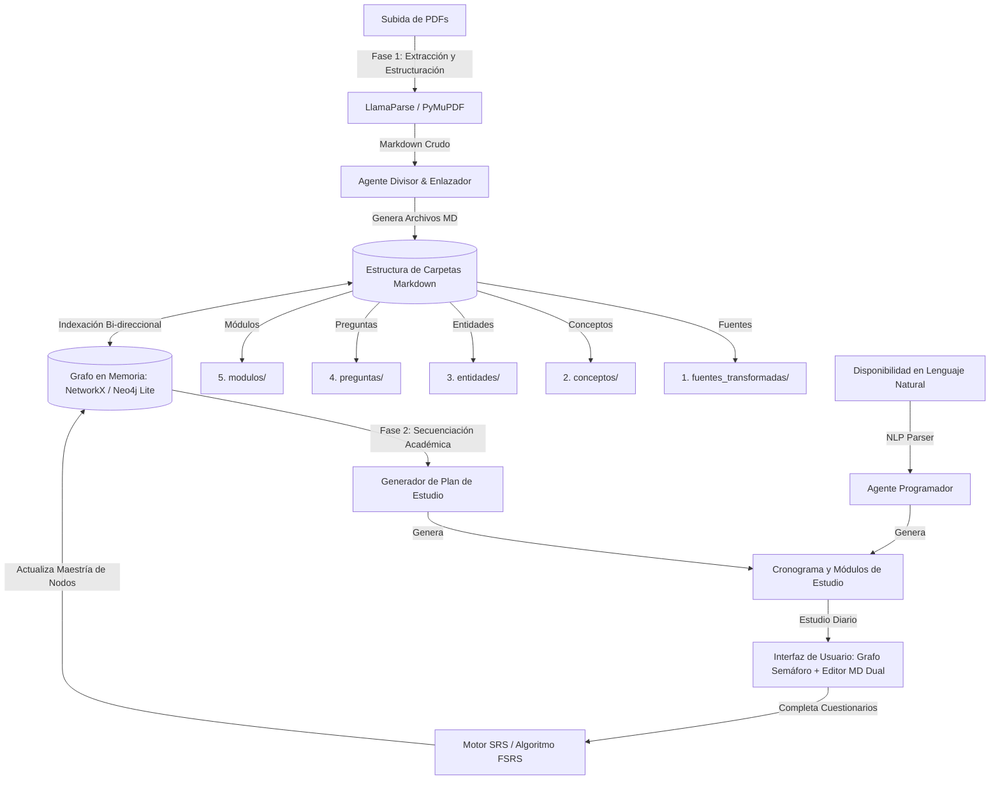
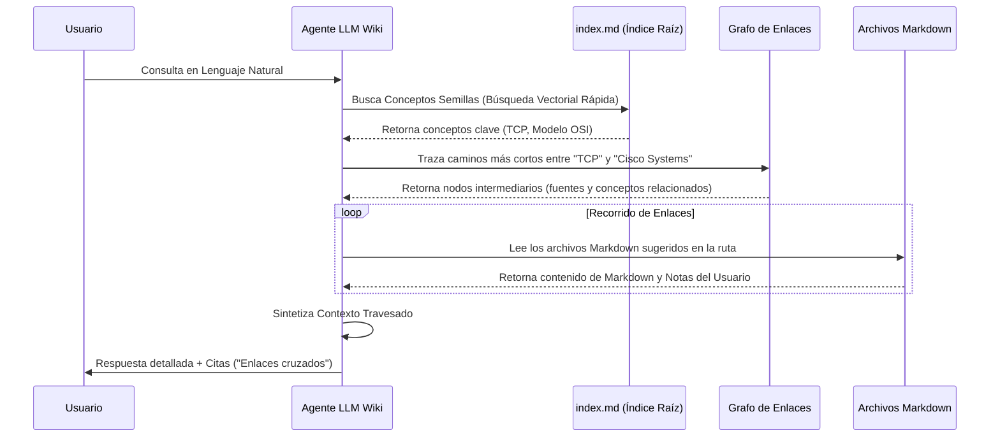
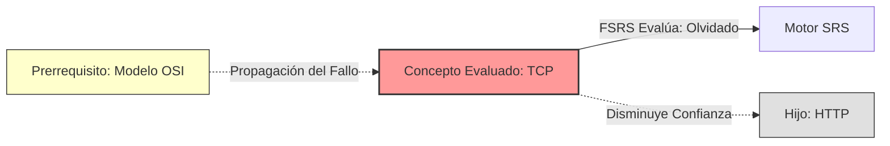

# YachaqAI Sistema de Aprendizaje Adaptativo, Grafos de Conocimiento y Repetición Espaciada mediante IA

**YachaqAI** (del quechua *Yachaq*, "el que sabe" o "sabio") es una plataforma inteligente de gestión del aprendizaje (LMS) y base de conocimiento interconectada. Transforma documentos estáticos (PDFs) en un grafo dinámico de conocimiento estructurado en Markdown, genera planes de estudio personalizados mediante lenguaje natural, y optimiza la retención a largo plazo utilizando repetición espaciada y cuestionarios interactivos.

---

## 1. Arquitectura General y Flujo del Sistema

El siguiente diagrama detalla cómo interactúan los componentes principales del sistema, desde la ingesta del PDF hasta la interfaz del grafo interactivo y la base de conocimiento ("LLM Wiki").



---

## 2. Especificación de la Estructura de Almacenamiento (Markdown Híbrido)

El sistema utiliza el almacenamiento en sistema de archivos local basado en Markdown como la "fuente de verdad" (Single Source of Truth). Esto permite que el usuario exporte su mazo y notas a herramientas de visualización personal como Obsidian. Cada archivo utiliza metadatos enriquecidos en formato **YAML Frontmatter**.

### Estructura de Directorios

```text
yachaq_knowledge_base/
├── 1. fuentes_transformadas/
│   └── introduccion_redes.md
├── 2. conceptos/
│   ├── modelo_osi.md
│   └── protocolo_tcp.md
├── 3. entidades/
│   ├── cisco_systems.md
│   └── tim_berners_lee.md
├── 4. preguntas/
│   ├── q_modelo_osi.md
│   └── q_protocolo_tcp.md
├── 5. modulos/
│   ├── modulo_1_fundamentos.md
│   └── modulo_2_transporte.md
└── index.md                      # Indice raíz e identificador del Mazo (Espacio de Estudio)
```

### Ejemplos de Archivos con YAML Frontmatter y Enlaces

#### A. Documento de Concepto: `2. conceptos/protocolo_tcp.md`
```markdown
---
id: protocolo_tcp
tipo: concepto
modulo: modulo_2_transporte
dificultad_srs: 4.2
estabilidad_srs: 8.5
proximo_repaso: 2026-06-08T08:00:00Z
maestria: 0.0  # Rango de 0.0 (Gris/No iniciado) a 1.0 (Verde/Dominado)
prerrequisitos:
  - modelo_osi
relacionados:
  - cisco_systems
---

# Protocolo TCP (Transmission Control Protocol)

El **Protocolo TCP** es un protocolo de red fundamental de la capa de transporte del [Modelo OSI](../conceptos/modelo_osi.md). Fue diseñado para proporcionar una entrega de datos confiable y orientada a la conexión sobre redes no confiables.

## Características Clave
- **Control de Flujo:** Garantiza que un emisor rápido no sature a un receptor lento.
- **Establecimiento de Conexión:** Utiliza el saludo de tres vías (Three-Way Handshake).

## Entidades Asociadas
- Desarrollado bajo la influencia teórica de [Cisco Systems](../entidades/cisco_systems.md).
```

#### B. Documento de Preguntas / Cuestionarios: `4. preguntas/q_protocolo_tcp.md`
```markdown
---
id: q_protocolo_tcp
concepto_asociado: protocolo_tcp
tipo_tarjeta: mazo_srs
---

# Cuestionario: Protocolo TCP

## Pregunta 1: Completar la Oración
El establecimiento de conexión en TCP se realiza mediante el método denominado `[saludo de tres vias]`.

## Pregunta 2: Relacionar Términos
Relacione el concepto de la izquierda con la definición correcta de la derecha:
- [A] Control de Flujo   | [ ] Proceso para acordar parámetros antes de enviar datos (B)
- [B] Handshake de 3 vías | [ ] Mecanismo que evita la saturación del receptor (A)

## Pregunta 3: Escribir/Desarrollar
¿Por qué se dice que TCP es orientado a la conexión?
> **Respuesta Esperada:** Porque requiere que se establezca una sesión de comunicación lógica y activa entre el origen y el destino antes de transferir datos, asegurando la entrega y el orden de los mismos.
```

---

## 3. Motor de Consulta de Lenguaje Natural: LLM Wiki (Agentic RAG)

En lugar de depender exclusivamente de bases de datos vectoriales estándar (que pierden el contexto estructural de la jerarquía de conceptos), YachaqAI implementa un motor de búsqueda **Graph-Traversal Agentic RAG**.

### Algoritmo de Búsqueda Semántica mediante Enlaces (Graph-Walking RAG)

Cuando el usuario realiza una pregunta libre (ej. *"¿Cómo afecta la pérdida de paquetes en el handshake de TCP dentro del modelo de referencia de Cisco?"*), el agente sigue este protocolo:



1. **Identificación de Semillas:** El LLM busca similitudes semánticas rápidas en los títulos de los conceptos y entidades de `index.md`.
2. **Navegación del Grafo (Walk Engine):** El agente de IA "camina" a través de los enlaces markdown (`[Texto](../conceptos/concepto.md)`). Si el concepto inicial apunta al "Modelo OSI" y este a su vez a "Cisco Systems", el agente lee consecutivamente dichos archivos markdown.
3. **Fusión de Datos del Usuario:** Si el usuario ha tomado notas adicionales en los archivos markdown (gracias al modo editor), el agente también lee estas anotaciones para incorporarlas a la respuesta personalizada.

---

## 4. Plan de Estudio y Motor de Calendario Natural (Scheduler Agent)

### Generación del Plan de Módulos (Estilo CISCO Networking Academy)
Una vez que el LLM genera el grafo de conceptos, calcula el orden óptimo de aprendizaje a través de un algoritmo de **Ordenamiento Topológico**. Esto asegura que los conceptos prerrequisito siempre se enseñen antes que los conceptos avanzados (por ejemplo, aprender el "Modelo OSI" antes que el "Protocolo TCP"). Los conceptos se agrupan secuencialmente en **Módulos**.

### Creación del Cronograma con Lenguaje Natural
El usuario puede ingresar su disponibilidad en texto simple:
> *"Quiero estudiar los lunes y miércoles por la noche (1 hora cada día) y los sábados por la mañana (3 horas). El domingo no quiero estudiar."*

#### Flujo de Conversión de Disponibilidad:
1. **Parser de Disponibilidad:** Un LLM traduce el texto del usuario a un esquema JSON estructurado:
   ```json
   {
     "dias_permitidos": [1, 3, 6],
     "minutos_por_dia": {
       "1": 60,
       "3": 60,
       "6": 180
     }
   }
   ```
2. **Asignador de Carga:** Sabiendo el tiempo promedio estimado para leer un módulo, realizar sus notas y contestar sus cuestionarios, el sistema distribuye los módulos y conceptos en los días disponibles del calendario, generando un cronograma personalizado.

---

## 5. Algoritmo de Repetición Espaciada Adaptativo en Grafos (Graph-SRS)

YachaqAI no evalúa cada tarjeta de memoria (flashcard) de forma aislada. Integra el algoritmo de **Repetición Espaciada FSRS** (Free Spaced Repetition Scheduler) con el Grafo de Conocimiento.

### Algoritmo de Propagación de Maestría
El algoritmo FSRS evalúa la Retentiva ($R$), Estabilidad ($S$) y Dificultad ($D$) del concepto basado en las respuestas a sus preguntas (Excelente, Bien, Difícil, Olvidado).

En YachaqAI, esta puntuación se propaga a los nodos vecinos:



1. **Fallo en Cascada:** Si el usuario califica una flashcard de "Protocolo TCP" como "Olvidado", el sistema asume que los prerrequisitos (ej. "Modelo OSI") o los nodos dependientes (ej. "HTTP") pueden tener lagunas. 
2. **Priorización Dinámica:** El sistema reduce ligeramente la estabilidad de los nodos hermanos y agenda una revisión rápida de los prerrequisitos, previniendo la memorización mecánica y fomentando el entendimiento estructural.

---

## 6. Sistema Visual del Grafo Dinámico (Semáforo de Maestría)

El grafo de conocimiento es el panel central de YachaqAI. Sus estados de visualización cambian en tiempo real:

| Estado del Nodo | Color | Significado Académico | Criterio de Activación |
| :--- | :--- | :--- | :--- |
| **No Descubierto / Bloqueado** | **Gris** | Aún no se ha llegado a este módulo en el cronograma de estudio. | Estado inicial por defecto. |
| **En Proceso de Estudio** | **Blanco con Borde Azul** | Pertenece al módulo activo, pero el cuestionario de evaluación aún no se ha rendido. | Se activa al iniciar el módulo. |
| **Nivel Crítico (Repaso Urgente)** | **Rojo** | Concepto dominado anteriormente pero con Retentiva ($R < 70\%$) según el algoritmo FSRS. | Fallo en el cuestionario o tiempo vencido. |
| **Nivel Medio (En Práctica)** | **Amarillo** | El concepto ha sido aprobado en cuestionarios recientes, pero requiere consolidación ($70\% \le R < 90\%$). | Aprobado con dificultad en el cuestionario. |
| **Nivel Dominado** | **Verde** | El concepto está firmemente retenido ($R \ge 90\%$). | Respuestas consecutivas correctas y estables. |

*   **Regla de Oro de los Módulos:** Un grupo de nodos que constituyen un módulo específico **solo se colorea** (pasa de gris a sus respectivos colores rojo, amarillo o verde) una vez que el usuario rinde el cuestionario correspondiente a ese módulo por primera vez.

---

## 7. Interfaz de Editor de Markdown de Modo Dual

Cada sección y concepto que el usuario lee dentro de un módulo se renderiza a partir de sus respectivos archivos Markdown. La interfaz provee un editor conmutable directamente en la web:

1. **Modo Lectura (Renderizado):** Muestra el contenido formateado estéticamente con tipografía de alta calidad, diagramas de flujo renderizados automáticamente y enlaces interactivos para navegar entre conceptos.
2. **Modo Editor (Edición Markdown):**
   * Desbloquea un editor de texto plano (con soporte de atajos y autocompletado de links `[[concepto]]`).
   * Permite añadir notas personales, diagramas adicionales o apuntes de clase directamente dentro de los archivos.
   * Al guardar, el backend regenera el archivo `.md` respectivo sin corromper la sección de metadatos (YAML Frontmatter) que utiliza el motor de repetición espaciada.

---

## 8. Pila Tecnológica Sugerida

Para la arquitectura técnica de **YachaqAI**, se recomienda la siguiente infraestructura de software moderna:

### Frontend
*   **Framework:** React con Next.js (TypeScript) para una SPA rápida y con renderizado optimizado de los módulos.
*   **Visualización de Grafos:** `react-flow` o `vis.js` para renderizar el grafo dinámico interactivo con soporte de físicas 2D y colores semáforo.
*   **Editor Markdown:** `CodeMirror` o `Milkdown` (editor WYSIWYG de Markdown integrado, extensible para enlaces internos tipo Wiki).

### Backend
*   **Framework API:** FastAPI (Python) por su alto desempeño y tipado estático nativo.
*   **Motor de Ingesta:** `LlamaParse` de LlamaIndex para convertir PDFs complejos (incluyendo gráficos y tablas) en texto limpio.
*   **Grafos en Memoria:** `NetworkX` para realizar búsquedas de camino corto, ordenamientos topológicos y propagación de estados semáforo en Python.
*   **Motor SRS:** Implementación de la librería abierta de FSRS (`py-fsrs`).

### Agentes de IA
*   **Orquestación:** LangGraph / LangChain para el agente que realiza el Graph-Traversal RAG en los archivos markdown.
*   **Modelo de Lenguaje:** API de Gemini (Gemini 2.5 Flash para tareas de extracción masiva y evaluación rápida; Gemini 2.5 Pro para la navegación inteligente del LLM Wiki y el estructurado del plan de estudios).
