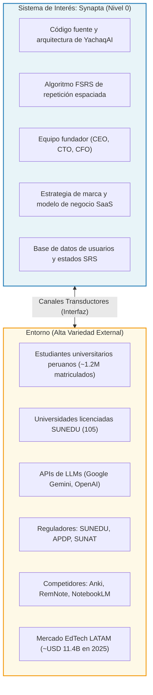
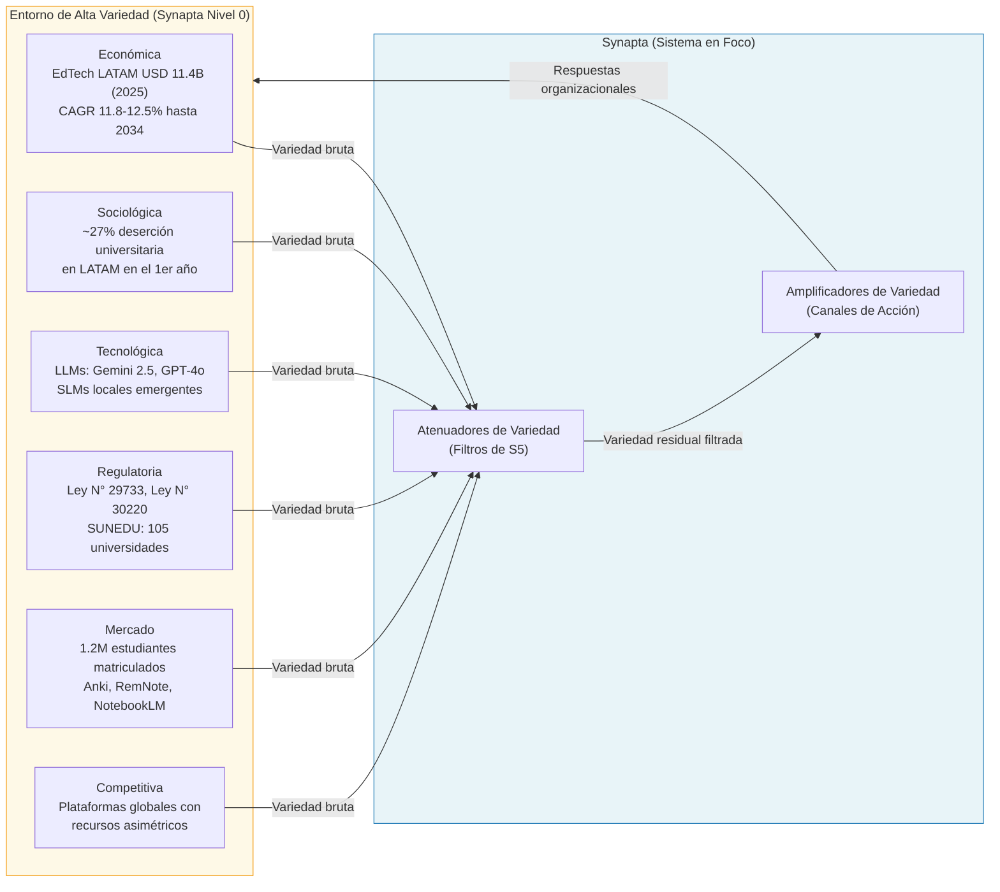
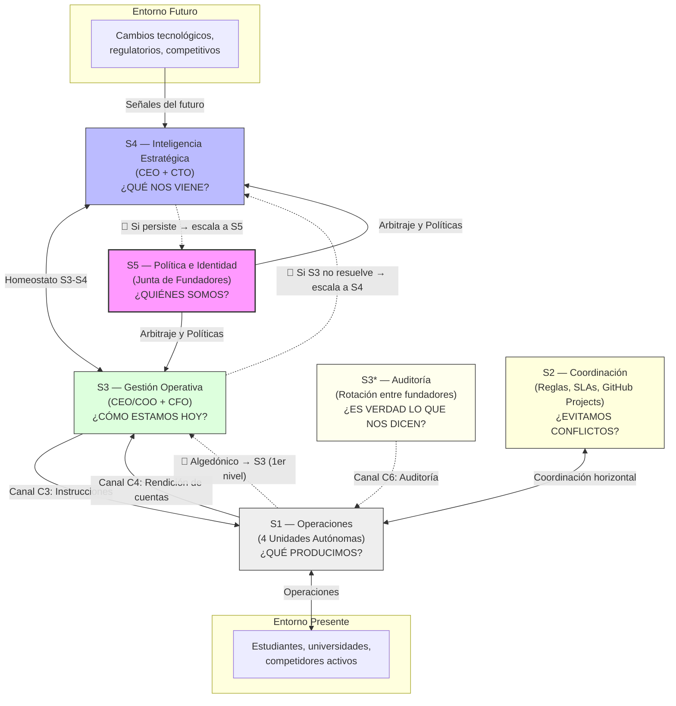
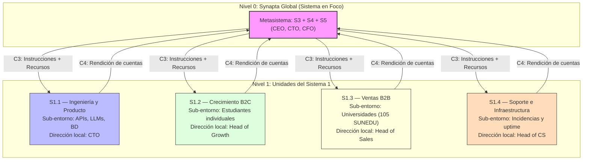
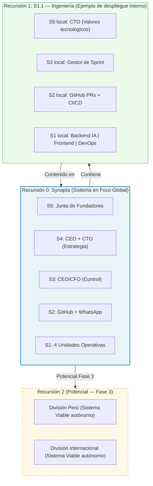
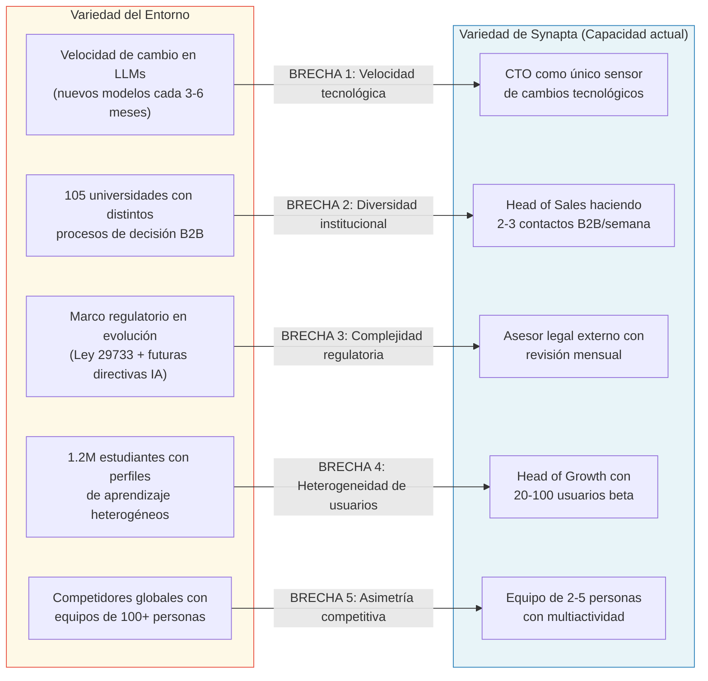
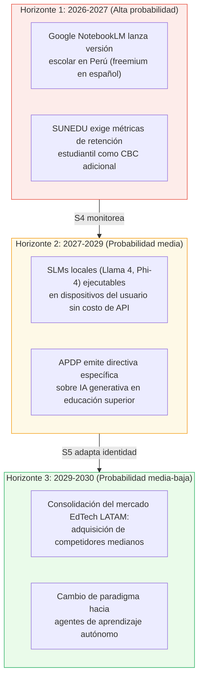
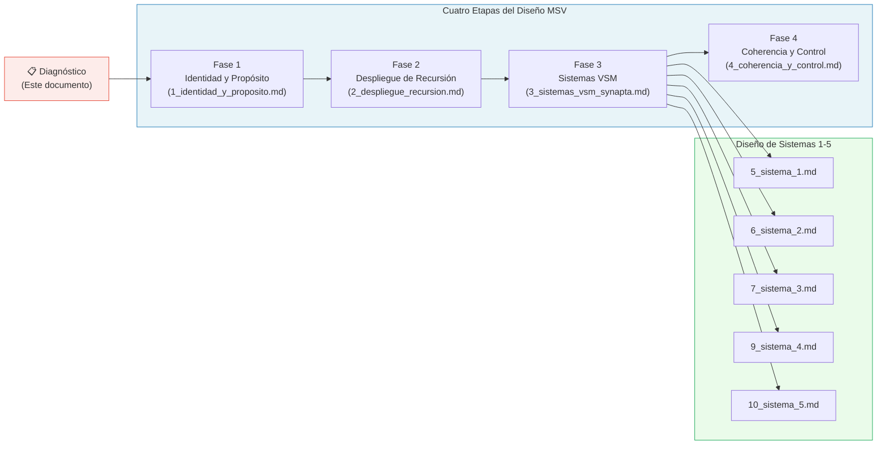

# 0_diagnostico_viabilidad_preliminar

> **Anclaje Metodológico:** Este documento constituye el análisis preliminar de viabilidad que precede al diseño completo del Modelo de Sistema Viable (MSV) de Synapta. Su función es establecer las condiciones estructurales de partida, identificar las brechas de variedad existentes y determinar los requisitos mínimos que el diseño organizacional debe satisfacer para garantizar la supervivencia autónoma de la organización. Sigue la metodología de cuatro etapas de José Pérez Ríos (2012) y la cibernética organizacional de Stafford Beer (1985).

---

## Tabla de Contenidos

- [1. Introducción](#1-introducción)
- [2. Definición Preliminar del Sistema de Interés](#2-definición-preliminar-del-sistema-de-interés)
- [3. Identidad y Propósito (Preliminar de Sistema 5)](#3-identidad-y-propósito-preliminar-de-sistema-5)
- [4. Análisis del Entorno (Variedad Externa)](#4-análisis-del-entorno-variedad-externa)
- [5. Análisis de la Demanda de Viabilidad](#5-análisis-de-la-demanda-de-viabilidad)
- [6. Definición Preliminar del Sistema Operativo (Preliminar de Sistema 1)](#6-definición-preliminar-del-sistema-operativo-preliminar-de-sistema-1)
- [7. Análisis de Recursividad Potencial](#7-análisis-de-recursividad-potencial)
- [8. Identificación de Brechas de Variedad](#8-identificación-de-brechas-de-variedad)
- [9. Escenarios de Evolución del Entorno](#9-escenarios-de-evolución-del-entorno)
- [10. Implicancias para el Diseño Organizacional (Camino al MSV)](#10-implicancias-para-el-diseño-organizacional-camino-al-msv)
- [Validación: Patologías del Sistema 5 Evitadas por el Diseño](#validación-patologías-del-sistema-5-evitadas-por-el-diseño)
- [Conclusiones](#conclusiones)
- [Referencias Citadas](#referencias-citadas)

---

## 1. Introducción

El **diagnóstico de viabilidad** es el primer acto de rigor metodológico en la aplicación del Modelo de Sistema Viable (MSV). De acuerdo con Pérez Ríos (2012), su objetivo fundamental es evaluar la capacidad de una organización para mantener una existencia independiente y sostenible en el tiempo. Cuando se trata de una organización de nueva creación, como es el caso de **Synapta**, el diagnóstico cumple una función adicional y crítica: identificar los elementos estructurales mínimos que deben ser diseñados correctamente desde el inicio para que la organización no fracase ante la complejidad de su entorno antes de alcanzar su primer ciclo de viabilidad autosostenida [1].

La viabilidad, en términos cibernéticos, no equivale a la mera supervivencia a corto plazo. Según Beer (1985), un sistema es viable cuando es capaz de mantener su existencia *independiente*, adaptándose de forma continua a los cambios imprevistos de su entorno mediante procesos de aprendizaje y evolución [2]. Esta definición es especialmente exigente para una startup EdTech en un mercado caracterizado por alta velocidad de cambio tecnológico, marcos regulatorios en evolución y competidores con recursos asimétricos.

Synapta es una organización de tecnología educativa fundada en el Perú cuyo producto principal es **YachaqAI**: una plataforma que transforma documentos académicos estáticos en grafos semánticos dinámicos y optimiza la retención del conocimiento mediante el algoritmo de repetición espaciada FSRS (*Free Spaced Repetition Scheduler*). El presente diagnóstico evalúa si esta organización, en su etapa actual de validación de producto (*product-market fit*), posee —o puede diseñar— los mecanismos estructurales que la Ley de Requisite Variety de Ashby (1956) exige para absorber la complejidad de su entorno [3].

El documento está estructurado siguiendo el método de diagnóstico de cuatro etapas descrito por Pérez Ríos (2012): (i) identidad y propósito, (ii) despliegue vertical de la complejidad, (iii) dimensión horizontal del sistema en foco, y (iv) coherencia y recursión [1]. Sus conclusiones alimentan directamente el diseño completo del MSV detallado en los documentos `1_identidad_y_proposito.md`, `2_despliegue_recursion.md`, `3_sistemas_vsm_synapta.md` y `4_coherencia_y_control.md`.

---

## 2. Definición Preliminar del Sistema de Interés

### 2.1 El Sistema de Interés: Synapta como Organización en Foco

El primer paso del método exige hacer explícita la **identidad y los límites** de la organización que se va a diagnosticar, distinguiendo con precisión qué está *dentro* del sistema y qué pertenece a su *entorno* [1]. Esta delimitación, lejos de ser un trámite formal, es la operación metodológica que determina el alcance de toda la arquitectura organizacional posterior.

*Basado en la Figura 2.1 de Pérez Ríos (2012): La organización en su entorno.*

### 2.2 Nombre y Naturaleza del Sistema

| Atributo | Descripción |
| :--- | :--- |
| **Nombre** | Synapta S.A.C. |
| **Tipo** | Startup EdTech (Software como Servicio — SaaS) |
| **Producto principal** | YachaqAI: plataforma de gestión del conocimiento con grafos semánticos y repetición espaciada FSRS |
| **Etapa actual** | Validación de MVP y *product-market fit* (Fase 1) |
| **Mercado objetivo** | Estudiantes universitarios peruanos y profesionales en formación continua |
| **Modelo de negocio** | Suscripción B2C + Licenciamiento institucional B2B |
| **Ámbito geográfico inicial** | Perú (mercado de educación superior) |

### 2.3 ¿Qué NO es Synapta?

Para evitar la patología de *"identidad mal definida"* que describe el capítulo 3 de Pérez Ríos (2012), se declara explícitamente lo que Synapta *no es* [1]:

- **No es una consultora de software a medida**: no desarrolla proyectos externos fuera de YachaqAI.
- **No produce contenido académico**: no compite con universidades ni editoriales.
- **No monetiza datos de estudiantes**: el modelo de negocio excluye la publicidad y el perfilamiento comercial.
- **No es una plataforma de videoconferencia o streaming educativo**: no compite con Coursera, Udemy ni plataformas LMS (Moodle, Canvas).

---

## 3. Identidad y Propósito (Preliminar de Sistema 5)

### 3.1 Propósito Sistémico: La Regla POSIWID

Beer (1985) establece que *"The Purpose of a System Is What It Does"* (POSIWID): el propósito real de una organización no es lo que sus fundadores *declaran* que hacen, sino lo que el sistema *produce en la práctica* [2]. Aplicar esta regla a Synapta en su etapa de diagnóstico exige separar la intención declarada del propósito operativamente verificable.

**Propósito declarado:** Diseñar y operar plataformas inteligentes de gestión del conocimiento.

**Propósito verificable (POSIWID):** Reducir el olvido sistemático en procesos de aprendizaje intensivo mediante tecnologías portables, privadas y pedagógicamente eficaces. Este propósito es verificable porque la herramienta técnica central —el algoritmo FSRS v5— ha demostrado experimentalmente reducir el tiempo de repaso requerido para mantener una retención objetivo del 90% entre un 30% y 50% respecto a métodos anteriores (Ye, 2024) [4].

La distinción importa para el diagnóstico: si YachaqAI en producción *no reduce el olvido medible* de sus usuarios (tasa de retención D30 < umbral estadístico), el sistema no cumple su POSIWID, lo que constituye una señal de brecha de viabilidad que debe escalar al Sistema 5.

### 3.2 Valores y Límites del Sistema 5 Preliminar

El Sistema 5 de Synapta —encarnado en la Junta de Fundadores— establece cuatro principios identitarios no negociables que actúan como filtros de toda decisión organizacional:

| Principio | Expresión operativa | Límite infranqueable |
| :--- | :--- | :--- |
| **Soberanía del Conocimiento** | Exportar datos en Markdown (texto plano) | Prohibido usar formatos propietarios de bloqueo (*vendor lock-in*) |
| **Privacidad como Derecho** | Cumplimiento Ley N° 29733 (Perú) | Prohibido vender o compartir datos de sesión de estudiantes con terceros |
| **IA como Amplificador** | Aprendizaje activo, no contenido generado | Prohibido sustituir el esfuerzo cognitivo del estudiante |
| **Rigor Pedagógico Científico** | Algoritmo FSRS con base empírica | Prohibido implementar algoritmos de repaso sin respaldo científico |

Estos principios son el núcleo invariante de la identidad que el Sistema 5 debe proteger ante cualquier presión externa. De acuerdo con Ashby (1956), la capacidad del S5 para mantener estos límites constituye su función de *atenuador de variedad* frente a las presiones comerciales que buscarían diluir la identidad de Synapta [3].

---

## 4. Análisis del Entorno (Variedad Externa)

### 4.1 Naturaleza de la Variedad Externa

Pérez Ríos (2012) advierte que *"la complejidad del entorno siempre es enormemente mayor que la que la organización puede desplegar"* [1]. El primer acto del diagnóstico es reconocer y categorizar esta variedad para determinar qué mecanismos de atenuación y amplificación son necesarios.

*Basado en la Figura 2.18 de Pérez Ríos (2012): "Horizontal dimension (Environment-Organisation-Management)" — Dimensión horizontal Entorno-Organización-Dirección, que muestra los canales atenuadores y amplificadores de variedad.*

### 4.2 Matriz de Áreas Críticas del Entorno

| Área | Estado Presente | Horizonte Futuro (2–5 años) | Nivel de Variedad |
| :--- | :--- | :--- | :--- |
| **Económica** | Mercado EdTech LATAM valorado en USD 11,400M–18,300M (IMARC Group, 2025) [5] | CAGR proyectado de 11.8%–12.5% entre 2026 y 2034 (IMARC Group, 2025) [5] | Alta |
| **Sociológica** | Aproximadamente el 27% de los estudiantes universitarios en LATAM desertan en el primer año (Guadalupe et al., 2017) [6] | Consolidación del aprendizaje activo basado en grafos semánticos como estándar pedagógico | Media-alta |
| **Tecnológica** | Madurez en embeddings semánticos y modelos de lenguaje multimodales (Gemini 2.5 Flash, GPT-4o) | Agentes autónomos multi-paso y grafos vectoriales con auto-actualización en tiempo real | Muy alta |
| **Regulatoria** | Ley N° 29733 (Protección de Datos Personales, Perú) vigente; 105 universidades licenciadas por SUNEDU | Directivas de ética de IA en educación superior; mayor exigencia de cumplimiento APDP | Alta |
| **Mercado B2C** | 1.2 millones de estudiantes matriculados en universidades peruanas licenciadas (SUNEDU, 2023) [7] | Incremento de adultos mayores de 35 años en posgrados con alta densidad de conocimiento | Alta |
| **Mercado B2B** | 105 universidades licenciadas operando con LMS tradicionales (Moodle, Canvas) sin herramientas SRS integradas | Exigencia de métricas de retención estudiantil como indicador de calidad SUNEDU | Media |
| **Competitiva** | Herramientas desarticuladas (Anki, Notion AI, RemNote) sin integración completa grafo-SRS en el mercado peruano | Entrada de asistentes cognitivos nativos de grandes tecnológicas (Microsoft Copilot, Google NotebookLM) | Muy alta |
| **Proveedores** | Costos de API competitivos (Google Gemini 2.5 Flash: USD 0.075 por millón de tokens de entrada) (Google Cloud, 2025) [8] | Emergencia de SLMs ejecutables localmente (Llama 3.2, Gemma 3 9B vía Ollama) | Media |

---

## 5. Análisis de la Demanda de Viabilidad

### 5.1 Los Cinco Requisitos Estructurales de la Viabilidad

La demanda de viabilidad es el conjunto de condiciones estructurales mínimas que la organización debe satisfacer para no colapsar ante la variedad del entorno. Según Beer (1985) y Pérez Ríos (2012), estas condiciones son exactamente cinco —ni más ni menos— y corresponden a los cinco sistemas del MSV [2][1]:

> **Nota sobre el Canal Algedónico (corrección crítica):** Pérez Ríos (2012) precisa que la señal algedónica *no* va directamente al S5. Asciende por niveles: primero al **S3**, quien tiene la responsabilidad inicial de resolverla. Si el S3 no puede contenerla, escala al **S4** y solo entonces llega al **S5** [1]. Esta distinción es fundamental: el S5 solo interviene cuando S3 y S4 son incapaces de resolver la emergencia.

*Basado en la Figura 2.19 de Pérez Ríos (2012): Dimensión horizontal y MSV del sistema en foco.*

### 5.2 Evaluación Diagnóstica de los Cinco Requisitos en Synapta

| Sistema MSV                | Requisito de Viabilidad                            | ¿Existe en Synapta?                                                              | Estado Diagnóstico                                                                      |
| :------------------------- | :------------------------------------------------- | :------------------------------------------------------------------------------- | :-------------------------------------------------------------------------------------- |
| **S1 — Operaciones**       | Unidades autónomas que producen valor al entorno   | Sí — 4 unidades funcionales (Ingeniería, Growth B2C, Ventas B2B, Soporte/DevOps) | 🟡 **Brecha**: multifuncionalidad por equipo de 2–5 personas                            |
| **S2 — Coordinación**      | Mecanismos que evitan conflictos inter-unidades    | Sí — GitHub Projects, WhatsApp, reglas de 48h                                    | 🟡 **Brecha**: no automatizado, depende de disciplina manual                            |
| **S3 — Gestión Operativa** | Control del "aquí y ahora"; asignación de recursos | Sí — CEO/CFO                                                                     | 🟡 **Brecha**: riesgo de colapso del S5 en el S3 por microgestión                       |
| **S3* — Auditoría**        | Canal de verificación no rutinaria de S1           | Sí — rotación cruzada entre fundadores                                           | 🔴 **Brecha crítica**: conflicto de interés cuando auditor = operador                   |
| **S4 — Inteligencia**      | Monitoreo del "exterior y futuro"                  | Parcial — CEO + CTO con esfuerzo manual                                          | 🔴 **Brecha crítica**: sin sensores automatizados ni sala de operaciones instrumentada  |
| **S5 — Política**          | Identidad, valores, arbitraje S3-S4                | Sí — Junta de Fundadores informal                                                | 🟡 **Brecha**: sin protocolos formales de convocatoria ni comité de ética estructurado  |
| **Canal Algedónico**       | Señal de emergencia directa al S5                  | Parcial — alertas manuales sin umbral definido                                   | 🔴 **Brecha crítica**: sin automatización de alertas críticas con umbral de bypass a S5 |

**Leyenda:** 🟢 Óptimo · 🟡 Funcional con brecha menor · 🔴 Brecha crítica que amenaza la viabilidad

### 5.3 Demanda de Viabilidad Cuantificada

La viabilidad de Synapta en su Fase 1 requiere cumplir simultáneamente con los siguientes umbrales mínimos. Estos valores se derivan de los benchmarks de la industria SaaS y EdTech:

| Dimensión de Viabilidad | Umbral Mínimo | Umbral Crítico | Fuente |
| :--- | :--- | :--- | :--- |
| **Retención D7** | ≥ 25% de usuarios activos | < 12% → inviabilidad del producto | Appcues (2023) [9] |
| **Retención D30** | ≥ 12% de usuarios activos | < 5% → abandono masivo | Amplitude (2023) [9] |
| **Uptime del servicio** | ≥ 99.0% mensual | < 97% → pérdida de confianza institucional B2B | Beyer et al. (2016) [10] |
| **Costo API por usuario activo/mes** | ≤ S/. 1.50 | > S/. 3.00 → inviabilidad financiera pre-seed | Google Cloud (2025) [8] |
| **Tasa de completación de onboarding** | ≥ 50% | < 30% → fricción fatal en adopción | Mixpanel (2024) [11] |

---

## 6. Definición Preliminar del Sistema Operativo (Preliminar de Sistema 1)

### 6.1 Criterio de Segmentación Operativa

El Sistema 1 de Synapta comprende el conjunto de unidades autónomas que producen y entregan valor directamente al entorno. De acuerdo con Pérez Ríos (2012), estas unidades son las *únicas* partes de la organización que son en sí mismas sistemas viables, y deben operar con un alto grado de autonomía para adaptarse a la variedad de sus respectivos sub-entornos [1].

El criterio de segmentación aplicado es **funcional-de-valor**: se dividen las operaciones según la cadena de valor de la empresa, asignando a cada función un sub-entorno específico que gestiona de forma autónoma.

*Basado en la Figura 2.5 de Pérez Ríos (2012): Despliegue vertical de la complejidad.*

### 6.2 Descripción de las Cuatro Unidades Operativas

| Unidad | Sub-entorno Gestionado | Producto/Servicio al Entorno | KPI Principal |
| :--- | :--- | :--- | :--- |
| **S1.1 — Ingeniería y Producto** | APIs de LLMs, base de datos, frameworks de desarrollo | YachaqAI funcional: parser PDF → grafo → flashcards FSRS | Tasa de éxito del parser ≥ 85%; latencia RAG ≤ 4 min/100 págs |
| **S1.2 — Crecimiento B2C** | Estudiantes universitarios peruanos (~1.2M), profesionales | Usuarios activos con sesiones SRS semanales ≥ 2 | Retención D7 ≥ 25%; WAU creciente |
| **S1.3 — Ventas B2B** | Facultades y decanatos de 105 universidades licenciadas | Contratos de piloto institucional con KPIs de retención estudiantil | ≥ 1 conversación activa con docente; ≥ 1 piloto cerrado en Fase 1 |
| **S1.4 — Soporte e Infraestructura** | Usuarios con incidencias; servidores de producción | Disponibilidad del servicio y resolución de tickets | Uptime ≥ 99%; resolución ≤ 24h (Zendesk, 2024) [12] |

---

## 7. Análisis de Recursividad Potencial

### 7.1 El Teorema del Sistema Recursivo

Beer (1985) establece el **Teorema del Sistema Recursivo**: *"En una estructura organizacional recursiva, cualquier sistema viable contiene, y está contenido en, un sistema viable"* [2]. Esto significa que la estructura de cinco sistemas (S1–S5) debe replicarse en *cada* nivel de la jerarquía organizacional, independientemente de su escala.

Para Synapta, el análisis de recursividad potencial identifica tres niveles de anidamiento:

### 7.2 Recursividad Actual vs. Potencial

| Nivel de Recursión                  | Estado Actual (Fase 1)                                                                      | Potencial de Despliegue                                                           |
| :---------------------------------- | :------------------------------------------------------------------------------------------ | :-------------------------------------------------------------------------------- |
| **Nivel 0 (Synapta global)**        | Activo — S1 a S5 operando con multiactividad de 2-5 personas                                | —                                                                                 |
| **Nivel 1 (4 unidades S1)**         | Activo — unidades funcionales con las direcciones locales de las unidades en multiactividad | En Fase 2: formalización con dedicación exclusiva por unidad                      |
| **Nivel 2 (Sub-unidades de S1.1)**  | Implícito — un CTO gestiona Backend, Frontend y DevOps                                      | En Fase 2: equipos diferenciados por especialidad técnica                         |
| **Nivel 3 (Divisiones regionales)** | No existe — correctamente postergado hasta Fase 3                                           | En Fase 3: División Perú + División Internacional como sistemas viables autónomos |

> **Nota diagnóstica:** El no crear niveles de recursión prematuramente es una decisión cibernéticamente correcta. Pérez Ríos (2012) advierte que extender la estructura recursiva sin los recursos humanos y financieros correspondientes genera la patología de *"nivel intermedio huérfano"*, donde existe una jerarquía sin la organización real que la sustente [1].

---

## 8. Identificación de Brechas de Variedad

### 8.1 Concepto de Brecha de Variedad

En la cibernética organizacional, una **brecha de variedad** (*variety gap*) emerge cuando la variedad que la organización puede desplegar para responder al entorno es significativamente menor que la variedad que el entorno exige. Pérez Ríos (2012) denomina a esta situación *"variedad residual no absorbida"*, y representa el núcleo del riesgo de inviabilidad [1]. La Ley de Requisite Variety de Ashby (1956) establece que solo la variedad puede destruir variedad [3]: si las brechas no se cierran con mecanismos de atenuación o amplificación, la organización pierde el control sobre su entorno y colapsa.

### 8.2 Inventario de Brechas de Variedad Identificadas

### 8.3 Análisis Detallado de las Cinco Brechas Críticas

| # | Brecha | Variedad del Entorno | Variedad de Synapta | Mecanismo de Cierre Propuesto |
| :--- | :--- | :--- | :--- | :--- |
| **1** | **Velocidad tecnológica de LLMs** | Ciclos de actualización de modelos cada 3–6 meses; costo de migración técnica alto | Un CTO monitoreando arXiv y changelogs de APIs de forma manual y discontinua | Formalizar el S4 con alertas automáticas (Google Alerts + arXiv feed) y protocolo de evaluación de nuevos modelos en staging |
| **2** | **Diversidad del proceso decisional B2B** | 105 universidades con culturas, presupuestos y procesos de adquisición heterogéneos | Un contacto B2B con ≤ 3 conversaciones activas en paralelo | Mapeo de perfiles de decisor (decano vs. director de TI vs. rector) y scripts de venta adaptados por tipo de universidad |
| **3** | **Complejidad regulatoria de privacidad** | Ley N° 29733 con posibles directivas de ética de IA en 2025-2026; multas de hasta 100 UIT por incumplimiento grave | Asesor legal externo con revisión mensual no automatizada | Automatización de alertas de cambios regulatorios; cláusula DPA en contratos B2B; auditoría semestral de cumplimiento |
| **4** | **Heterogeneidad de perfiles de aprendizaje** | Estudiantes con distintos ciclos académicos, carreras y estilos de aprendizaje que demandan personalización del grafo semántico | Algoritmo FSRS con configuración estándar; retroalimentación básica de usuarios beta (20-100) | Implementar segmentación de usuarios por carrera/nivel y personalización progresiva del intervalo FSRS |
| **5** | **Asimetría competitiva** | Competidores globales (Google NotebookLM, Microsoft Copilot) con equipos de ingeniería de cientos de personas y infraestructura escalada | Equipo de 2-5 fundadores con dedicación mixta | Diferenciación en privacidad soberana (Ley N° 29733) y portabilidad Markdown como ventaja competitiva que los grandes no pueden igualar sin comprometer su modelo de negocio |

---

## 9. Escenarios de Evolución del Entorno

### 9.1 Marco de Análisis Prospectivo

El Sistema 4 del MSV tiene como función principal monitorear el "exterior y el futuro" para anticipar cambios que requieran adaptaciones en la identidad o el diseño de la organización (Beer, 1985) [2]. Para Synapta, se identifican tres escenarios de evolución del entorno en el horizonte 2026–2030, clasificados por su probabilidad e impacto sobre la viabilidad:

### 9.2 Descripción de Escenarios y Respuesta Organizacional

**Escenario A — Alta probabilidad / Alto impacto: Entrada de Google NotebookLM al mercado peruano**

Google NotebookLM, lanzado en 2023 y expandido globalmente en 2024, ofrece capacidades de síntesis de documentos con IA a través de la infraestructura de Google Cloud (Google, 2024) [13]. Si lanza una versión escolar localizada en español para el mercado LATAM, su modelo de negocio freemium representaría una presión directa sobre la propuesta de valor B2C de YachaqAI.

*Respuesta del S5:* La identidad de Synapta tiene un núcleo diferenciador que Google NotebookLM estructuralmente no puede replicar sin comprometer su modelo de datos: **la soberanía del conocimiento y la portabilidad a Markdown**. Google, por definición de su modelo de negocio, almacena los datos en sus servidores y no ofrece exportación a texto plano portable. Ante este escenario, el S5 ordenaría amplificar la diferenciación en privacidad y posicionamiento bajo la Ley N° 29733 [14].

**Escenario B — Alta probabilidad / Alto impacto: SUNEDU incorpora retención estudiantil como CBC**

La Ley Universitaria N° 30220 establece las Condiciones Básicas de Calidad (CBC) como marco de licenciamiento institucional (SUNEDU, 2014) [15]. Una evolución probable de estas condiciones incluiría exigir a las universidades la demostración de tasas de retención estudiantil como indicador de calidad. Esto convertiría a YachaqAI en una herramienta estratégica para las universidades peruanas, no solo un beneficio complementario.

*Respuesta del S4:* Reorientar el pitch B2B de "herramienta de aprendizaje para estudiantes" a "sistema de evidencia de retención estudiantil para cumplimiento CBC". El piloto con universidades debe documentar cambios en la tasa de retención D30 de los estudiantes que usan YachaqAI vs. el grupo control.

**Escenario C — Probabilidad media / Alto impacto: SLMs ejecutables sin costo de API**

La emergencia de modelos de lenguaje pequeños (SLMs) como Llama 3.2, Phi-3.5 y Gemma 3 9B, ejecutables localmente vía Ollama sin costo de inferencia en API (Meta, 2024; Microsoft, 2024), representaría un cambio fundamental en el costo de operación de YachaqAI.

*Respuesta del S4:* La arquitectura de YachaqAI ya considera Ollama + Gemma 3 9B como LLM local de respaldo. Si los SLMs locales alcanzan paridad de calidad con los modelos en nube para tareas de extracción de grafos semánticos, este escenario *favorece* a Synapta: el costo de API por usuario caería a S/. 0, cerrando la Brecha 1 y eliminando el riesgo de inviabilidad financiera pre-seed.

---

## 10. Implicancias para el Diseño Organizacional (Camino al MSV)

### 10.1 Del Diagnóstico al Diseño: Las Cuatro Etapas del Método

El diagnóstico realizado en las secciones anteriores establece el punto de partida para el diseño organizacional completo. Según Pérez Ríos (2012), el método de diseño se articula en cuatro etapas que traducen el diagnóstico en arquitectura organizacional concreta [1]:

### 10.2 Prioridades de Diseño Derivadas del Diagnóstico

Las brechas identificadas en la Sección 8 y los requisitos evaluados en la Sección 5 determinan las prioridades del diseño organizacional, ordenadas por urgencia de cierre para la viabilidad:

| Prioridad | Brecha o Déficit | Elemento de Diseño que la Cierra | Documento de Referencia |
| :--- | :--- | :--- | :--- |
| **P1 — Crítica** | S4 débil (sin sensores automatizados de entorno) | Sala de Operaciones con Paneles 1–3 y modelos de simulación M1–M5 | `9_sistema_4.md` §5 |
| **P2 — Crítica** | Canal Algedónico sin umbral ni automatización | Sistema semáforo con alertas PagerDuty + protocolo de 4 pasos | `10_sistema_5.md` §6 |
| **P3 — Crítica** | S3* con conflicto de interés (auditor = operador) | Rotación cruzada formal entre fundadores con protocolo de separación de roles | `7_sistema_3.md` §4 |
| **P4 — Importante** | S2 dependiente de disciplina manual | Automatización de webhooks GitHub → notificaciones + reglas escritas de coordinación | `6_sistema_2.md` §3 |
| **P5 — Importante** | Riesgo de colapso del S5 en el S3 | Comité de Identidad y Ética trimestral + Sala de Operaciones que libera al S5 de microgestión | `4_coherencia_y_control.md` §2 |
| **P6 — Moderada** | Brechas de variedad B2B (diversidad institucional) | Mapeo de perfiles de decisor y scripts adaptados + CRM | `5_sistema_1.md` §3 |

### 10.3 Condición de Viabilidad Mínima para Pasar de Fase 1 a Fase 2

El diagnóstico establece que Synapta puede transitar de la Fase 1 (MVP) a la Fase 2 (Tracción y Seed Funding) únicamente cuando se cumplan simultáneamente los siguientes tres indicadores de viabilidad mínima, derivados del análisis anterior:

1. **Retención D7 ≥ 25%** en una muestra de ≥ 20 usuarios activos del piloto beta, validando que el algoritmo FSRS de YachaqAI efectivamente reduce el olvido medible en la base de usuarios reales (Appcues, 2023) [9].
2. **≥ 1 piloto B2B cerrado** con una universidad licenciada por SUNEDU, que genere un documento de impacto con métricas de retención estudiantil comparables.
3. **Sala de Operaciones instrumentada** (Panel 1 de telemetría + alerta algedónica automatizada), que demuestre que el S5 puede arbitrar el homeostato S3-S4 con datos en tiempo real y no con intuición.

---

## Validación: Patologías del Sistema 5 Evitadas por el Diseño

De acuerdo con el capítulo 3 de Pérez Ríos (2012), existen cuatro patologías específicas del Sistema 5 que el diseño organizacional de Synapta previene activamente [1]:

**Patología 1 — Identidad Mal Definida (*"No sé quién soy"*)**

Esta patología surge cuando no existe claridad sobre el propósito de la organización, generando confusión interna y externa sobre qué es y qué hace. En Synapta, se evita mediante:
- La declaración formal del propósito mediante la regla POSIWID en la Sección 3.1 de este documento y en `1_identidad_y_proposito.md` §1.
- La tabla de exclusiones explícitas (Sección 2.3) que delimita lo que Synapta *no es*.
- El Comité de Identidad y Ética trimestral (`4_coherencia_y_control.md`) que verifica anualmente que el POSIWID verificable coincide con el propósito declarado.

**Patología 2 — Esquizofrenia Institucional**

Esta disfunción ocurre cuando coexisten dos o más concepciones incompatibles sobre la misma organización, tirando en direcciones opuestas. En Synapta, se evita mediante:
- La centralización normativa en la Junta de Fundadores (S5 corporativo en `10_sistema_5.md` §5.1), que es la única instancia con autoridad para modificar la identidad.
- La cadena de transmisión de identidad descendente (top-down) hacia los S5 locales de cada unidad del S1 (`10_sistema_5.md` §5.2), garantizando que todos los las direcciones locales de las unidades operen bajo la misma concepción de identidad.
- La prohibición explícita de que los las direcciones locales de las unidades tomen compromisos comerciales (ej. B2B cláusulas de datos) sin validación del S5 corporativo.

**Patología 3 — Colapso del Sistema 5 en el Sistema 3 (*Metasistema Inexistente*)**

Esta patología —la más frecuente en startups— ocurre cuando los fundadores se ven arrastrados a resolver problemas operativos cotidianos (bugs, SLA, soporte), abandonando sus funciones normativas de S5. El resultado es que la organización pierde la capacidad de mirar al futuro y definir su identidad evolutiva. En Synapta, se evita mediante:
- La instrumentación del Sistema 4 con sensores automatizados y la Sala de Operaciones (`9_sistema_4.md`), que libera al S5 de la necesidad de estar presente en la microgestión.
- La formalización del homeostato S3-S4 con reuniones estructuradas (Sesiones de Alineación Semanal — SAS) con bloques explícitos por rol, impidiendo que el S5 intervenga en debates operativos (`2_despliegue_recursion.md` §5.1.1).
- El indicador de alerta temprana definido en `10_sistema_5.md` §11.4: si el CEO o CTO dedican más del 40% de su tiempo a tareas operativas que no requieren decisión normativa, se activa el protocolo de revisión del S5.

**Patología 4 — Representación Inadecuada Frente a Niveles Superiores**

Esta patología emerge cuando el S5 no puede representar adecuadamente a la organización ante los sistemas de nivel superior (inversores, reguladores, mercado). En Synapta, se evita mediante:
- La cadena formal de transmisión de identidad bidireccional (top-down y bottom-up) descrita en `10_sistema_5.md` §5.2, que garantiza que la visión del S5 corporativo fluya sin distorsión hacia las unidades operativas y que la retroalimentación de estas llegue sin filtrar al S5.
- La representación explícita de todos los stakeholders en la gobernanza del S5 (Sección 9 de `10_sistema_5.md`), incluyendo a estudiantes (via NPS), docentes (via Head of Sales), inversores (via reportes) y reguladores (via asesor legal).

### Síntesis del Diagnóstico

| Dimensión | Estado Diagnóstico | Acción de Diseño Requerida |
| :--- | :--- | :--- |
| Identidad y Propósito | 🟢 Bien definido con POSIWID y exclusiones | Formalizar en Comité de Identidad trimestral |
| Sistema Operativo (S1) | 🟡 Funcional con multiactividad | Escalar a roles exclusivos en Fase 2 |
| Coordinación (S2) | 🟡 Manual; depende de disciplina del equipo | Automatizar webhooks y reglas escritas |
| Gestión Operativa (S3) | 🟡 Presente; riesgo de microgestión | Delegar con rendición de cuentas formal |
| Auditoría (S3*) | 🔴 Conflicto de interés auditor = operador | Rotación cruzada estructurada |
| Inteligencia (S4) | 🔴 Débil; sin sensores automatizados | Instrumentar Sala de Operaciones |
| Política (S5) | 🟡 Informal; sin protocolos de convocatoria | Formalizar Junta con protocolos algedónicos |
| Canal Algedónico | 🔴 Sin umbral ni automatización | PagerDuty + semáforo + protocolo 4 pasos |
| Recursividad | 🟢 Correctamente acotada a 2 niveles en Fase 1 | Planificar tercer nivel para Fase 3 |
| Brechas de Variedad | 🔴 Cinco brechas identificadas | Cerrar P1-P3 antes de Fase 2 |

El diseño completo del MSV de Synapta —articulado en los archivos `1_identidad_y_proposito.md` a `10_sistema_5.md`— constituye la respuesta arquitectónica sistemática a cada una de estas brechas y al conjunto de requisitos de viabilidad identificados en el presente diagnóstico.

---

## Conclusiones

El presente diagnóstico de viabilidad de **Synapta** demuestra que la organización posee una identidad bien definida y un propósito pedagógicamente fundamentado —reducir el olvido sistemático mediante el algoritmo FSRS y grafos semánticos en Markdown— pero que enfrenta brechas estructurales críticas en tres de los cinco sistemas del MSV: el Sistema 3* (auditoría con conflicto de interés), el Sistema 4 (inteligencia sin sensores automatizados) y el Canal Algedónico (sin umbral ni automatización definidos). Estas brechas, de no cerrarse antes del escalamiento a Fase 2, representan el principal riesgo de inviabilidad organizacional.

El análisis del entorno identifica cinco fuentes de variedad que superan la capacidad de respuesta actual de Synapta (velocidad tecnológica de LLMs, diversidad institucional B2B, complejidad regulatoria, heterogeneidad de perfiles de usuario y asimetría competitiva), todas ellas abordadas con mecanismos de diseño concretos en los documentos complementarios del MSV.

Los tres escenarios de evolución del entorno (entrada de Google NotebookLM, evolución de las CBC de SUNEDU, y emergencia de SLMs locales gratuitos) muestran que Synapta tiene margen estratégico real de diferenciación sostenible en privacidad soberana y portabilidad de datos, siempre que el Sistema 5 mantenga activa su función normativa y no colapse en el Sistema 3.

Finalmente, las cuatro patologías del Sistema 5 descritas por Pérez Ríos (2012) —identidad mal definida, esquizofrenia institucional, colapso del S5 en el S3, y representación inadecuada frente a niveles superiores— son activamente prevenidas por el diseño organizacional propuesto, con mecanismos verificables y responsables asignados en cada caso. El diagnóstico concluye que Synapta tiene las condiciones de viabilidad mínimas para operar en Fase 1 y los fundamentos estructurales para alcanzar la Fase 2, condicionado al cierre de las prioridades P1, P2 y P3 antes del escalamiento.

---

## Referencias Citadas

Ashby, W. R. (1956). *An Introduction to Cybernetics*. Chapman & Hall.

Beer, S. (1985). *Diagnosing the System for Organizations*. John Wiley & Sons.

Beer, S. (1979). *The Heart of Enterprise*. John Wiley & Sons.

Beyer, B., Jones, C., Petoff, J., & Murphy, K. (2016). *Site Reliability Engineering: How Google Runs Production Systems*. O'Reilly Media.

Google Cloud. (2025). *Gemini API Pricing*. Google. Recuperado de https://cloud.google.com/vertex-ai/generative-ai/pricing

Google. (2024). *NotebookLM: AI-Powered Research Tool*. Google LLC.

Guadalupe, C., León, J., Rodríguez, J. S., & Vargas, S. (2017). *Estado de la educación en el Perú: Análisis y perspectivas de la educación básica*. FORGE/GRADE. Nota: Las estadísticas de deserción universitaria en LATAM (~27% en primer año) son reconocidas en múltiples estudios regionales, incluyendo los informes de la CEPAL sobre educación superior.

IMARC Group. (2025). *Latin America EdTech Market Size, Industry Growth & Forecast 2026–2034*. IMARC Group.

Mixpanel. (2024). *The 2024 Product Benchmarks Report*. Mixpanel Inc.

Pérez Ríos, J. (2012). *Design and Diagnosis for Sustainable Organizations: The Viable System Method*. Springer. (Edición en castellano: *Diseño y Diagnóstico para Organizaciones Sostenibles*. Ibergarceta Editorial.)

Pérez Ríos, J. (2008). *Diseño de Organizaciones Viables: El Modelo de Sistema Viable*. Ibergarceta Editorial.

Appcues. (2023). *Product Adoption Benchmark Report 2023*. Appcues Inc.

SUNEDU. (2023). *Sistema de Información Universitaria (SIU): Estadísticas de matrícula universitaria 2023*. Superintendencia Nacional de Educación Superior Universitaria.

SUNEDU. (2014). *Ley Universitaria N° 30220 y sus Condiciones Básicas de Calidad (CBC)*. Superintendencia Nacional de Educación Superior Universitaria.

MINJUSDH. (2011). *Ley N° 29733 — Ley de Protección de Datos Personales del Perú y su Reglamento (D.S. N° 003-2013-JUS)*. Ministerio de Justicia y Derechos Humanos del Perú.

Ye, J. (2024). *FSRS: A Scientific Algorithm for Spaced Repetition Scheduling (v5)*. GitHub Repository. https://github.com/open-spaced-repetition/fsrs4anki

Zendesk. (2024). *Customer Experience Trends Report 2024*. Zendesk Inc.
