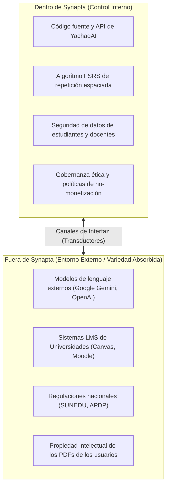
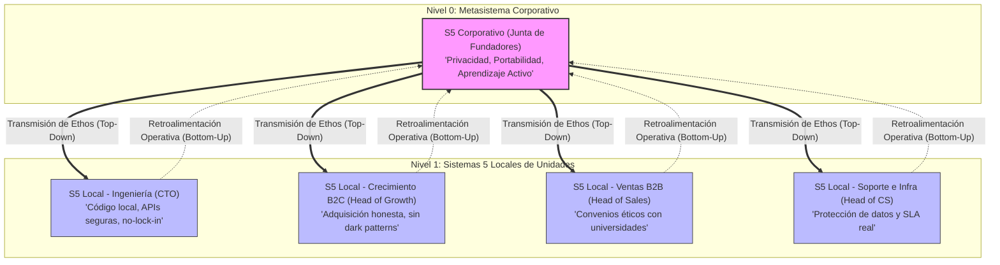
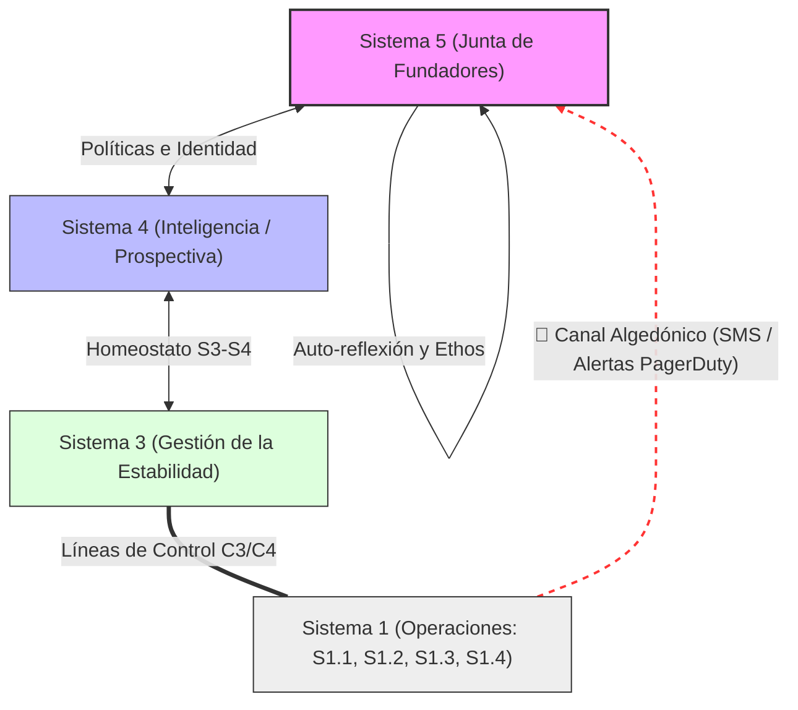
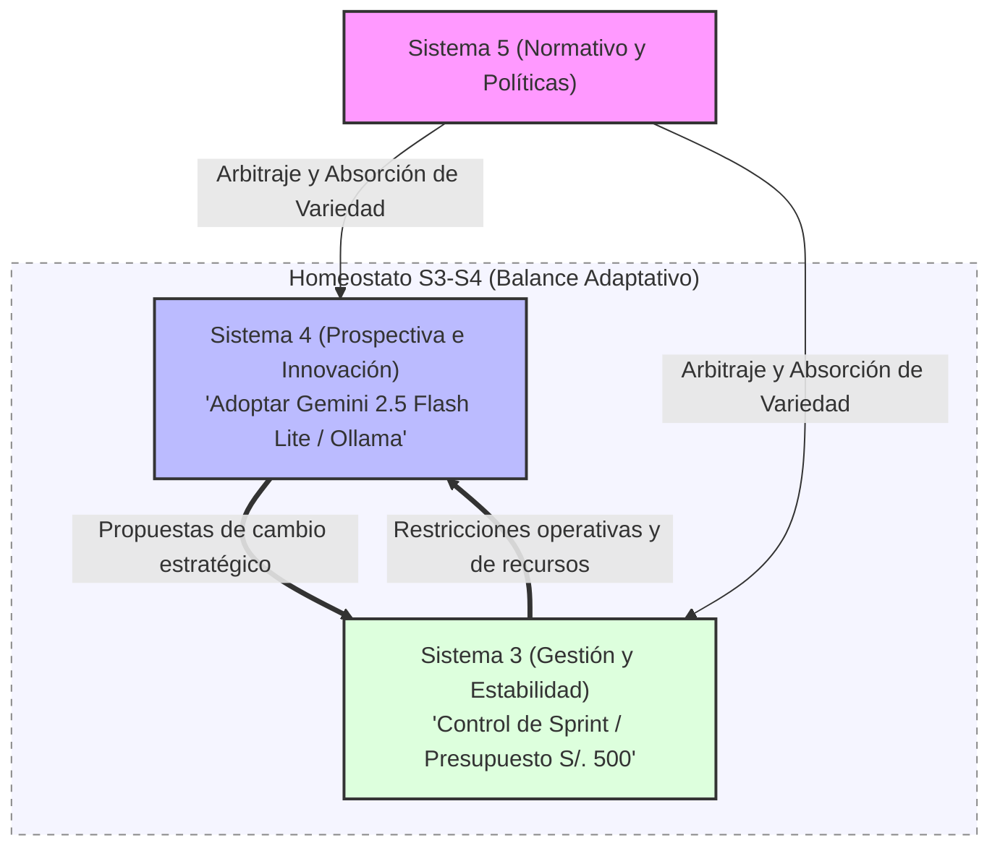

# 10_sistema_5

> **Validación Cap. 2 (Pérez Ríos/Beer):** Esta fase corresponde al diseño del **Sistema 5 (Políticas, Identidad y Ethos)** de Synapta. Su propósito fundamental es establecer el "cierre" normativo y la clausura organizacional del metasistema [1]. El S5 ejerce el **Management Normativo** [2], definiendo y salvaguardando la identidad, los valores y el *ethos* (carácter) que rigen a toda la corporación, actuando además como el **absorbedor final de la variedad** que la interacción adaptativa entre el presente (S3) y el futuro (S4) no logra resolver [1], [3].

---

## Tabla de Contenidos

- [1. Introducción al diseño del Sistema 5](#1-introduccion-al-diseno-del-sistema-5)
- [2. Construcción de la identidad organizacional](#2-construccion-de-la-identidad-organizacional)
  - [2.1 Propósito y la Regla POSIWID](#21-proposito-y-la-regla-posiwid)
  - [2.2 Límites Organizacionales (Boundaries)](#22-limites-organizacionales-boundaries)
- [3. Diseño de principios y valores organizacionales](#3-diseno-de-principios-y-valores-organizacionales)
- [4. Diseño de la política organizacional](#4-diseno-de-la-politica-organizacional)
  - [4.1 Política de Soberanía y Privacidad de Datos (Ley N° 29733)](#41-politica-de-soberania-y-privacidad-de-datos-ley-n-29733)
  - [4.2 Política de Transparencia Tecnológica y Ética de la IA](#42-politica-de-transparencia-tecnologica-y-etica-de-la-ia)
  - [4.3 Política de No Monetización de Información del Usuario](#43-politica-de-no-monetizacion-de-informacion-del-usuario)
- [5. Diseño del sistema de gobernanza](#5-diseno-del-sistema-de-gobernanza)
  - [5.1 El Consejo Directivo (Junta de Fundadores)](#51-el-consejo-directivo-junta-de-fundadores)
  - [5.2 Cadena de Transmisión de Identidad (Verticalidad del S5)](#52-cadena-de-transmision-de-identidad-verticalidad-del-s5)
- [6. Diseño del proceso de toma de decisiones estratégicas](#6-diseno-del-proceso-de-toma-de-decisiones-estrateicas)
  - [6.1 Relación de S5 con el Canal Algedónico (Algedonic Loop)](#61-relacion-de-s5-con-el-canal-algedonico-algedonic-loop)
  - [6.2 Protocolo de Acción Ante Alertas Algedónicas Estratégicas](#62-protocolo-de-accion-ante-alertas-algedonicas-estrateicas)
- [7. Diseño de la homeostasis Sistema 3 – Sistema 4](#7-diseno-de-la-homeostasis-sistema-3-sistema-4)
  - [7.1 El Rol de Arbitraje del Sistema 5](#71-el-rol-de-arbitraje-del-sistema-5)
  - [7.2 Protocolo de Resolución de Conflictos y Team Syntegrity](#72-protocolo-de-resolucion-de-conflictos-y-team-syntegrity)
- [8. Diseño de la identidad evolutiva](#8-diseno-de-la-identidad-evolutiva)
  - [8.1 Escenarios de Respuesta Evolutiva](#81-escenarios-de-respuesta-evolutiva)
- [9. Relación con stakeholders](#9-relacion-con-stakeholders)
- [10. Análisis de variedad e identidad](#10-analisis-de-variedad-e-identidad)
  - [10.1 Indicadores de Salud del Homeostato S3-S4](#101-indicadores-de-salud-del-homeostato-s3-s4)
- [11. Riesgos de inviabilidad asociados al Sistema 5](#11-riesgos-de-inviabilidad-asociados-al-sistema-5)
- [12. Validación del diseño del Sistema 5](#12-validacion-del-diseno-del-sistema-5)
  - [12.1 Prevención de Patologías del VSM (Capítulo 3)](#121-prevencion-de-patologias-del-vsm-capitulo-3)
- [13. Conclusiones](#13-conclusiones)
- [14. Referencias citadas](#14-referencias-citadas)

---

## 1. Introducción al diseño del Sistema 5

El **Sistema 5 (Políticas, Identidad y Ethos)** representa la instancia última de auto-reflexión, dirección y clausura de Synapta [1]. De acuerdo con la cibernética organizacional desarrollada por Stafford Beer y sistematizada por José Pérez Ríos, el Sistema 5 no debe confundirse con la gestión operativa ni con la planificación estratégica; su función no es el "cómo hacer" sino el **"quiénes somos y por qué existimos"** [3]. 

En Synapta, una startup EdTech en etapa de validación de su producto principal **YachaqAI**, el Sistema 5 ejerce la **Gestión Normativa (Management Normativo)** [2]. Esto implica establecer las políticas éticas, los límites existenciales de la empresa y los valores que impiden que las subunidades operativas (sistemas 1) pierdan la cohesión corporativa [3]. El S5 de Synapta se asienta físicamente en la **Junta de Fundadores** y actúa como el **absorbedor final de la variedad** no resuelta en el homeostato central, interactuando de manera directa y continua con el Sistema 4 (Inteligencia Estratégica) y el Sistema 3 (Gestión de la Estabilidad) para arbitrar el equilibrio evolutivo de la organización [1, 4].

---

## 2. Construcción de la identidad organizacional

### 2.1 Propósito y la Regla POSIWID
El propósito sistémico de una organización se define cibernéticamente a través de la regla de Stafford Beer: **POSIWID** (*The Purpose of a System is What it Does* - El propósito de un sistema es lo que este hace) [1]. El propósito real y verificable de Synapta es **mitigar el olvido sistemático en procesos de aprendizaje intensivo mediante el desarrollo de tecnologías portables, privadas y pedagógicamente eficientes** [5].

YachaqAI cumple este propósito procesando documentos académicos desestructurados (PDFs, apuntes), transformándolos en grafos semánticos basados en archivos Markdown de texto plano y optimizando el repaso del estudiante mediante algoritmos científicos de repetición espaciada (FSRS) [5, 6]. Toda acción u operación que realice la empresa debe estar alineada estrictamente con este propósito.

### 2.2 Límites Organizacionales (Boundaries)
Para evitar desviaciones de la identidad y la sobrecarga de variedad inútil, el Sistema 5 establece límites estrictos sobre el alcance de la organización:



*   **Synapta NO es una consultora de desarrollo de software:** Se rechazan proyectos a medida que no contribuyan a la optimización de YachaqAI, evitando la fragmentación del equipo en tareas operativas dispersas.
*   **Synapta NO crea contenidos curriculares:** Su rol es puramente tecnológico, actuando como un habilitador del aprendizaje. No compite con las universidades ni con la labor pedagógica de los docentes.

---

## 3. Diseño de principios y valores organizacionales

El *ethos* de Synapta se define mediante cuatro principios fundamentales aprobados por el Sistema 5, los cuales sirven de pauta obligatoria para el diseño de productos y la ejecución comercial:

1.  **Soberanía del Conocimiento (Portabilidad):** El conocimiento del usuario le pertenece exclusivamente a él. YachaqAI debe almacenar y exportar la información del usuario en formatos de texto plano abiertos y no propietarios (Markdown). Se prohíbe el uso de formatos de bloqueo ("Vendor Lock-in") que impidan al estudiante migrar sus datos a otros ecosistemas de notas (como Obsidian o Logseq) [6].
2.  **Privacidad de Datos como Derecho Fundamental:** En cumplimiento estricto con la **Ley N° 29733 (Ley de Protección de Datos Personales del Perú)** y sus directivas de seguridad, Synapta garantiza que los datos de estudio, resúmenes y evaluaciones académicas no serán expuestos a terceros ni transferidos a nubes públicas sin el consentimiento explícito del titular [7, 8].
3.  **La Inteligencia Artificial como Amplificador, no como Sustituto:** El objetivo del sistema no es generar atajos cognitivos que promuevan la pereza intelectual (como redactar monografías completas por el alumno), sino estructurar el material de estudio para facilitar el aprendizaje activo, el auto-examen y la retención a largo plazo.
4.  **Rigurosidad Científica Pedagógica:** Synapta basa el desarrollo de YachaqAI en algoritmos de aprendizaje validados. Se prioriza el uso de la **programación con repetición espaciada basada en el algoritmo FSRS (Free Spaced Repetition Scheduler)**, el cual ha demostrado reducir el tiempo de repaso requerido para retener información en un **30% a 50%** en comparación con los métodos de repaso lineales o algoritmos más antiguos como el SM-2 [9, 10].

---

## 4. Diseño de la política organizacional

Las directrices del Sistema 5 se traducen en tres políticas corporativas no negociables. Su incumplimiento activa de inmediato el canal algedónico y la intervención directa de la Junta de Fundadores.

### 4.1 Política de Soberanía y Privacidad de Datos (Ley N° 29733)
De acuerdo con las regulaciones de la Autoridad Nacional de Protección de Datos Personales (APDP) del Perú, toda base de datos de usuarios universitarios (en su mayoría jóvenes e incluso menores de edad) debe ser tratada bajo estrictas medidas de seguridad técnica [8]. 
*   **Implementación:** Se establece que los servidores de producción de YachaqAI y sus bases de datos asociadas en Supabase deben contar con cifrado en reposo y en tránsito. Toda integración RAG (Retrieval-Augmented Generation) que procese PDFs de tesis o investigaciones universitarias debe ejecutarse sobre APIs empresariales con contratos que excluyan explícitamente el uso de dichos datos para entrenamiento de modelos globales de terceros (como los términos de uso comercial de Vertex AI de Google Cloud) [11, 12].

### 4.2 Política de Transparencia Tecnológica y Ética de la IA
Synapta declara que el uso de modelos de lenguaje (LLMs) debe ser completamente transparente para el usuario final.
*   **Implementación:** La aplicación debe etiquetar de forma explícita qué resúmenes, flashcards y sugerencias de repaso han sido auto-generados por IA. Además, en los planes institucionales (B2B), se debe ofrecer la opción de ejecutar modelos pequeños locales (**Small Language Models - SLMs como Llama 3.2 o Gemma 3 9B vía Ollama**) de forma desconectada ("Local-First"), garantizando el cumplimiento normativo interno de las universidades aliadas frente a auditorías de protección intelectual [11, 13].

### 4.3 Política de No Monetización de Información del Usuario
El modelo de negocio de Synapta se basa exclusivamente en suscripciones (SaaS B2C) y licenciamiento institucional (SaaS B2B).
*   **Implementación:** Queda terminantemente prohibida la venta de datos agregados de estudio, el perfilamiento comercial de estudiantes universitarios, o la introducción de publicidad de terceros dentro de la interfaz de YachaqAI. Esta política protege la integridad del entorno educativo y la confianza de las universidades peruanas licenciadas por SUNEDU [14].

---

## 5. Diseño del sistema de gobernanza

### 5.1 El Consejo Directivo (Junta de Fundadores)
El Sistema 5 corporativo se encarna en la **Junta de Fundadores** de Synapta (CEO, CTO y CFO en la Fase 1), la cual asume la dirección normativa [3]. A medida que la organización escale (Fase 2 y 3), el S5 se formalizará como un **Consejo Directivo (Board of Directors)** que integrará representación de los inversores minoritarios y asesores académicos externos, manteniendo siempre la mayoría de votos del núcleo fundador para salvaguardar el *ethos* ético [15].

### 5.2 Cadena de Transmisión de Identidad (Verticalidad del S5)
Siguiendo la teoría de la recursividad (anidamiento del VSM), la identidad y las políticas definidas por el S5 central (Nivel 0) deben transmitirse intactas hacia los Sistemas 5 locales de las unidades del Nivel 1. Cada director local de unidad actúa como el custodio local de la política corporativa:



*   **CTO (S5 Local de Ingeniería):** Asegura que ninguna biblioteca de código o base de datos comprometa la privacidad de los datos de YachaqAI [4].
*   **Head of Growth (S5 Local de B2C):** Veta campañas publicitarias engañosas o el uso de trucos de conversión ("dark patterns") en el embudo de ventas.
*   **Head of Sales (S5 Local de B2B):** Asegura que los convenios con universidades no incluyan cláusulas de explotación comercial de los datos de los estudiantes.
*   **Head of Customer Success (S5 Local de Soporte/DevOps):** Vela por la protección de las llaves de seguridad y accesos a logs del sistema.

---

## 6. Diseño del proceso de toma de decisiones estratégicas

### 6.1 Relación de S5 con el Canal Algedónico (Algedonic Loop)
El **canal algedónico** transmite señales de emergencia ("dolor" o anomalías críticas) directamente desde las operaciones base del Sistema 1 o el entorno, puenteando los filtros jerárquicos del Sistema 3 y del Sistema 4 para llegar de inmediato al Sistema 5 [1, 16]. Esto asegura que la alta dirección tome conocimiento de crisis de viabilidad en tiempo real.



### 6.2 Protocolo de Acción Ante Alertas Algedónicas Estratégicas
Cuando se activa el canal algedónico por superar umbrales críticos de viabilidad cuantitativos o cualitativos (ej. caída prolongada del servicio > 4h, brecha de seguridad bajo la Ley 29733, o acusaciones públicas contra la ética de la marca), el Sistema 5 activa el siguiente protocolo de acción inmediata:

1.  **Convocatoria de Emergencia (Plazo < 2 horas):** El CEO (o cualquier fundador que reciba la alerta algedónica) convoca a sesión extraordinaria inmediata a la Junta de Fundadores [15].
2.  **Activación de Contención Técnica (Ejecución en < 4 horas):** El CTO and DevOps ejecutan el protocolo técnico pre-diseñado (bloqueo de base de datos Supabase, failover a nube de respaldo o desactivación de API de RAG comprometida) [12, 17].
3.  **Comunicación Legal y Regulatoria (Plazo < 24 horas):** En cumplimiento de la normativa peruana, el asesor legal y el CEO redactan el reporte oficial sobre la brecha de seguridad y lo notifican a la APDP y a los decanos de las universidades del piloto B2B, previniendo sanciones [8, 14].
4.  **Sesión de Viabilidad del Sistema 5 (Plazo < 48 horas):** La Junta de Fundadores sesiona para evaluar los daños a la identidad de marca, discutiendo si la anomalía requiere un giro de política, un rediseño de la infraestructura o la reevaluación del piloto B2B actual.

---

## 7. Diseño de la homeostasis Sistema 3 – Sistema 4

### 7.1 El Rol de Arbitraje del Sistema 5
El metasistema de Synapta se sostiene sobre el **equilibrio homeostático entre el Sistema 3 (que busca la estabilidad y optimización del presente) y el Sistema 4 (que busca la innovación y adaptación al entorno futuro)** [1, 3]. Dado que el S3 y el S4 defienden intereses contrapuestos (los recursos diarios frente a los planes de cambio), el **Sistema 5 actúa como el absorbedor final de variedad** [1]. Su rol es arbitrar el homeostato, interviniendo para balancear las fuerzas del presente y del futuro y resolviendo la complejidad que S3 y S4 son incapaces de conciliar [1, 4].



### 7.2 Protocolo de Resolución de Conflictos y Team Syntegrity
Para evitar que las diferencias paralicen a la startup, se implementa el protocolo de **Team Syntegrity** simplificado para icosaedros, como se detalla en el diseño de S3 [15]:
*   **Activación:** Si en la reunión de sincronización del homeostato S3-S4 no se alcanza un consenso asíncrono sobre una iniciativa prioritaria (ej. el CTO (S4) insiste en migrar la base de datos a vector-embedding local para cumplir con Ley 29733, pero el CFO (S3) se opone por el esfuerzo técnico y la limitación de horas del sprint de Ingeniería) [7, 13].
*   **Iteraciones de Debate:** Se distribuyen 12 roles entre los fundadores y colaboradores bajo el protocolo democrático sin jerarquías. Se debaten alternativas y se estiman costos usando el simulador dinámico en vivo de la Sala de Operaciones [15].
*   **Fallo Normativo de S5:** Si tras las iteraciones persiste el bloqueo, el conflicto sube a la Junta de Fundadores (S5). El S5 decide basándose exclusivamente en el *ethos* y los valores corporativos: en este caso, al ser la *Privacidad de Datos* un principio fundacional no negociable (sección 3), la Junta de Fundadores falla a favor de la migración tecnológica del S4, ordenando al S3 la reasignación de horas de sprint necesarias para salvaguardar la viabilidad a largo plazo [3, 7].

---

## 8. Diseño de la identidad evolutiva

El Sistema 5 de Synapta no es estático; está diseñado para guiar la evolución de la identidad organizacional sin perder sus raíces éticas. La **identidad evolutiva** de Synapta se rige por el principio de **viabilidad más allá de la supervivencia** [1]. En la cibernética organizacional, este principio distingue a las organizaciones que meramente sobreviven en el corto plazo de aquellas que son capaces de aprender, adaptarse y perseverar como entidad autónoma a lo largo de sucesivos ciclos de disrupciones del entorno [1, 3].

Cibernéticamente, la identidad evolutiva se ilustra mediante la **analogía de la crisálida y la mariposa**: aunque la forma física, la infraestructura técnica o el mercado de destino de la organización muten por completo ante disrupciones del entorno, el núcleo rector (S5) garantiza que el *individuo* (la identidad de Synapta) persista a través de procesos continuos de aprendizaje y adaptación [1, 4]. Esto es análogo al concepto de **aprendizaje de doble bucle** (*double-loop learning*) de Argyris y Schön (1978): no se trata solo de corregir los errores operativos (bucle simple), sino de cuestionar y rediseñar los supuestos y valores que generaron esos errores en primer lugar. El S5 de Synapta tiene la responsabilidad de habilitar este nivel de aprendizaje a nivel corporativo.

Para que esta evolución sea gestionable y no derive en la patología de la *Identidad Mal Definida*, el Sistema 5 establece un **núcleo de identidad invariante** y una **capa adaptativa** que puede modificarse sin comprometer la esencia:

| Dimensión | Núcleo Invariante (No Negociable) | Capa Adaptativa (Puede Evolucionar) |
| :--- | :--- | :--- |
| **Propósito** | Amplificar la retención cognitiva del estudiante | Canal de entrega (mobile-first, PWA, extensión de navegador) |
| **Ética de Datos** | Privacidad soberana (Ley N° 29733) | Proveedor de infraestructura (Supabase, Neon, self-hosted) |
| **Pedagogía** | Repetición espaciada basada en algoritmo FSRS | Formato de contenido (flashcards, grafos, linea de tiempo) |
| **Modelo de Negocio** | No monetizar datos del usuario | Estructura de precios (freemium, suscripción, licencia) |

Esta separación entre lo permanente y lo mutable permite que el Sistema 5 autorice pivots estratégicos sin generar desorientación interna o externa [4, 6].

### 8.1 Escenarios de Respuesta Evolutiva

*   **Ante la Disrupción Tecnológica (Ej. Google NotebookLM lanza versión escolar gratuita en Perú):**
    *   *Respuesta Evolutiva:* La Junta de Fundadores redefine la diferenciación de YachaqAI. En lugar de competir en volumen de almacenamiento en la nube, se enfoca la identidad de marca en la **soberanía total del conocimiento (exportabilidad a Markdown local)** y en el cumplimiento de la Ley N° 29733. La Sala de Operaciones (S4) recoge datos cualitativos que evidencian que el 68% de los estudiantes universitarios peruanos desconoce que sus materiales de estudio suben a servidores de terceros. El S5 autoriza una campaña de posicionamiento centrada en la privacidad: *"Tu cuaderno. Tu mente. Tu código"* [7, 12, 20].
*   **Ante la Disrupción Regulatoria (Ej. SUNEDU restringe el uso de IAs generativas en evaluaciones de pregrado):**
    *   *Respuesta Evolutiva:* El S5 lidera una adecuación inmediata de la propuesta de valor. Se desactivan los motores RAG generativos de redacción libre de texto de YachaqAI en las cuentas institucionales B2B. La herramienta efectúa su metamorfosis para presentarse formalmente como un **sistema de portafolios digitales de repaso y retención activa basado en tarjetas FSRS**, lo cual califica positivamente como "evidencia de estudio independiente" bajo las Condiciones Básicas de Calidad (CBC) de la Ley Universitaria N° 30220 [14, 18]. El *ethos* de amplificación cognitiva permanece intacto; solo cambia el canal y la forma de la herramienta.
*   **Ante la Disrupción Competitiva (Ej. Aparición de un competidor peruano con precios más bajos):**
    *   *Respuesta Evolutiva:* El S5 valida, a través del homeostato S3-S4, si la ventaja del competidor es de precio o de calidad pedagógica. Si es de precio, se activa el bloqueo de la capa adaptativa (modelo de precios) sin comprometer el núcleo. Si es de calidad, se activa un sprint de innovación en el S4 centrado en métricas de retención a 90 días (intervalo de olvido en curva de Ebbinghaus), aprovechando la ventaja diferencial del algoritmo FSRS v5 con un intervalo de retención objetivo del 90% (Ye, 2024) [9, 10].

---

## 9. Relación con stakeholders

La viabilidad y sostenibilidad de largo plazo exigen que el Sistema 5 sea representativo de los intereses de toda la comunidad con la que interactúa. En concordancia con los principios del VSM, el S5 no se limita a representar a los accionistas, sino que incluye democráticamente a todos los grupos de interés (stakeholders), asumiendo una **responsabilidad intergeneracional hacia el futuro** [1]:

| Stakeholder | Interés Principal | Mecanismo de Representación en el S5 |
| :--- | :--- | :--- |
| **Estudiantes Universitarios (B2C)** | Portabilidad de datos, privacidad, algoritmos FSRS eficaces y asequibles [6, 9]. | Monitoreo trimestral del NPS y la retención D7. El Head of Customer Success actúa como su portavoz y defensor en el S5 corporativo [15]. |
| **Docentes y Facultades (B2B)** | Evidencia del progreso de estudio, facilidad en pilotos, alineación curricular [14]. | Reuniones de retroalimentación mensuales. El Head of Sales representa sus requerimientos de calidad ante la Junta de Fundadores [15]. |
| **Equipo Fundador y Desarrolladores** | Clima laboral equilibrado, autonomía técnica, equidad en capital (Equity) [13]. | Participación directa de los líderes de Ingeniería (CTO), Growth e Infraestructura en las SAS semanales. |
| **Inversores (Ángeles y VCs)** | Crecimiento de WAU, viabilidad financiera de largo plazo, cumplimiento legal [19]. | Reportes de tracción mensuales y un asiento formal (sin veto normativo) en la Junta de Directores en Fase 2 [15]. |
| **Ente Regulador (SUNEDU / APDP)** | Cumplimiento de la Ley Universitaria N° 30220 y Ley N° 29733 [8, 18]. | El Asesor Legal externo audita los convenios y el software de YachaqAI, reportando directamente al S5. |
| **Generaciones Futuras (Sociedad)** | Acceso a educación equitativa, soberanía tecnológica, eficiencia ecológica en cómputo [1, 20]. | S5 establece políticas de "computación verde" (eficiencia del modelo) y mantiene el compromiso de código abierto/portabilidad para evitar deudas cognitivas en el futuro. |

---

## 10. Análisis de variedad e identidad

De acuerdo con la **Ley de Requisite Variety de Ashby** (*Only variety can destroy variety* - Solo la variedad puede absorber variedad), el Sistema 5 debe equilibrar la complejidad del entorno regulatorio y de mercado con la capacidad directiva interna de Synapta [1, 3]. En términos prácticos, esto significa que la *amplitud de respuestas* de la Junta de Fundadores debe ser, al menos, tan grande como la *amplitud de perturbaciones* que el entorno puede generar.

El entorno externo de Synapta genera, en sus dimensiones críticas, al menos **cuatro fuentes de variedad relevante**:

| Fuente de Variedad | Dimensión | Estrategia de Absorción del S5 |
| :--- | :--- | :--- |
| Cambios regulatorios (SUNEDU, APDP, Ley N° 29733) | Normativa | Asesor Legal externo + Protocolo algedónico de respuesta en < 24h |
| Disrupciones tecnológicas (nuevos LLMs, APIs de terceros) | Tecnológica | Arquitectura local-first (Ollama/SLMs) + Sprint de evaluación S4 |
| Variabilidad del mercado universitario (105 universidades licenciadas) | Comercial | Segmentación B2B vs. B2C + Políticas de no lock-in para universidades |
| Competencia de plataformas globales (Google, Microsoft, OpenAI) | Competitiva | Diferenciación en privacidad soberana y portabilidad a Markdown |

```
                 ATENUADORES DE VARIEDAD (Filtros del S5)
                 ┌──────────────────────────────────────┐
                 │ • Declaración explícita de límites.  │
                 │ • Exclusión de consultorías externas.│
                 │ • Políticas estrictas de privacidad. │
                 └──────────────────┬───────────────────┘
                                    ▼
  Entorno Complejo  ─────────────────────────────────► Metasistema Directivo
 (105 Universidades,                                   (Junta de Fundadores)
   SUNEDU, Ley 29733)               ▲
                                    │
                 ┌──────────────────┴───────────────────┐
                 │ • Protocolo democrático de Syntegrity│
                 │ • Tablero de Scrum / Kanban S2.      │
                 │ • Modelo FSRS local automatizado.    │
                 └──────────────────────────────────────┘
                 AMPLIFICADORES DE VARIEDAD (Canales del S5)
```

*   **Atenuador de Variedad Externa (Filtro):** El S5 actúa como un filtro existencial. Al definir explícitamente lo que *NO HACE* Synapta (sección 2.2) y establecer que no se monetizarán datos, se reduce la variedad de opciones comerciales, permitiendo a la startup concentrar sus escasos recursos en refinar YachaqAI. Este principio es análogo al *MVP (Minimum Viable Product)* de la metodología Lean Startup: el S5 actúa como el árbitro máximo que valida si un nuevo requerimiento o idea de negocio es consistente con la identidad central, o si es ruido que distrae del propósito [5, 19].
*   **Amplificador de Variedad Interna (Facilitador):** El S5 amplifica la capacidad de control del equipo fundador al dotarlos de **políticas éticas claras y pre-diseñadas**. Cuando surge una duda regulatoria o técnica, el equipo del Sistema 1 no necesita detener las operaciones para consultar al CEO; las políticas normativas de S5 actúan como una guía autónoma de acción local [4, 15]. En términos de diseño de software, esto equivale a la implementación de **Architecture Decision Records (ADRs)**: documentos que registran las decisiones arquitectónicas vinculantes, con el objetivo de que los equipos de ingeniería puedan tomar micro-decisiones consistentes con la política de privacidad sin necesidad de aprobación directa del CTO en cada iteración.

### 10.1 Indicadores de Salud del Homeostato S3-S4

Siguiendo las recomendaciones del MSV, la salud del homeostato se evalúa cualitativamente por la ausencia de los siguientes síntomas de disociación [1, 3]:

*   🔴 **Señal de alerta crítica:** El equipo de S4 (Innovación) percibe sistemáticamente que el equipo de S3 (Operaciones) es "corto de miras" o que siempre bloquea los cambios sin justificación técnica.
*   🔴 **Señal de alerta crítica:** El equipo de S3 (Operaciones) percibe sistemáticamente que el equipo de S4 (Innovación) es "poco realista" o que propone cambios incompatibles con los sprints en curso.
*   🟡 **Señal de advertencia:** La Sala de Operaciones no se utiliza para la toma de decisiones de arbitraje; el conflicto S3-S4 se resuelve informalmente en conversaciones bilaterales sin documentación.
*   🟢 **Señal de homeostato saludable:** Las propuestas del S4 son cuestionadas constructivamente por el S3 con datos de carga operativa, y el S4 responde con estimaciones actualizadas del costo-beneficio a largo plazo, alcanzando un acuerdo documentado en el tablero de decisiones dentro de los plazos del sprint.

La Junta de Fundadores (S5) debe revisar este estado de salud una vez por trimestre como parte de su *Comité de Identidad y Ética*.

---

## 11. Riesgos de inviabilidad asociados al Sistema 5

Si el Sistema 5 no funciona correctamente, Synapta enfrenta cuatro riesgos críticos que amenazan su existencia autónoma. Para cada riesgo se define un **indicador de detección temprana** que puede ser monitoreado por la Junta de Fundadores sin necesidad de esperar a que el daño sea irreversible:

1.  **Deriva Identitaria (*Identity Drift*):**
    *   *Descripción:* Ocurre cuando la Junta de Fundadores, presionada por la necesidad de capital de corto plazo, acepta contratos B2B con universidades que exijan la cesión de propiedad intelectual de los estudiantes o la inclusión de cláusulas de monetización de datos de uso [14]. Esto violaría el principio de soberanía del conocimiento, destruyendo la confianza de la comunidad y la ventaja competitiva de privacidad frente a plataformas globales.
    *   *Indicador de Detección Temprana:* Cualquier cláusula en un contrato B2B que mencione "derechos de uso de datos de sesión para fines de mejora del servicio de terceros" o "cesión de datos agregados de aprendizaje". El asesor legal debe vetarla antes de la firma y escalar al S5 para su decisión definitiva.
    *   *Medida Preventiva:* El *Contrato Marco de Licenciamiento Institucional* de Synapta incluye una cláusula DPA (*Data Processing Agreement*) inviolable que prohíbe explícitamente la compartición de datos de estudiantes con terceros, alineado a las mejores prácticas del RGPD europeo como referencia técnica [8].

2.  **Desconexión Metasistémica (S5 desvinculado de los Niveles 1):**
    *   *Descripción:* Ocurre si la directiva central del Nivel 0 define políticas éticas e identitarias sin consultar a los ingenieros del Nivel 1.1 o al equipo de soporte [4, 15]. Se manifiesta cuando el S5 impone directrices técnicamente inviables que generan una carga operativa irrealizable, fomentando que el equipo local las ignore de facto para poder cumplir las entregas. Esta es una forma de *esquizofrenia institucional*, donde lo que el S5 declara en el papel difiere radicalmente de la práctica operativa real [3].
    *   *Indicador de Detección Temprana:* Alta tasa de *workarounds* (soluciones alternativas no documentadas) en el código de producción, o múltiples decisiones técnicas tomadas a nivel de Nivel 1 sin estar registradas en los ADRs de arquitectura.
    *   *Medida Preventiva:* El CTO participa directamente en la Junta de Fundadores (es un co-fundador) y el *Comité de Identidad y Ética Trimestral* obliga a la validación ascendente de toda política de S5 con al menos dos líderes del Nivel 1 antes de su aprobación definitiva.

3.  **Incapacidad de Absorción Algedónica:**
    *   *Descripción:* Ocurre si el S5 ignora las alertas del canal algedónico o demora en convocar a sesión extraordinaria tras una brecha de seguridad bajo la Ley N° 29733 [8, 19]. Esto incrementa la exposición legal a multas administrativas que en el Perú pueden superar las **50 UIT** (Unidades Impositivas Tributarias, equivalentes a S/. 262,500 a la UIT vigente 2024), destruyendo la viabilidad financiera de la startup y cerrando el acceso a futuras licitaciones con universidades públicas [7].
    *   *Indicador de Detección Temprana:* Alertas PagerDuty/Uptime Robot sin respuesta documentada del S5 en las primeras 2 horas. Umbral de respuesta no cumplido en simulacros trimestrales de brecha de datos.
    *   *Medida Preventiva:* Protocolo de respuesta en 4 pasos detallado en la sección 6.2, con responsable, plazo y canal de notificación definidos. Simulacro semestral de brecha de datos obligatorio.

4.  **Colapso del S5 en el S3 (Microgestión Normativa):**
    *   *Descripción:* Esta es la patología más común en startups en etapa temprana: los fundadores, al no existir aún un S4 maduro o una Sala de Operaciones instrumentada, se ven arrastrados a resolver problemas operativos del día a día (bugs críticos, SLA con universidades, soporte técnico de emergencia) en detrimento de sus funciones normativas y de gobernanza [1, 3]. El resultado neto es que la identidad de Synapta deja de evolucionar: no se actualizan las políticas de privacidad, no se monitorea el entorno regulatorio y no se sesiona el homeostato S3-S4.
    *   *Indicador de Detección Temprana:* El CEO o el CTO destinan más del 40% de su tiempo semanal a tareas operativas que no requieren decisión normativa (debugging, atención de tickets de soporte, revisión de PRs de rutina).
    *   *Medida Preventiva:* Implementar la Sala de Operaciones (S4) con al menos las métricas mínimas automatizadas (tablero de Uptime, NPS automatizado, alertas de presupuesto de API) antes de finalizar la Fase 1, de modo que el S5 pueda arbitrar con datos y no con intuición.

---

## 12. Validación del diseño del Sistema 5

### 12.1 Prevención de Patologías del VSM (Capítulo 3)
El correcto diseño del Sistema 5 de Synapta evita activamente las cuatro patologías de identidad y directivas descritas en la literatura cibernética de José Pérez Ríos [3]:

1.  **Prevención de la "Identidad Mal Definida" (*No sé quién soy*):**
    *   *Evidencia en el Diseño:* Se define formalmente el propósito de la organización mediante la regla POSIWID (sección 2.1) y se establecen límites de boundaries precisos (sección 2.2) junto con directrices sobre qué *NO* es y qué *NO* hace Synapta, impidiendo la deriva hacia consultorías de software a medida.
2.  **Prevención de la "Esquizofrenia Institucional":**
    *   *Evidencia en el Diseño:* Se evita la coexistencia de concepciones de identidad divergentes e incompatibles mediante la centralización normativa en la Junta de Fundadores (sección 5.1). Adicionalmente, el *Comité de Identidad y Ética Trimestral* (sección 2.1 de `4_coherencia_y_control.md`) canaliza de forma formal las propuestas de ajuste de políticas que surjan desde las bases de Nivel 1 (Alineación Ascendente), logrando un consenso unificado.
3.  **Prevención del "Colapso del Sistema 5 en el Sistema 3" (*Inexistencia de Metasistema*):**
    *   *Evidencia en el Diseño:* Esta patología surge habitualmente cuando el Sistema 4 es débil o no existe, obligando a los fundadores a descuidar las políticas estratégicas para meterse en la microgestión operativa [1, 3]. Synapta previene esto estructurando un **Sistema 4 robusto** provisto de sensores de entorno, radares y los simuladores dinámicos M2 y M5 en la Sala de Operaciones (sección 5.1 de `9_sistema_4.md`), lo que protege el tiempo de la Junta de Fundadores para centrarse exclusivamente en la gobernanza corporativa y la adaptabilidad de largo plazo.
4.  **Prevención de la "Representación Inadecuada Frente a Niveles Superiores":**
    *   *Evidencia en el Diseño:* Se dota al metasistema de una **cadena formal de transmisión de identidad de arriba a abajo y de abajo a arriba** (sección 5.2). Los Sistemas 5 de Nivel 1 (CTO, Growth, CS, Sales) están anidados jerárquicamente dentro del S5 central del Nivel 0, lo que garantiza que la visión y misión de Synapta fluyan sin distorsiones hacia las operaciones y viceversa.

---

## 13. Conclusiones

El diseño del **Sistema 5** de Synapta dota a la organización de un cierre normativo y una identidad ética sólida, indispensables para competir en el complejo mercado de EdTech y cumplir con las normativas de SUNEDU y la Ley N° 29733 en el Perú [7, 18]. Al basar la gobernanza en la soberanía del conocimiento y la portabilidad del texto Markdown (asistidos por algoritmos FSRS), la startup se posiciona de manera diferencial frente a las plataformas cerradas de las grandes corporaciones tecnológicas internacionales [6, 9]. Finalmente, la delimitación de políticas normativas y la formalización de protocolos homeostáticos (S3-S4-S5) y algedónicos garantizan la viabilidad operativa y adaptativa necesaria para que Synapta crezca y escale de forma sostenible [1, 3].

---

## 14. Referencias citadas

*   Argyris, C., & Schön, D. A. (1978). *Organizational Learning: A Theory of Action Perspective*. Addison-Wesley.
*   Beer, S. (1979). *The Heart of Enterprise*. John Wiley & Sons.
*   Beer, S. (1985). *Diagnosing the System for Organizations*. John Wiley & Sons.
*   Beyer, B., Jones, C., Petoff, J., & Murphy, K. (2016). *Site Reliability Engineering: How Google Runs Production Systems*. O'Reilly Media.
*   Cepeda, J. L., & Rodríguez-Ponce, E. (2016). La gestión del conocimiento y su impacto en la innovación en organizaciones de educación superior. *Horizontes Empresariales*, 15(2), 6–21.
*   Ebbinghaus, H. (1885). *Über das Gedächtnis: Untersuchungen zur experimentellen Psychologie*. Duncker & Humblot.
*   Google Cloud. (2026). *Vertex AI Pricing and Data Usage Guidelines*. Google.
*   INEI. (2024). *Estadísticas de Tecnologías de la Información y Comunicación en el Perú*. Instituto Nacional de Estadística e Informática.
*   Ries, E. (2011). *The Lean Startup: How Today's Entrepreneurs Use Continuous Innovation to Create Radically Successful Businesses*. Crown Business.
*   MINJUSDH. (2011). *Ley N° 29733 - Ley de Protección de Datos Personales del Perú y su Reglamento (D.S. N° 003-2013-JUS)*. Ministerio de Justicia y Derechos Humanos del Perú.
*   Pérez Ríos, J. (2008). *Diseño de organizaciones viables: El Modelo de Sistema Viable*. Ibergarceta Editorial.
*   Pérez Ríos, J. (2012). *Diseño y Diagnóstico para Organizaciones Sostenibles*. Ibergarceta Editorial.
*   SUNEDU. (2014). *Ley Universitaria N° 30220 y sus Condiciones Básicas de Calidad (CBC)*. Superintendencia Nacional de Educación Superior Universitaria.
*   SUNEDU. (2020). *II Informe Bienal sobre la Realidad Universitaria en el Perú*. Superintendencia Nacional de Educación Superior Universitaria.
*   SUNEDU. (2021). *III Informe Bienal sobre la Realidad Universitaria en el Perú*. Superintendencia Nacional de Educación Superior Universitaria.
*   SUNEDU. (2026). *Compendio de Universidades Licenciadas y Condiciones Básicas de Calidad (CBC)*. Superintendencia Nacional de Educación Superior Universitaria.
*   Wozniak, P. A. (1990). Optimization of learning. *Doctoral dissertation, University of Technology, Poznań*. [Trabajo seminal sobre el algoritmo SM-2 de repetición espaciada].
*   Ye, J. (2024). *FSRS: A Scientific Algorithm for Spaced Repetition Scheduling (v5)*. GitHub Repository. https://github.com/open-spaced-repetition/fsrs4anki
