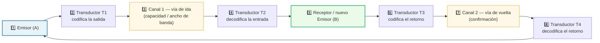
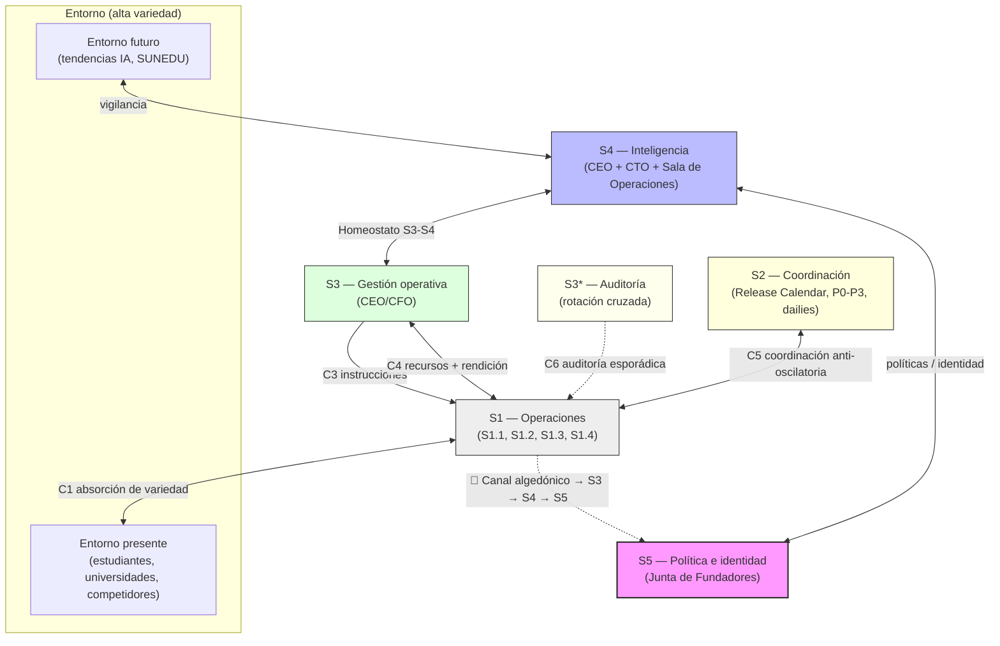
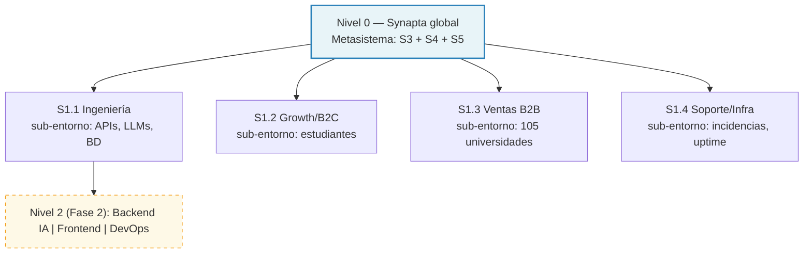
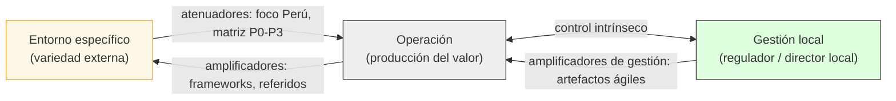
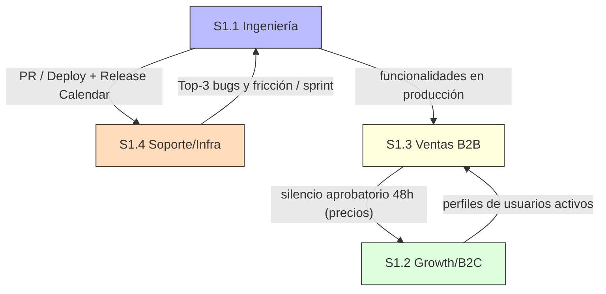
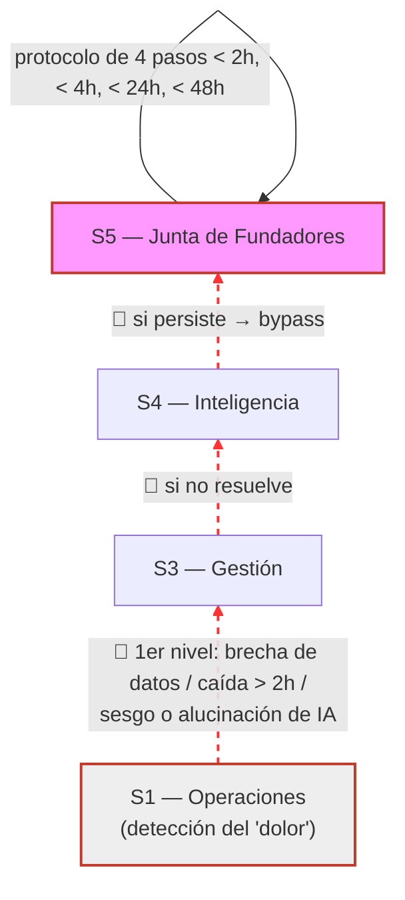

# 11_borrador_v2_diseno_integrado_msv_synapta

> **Anclaje metodológico:** Este documento es un **borrador preliminar (v2)** que integra y sintetiza el diseño organizacional previo de Synapta (archivos `5_sistema_1.md` a `10_sistema_5.md`) a partir del diagnóstico de viabilidad (`0_diagnostico_viabilidad_preliminar.md`) y de **cinco fuentes nuevas** incorporadas en el cuaderno *«VSM: Fuentes para Levantamiento de Brechas — Synapta»*. La validación teórica de cada parte sigue el **capítulo 2** del libro de Pérez Ríos (2012), *Design and Diagnosis for Sustainable Organizations: The Viable System Method* (cuaderno *«(msv) dd»*), del cual se toman, con su numeración textual, las figuras que estructuran la sección de diagramas. Toda corrección respecto del diseño previo se marca con 🔧 y se cita en formato APA. Este borrador se refinará en iteraciones posteriores.

---

## Índice

* [Mapa de uso de las 5 fuentes nuevas](#mapa-de-uso-de-las-5-fuentes-nuevas)
* [1. Diagnóstico de viabilidad](#1-diagnóstico-de-viabilidad)
* [2. Sistema 1 — Operaciones](#2-sistema-1--operaciones)
* [3. Sistema 2 — Coordinación](#3-sistema-2--coordinación)
* [4. Sistema 3 — Gestión operativa (y S3* Auditoría)](#4-sistema-3--gestión-operativa-y-s3-auditoría)
* [5. Sistema 4 — Inteligencia](#5-sistema-4--inteligencia)
* [6. Sistema 5 — Política e identidad](#6-sistema-5--política-e-identidad)
* [7. Diagramas de interacción y comunicación](#7-diagramas-de-interacción-y-comunicación)
* [Referencias citadas](#referencias-citadas)

---

## Mapa de uso de las 5 fuentes nuevas

Para hacer explícito el aporte de las nuevas fuentes a la estructura del rediseño, se mapea cada una al sistema o sistemas donde se aplica como corrección:

| # | Fuente nueva (APA abreviada) | Aporte central | Se aplica en |
| :--- | :--- | :--- | :--- |
| F1 | Pérez Ríos (2025), *Systems* 13(9), 749 | Taxonomía de Patologías Organizacionales (TOP) en la era de la IA: 26 patologías estructurales, funcionales y de comunicación | S4, S5, Diagnóstico |
| F2 | Kellogg (2026), *Tim Kellogg Blog* | Mapeo de un agente de IA autónomo al MSV; el S5 (identidad/valores) habilita la autonomía; señal algedónica como "dopamina sintética" | S1, S5 |
| F3 | Ceballos Chávez et al. (2025), *Systems* 13(5), 343 | Modelo Viable y Ágil (AVM): artefactos ágiles como amplificadores/atenuadores de variedad; evitar el "régimen supercrítico" de comunicación | S1, S2, S3 |
| F4 | Zavrazhnyi & Kulyk (2025), Sumy State University | IA como "fuerza laboral digital" en el ciclo *Percepción → LLM → Acción → Memoria*; controlador PID en la gestión | S1, S3, S4 |
| F5 | Puche Regaliza et al. (2006), X Congreso de Ingeniería de Organización | Aplicación del VSM (vía VSMod) a proyectos software; stakeholders en el S5 y simulación de Dinámica de Sistemas en el S4 | S4, S5 |

---

## 1. Diagnóstico de viabilidad

*(Síntesis de `0_diagnostico_viabilidad_preliminar.md`; punto de partida del rediseño.)*

**Sistema de interés y propósito.** Synapta S.A.C. es una startup EdTech peruana en Fase 1 (validación de MVP / *product-market fit*) cuyo producto, **YachaqAI**, transforma documentos académicos en grafos semánticos en Markdown y optimiza la retención con el algoritmo de repetición espaciada **FSRS**. Bajo la regla POSIWID de Beer (1985) —*el propósito de un sistema es lo que hace*—, su propósito verificable es **reducir el olvido sistemático**, sustentado en que FSRS reduce el tiempo de repaso requerido para una retención objetivo del 90% entre un 30% y un 50% frente a métodos previos (Ye, 2024). La viabilidad se evalúa con el método de cuatro etapas de Pérez Ríos (2012) y la Ley de Variedad Requerida de Ashby (1956).

**Entorno de alta variedad.** El mercado EdTech LATAM se valoró en torno a USD 11 400 millones en 2025, con un CAGR proyectado de 11.8%–12.5% hasta 2034 (IMARC Group, 2025); el mercado peruano comprende ~1.2 millones de estudiantes matriculados y 105 universidades licenciadas (SUNEDU, 2023), con competidores como Anki, RemNote y Google NotebookLM.

**Brechas críticas de viabilidad (resultado del diagnóstico).** La evaluación de los cinco requisitos del MSV arroja tres brechas que amenazan la viabilidad si no se cierran antes de Fase 2:

| Sistema | Estado | Brecha |
| :--- | :--- | :--- |
| S1 Operaciones | 🟡 | Multiactividad de un equipo de 2–5 personas |
| S2 Coordinación | 🟡 | Coordinación dependiente de disciplina manual |
| S3 Gestión | 🟡 | Riesgo de microgestión (hipertrofia del S3) |
| **S3\* Auditoría** | 🔴 | **Conflicto de interés: auditor = operador** |
| **S4 Inteligencia** | 🔴 | **Sin sensores automatizados ni sala de operaciones instrumentada** |
| S5 Política | 🟡 | Junta informal sin protocolos de convocatoria |
| **Canal algedónico** | 🔴 | **Sin umbral definido ni automatización de alertas** |

A esto se suman **cinco brechas de variedad**: (1) velocidad de cambio de los LLMs, (2) diversidad del proceso decisional B2B de 105 universidades, (3) complejidad regulatoria (Ley N° 29733), (4) heterogeneidad de perfiles de aprendizaje y (5) asimetría competitiva frente a plataformas globales.

🔧 **Corrección v2 del diagnóstico (nueva fuente).** El diagnóstico original trataba las patologías de forma cualitativa. Se incorpora como rejilla de verificación la **Taxonomía de Patologías Organizacionales (TOP)** de Pérez Ríos (2025), que clasifica 26 patologías —estructurales, funcionales y de comunicación— específicas de organizaciones que integran IA. Bajo esta rejilla, las tres brechas rojas se reclasifican formalmente como: *S4 débil →* patología **PII5 «pollo sin cabeza»**; *canal algedónico ausente →* patología **PIII4 de comunicación**; *S3\* con conflicto →* patología funcional de auditoría. Esta clasificación, citable y trazable, refuerza la prioridad de cierre P1–P3 (Pérez Ríos, 2025).

**Condición de viabilidad mínima (Fase 1 → Fase 2).** Cumplir simultáneamente: retención D7 ≥ 25% en ≥ 20 usuarios activos (Appcues, 2023); ≥ 1 piloto B2B cerrado con universidad licenciada; y Sala de Operaciones instrumentada con telemetría y alerta algedónica automatizada.

---

## 2. Sistema 1 — Operaciones

**Esencia (síntesis del diseño previo).**
1. El S1 está formado por **cuatro unidades operativas autónomas** —S1.1 Ingeniería/Producto (CTO), S1.2 Growth/B2C, S1.3 Ventas B2B y S1.4 Soporte/Infraestructura—, cada una con sus tres elementos básicos (entorno, operaciones y gestión local) y replicando internamente las cinco funciones de viabilidad (recursión Nivel 1), conforme a la dimensión vertical del MSV (Pérez Ríos, 2012; Beer, 1985).
2. Cada unidad opera con **control intrínseco y autonomía acotada** por límites de cohesión global (presupuesto de APIs, *Release Calendar*, SLA ≤ 24h), y absorbe la variedad de su sub-entorno con atenuadores (foco territorial Perú, matriz P0–P3) y amplificadores (frameworks, referidos orgánicos, runbooks).

**Correcciones v2 (diagnóstico + fuentes nuevas).**

🔧 **C2.1 — IA como "fuerza laboral digital" en el núcleo operativo.** El pipeline de YachaqAI se reestructura explícitamente como el ciclo cibernético ***Percepción → LLM → Acción → Memoria*** propuesto por Zavrazhnyi y Kulyk (2025), de modo que la IA absorba variedad operativa repetitiva (parseo, generación de flashcards, propagación en grafo) y reduzca el costo del S1, cerrando parcialmente la brecha de capacidad del equipo de 2–5 personas señalada en el diagnóstico (Zavrazhnyi & Kulyk, 2025).

🔧 **C2.2 — Artefactos ágiles como reguladores de variedad.** Se formaliza el rol de **Product Owner** por unidad y se reencuadran los tableros virtuales y *product backlogs* (GitHub Projects) no como herramientas de gestión sin más, sino como **amplificadores y atenuadores de variedad** entre el S3 y el S1, tal como recomienda el Modelo Viable y Ágil de Ceballos Chávez et al. (2025), dando iteración rápida sin perder cohesión.

🔧 **C2.3 — Operaciones de agentes con retroalimentación algedónica.** Para la operación de cualquier agente de IA dentro de YachaqAI, se adopta el mapeo de Kellogg (2026): las operaciones del S1 equivalen al *tool calling* y deben emitir **señales de retroalimentación directa** ("dopamina sintética") sobre interacciones exitosas con estudiantes, habilitando autorregulación local (Kellogg, 2026).

---

## 3. Sistema 2 — Coordinación

**Esencia (síntesis del diseño previo).**
1. El S2 es el **regulador anti-oscilatorio horizontal** que amortigua las fricciones entre las cuatro unidades del S1 mediante reglas y rutinas automatizadas (Release Calendar, silencio aprobatorio de 48h, matriz P0–P3, deploy con preaviso de 24h), sin autoridad de mando y co-diseñado con los directores locales para no derivar en burocracia autoritaria (Beer, 1985; Pérez Ríos, 2008).
2. Su efectividad se sustenta en la **Ley de Ashby**: al restringir los estados de conflicto, reduce la variedad de coordinación que llega al S3 a una constante manejable (≤ 5 alertas consolidadas/semana), liberando la capacidad cognitiva del metasistema (Ashby, 1956; Miller, 1956).

**Correcciones v2 (diagnóstico + fuentes nuevas).**

🔧 **C3.1 — Prevención del "régimen supercrítico" de comunicación.** El diagnóstico identificó que el S2 dependía de disciplina manual. Con base en el análisis de redes de Ceballos Chávez et al. (2025) —que demuestra que la baja conectividad y el exceso de intermediarios generan cuellos de botella ("régimen supercrítico")— se incorporan **reuniones diarias breves (*daily stand-ups*)** y un indicador de **visibilidad cruzada** entre unidades, reduciendo intermediarios y relaciones conflictivas (Ceballos Chávez et al., 2025).

🔧 **C3.2 — Automatización de los amortiguadores.** Se eleva la prioridad de automatizar los webhooks (GitHub → notificaciones) y las reglas escritas de coordinación, convirtiendo los atenuadores de variedad en mecanismos automáticos y no en hábitos manuales, en línea con el principio cibernético de "preferir la automatización de la restricción sobre la intervención humana" (Beer, 1985) y con la operativa ágil de tableros como reguladores (Ceballos Chávez et al., 2025).

---

## 4. Sistema 3 — Gestión operativa (y S3* Auditoría)

**Esencia (síntesis del diseño previo).**
1. El S3 gobierna el **"aquí y ahora"** mediante metas pactadas y asignación de recursos por el Canal 4 (negociación en la SAS mensual) y rendición de cuentas por **informes de excepción** con semáforos 🟢🟡🔴, interviniendo solo ante el estado rojo para preservar la autonomía del S1 (Beer, 1985; Pérez Ríos, 2012).
2. El **S3\* (Canal 6 de auditoría)** verifica la veracidad de los reportes con inspección directa de datos crudos, bajo el principio de **rotación cruzada** (quien audita no pertenece a la unidad auditada), análoga al radar móvil de tráfico (Beer, 1985).

**Correcciones v2 (diagnóstico + fuentes nuevas).**

🔧 **C4.1 — Resolución de la brecha crítica del S3\*.** El diagnóstico marcó en 🔴 el conflicto de interés "auditor = operador". Se ratifica y formaliza la **rotación cruzada estructurada** con calendario fijo mensual e independencia de roles documentada, eliminando la patología funcional de auditoría identificada bajo la TOP (Pérez Ríos, 2025).

🔧 **C4.2 — Control por semáforos modelado como controlador PID.** El sistema de escalamiento por excepciones se reformula como un **controlador PID** (Proporcional-Integral-Derivativo) adaptado a la gestión, según Zavrazhnyi y Kulyk (2025): el componente proporcional reacciona a la magnitud de la desviación del KPI, el integral a su persistencia acumulada y el derivativo a su velocidad de cambio. Así, la "señal de control" del S3 responde matemáticamente a la brecha entre el estado real y el planeado, estabilizando el rumbo y previniendo tanto la sobre-reacción como la hipertrofia del S3 (Zavrazhnyi & Kulyk, 2025).

🔧 **C4.3 — Variedad S3↔S1 gestionada con artefactos ágiles.** La interfaz de asignación de recursos y rendición de cuentas integra los artefactos del AVM (backlogs y tableros) como instrumentos formales de absorción de variedad entre gestión y operación (Ceballos Chávez et al., 2025).

---

## 5. Sistema 4 — Inteligencia

**Esencia (síntesis del diseño previo).**
1. El S4 es el órgano de **adaptación al "afuera y el mañana"**: opera radares (tecnológico, regulatorio y de mercado) con sensores y transductores, y una **Sala de Operaciones Virtual** que estructura la variedad en cinco pantallas (presente, pasado, futuro/simulación, modelo cibernético y vigilancia del entorno), sosteniendo el homeostato S3–S4 (Pérez Ríos, 2012; Beer, 1979).
2. Su prospectiva se apoya en **modelos de simulación dinámica** (M2 pérdida de piloto B2B y M5 penetración de mercado/regulación SUNEDU), con decisiones pre-diseñadas ("planes dormidos") y gatillos algedónicos cuantitativos.

**Correcciones v2 (diagnóstico + fuentes nuevas).**

🔧 **C5.1 — Cierre de la brecha crítica del S4 con respaldo en la TOP.** El diagnóstico marcó el S4 en 🔴 (sin sensores automatizados). La instrumentación de la Sala de Operaciones se justifica ahora como prevención directa de la patología **PII5 «pollo sin cabeza»** de Pérez Ríos (2025): en una EdTech basada en IA, el S4 debe escrutar continuamente las nuevas tendencias de IA para no quedar obsoleta (Pérez Ríos, 2025).

🔧 **C5.2 — Fundamento metodológico de los simuladores M2/M5.** El uso de **Dinámica de Sistemas** en la pantalla de futuro se fundamenta explícitamente en Puche Regaliza et al. (2006), quienes demuestran que el S4 de un proyecto software debe explorar el futuro con modelos de simulación para prevenir desvíos de tiempo y presupuesto; se adopta además la herramienta **VSMod** como soporte de mapeo cibernético de la Pantalla 4 (Puche Regaliza et al., 2006).

🔧 **C5.3 — Índices cuantitativos de adaptabilidad.** Se incorpora la recomendación de Zavrazhnyi y Kulyk (2025) de añadir **índices cuantitativos de adaptabilidad y sostenibilidad** al tablero del S4, de modo que la salud adaptativa de la startup se mida y no solo se intuya (Zavrazhnyi & Kulyk, 2025).

---

## 6. Sistema 5 — Política e identidad

**Esencia (síntesis del diseño previo).**
1. El S5, encarnado en la **Junta de Fundadores**, ejerce la gestión normativa (POSIWID, límites organizacionales y cuatro principios: soberanía del conocimiento, privacidad como derecho —Ley N° 29733—, IA como amplificador y rigor pedagógico) y actúa como **absorbedor final de variedad**, arbitrando el homeostato S3–S4 (Beer, 1985; Pérez Ríos, 2012).
2. Recibe el **canal algedónico** (bypass directo desde el S1) y previene activamente las cuatro patologías del S5: identidad mal definida, esquizofrenia institucional, colapso del S5 en el S3 y representación inadecuada (Pérez Ríos, 2008).

**Correcciones v2 (diagnóstico + fuentes nuevas).**

🔧 **C6.1 — Identidad y valores como condición de autonomía de la IA.** Para todo agente de IA de YachaqAI (p. ej., tutores autónomos), el S5 debe definir explícitamente su **sistema de valores e identidad**, que es —según Kellogg (2026)— lo que da "vida" y autonomía estable al agente y evita su colapso conductual. Esto eleva la política de "IA como amplificador" de principio declarativo a especificación de diseño del agente (Kellogg, 2026).

🔧 **C6.2 — Canal algedónico robusto para riesgos éticos de la IA.** El diagnóstico marcó el canal algedónico en 🔴. Se rediseña como **canal directo S1 → S5 robusto** que transmita alarmas críticas no solo técnicas o financieras, sino también de **sesgo, alucinación o impacto ético** de la IA sobre los usuarios, conforme a la patología de comunicación **PIII4** de Pérez Ríos (2025), complementado con la lógica de retroalimentación algedónica de Kellogg (2026) (Pérez Ríos, 2025; Kellogg, 2026).

🔧 **C6.3 — Gobernanza de stakeholders y filosofía del producto.** Siguiendo a Puche Regaliza et al. (2006), el S5 integra activamente a **todos los interesados** (desarrolladores, docentes, estudiantes, inversores, regulador) para asentar la filosofía central del desarrollo —en el caso de Synapta, la decisión fundacional de **portabilidad abierta en Markdown frente al *vendor lock-in***—, blindando la identidad contra la deriva identitaria por presión de capital (Puche Regaliza et al., 2006).

---

## 7. Diagramas de interacción y comunicación

Esta sección presenta, en mermaid, (a) los **diagramas de comunicación** con los **8 componentes** del canal según la **Fig. 2.3 «Components of a communication channel»** del libro de Pérez Ríos (2012), y (b) los **diagramas de interacción entre sistemas**, identificando para cada uno la figura exacta del capítulo 2 que le sirve de base.

### 7.1 Canal de comunicación genérico — los 8 componentes (Fig. 2.3)

> **Base teórica:** *Fig. 2.3 «Components of a communication channel»* (Pérez Ríos, 2012). Un canal es un bucle homeostático cerrado: la información va del emisor al receptor y **retorna** una confirmación de que fue recibida e interpretada. Cada canal debe tener **capacidad (ancho de banda)** suficiente para transmitir la variedad requerida por unidad de tiempo sin pérdida de integridad.

### 7.2 Instanciación operativa — Canal de Despliegue S1.1 ↔ S1.4 (según Fig. 2.3)

> Bucle homeostático real entre **Ingeniería (S1.1)** y **Soporte/Infraestructura (S1.4)** que evita que un *deploy* mal coordinado sature el soporte. Los 8 componentes se etiquetan según la Fig. 2.3 (Pérez Ríos, 2012).

```mermaid
graph LR
    A["1️⃣ Emisor: CTO / Dev (S1.1)<br/>cierra sprint de código"] --> T1["2️⃣ T1: GitHub Action<br/>compila main + changelog Markdown"]
    T1 --> C1["3️⃣ Canal 1: CI/CD + webhook<br/>→ canal #infra-deploys<br/>(máx. 1 deploy mayor/día)"]
    C1 --> T2["4️⃣ T2: consola Vercel/Supabase<br/>+ alerta en Slack"]
    T2 --> B["5️⃣ Receptor: DevOps / CS Lead (S1.4)"]
    B --> T3["6️⃣ T3: reacción ✅ tras validar<br/>estabilidad en producción"]
    T3 --> C2["7️⃣ Canal 2: Slack webhook<br/>(evento reaction_added)"]
    C2 --> T4["8️⃣ T4: GitHub Actions decodifica<br/>→ estado 'Verificado'"]
    T4 --> A

    style A fill:#e8f4f8,stroke:#2980b9,stroke-width:2px
    style B fill:#eafbea,stroke:#27ae60,stroke-width:2px
    style C1 fill:#fef9e7,stroke:#f39c12
    style C2 fill:#fef9e7,stroke:#f39c12
```

### 7.3 Instanciación de entorno — Canal C1 entre sub-entornos B2C ↔ B2B (según Fig. 2.3)

> Canal de absorción natural de variedad: el éxito del estudiante (B2C) se convierte en recomendación al docente (B2B), reduciendo el costo de venta consultiva. Etiquetado según la Fig. 2.3 (Pérez Ríos, 2012).

```mermaid
graph LR
    A["1️⃣ Emisor: Estudiante (sub-entorno B2C)"] --> T1["2️⃣ T1: comparte mazo/apuntes<br/>validados desde la app"]
    T1 --> C1["3️⃣ Canal 1: aula + chats<br/>universitarios"]
    C1 --> T2["4️⃣ T2: el docente decodifica<br/>la utilidad pedagógica"]
    T2 --> B["5️⃣ Receptor: Docente (sub-entorno B2B)"]
    B --> T3["6️⃣ T3: recomienda a pares /<br/>correo institucional"]
    T3 --> C2["7️⃣ Canal 2: claustro docente"]
    C2 --> T4["8️⃣ T4: tracción 'pull' →<br/>registro orgánico de nuevos estudiantes"]
    T4 --> A

    style A fill:#e8f4f8,stroke:#2980b9,stroke-width:2px
    style B fill:#eafbea,stroke:#27ae60,stroke-width:2px
    style C1 fill:#fef9e7,stroke:#f39c12
    style C2 fill:#fef9e7,stroke:#f39c12
```

### 7.4 Estructura completa del MSV de Synapta (base: Fig. 2.19)

> **Base teórica:** *Fig. 2.19 «Horizontal dimension (Environment-Organisation-Management) and MSV of the system-in-focus»* (Pérez Ríos, 2012). Muestra los sistemas vitales (1, 2, 3, 3*, 4, 5), el entorno presente y futuro y los canales de comunicación.

> **Nota de validación (corrección del diagnóstico):** la señal algedónica asciende por niveles (S1 → S3 → S4 → S5) y solo llega al S5 si S3 y S4 no la resuelven; no va directa al S5 en condiciones rutinarias (Pérez Ríos, 2012).

### 7.5 Dimensión vertical — Despliegue de la complejidad (base: Fig. 2.5)

> **Base teórica:** *Fig. 2.5 «Vertical unfolding of complexity»* (Pérez Ríos, 2012). El entorno general se desglosa en sub-entornos tratados por organizaciones progresivamente menores.

### 7.6 Dimensión horizontal — Entorno-Operación-Gestión (base: Fig. 2.18)

> **Base teórica:** *Fig. 2.18 «Horizontal dimension (Environment-Organisation-Management)»* (Pérez Ríos, 2012). Ilustra los tres componentes básicos y los canales que atenúan o amplifican variedad.

> 🔧 La etiqueta "artefactos ágiles" como amplificador de la gestión integra la corrección C2.2/C4.3 (Ceballos Chávez et al., 2025).

### 7.7 Relaciones entre operaciones elementales del S1 (base: Fig. 2.47)

> **Base teórica:** *Fig. 2.47 «Relations between elementary operations (System 1)»* (Pérez Ríos, 2012). Conexiones horizontales (C2) entre las unidades operativas.

### 7.8 Canal algedónico (base: Fig. 2.53)

> **Base teórica:** *Fig. 2.53 «Algedonic channel»* (Pérez Ríos, 2012). Canal paralelo a los verticales que transmite señales de alerta ante peligros para la supervivencia. Se enriquece con la corrección C6.2 para cubrir riesgos éticos de la IA (Pérez Ríos, 2025; Kellogg, 2026).

---

## Referencias citadas

*(Formato APA. Se listan las fuentes efectivamente citadas en el cuerpo de este borrador.)*

### Fuentes nuevas (cuaderno «VSM: Fuentes para Levantamiento de Brechas — Synapta»)

Ceballos Chávez, B. A., Takeo Nava, J. G., Moreno Escobar, J. J., & Morales Matamoros, O. (2025). Viable and Agile Model for Improving the Quality Area in an Automotive Company in Mexico. *Systems, 13*(5), 343. https://doi.org/10.3390/systems13050343

Kellogg, T. (2026, 9 de enero). *Viable Systems: How to build a fully autonomous agent* [Entrada de blog]. Tim Kellogg Blog.

Pérez Ríos, J. (2025). The Viable System Model and the Taxonomy of Organizational Pathologies in the Age of Artificial Intelligence (AI). *Systems, 13*(9), 749. https://doi.org/10.3390/systems13090749

Puche Regaliza, J. C., Pérez Ríos, J. M., & Sánchez Mayoral, P. (2006). Aplicación de la Cibernética Organizacional mediante VSMod al estudio de un Proyecto Software. *X Congreso de Ingeniería de Organización*, Valencia, España, 7–8 de septiembre de 2006.

Zavrazhnyi, K., & Kulyk, A. (2025). Adaptive Business Models for Youth Entrepreneurship: Using Artificial Intelligence and European Digital Practice. En O. Kubatko & B. Kovalov (Eds.), *EU Practices of Youth and Business Cooperation: Proceedings of the International Scientific and Practical Conference* (pp. 87–90). Sumy State University.

### Fuentes teóricas y de validación (cap. 2 del libro y benchmarks)

Appcues. (2023). *Product adoption benchmark report 2023*. Appcues Inc.

Ashby, W. R. (1956). *An introduction to cybernetics*. Chapman & Hall.

Beer, S. (1979). *The heart of enterprise*. John Wiley & Sons.

Beer, S. (1985). *Diagnosing the system for organizations*. John Wiley & Sons.

IMARC Group. (2025). *Latin America EdTech market size, industry growth & forecast 2026–2034*. IMARC Group.

Miller, G. A. (1956). The magical number seven, plus or minus two: Some limits on our capacity for processing information. *Psychological Review, 63*(2), 81–97.

Pérez Ríos, J. (2008). *Diseño y diagnóstico de organizaciones viables: un enfoque sistémico*. Iberfora 2000.

Pérez Ríos, J. (2012). *Design and diagnosis for sustainable organizations: The viable system method*. Springer.

SUNEDU. (2023). *Sistema de Información Universitaria (SIU): estadísticas de matrícula universitaria 2023*. Superintendencia Nacional de Educación Superior Universitaria.

Ye, J. (2024). *FSRS: A scientific algorithm for spaced repetition scheduling (v5)* [Repositorio de software]. GitHub. https://github.com/open-spaced-repetition/fsrs4anki

---

> **Estado:** Borrador preliminar v2 para refinamiento. Próximas iteraciones sugeridas: (1) cuantificar el controlador PID del S3 (C4.2) con parámetros reales de sprint; (2) detallar los índices de adaptabilidad del S4 (C5.3); y (3) validar la capacidad/ancho de banda de cada canal de la sección 7 contra la carga real de la Fase 1.
