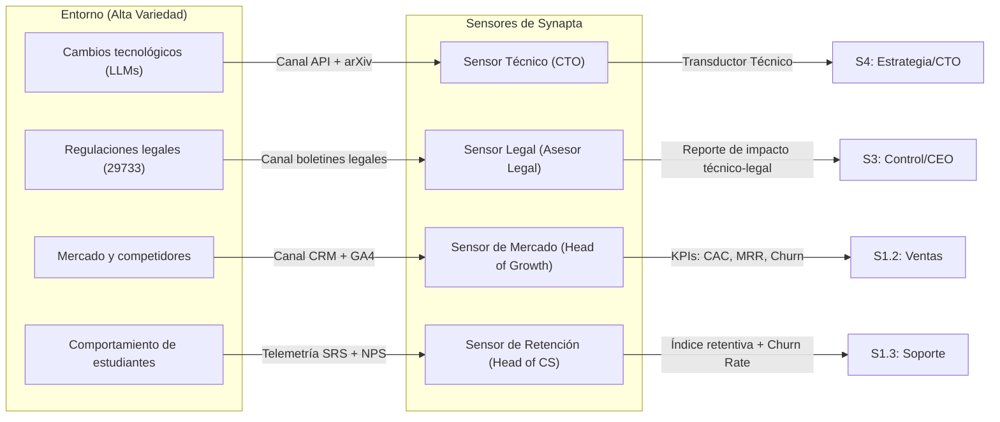

# 1_identidad_y_proposito

> **Validación Cap. 2 (Pérez Ríos/Beer):** Esta fase corresponde al Paso 1 del método de diagnóstico/diseño del MSV. Su objetivo es responder *qué es* la organización, *para qué existe* y *dónde terminan sus límites*, antes de poder analizar su estructura interna. Sin este paso, todo diseño posterior carece de ancla metodológica.

---

## 1. Declaración de Identidad, Propósito y Límites (Boundaries)

### 1.1 Qué ES y Qué HACE Synapta
**Synapta** es una organización de tecnología educativa (EdTech) fundada en Perú cuyo propósito sistémico es *diseñar, desarrollar y operar plataformas inteligentes de gestión del conocimiento y optimización del aprendizaje*. Su producto principal, **YachaqAI**, transforma documentos estáticos (PDFs, apuntes) en grafos dinámicos de conocimiento estructurado en Markdown, automatiza la planificación del estudio y optimiza la retención a largo plazo mediante repetición espaciada (algoritmo FSRS) con propagación en grafo.

> **Principio de Beer — POSIWID** (*The Purpose of a System is What it Does*): El propósito de Synapta no es lo que sus fundadores declaran, sino lo que el sistema produce en la práctica. Su propósito verificable es **reducir el olvido sistemático en cualquier proceso de aprendizaje intensivo** — incluyendo estudiantes universitarios, profesionales en formación continua e investigadores — mediante herramientas tecnológicas que son portables, privadas y verificablemente eficaces.

**Responsable de custodiar esta declaración de propósito:** Junta de Fundadores / Consejo Directivo de Synapta (Sistema 5 corporativo).

---

### 1.2 Qué NO ES y Qué NO HACE Synapta
Para evitar la *"esquizofrenia institucional"* (patología citada en el Cap. 2 cuando una organización no sabe lo que es), se delimitan explícitamente las exclusiones:

| Exclusión | Razón estratégica |
| :--- | :--- |
| **No crea contenido académico** | No compite con universidades, editoriales ni docentes. Synapta es habilitador tecnológico, no productor de currículo. |
| **No es consultora de software a medida** | No desarrolla proyectos externos personalizados fuera de la plataforma YachaqAI. |
| **No monetiza datos de usuarios** | Excluye explícitamente la publicidad, venta de metadatos de estudio o perfilamiento de estudiantes. |
| **No es una plataforma de streaming de video** | No produce ni distribuye videoconferencias o clases grabadas. |

---

### 1.3 Demarcación de Límites (Boundaries)
La frontera del sistema determina qué está dentro (bajo el control de Synapta) y qué está fuera (el entorno con el que interactúa):

| Dentro del Límite (Synapta) | Fuera del Límite (Entorno) |
| :--- | :--- |
| Código fuente propietario de YachaqAI | PDFs y documentos del usuario (propiedad intelectual del cliente) |
| Algoritmos de sincronización BD ↔ Markdown | APIs de LLMs externos (Google Gemini, OpenAI) |
| Estrategia de marca, precios y canales de venta | Plataformas LMS de universidades (Moodle, Canvas) |
| Base de datos de estado SRS de los usuarios | Repositorios PKM externos (Obsidian, Notion) |
| Equipo de ingeniería, ventas y soporte | Reguladores (SUNEDU, INDECOPI, SUNAT) |

---

## 2. Responsables por Área Funcional

Siguiendo la metodología del Cap. 2, cada área funcional que interactúa con el entorno debe tener un responsable explícito que actúe como "transductor" entre la variedad externa y la respuesta organizacional:

| Área Funcional | Responsable (Rol) | Sistema MSV al que pertenece |
| :--- | :--- | :--- |
| **Legal y Cumplimiento** | Asesor Legal externo + CEO para decisiones vinculantes | Sistema 5 (política) + Sistema 3 (control) |
| **Contabilidad y Finanzas** | CFO / Director Financiero | Sistema 3 (control de recursos) |
| **Presupuesto de APIs y Nube** | CTO + Head of Engineering | Sistema 3 y Sistema 1.1 (Ingeniería) |
| **Recursos Humanos** | Head of People (RRHH) | Sistema 3 (operativo) |
| **Desarrollo de Producto** | CTO + Equipo de Ingeniería | Sistema 1.1 (Ingeniería y Producto) |
| **Marketing Digital (B2C)** | Head of Growth / CMO | Sistema 1.2 (Crecimiento y Ventas) |
| **Ventas Institucionales (B2B)** | Head of Sales / Ejecutivos de Cuenta | Sistema 1.2 (Crecimiento y Ventas) |
| **Soporte al Cliente** | Head of Customer Success | Sistema 1.3 (Experiencia e Infraestructura) |
| **Infraestructura y DevOps** | Head of Infrastructure / DevOps Lead | Sistema 1.3 (Experiencia e Infraestructura) |
| **Estrategia e I+D** | CEO + CTO | Sistema 4 (Inteligencia estratégica) |
| **Identidad y Ética Corporativa** | Junta de Fundadores | Sistema 5 (Política) |

---

## 3. Análisis de Áreas Fundamentales del Entorno: Matriz Presente vs. Futuro

El entorno de Synapta es altamente complejo. El Cap. 2 exige analizar al menos 12 áreas críticas diferenciando el **presente** y el **futuro**, incorporando datos externos con sus fuentes.

| Área del Entorno | Responsable del Sensor | Presente (Aquí y Ahora) | Futuro (Horizonte 2–5 años) |
| :--- | :--- | :--- | :--- |
| **Económica** | CFO + Head of Growth | El mercado EdTech en LATAM está valorado entre USD $11,400M y $18,300M en 2025/2026 *(IMARC Group, 2025)* [1]. | CAGR proyectado de **11.8%–12.5%** entre 2026–2034 *(IMARC Group, 2025)* [1]. |
| **Sociológica** | Head of Growth + Head of Customer Success | Aprox. **27% de los estudiantes universitarios en LATAM desertan en el primer año** *(Scielo, 2023)* [2] — la demanda de retención estudiantil es urgente. | Transición al paradigma de aprendizaje activo basado en grafos semánticos personalizados. |
| **Política** | CEO + Asesor Legal | Gobiernos como Brasil invierten USD $5,000M en digitalización escolar *(IMARC Group, 2025)* [1]. | Políticas nacionales de soberanía de IA en sectores educativos. |
| **Legislativa** | Asesor Legal | Ley N° 29733 de Protección de Datos Personales (Perú). | Regulaciones de uso ético de IA en educación superior y directivas específicas de la Autoridad Nacional de Protección de Datos Personales (APDP) de Perú. |
| **Institucional** | Head of Sales | Las **105 universidades licenciadas** en Perú *(SUNEDU, 2026)* [3] operan bajo sistemas LMS tradicionales (Moodle, Canvas). | Centralización de métricas de retención estudiantil exigidas por SUNEDU como indicador de calidad. |
| **Mercados** | Head of Growth | Herramientas desarticuladas: Anki (SRS), Obsidian (PKM), PDF.ai (lectura IA). No existe un producto integrado en el mercado peruano. | Consolidación de plataformas "Estudio Inteligente Todo en Uno" con licenciamiento institucional. |
| **Proveedores** | CTO + Head of Infrastructure | Costos de APIs cloud (Google Gemini 1.5 Flash, GPT-4o-mini) competitivos en precio por millón de tokens. | Emergencia de SLMs locales (Llama-3, Phi-3) ejecutables en dispositivos del usuario. |
| **Competidores** | Head of Growth + CTO | Anki (curva de aprendizaje alta), Notion AI (sin SRS), RemNote (nicho anglosajón). | Asistentes cognitivos nativos en navegadores y sistemas operativos (Microsoft Copilot, Google NotebookLM). |
| **Tecnológica** | CTO | Madurez en embeddings semánticos (`text-embedding-004`) y parsers estructurados (LlamaParse). | Agentes autónomos multi-paso y grafos vectoriales en memoria con auto-actualización. |
| **Ecológica** | CFO + CTO | Consumo energético de centros de datos para consultas RAG. | Regulación de eficiencia energética en cómputo (computación verde). |
| **Educativa** | Head of Customer Success | Cualquier aprendiz intensivo (universitarios, profesionales en formación continua, investigadores) enfrenta baja retención activa: la Curva de Ebbinghaus muestra que sin repaso activo se pierde el 70% del contenido nuevo en 24 horas. | Estándar de "Aprendizaje Activo" adoptado tanto en curricula universitaria como en programas de desarrollo profesional continuo en Perú. |
| **Demográfica** | Head of Growth | Más de **1.2 millones de estudiantes matriculados** en universidades peruanas licenciadas *(SUNEDU SIU, 2023/2024)* [4]; la población de educación superior en el Perú es el mercado foco inicial. | Incremento de adultos mayores de 35 años que cursan posgrados y requieren herramientas de alta densidad de conocimiento. |

---

## 4. Configuración de la Captura de Información: Sensores, Fuentes y Canales

Para cada variable crítica del entorno se define: el sensor, el responsable, la fuente, la frecuencia y el canal de transmisión con sus transductores. Esto sigue el *checklist* del Cap. 2 (Paso 4).

| Sensor | Responsable | Fuente | Frecuencia | Canal y Transducción |
| :--- | :--- | :--- | :--- | :--- |
| **Variabilidad costo/rendimiento LLMs** | CTO | Consolas GCP y OpenAI; feeds arXiv | Tiempo real (alertas) + revisión diaria | Semáforo de salud del servicio (Verde/Amarillo/Rojo) en dashboard de ingeniería |
| **Retención y adherencia de estudiantes** | Head of Customer Success | Tabla `respuestas_srs` y `srs_estados` en BD de producción | Semanal automático | Métricas agregadas (retentiva promedio, tasa abandono) → gráficos de evolución para Producto |
| **Cumplimiento y privacidad de datos** | Asesor Legal + CEO | Boletín El Peruano, directivas de la APDP (Perú) | Semanal | Reporte legal traducido a impacto técnico (Aprobado/Requiere ajuste/Requiere consentimiento) |
| **Adquisición B2C y B2B** | Head of Growth + Head of Sales | GA4, PostHog, CRM (HubSpot) | Diaria (B2C), semanal (B2B) | CAC y MRR en tiempo real → reportes al equipo de Crecimiento y al CFO |

---

## 5. Visualización: El Dashboard Algedónico (Operations Room)

Basado en el concepto de *Operations Room* de Beer (Proyecto Cybersyn), el dashboard de Synapta presenta la información del entorno de forma que reduzca la variedad a señales accionables:

- **Panel 1 – Telemetría de YachaqAI:** Grafo semáforo de retentiva promedio de usuarios, tasa de error del parser y latencia RAG.
- **Panel 2 – Salud de Mercado:** CAC vs. presupuesto, MRR, churn rate semanal.
- **Panel 3 – Entorno Futuro (S4):** Simulaciones de escenarios críticos (e.g., adopción masiva por una universidad de 10,000 estudiantes; colapso del proveedor de API principal).

Responsable del mantenimiento del dashboard: **Head of Infrastructure + Head of Growth** (en coordinación con S3).

---

## Fuentes Citadas

| # | Fuente | Dato utilizado |
| :--- | :--- | :--- |
| [1] | IMARC Group (2025). *Latin America EdTech Market Size, Industry Growth & Forecast 2026–2034* | Mercado LATAM EdTech: USD $11.4B–$18.3B; CAGR 11.8%–12.5% |
| [2] | Scielo / Revistas académicas (2023). *Deserción estudiantil en universidades latinoamericanas* | ~27% deserción en el primer año universitario en LATAM |
| [3] | SUNEDU (2026). *Listado de universidades con licencia institucional vigente* | 105 universidades licenciadas en Perú |
| [4] | SUNEDU – Sistema de Información Universitaria (2023/2024) | ~1.2 millones de estudiantes matriculados en universidades peruanas licenciadas |
| [5] | Banco Mundial (2021). *Educación superior en América Latina y el Caribe* | >30 millones de estudiantes en educación superior en LATAM |
