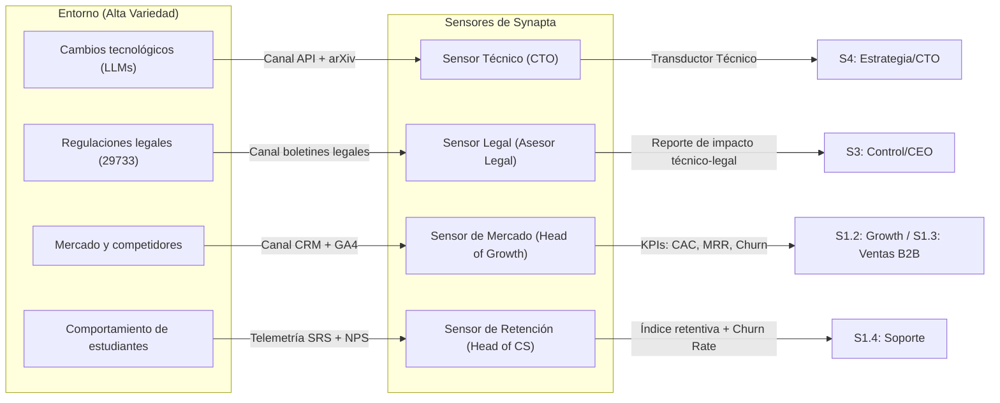

# 1_identidad_y_proposito

> **Validación Cap. 2 (Pérez Ríos/Beer):** Esta fase corresponde al Paso 1 del método de diagnóstico/diseño del MSV. Su objetivo es responder *qué es* la organización, *para qué existe* y *dónde terminan sus límites*, antes de poder analizar su estructura interna. Sin este paso, todo diseño posterior carece de ancla metodológica.

## Tabla de Contenidos

- [1. Declaración de Identidad, Propósito y Límites (Boundaries)](#1-declaracion-de-identidad-proposito-y-limites-boundaries)
  - [1.1 Qué ES y Qué HACE Synapta](#11-que-es-y-que-hace-synapta)
  - [1.2 Qué NO ES y Qué NO HACE Synapta](#12-que-no-es-y-que-no-hace-synapta)
  - [1.3 Demarcación de Límites (Boundaries)](#13-demarcacion-de-limites-boundaries)
- [2. Responsables por Área Funcional](#2-responsables-por-area-funcional)
- [3. Análisis de Áreas Fundamentales del Entorno: Matriz Presente vs. Futuro](#3-analisis-de-areas-fundamentales-del-entorno-matriz-presente-vs-futuro)
- [4. Configuración de la Captura de Información: Sensores, Fuentes y Canales](#4-configuracion-de-la-captura-de-informacion-sensores-fuentes-y-canales)
- [5. Sala de Operaciones (Operations Room) y Canal Algedónico](#5-sala-de-operaciones-operations-room-y-canal-algedonico)
  - [5.1 La Sala de Operaciones (Operations Room)](#51-la-sala-de-operaciones-operations-room)
  - [5.2 El Canal Algedónico (Algedonic Loop)](#52-el-canal-algedonico-algedonic-loop)
  - [5.3 Diagnóstico y Prevención de Patologías en la Fase 1](#53-diagnostico-y-prevencion-de-patologias-en-la-fase-1)
- [Fuentes Citadas](#fuentes-citadas)

---

---

## 1. Declaración de Identidad, Propósito y Límites (Boundaries)

### 1.1 Qué ES y Qué HACE Synapta
**Synapta** es una organización de tecnología educativa (EdTech) fundada en Perú cuyo propósito sistémico es *diseñar, desarrollar y operar plataformas inteligentes de gestión del conocimiento y optimización del aprendizaje*. Su producto principal, **YachaqAI**, transforma documentos estáticos (PDFs, apuntes) en grafos dinámicos de conocimiento estructurado en Markdown, automatiza la planificación del estudio y optimiza la retención a largo plazo mediante repetición espaciada (algoritmo FSRS) con propagación en grafo.

> **Principio de Beer — POSIWID** (*The Purpose of a System is What it Does*): El propósito de Synapta no es lo que sus fundadores declaran, sino lo que el sistema produce en la práctica. Su propósito verificable es **reducir el olvido sistemático en cualquier proceso de aprendizaje intensivo** — incluyendo estudiantes universitarios, profesionales en formación continua e investigadores — mediante herramientas tecnológicas que son portables, privadas y verificablemente eficaces.

**Responsable de custodiar esta declaración de propósito:** Junta de Fundadores / Consejo Directivo de Synapta (Sistema 5 corporativo).

---

### 1.2 Qué NO ES y Qué NO HACE Synapta
Para evitar la *"esquizofrenia institucional"* (patología citada en el Cap. 2 cuando una organización no sabe lo que es), se delimitan explícitamente las exclusiones:

| Exclusión | Razón estratégica |
| :--- | :--- |
| **No crea contenido académico** | No compite con universidades, editoriales ni docentes. Synapta es habilitador tecnológico, no productor de currículo. |
| **No es consultora de software a medida** | No desarrolla proyectos externos personalizados fuera de la plataforma YachaqAI. |
| **No monetiza datos de usuarios** | Excluye explícitamente la publicidad, venta de metadatos de estudio o perfilamiento de estudiantes. |
| **No es una plataforma de streaming de video** | No produce ni distribuye videoconferencias o clases grabadas. |

---

### 1.3 Demarcación de Límites (Boundaries)
La frontera del sistema determina qué está dentro (bajo el control de Synapta) y qué está fuera (el entorno con el que interactúa):

| Dentro del Límite (Synapta) | Fuera del Límite (Entorno) |
| :--- | :--- |
| Código fuente propietario de YachaqAI | PDFs y documentos del usuario (propiedad intelectual del cliente) |
| Algoritmos de sincronización BD ↔ Markdown | APIs de LLMs externos (Google Gemini, OpenAI) |
| Estrategia de marca, precios y canales de venta | Plataformas LMS de universidades (Moodle, Canvas) |
| Base de datos de estado SRS de los usuarios | Repositorios PKM externos (Notion u otros gestores de notas Markdown locales) |
| Equipo de ingeniería, ventas y soporte | Reguladores (SUNEDU, INDECOPI, SUNAT) |

---

## 2. Responsables por Área Funcional

Siguiendo la metodología del Cap. 2, cada área funcional que interactúa con el entorno debe tener un responsable explícito que actúe como "transductor" entre la variedad externa y la respuesta organizacional:

| Área Funcional                    | Responsable (Rol)                                      | Sistema MSV al que pertenece                |
| :-------------------------------- | :----------------------------------------------------- | :------------------------------------------ |
| **Legal y Cumplimiento**          | Asesor Legal externo + CEO para decisiones vinculantes | Sistema 5 (política) + Sistema 3 (control)  |
| **Contabilidad y Finanzas**       | CFO / Director Financiero                              | Sistema 3 (control de recursos)             |
| **Presupuesto de APIs y Nube**    | CTO + Head of Engineering                              | Sistema 3 y Sistema 1.1 (Ingeniería)        |
| **Recursos Humanos**              | Head of People (RRHH)                                  | Sistema 3 (operativo)                       |
| **Desarrollo de Producto**        | CTO + Equipo de Ingeniería                             | Sistema 1.1 (Ingeniería y Producto)         |
| **Marketing Digital (B2C)**       | Head of Growth / CMO                                   | Sistema 1.2 (Crecimiento B2C)              |
| **Ventas Institucionales (B2B)**  | Head of Sales / Ejecutivos de Cuenta                   | Sistema 1.3 (Ventas B2B)                    |
| **Soporte al Cliente**            | Head of Customer Success                               | Sistema 1.4 (Soporte e Infraestructura)     |
| **Infraestructura y DevOps**      | Head of Infrastructure / DevOps Lead                   | Sistema 1.4 (Soporte e Infraestructura)     |
| **Estrategia e I+D**              | CEO + CTO                                              | Sistema 4 (Inteligencia estratégica)        |
| **Identidad y Ética Corporativa** | Junta de Fundadores                                    | Sistema 5 (Política)                        |

---

## 3. Análisis de Áreas Fundamentales del Entorno: Matriz Presente vs. Futuro

El entorno de Synapta es altamente complejo. El Cap. 2 exige analizar al menos 12 áreas críticas diferenciando el **presente** y el **futuro**, incorporando datos externos con sus fuentes.

| Área del Entorno | Responsable del Sensor | Presente (Aquí y Ahora) | Futuro (Horizonte 2–5 años) |
| :--- | :--- | :--- | :--- |
| **Económica** | CFO + Head of Growth | El mercado EdTech en LATAM está valorado entre USD $11,400M y $18,300M en 2025/2026 *(IMARC Group, 2025)* [1]. | CAGR proyectado de **11.8%–12.5%** entre 2026–2034 *(IMARC Group, 2025)* [1]. |
| **Sociológica** | Head of Growth + Head of Customer Success | Aprox. **27% de los estudiantes universitarios en LATAM desertan en el primer año** *(Scielo, 2023)* [2] — la demanda de retención estudiantil es urgente. | Transición al paradigma de aprendizaje activo basado en grafos semánticos personalizados. |
| **Política** | CEO + Asesor Legal | Gobiernos como Brasil invierten USD $5,000M en digitalización escolar *(IMARC Group, 2025)* [1]. | Políticas nacionales de soberanía de IA en sectores educativos. |
| **Legislativa** | Asesor Legal | Ley N° 29733 de Protección de Datos Personales (Perú). | Regulaciones de uso ético de IA en educación superior y directivas específicas de la Autoridad Nacional de Protección de Datos Personales (APDP) de Perú. |
| **Institucional** | Head of Sales | Las **105 universidades licenciadas** en Perú *(SUNEDU, 2026)* [3] operan bajo sistemas LMS tradicionales (Moodle, Canvas). | Centralización de métricas de retención estudiantil exigidas por SUNEDU como indicador de calidad. |
| **Mercados** | Head of Growth | Herramientas desarticuladas: Anki (SRS), gestores de conocimiento personal (PKM) locales, PDF.ai (lectura IA). No existe un producto integrado en el mercado peruano. | Consolidación de plataformas "Estudio Inteligente Todo en Uno" con licenciamiento institucional. |
| **Proveedores** | CTO + Head of Infrastructure | Costos de APIs cloud (Google Gemini 1.5 Flash, GPT-4o-mini) competitivos en precio por millón de tokens. | Emergencia de SLMs locales (Llama-3, Phi-3) ejecutables en dispositivos del usuario. |
| **Competidores** | Head of Growth + CTO | Anki (curva de aprendizaje alta), Notion AI (sin SRS), RemNote (nicho anglosajón). | Asistentes cognitivos nativos en navegadores y sistemas operativos (Microsoft Copilot, Google NotebookLM). |
| **Tecnológica** | CTO | Madurez en embeddings semánticos (`text-embedding-004`) y parsers estructurados (LlamaParse). | Agentes autónomos multi-paso y grafos vectoriales en memoria con auto-actualización. |
| **Ecológica** | CFO + CTO | Consumo energético de centros de datos para consultas RAG. | Regulación de eficiencia energética en cómputo (computación verde). |
| **Educativa** | Head of Customer Success | Cualquier aprendiz intensivo (universitarios, profesionales en formación continua, investigadores) enfrenta baja retención activa: la Curva de Ebbinghaus muestra que sin repaso activo se pierde el 70% del contenido nuevo en 24 horas [6]. | Estándar de "Aprendizaje Activo" adoptado tanto en curricula universitaria como en programas de desarrollo profesional continuo en Perú. |
| **Demográfica** | Head of Growth | Más de **1.2 millones de estudiantes matriculados** en universidades peruanas licenciadas *(SUNEDU SIU, 2023/2024)* [4]; la población de educación superior en el Perú es el mercado foco inicial. | Incremento de adultos mayores de 35 años que cursan posgrados y requieren herramientas de alta densidad de conocimiento. |

---

## 4. Configuración de la Captura de Información: Sensores, Fuentes y Canales

Para cada variable crítica del entorno se define: el sensor, el responsable, la fuente, la frecuencia y el canal de transmisión con sus transductores. Esto sigue el *checklist* del Cap. 2 (Paso 4).

| Sensor | Responsable | Fuente | Frecuencia | Canal y Transducción |
| :--- | :--- | :--- | :--- | :--- |
| **Variabilidad costo/rendimiento LLMs** | CTO | Consolas GCP y OpenAI; feeds arXiv | Tiempo real (alertas) + revisión diaria | Semáforo de salud del servicio (Verde/Amarillo/Rojo) en dashboard de ingeniería |
| **Retención y adherencia de estudiantes** | Head of Customer Success | Tabla `respuestas_srs` y `srs_estados` en BD de producción | Semanal automático | Métricas agregadas (retentiva promedio, tasa abandono) → gráficos de evolución para Producto |
| **Cumplimiento y privacidad de datos** | Asesor Legal + CEO | Boletín El Peruano, directivas de la APDP (Perú) | Semanal | Reporte legal traducido a impacto técnico (Aprobado/Requiere ajuste/Requiere consentimiento) |
| **Adquisición B2C y B2B** | Head of Growth + Head of Sales | GA4, PostHog, CRM (HubSpot) | Diaria (B2C), semanal (B2B) | CAC y MRR en tiempo real → reportes al equipo de Crecimiento y al CFO |

---

## 5. Sala de Operaciones (Operations Room) y Canal Algedónico

Siguiendo las directrices del libro de José Pérez Ríos, la Sala de Operaciones y el Canal Algedónico son dos componentes cibernéticos distintos pero estrechamente interrelacionados:

### 5.1 La Sala de Operaciones (Operations Room)
Es el entorno virtual de toma de decisiones (un *decision environment* en Notion y Google Sheets) diseñado para asistir a todo el **Metasistema (Sistemas 3, 4 y 5)**. Su propósito es reducir la variedad de datos brutos a información accionable sobre tres horizontes temporales:
*   **El Pasado y Presente (Sistema 3):** Monitorea las operaciones en tiempo real para optimizar el "aquí y ahora". Se nutre de los Paneles 1 y 2 para regular la cohesión y las sinergias internas de las unidades de Nivel 1.
*   **El Futuro (Sistema 4):** Monitorea el "afuera y el mañana" mediante el Panel 3. Integra los **modelos de simulación dinámica (M1, M2 y M3)** para proyectar escenarios de escalabilidad, costos de APIs y disponibilidad del equipo.
*   **La Coherencia de Políticas (Sistema 5):** Provee al Consejo Directivo una imagen unificada de la salud de la organización, permitiéndole evaluar si el comportamiento sistémico se alinea con el *ethos* y propósito declarados.

### 5.2 El Canal Algedónico (Algedonic Loop)
Es un canal de información de emergencia que **discurre en paralelo a los canales de reporte ordinarios** (C3 y C4). Su única función es transmitir señales de dolor (amenazas críticas a la viabilidad) o placer (oportunidades extraordinarias) de forma inmediata.
*   **Flujo cibernético:** La alerta se origina en los sensores de la operación (S1). Sube al director local y al **Sistema 3** (CEO/COO), que tiene un plazo acotado de reacción (ej. 15 minutos en caídas técnicas). Si el S3 no puede solucionar la anomalía, la señal pasa por el **Sistema 4** y **despierta de inmediato al Sistema 5** (Junta de Fundadores) para activar los **protocolos de emergencia pre-diseñados**.
*   **Integración visual:** El Canal Algedónico se integra en la Sala de Operaciones mediante un sistema semáforo (Verde 🟢 = Operación normal; Ámbar 🟡 = Warning; Rojo 🔴 = Alarma Algedónica crítica bypass a S5).

| Panel en Sala de Operaciones | Sistema Metasistémico | Variables Monitoreadas | Sensor / Origen de Alerta | Gatillo Algedónico Crítico (🔴 Bypass a S5) |
| :--- | :--- | :--- | :--- | :--- |
| **Panel 1 – Telemetría de YachaqAI** | **S3** (Presente) | Retentiva promedio de usuarios, tasa de error de LlamaParse y latencia RAG. | Base de datos de producción (telemetría automática) | Tasa de error del parser > 30% sostenida por 1 hora, latencia RAG > 10 segundos por > 30 minutos *(Google SRE Book [7])*, o consumo acumulado de cuota de APIs de IA > 85% antes del día 20 del mes *(Y Combinator [8])*. |
| **Panel 2 – Salud de Mercado** | **S3** (Presente) | CAC vs. Presupuesto, MRR y Churn rate semanal. | CRM de Ventas y Google Analytics | Caída de 50%+ de Usuarios Activos Semanales (WAU) en una sola semana *(Y Combinator [8])*. |
| **Panel 3 – Entorno Futuro** | **S4** (Futuro) | Modelos de Simulación de Entorno (M2, M5), papers arXiv y movimientos de competidores. | Google Alerts, feeds arXiv e insumos del CTO/Sales | *No genera alertas algedónicas operativas* (alimenta el plan estratégico y el Homeostato S4-S3). |

### 5.3 Diagnóstico y Prevención de Patologías en la Fase 1
*   **Prevención de la Esquizofrenia Institucional:** Esta patología funcional (síntoma del "no sé quién soy" o colisiones de identidad) se evita en Synapta porque la definición de lo que *ES* y lo que *NO ES* (§1.1, §1.2) y sus límites (§1.3) han sido formalmente declarados por el S5. El S4 (a través de telemetría y encuestas de usuarios) monitorea si el entorno percibe a Synapta de acuerdo con esta identidad, permitiendo al S5 recalibrar las políticas antes de que surja una divergencia identitaria.
*   **Prevención del Bloqueo del Canal Algedónico:** Se evita al formalizar las alertas semáforo y automatizar los sensores técnicos (Sentry, UptimeRobot). Además, se dota al S5 de protocolos de emergencia pre-diseñados listos para ejecutar (§4.2 en `4_coherencia_y_control.md`), ya que en crisis de viabilidad el metasistema no debe perder tiempo improvisando alternativas.

**Responsable de la Sala de Operaciones:** El **CEO / COO (S3)** es el administrador primario. Los directores locales son los encargados de proveer los flujos de datos sin alteración; que un director "filtre" o "maquille" los datos de su Panel antes de que el S3 pueda leerlos constituiría la patología de *filtrado o distorsión de información* que este diseño elimina de raíz.

---

## Fuentes Citadas

| # | Fuente | Dato utilizado |
| :--- | :--- | :--- |
| [1] | IMARC Group (2025). *Latin America EdTech Market Size, Industry Growth & Forecast 2026–2034* | Mercado LATAM EdTech: USD $11.4B–$18.3B; CAGR 11.8%–12.5% |
| [2] | Scielo / Revistas académicas (2023). *Deserción estudiantil en universidades latinoamericanas* | ~27% deserción en el primer año universitario en LATAM |
| [3] | SUNEDU (2026). *Listado de universidades con licencia institucional vigente* | 105 universidades licenciadas en Perú |
| [4] | SUNEDU – Sistema de Información Universitaria (2023/2024) | ~1.2 millones de estudiantes matriculados en universidades peruanas licenciadas |
| [5] | Banco Mundial (2021). *Educación superior en América Latina y el Caribe* | >30 millones de estudiantes en educación superior en LATAM |
| [6] | Ebbinghaus, Hermann (1885). *Memory: A Contribution to Experimental Psychology* | Pérdida de aproximadamente el 70% de información nueva sin repaso activo dentro de las primeras 24 horas (Curva del Olvido) |
| [7] | Beyer, B., Jones, C., Petoff, J., & Murphy, K. (2016). *Site Reliability Engineering: How Google Runs Production Systems*. O'Reilly Media. | Prácticas para metas de disponibilidad, latencia y tasas de error. |
| [8] | Y Combinator (2020). *Startup Playbook & MVP Validation Cycles*. | Ciclo estándar de validación y control presupuestario de startups pre-semilla. |