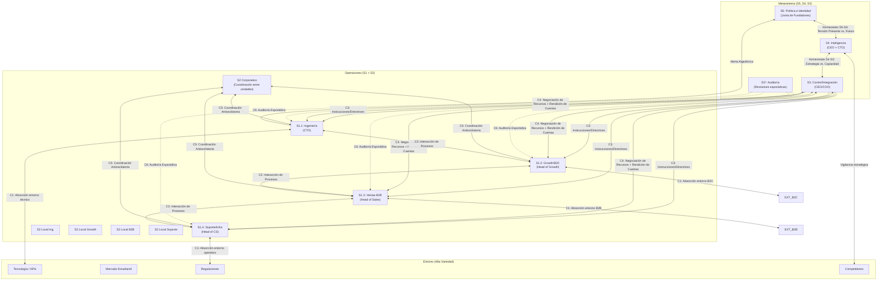
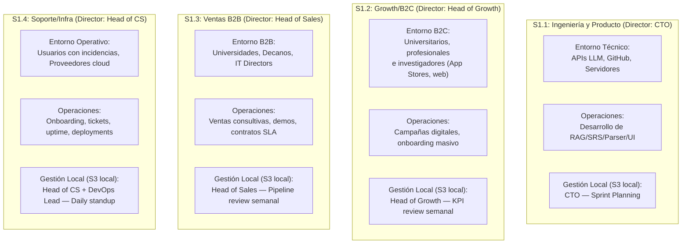

# 3_sistemas_vsm_synapta

> **Validación Cap. 2 (Pérez Ríos/Beer):** Esta fase corresponde a la *Dimensión Horizontal*. Se posiciona en el nivel de recursión elegido como *sistema en foco* (Synapta, Nivel 0) y analiza en detalle sus 5 subsistemas. Para cada uno se validan: **Existencia** (¿está formalmente representado?), **Calidad** (¿tiene los recursos y canales adecuados?) y **Desempeño** (¿opera de forma eficiente y eficaz?). La secuencia recomendada por el Cap. 2 es inversa a la operativa: primero S5, luego S4, S3, S3*, S2 y finalmente S1, para entender el propósito antes que los detalles.


## Tabla de Contenidos

- [Vista General del MSV de Synapta](#vista-general-del-msv-de-synapta)
- [1. Sistema 5: Política e Identidad](#1-sistema-5-politica-e-identidad)
  - [Relación entre los Sistemas 5 de Diferentes Niveles de Recursión](#relacion-entre-los-sistemas-5-de-diferentes-niveles-de-recursion)
- [2. Sistema 4: Inteligencia (El Exterior y el Futuro)](#2-sistema-4-inteligencia-el-exterior-y-el-futuro)
  - [Relación entre los Sistemas 4 de Diferentes Niveles](#relacion-entre-los-sistemas-4-de-diferentes-niveles)
  - [Modelos de Simulación del Entorno para el S4](#modelos-de-simulacion-del-entorno-para-el-s4)
- [3. Sistema 3: Control y Cohesión (El Aquí y Ahora)](#3-sistema-3-control-y-cohesion-el-aqui-y-ahora)
  - [Modelos Operativos de Regulación (S3)](#modelos-operativos-de-regulacion-s3)
  - [Sesión de Adaptación Estratégica (SAS) (M6)](#sesion-de-adaptacion-estrategica-sas-m6)
- [4. Sistema 3*: Auditoría y Monitoreo (Prevención de Hipertrofia del S3)](#4-sistema-3-auditoria-y-monitoreo-prevencion-de-hipertrofia-del-s3)
- [5. Sistema 2: Coordinación (Local y Corporativo)](#5-sistema-2-coordinacion-local-y-corporativo)
  - [5.1 Prevención de la patología: "Sistema 2 Autoritario (Burócratas Autoritarios)"](#51-prevencion-de-la-patologia-sistema-2-autoritario-burocratas-autoritarios)
  - [5.2 Sistema 2 Corporativo (Mecanismos S2 entre B2C y B2B — M2 & M5)](#52-sistema-2-corporativo-mecanismos-s2-entre-b2c-y-b2b-m2-m5)
  - [5.3 Mecanismo S2 de Cuadro de Mando Semanal por Unidad](#53-mecanismo-s2-de-cuadro-de-mando-semanal-por-unidad)
  - [5.4 Sistema 2 Local — Ingeniería (S1.1)](#54-sistema-2-local-ingenieria-s11)
  - [5.5 Sistema 2 Local — Growth (S1.2) y Ventas B2B (S1.3)](#55-sistema-2-local-growth-s12-y-ventas-b2b-s13)
  - [5.6 Sistema 2 Local — Soporte e Infraestructura (S1.4)](#56-sistema-2-local-soporte-e-infraestructura-s14)
- [6. Sistema 1: Operaciones (Unidades Operativas Viables)](#6-sistema-1-operaciones-unidades-operativas-viables)
- [Fuentes Citadas](#fuentes-citadas)

---

---

## Vista General del MSV de Synapta



---

## 1. Sistema 5: Política e Identidad

> **Cap. 2:** S5 es la máxima autoridad. Cierra la organización fijando su identidad, misión, valores y *ethos*. Equilibra la tensión entre S3 (aquí y ahora) y S4 (futuro). Recibe el canal algedónico directo desde operaciones si la viabilidad está en riesgo.

**Existencia:** Representado por la **Junta de Fundadores / Consejo Directivo de Synapta**.

**Calidad:**
- Declara el principio de **"Markdown libre y propiedad del usuario"** (Single Source of Truth), la privacidad como valor no negociable y la transparencia algorítmica.
- Establece los límites éticos que S3 y S1 no pueden cruzar, incluso bajo presión de mercado (e.g., nunca vender metadatos de estudio aunque un inversor lo requiera).

**Desempeño:** Equilibra activamente la tensión entre la presión operativa del día a día (S3: *"necesitamos ingresos rápidos"*) y la visión adaptativa del futuro (S4: *"debemos migrar a local-first"*). S5 decide bajo qué valores éticos se resuelve esa tensión.

**Responsables:**

| Función | Responsable |
| :--- | :--- |
| Custodio de identidad y ética | Junta de Fundadores (CEO + Co-founders) |
| Validación legal de políticas | Asesor Legal externo |
| Comunicación de valores a toda la organización | CEO + Head of People (RRHH) |

**Relación con otros sistemas:**
- **↔ S4:** Homeostato permanente. S5 recibe del S4 las opciones estratégicas de adaptación y decide cuáles son compatibles con la identidad declarada.
- **↔ S3:** S5 fija las políticas y los límites. S3 opera dentro de esos límites.
- **← S1 (Algedónico):** Si alguna unidad operativa detecta una amenaza vital (e.g., brecha de datos masiva), la señal llega *directamente* a S5 sin pasar por S3, garantizando respuesta inmediata.

---

### Relación entre los Sistemas 5 de Diferentes Niveles de Recursión
El Cap. 2 establece que los S5 de distintos niveles forman una **cadena de transmisión y validación de identidad**:
- El S5 de Synapta (Nivel 0) fija la identidad global: *"privacidad del usuario, Markdown abierto, IA como amplificador"*.
- Los directores locales de Ingeniería, Ventas y Soporte (sus respectivos S5 a nivel de unidad) deben **asumir, comprender y traducir** esa identidad a sus contextos operativos.
- Por ejemplo: el S5 local de Ingeniería traduce *"privacidad del usuario"* en *"toda arquitectura de BD debe soportar modo on-premise sin dependencia cloud obligatoria"*.
- **Procedimiento de comunicación:** Sesiones bimestrales de alineación de valores dirigidas por el CEO, en las que cada director local verifica que sus decisiones operativas sean congruentes con la identidad corporativa. La patología que se previene es la *"representación inadecuada frente a niveles superiores"* (Cap. 2), que ocurre cuando los directores locales actúan sin consultar ni respetar la identidad del nivel superior.

---

## 2. Sistema 4: Inteligencia (El Exterior y el Futuro)

> **Cap. 2:** S4 monitorea el entorno exterior (mercados, tecnología, competidores) y planifica la adaptación futura. Su interacción más crítica internamente es con S3, formando el **Homeostato S4-S3**: S4 propone cambios para adaptarse y S3 responde con las capacidades reales disponibles.

**Existencia:** Representado por la **Dirección Estratégica (CEO + CTO)** con apoyo del equipo de I+D.

**Calidad:**
- Modelos de simulación de costos de API y volumen de tokens (¿qué pasa si la base de usuarios crece de 5,000 a 50,000 en 6 meses?).
- Monitoreo sistemático de papers en arXiv sobre optimización FSRS y evolución de RAG.
- Evaluación del impacto del algoritmo FSRS: benchmarks muestran **20%–30% menos reviews diarias** vs. SM-2 clásico manteniendo la misma retención *(FSRS Benchmark Study, 2024)* [1].

**Desempeño:** Genera roadmaps tecnológicos viables que anticipan la obsolescencia y mantienen a Synapta adaptable frente a cambios como la aparición de asistentes cognitivos nativos en sistemas operativos.

**Responsables:**

| Función | Responsable |
| :--- | :--- |
| Estrategia tecnológica y roadmap de IA | CTO |
| Investigación de mercado y benchmarking competitivo | Head of Growth + Head of Sales |
| Simulaciones financieras y escenarios de costos | CFO + CTO |
| Monitoreo de regulaciones futuras | Asesor Legal + CEO |

**Relación con otros sistemas:**
- **↔ S3 (Homeostato S4-S3):** S4 propone *"migrar el motor RAG a ejecución local"*. S3 responde: *"la capacidad actual de ingeniería puede absorber eso en Q3, no Q2"*. Esta negociación garantiza que las propuestas estratégicas sean factibles operativamente.
- **↔ S5:** S4 presenta a S5 las opciones de adaptación. S5 valida cuáles son compatibles con los valores éticos de Synapta.
- **← Entorno (S4 como sensor activo):** S4 no espera que los cambios lleguen — activamente los busca en eventos de la industria, foros técnicos, movimientos de competidores y cambios regulatorios.

---

### Relación entre los Sistemas 4 de Diferentes Niveles
El Cap. 2 establece que los S4 de distintos niveles deben estar **explícitamente conectados** para evitar estrategias contradictorias:
- El S4 de Ingeniería (Nivel 1.1) planifica adoptar modelos locales de lenguaje (SLMs). Ese plan afecta los costos de API y el presupuesto de Ventas B2B (Nivel 1.3).
- El S4 de Ventas B2B planifica ofrecer un tier de precio "on-premise" a universidades. Eso afecta la estructura que Ingeniería debe desarrollar.
- **Mecanismo de coherencia:** Reuniones mensuales del *comité tecnológico-comercial* (CTO + Head of Sales + CFO) donde los S4 de cada unidad presentan sus planes de adaptación y se verifica compatibilidad cruzada. Los outputs del modelo financiero de Ingeniería (costos de API por usuario) sirven como *inputs* del modelo de pricing de Ventas B2B — implementando el principio de *modelos de Dinámica de Sistemas anidados* descrito en el Cap. 2.

---

### Modelos de Simulación del Entorno para el S4
El metasistema del Nivel 0 (Corporativo) cuenta con dos modelos cuantitativos desarrollados para simular escenarios competitivos y de mercado externo (allá y mañana) y predecir impactos regulatorios:

#### Modelo M2 — Impacto de Perder el Piloto Institucional
- **Propósito:** Modelar el impacto de la pérdida del docente patrocinador sobre la captación y validación del producto.
- **Variables de Entrada:**
  - % de usuarios activos por recomendación directa del docente: `30%` (obtenido del onboarding de la app).
  - Tasa de retención de esos usuarios si el docente abandona: `50%` (adherencia intrínseca estimada).
  - Semanas para conseguir un nuevo piloto con otro docente: `8 semanas` (2 semanas de contacto, 2 de exploración, 4 de prueba informal).
- **Variables de Salida:** Caída proyectada de WAU el mes posterior, tiempo estimado para recuperar la base mediante difusión orgánica, y número de canales B2C adicionales requeridos.
- **Responsable:** Head of Sales + CEO [3].

#### Modelo M5 — Penetración de Mercado y Requerimientos Regulatorios EdTech Perú
- **Propósito:** Simular a 5 años la tasa de adopción de la competencia de IAs y la variación de matrículas universitarias SUNEDU, y el impacto de cambios en las normativas de acreditación de SUNEDU y licenciamiento de programas virtuales.
- **Variables de Entrada:**
  - Proyección de matriculados universitarios nacionales (SUNEDU): `1.2M` de estudiantes peruanos.
  - Crecimiento anual estimado del mercado virtual: `8.5%` anual.
  - Tasa de penetración proyectada de competidores EdTech: `5.0%` anual.
  - Probabilidad de endurecimiento regulatorio de SUNEDU sobre programas 100% virtuales: `40%` a 3 años.
- **Variables de Salida:** Mercado direccionable total (SOM) a 5 años, volumen de licencias institucionales proyectadas, y alertas sobre la necesidad de adaptar el roadmap de producto ante requerimientos legales de SUNEDU.
- **Responsable:** CEO + Head of Sales.

**Criterios de Calidad de los Modelos:** Se consideran operativos únicamente si: (1) tienen variables por defecto basadas en la realidad operativa del proyecto (no datos ficticios), (2) han sido ejecutados y validados, y (3) contienen una sección de "Decisiones pre-diseñadas" que guía la acción directa del equipo en caso de desviación.

---

## 3. Sistema 3: Control y Cohesión (El Aquí y Ahora)

> **Cap. 2:** S3 es responsable del presente de la organización. Optimiza la operación conjunta del Sistema 1 buscando sinergias y distribuyendo recursos de manera justa. No interviene de forma autoritaria en la gestión local diaria de las unidades — respeta al máximo la autonomía del S1 e interviene únicamente ante excepciones algedónicas.

**Existencia:** Representado por el **CEO / COO** (Dirección de Operaciones).

**Calidad:** Cuenta con cuadros de mando semanales específicos por unidad, control financiero centralizado del presupuesto de APIs y pauta publicitaria, y canal formal C4 para negociación de recursos.

**Desempeño:** Administra la viabilidad del día a día. S3 interviene en las operaciones solo cuando se activan los niveles Amarillo o Rojo del canal algedónico (e.g., uptime < 99%, bugs críticos > 3 en producción). Su patología común es la microgestión, la cual destruye la confianza y la autonomía del S1.

**Responsables:**

| Función | Responsable |
| :--- | :--- |
| Sinergia, cohesión y dirección operativa global (Decisor) | CEO |
| Distribución, control del presupuesto del proyecto y asignación de recursos (Controlador) | CFO |
| Asignación y monitoreo de la carga horaria del equipo | Head of People (RRHH) |
| Reporte de avance y viabilidad a la Junta de Fundadores | CEO |
| Arbitraje y resolución de conflictos inter-unidades | CEO (como mediador de último recurso) |

### Modelos Operativos de Regulación (S3)
El metasistema del Nivel 0 (Corporativo) cuenta con dos modelos cuantitativos internos enfocados en el "aquí y ahora" para regular la estabilidad operativa y la asignación de recursos:

#### Modelo M1 — Agotamiento del Presupuesto de APIs
- **Propósito:** Prevenir la interrupción del servicio por agotamiento de saldo en las APIs de LLMs (el único costo variable directo).
- **Variables de Entrada:**
  - Presupuesto mensual total: `S/. 100` (referencial, se ajusta según saldo real).
  - Costo por sesión de consulta RAG: `USD 0.004` (basado en el costo oficial de Google Gemini 1.5 Flash: USD 0.075/M tokens de entrada + USD 0.30/M tokens de salida; con factor 10x para margen de ineficiencia y reintentos).
  - Usuarios Activos Mensuales (MAU): `80` (meta base del proyecto).
  - Sesiones RAG por usuario/mes: `12` (3 repeticiones/semana).
  - Tipo de cambio USD/PEN: `3.75` (calibrado mensualmente).
- **Variables de Salida:** Gasto mensual estimado (MAU × sesiones × costo/sesión × TC), número máximo de usuarios sostenibles y proyección de meses de viabilidad financiera.
- **Responsable:** CTO (construcción inicial y actualización mensual en los primeros tres días del mes con facturación real).
- **Ubicación:** Google Drive compartido (`M1_presupuesto_apis_[mes_año].gsheet`).

#### Modelo M3 — Disponibilidad del Equipo y Capacidad por Hitos Externos
- **Propósito:** Anticipar cuellos de botella en el desarrollo debido a semanas de alta demanda profesional o entregas concurrentes externas de los fundadores.
- **Variables de Entrada:**
  - Semanas críticas de alta demanda externa (ej. cierres trimestrales de consultorías externas) [2].
  - Disponibilidad mínima de cada integrante en periodos críticos: `5 horas/semana` (declarada por cada miembro) [2].
  - Tareas críticas no pausables: Uptime de infraestructura y soporte técnico urgente.
- **Variables de Salida:** Backlog de tareas a adelantar antes del período crítico, tareas postergables y reprogramación de sprints.
- **Responsable:** CEO.

**Relación con otros sistemas:**
- **→ S1 (C3):** Envía directrices generales y políticas globales (no instrucciones operativas detalladas).
- **↔ S1 (C4):** Canal de negociación de recursos (tiempo, herramientas, cuotas de API) y rendición de cuentas de KPIs.
- **← S3* (C6):** Encarga investigaciones o recibe auditorías directas para validar la veracidad de los reportes del S1.
- **↔ S4 (Homeostato):** Alimenta la planificación estratégica con las capacidades reales de la operación actual.

---

### Sesión de Adaptación Estratégica (SAS) (M6)
Para asegurar el equilibrio dinámico entre la política (S5), la inteligencia (S4) y el control operativo (S3), se formaliza la **Sesión de Adaptación Estratégica (SAS)**:

- **Frecuencia:** Mensual, fijada para el primer viernes de cada mes.
- **Duración:** `90 minutos` [4].
- **Participantes:** Todo el equipo (al ser un equipo de 2-5 integrantes, la separación de roles es funcional y requiere participación colectiva).
- **Medios:** Reunión por Google Meet con acta interactiva redactada en Notion en tiempo real.
- **Preparación Previa:** Cada responsable de unidad actualiza su cuadro de mando semanal el jueves anterior antes de las 10pm. El CEO consolida los datos en un resumen ejecutivo que se comparte el jueves a las 11pm.

#### Agenda Estándar de 90 Minutos:
1. **BLOQUE 1 — Estado Actual [20 min] (CEO):** Desempeño operativo (cuadros de mando), resolución de conflictos del S2, hallazgos de auditorías S3* y estado del presupuesto de APIs.
2. **BLOQUE 2 — Señales del Entorno [20 min] (CTO + Head of Sales):** Cambios en APIs y tecnologías de IA, análisis de competidores (ej. NotebookLM) y variaciones en el entorno universitario peruano.
3. **BLOQUE 3 — Tensión Presente vs. Futuro [20 min] (Todos):** Ajustes tácticos deseados frente a la capacidad real permitida por los hitos y disponibilidad del equipo.
4. **BLOQUE 4 — Decisiones y Valores [20 min] (Todos):** Votación de cambios y validación contra los principios éticos de la organización (ej. rechazo de venta de datos).
5. **BLOQUE 5 — Cierre [10 min] (CEO):** Definición de la matriz de compromisos (acción, responsable, fecha) y cierre del acta.

*SAS Extraordinaria:* Convocada de inmediato por el CEO ante alertas algedónicas de nivel **Crítico**, superación del presupuesto de APIs antes del día 20, o parálisis de coordinación irresoluble.

---

## 4. Sistema 3*: Auditoría y Monitoreo (Prevención de Hipertrofia del S3)

> **Cibernética Organizacional:** El Sistema 3* provee al metasistema información esporádica de primera mano directamente de las operaciones de la unidad viable, evitando pasar por los canales jerárquicos estándar del S1 o del S2. Esto previene que la información sea filtrada por directores locales interesados en reportar únicamente datos favorables. No es rutinario ni autoritario; su uso abusivo destruye la autonomía del S1, pero su ausencia condena al S3 a la ceguera operativa o a la hipertrofia.

**Existencia:** Representado por **auditorías de código cruzadas**, **encuestas de NPS aleatorias** y **auditorías financieras** de consumo cloud.

**Calidad:** Ejecutado mediante herramientas automáticas (Sentry para excepciones, SonarQube para calidad de código) y observación cualitativa directa (*customer shadowing* o entrevistas cortas con alumnos beta).

**Desempeño (Independencia Estructural):** Para garantizar la veracidad de la auditoría, **quien audita una unidad no puede pertenecer a ella**. En el equipo de 2-5 personas, se implementa una **rotación cruzada mensual** fija asignada por el CEO al inicio del semestre según la configuración de personal activa:
*   **En la configuración de 5 personas (Completo):**
    *   El CEO (operador de Ventas B2B S1.3) audita la calidad de código, UI y APIs de la unidad de Ingeniería (S1.1).
    *   El CTO (operador de Ingeniería S1.1) audita la fidelidad y conversión del pipeline en el CRM de Ventas B2B (S1.3).
    *   El CFO (operador de Soporte/CS S1.4) audita las campañas y leads calificados de la unidad de Growth/Marketing (S1.2).
    *   El responsable de Growth (S1.2) audita los tiempos de respuesta y nivel de satisfacción de los tickets en Soporte/CS (S1.4).
    *   El desarrollador Frontend (S1.1) realiza auditorías cruzadas sobre logs de DevOps.
*   **En la configuración de 3 personas (Base):**
    *   El CEO (Ventas B2B/Growth) audita la calidad del código, UI y logs de error de Ingeniería.
    *   El CTO (Ingeniería) audita la veracidad de leads y el CRM de Ventas.
    *   El CFO (Soporte/CS) audita la coherencia de la narrativa y leads en las campañas de Growth.
*   **En la configuración de 2 personas (Mínimo):**
    *   La Persona A (CEO/CFO/Negocios) realiza inspecciones esporádicas del consumo de APIs e incidencias en logs de la Persona B (CTO/Ingeniería).
    *   La Persona B (CTO/Tecnología) audita el CRM de ventas y los tickets de soporte ingresados por la Persona A (CEO).

> **Conciliación teórica — La Analogía del Radar de Tráfico (Cap. 3):**
> Beer y Pérez Ríos explican que el S3* funciona de manera análoga a un **radar móvil de tráfico**. Para alinear el comportamiento de los conductores (o de las unidades operativas), no se requiere un policía en cada esquina; basta con la posibilidad esporádica e impredecible de una medición (radar).
> Sin embargo, esto **no significa que las auditorías deban ser secretas o a escondidas**. Las unidades del S1 deben conocer de antemano qué variables se van a medir (código limpio, leads calificados, tiempos de respuesta) y que las auditorías ocurrirán. El enfoque no es punitivo ni de interferencia, sino de **prevención temprana** (similar a un chequeo médico de rutina) para identificar cuellos de botella antes de que afecten la viabilidad general.
> Para Synapta, se implementa un modelo híbrido: el calendario mensual fijo asegura que la auditoría ocurra como mínimo (previniendo su abandono por sobrecarga de actividades externas del equipo), mientras que el CEO puede convocar auditorías extraordinarias sin previo aviso ante discrepancias en los KPIs.

#### Plantilla del Informe de Auditoría S3*
El auditor de turno completa y entrega al CEO el siguiente formato mensual:
```text
INFORME DE AUDITORÍA S3* — [Nombre de la unidad auditada]
──────────────────────────────────────────────────────
Fecha: [dd/mm/aaaa]
Auditor: [Nombre y Rol en el equipo, ajeno a la unidad]
──────────────────────────────────────────────────────
1. Variables revisadas y método de verificación (ej. inspección visual CRM, Sentry logs)
2. Hallazgos que coinciden con los reportes habituales del S1
3. Hallazgos que difieren o no coinciden con los reportes habituales
4. Puntos ciegos (aspectos operativos que no están siendo medidos)
5. Calificación de Salud Operativa: Verde / Amarillo / Rojo
6. Recomendación de acción al CEO (S3)
──────────────────────────────────────────────────────
Distribución: Envío exclusivo al CEO. El CEO determina cuándo y cómo
comunicarlo al responsable de la unidad auditada para no generar desconfianza.
```

---

## 5. Sistema 2: Coordinación (Local y Corporativo)

> **Cibernética Organizacional:** S2 amortigua las oscilaciones y evita conflictos entre las unidades del S1. **No emite órdenes ni tiene jerarquía sobre el S1** — provee canales y servicios de coordinación automática. El único canal autorizado para enviar mandatos al S1 es el Sistema 3.

### 5.1 Prevención de la patología: "Sistema 2 Autoritario (Burócratas Autoritarios)"
*   **Definición:** Ocurre cuando el Sistema 2 (normas, estándares, calendarios) intenta imponer autoridad sobre las unidades operativas (S1) como si tuviera poder de decisión, lo que genera rechazo, evasión de controles y parálisis.
*   **La Analogía de las Reglas de Tránsito:** El S2 debe funcionar como las reglas de tránsito. Estas existen para agilizar el flujo de vehículos y evitar colisiones, no para decirle a cada conductor hacia dónde debe viajar o dictar sus decisiones.
*   **Mecanismo de Corrección en Synapta:** Para evitar la percepción de imposición, todos los mecanismos de coordinación del S2 son **co-diseñados de forma conjunta por el S1 (los directores locales que serán coordinados) y el S3 (CEO/COO)**. Esto garantiza que las reglas de sincronización se asimilen como herramientas de apoyo mutuo y no como burocracia ajena.

### 5.2 Sistema 2 Corporativo (Mecanismos S2 entre B2C y B2B — M2 & M5)
**Responsable:** CEO / COO como árbitro y diseñador de los mecanismos formales compartidos.

Para evitar que los esfuerzos comerciales de B2C y B2B colisionen o sobrecarguen la capacidad de entrega de Ingeniería, se establecen cuatro canales de coordinación co-diseñados:

1.  **Coherencia de Narrativa Pública:** Antes de publicar cualquier mensaje en redes que mencione precios, promociones o gratuidad de YachaqAI, el integrante de B2C notifica al de B2B con al menos `48 horas` de anticipación. Esto evita devaluar la propuesta institucional del piloto. Si el responsable de B2B no objeta en ese plazo, la publicación procede (silencio es aprobación para evitar cuellos de botella).
2.  **Calendario de Acciones Externas Automatizado:** Se mantiene un calendario semanal centralizado integrado mediante un tablero automatizado de GitHub Projects, donde cada unidad registra las campañas, lanzamientos o demostraciones planificadas. Esto gatilla notificaciones automatizadas vía webhooks hacia el canal de coordinación de Slack/Discord, evitando saturar los mismos canales de difusión.
3.  **Reporte Mensual de Señales Cruzadas:** El responsable de B2C comparte un reporte de perfiles de usuario y carreras más activas con B2B (para orientar nuevos pilotos); el de B2B comparte el feedback cualitativo y necesidades pedagógicas reportadas por los docentes con Ingeniería y B2C.
4.  **Protocolo de Crisis de Reputación:** Ante cualquier queja pública o malentendido con un docente, B2C coordina la respuesta en redes en menos de `24 horas` y B2B contacta al docente de forma directa e inmediata para contener el impacto, sin necesidad de escalar previamente a la dirección.

#### Mecanismos de Coordinación con Ingeniería (S2 Corp):
*   **Esquemas de datos estandarizados:** YAML frontmatter y estructura de directorios Markdown normalizados — el "idioma común" entre Producto, Ventas y Soporte que impide desajustes técnicos.
*   **Matriz de Sizing:** Limita el volumen de compromisos B2B que Ventas puede firmar mensualmente en función de la velocidad de entrega de Ingeniería (puntos de historia disponibles).
*   **Release Calendar:** Ventana mensual coordinada donde Ingeniería comunica qué funcionalidades son estables en producción antes de que Ventas las incluya en demos.
*   **SLA Internos:** Ingeniería se compromete a resolver bugs críticos reportados por Soporte en < 4 horas durante días hábiles.

### 5.3 Mecanismo S2 de Cuadro de Mando Semanal por Unidad
Para evitar que el metasistema se sobrecargue y que el S3 intente absorber directamente la complejidad operativa (lo que provocaría **Hipertrofia del S3**), cada integrante responsable actualiza de forma autónoma su propia hoja de cálculo de Google Sheets cada lunes antes de las 10am:

```text
CUADRO DE MANDO SEMANAL — [Nombre de la Unidad Operativa]
Responsable: [Nombre]  |  Semana: [dd/mm/aaaa al dd/mm/aaaa]
─────────────────────────────────────────────────────────────
Indicador       | Valor actual | Objetivo | Estado (🟢/🟡/🔴)
─────────────────────────────────────────────────────────────
[KPI principal] | [valor]      | [meta]   | [Estado]
[KPI 2]         | [valor]      | [meta]   | [Estado]
[KPI 3]         | [valor]      | [meta]   | [Estado]
─────────────────────────────────────────────────────────────
¿Hubo desviación significativa esta semana? [Sí/No] - [Causa en 1 línea]
¿Qué acción correctora ejecuté o propongo? [Texto libre]
¿Se requiere la intervención del metasistema (S3)? [Sí/No]
─────────────────────────────────────────────────────────────
```
*   **Frecuencia Semanal:** Permite detectar desviaciones antes de que se pierda el sprint completo y encaja con la cadencia de planificación ágil del equipo (1-2 semanas), sin la sobrecarga insostenible de una medición diaria para integrantes con dedicación parcial/mixta.
*   **Función Dual Sistémica:** 
    1.  **Mecanismo S2 (Amortiguador de variedad):** Al estandarizar el formato, el día y la hora de reporte de todas las unidades, absorbe la variedad caótica de las operaciones y las traduce a una estructura comparable.
    2.  **Canal C4 (Rendición de cuentas):** Funciona como la vía formal por la cual la unidad rinde cuentas al S3 y activa el escalamiento metasistémico si marca la opción *"Sí, se requiere intervención del metasistema (S3)"*.

### 5.4 Sistema 2 Local — Ingeniería (S1.1)
**Responsable:** CTO + Scrum Master.
**Mecanismos:** Sprints semanales (Scrum), tablero Kanban compartido (GitHub Projects), estándares de branching en Git, revisiones de PR obligatorias antes de merge a producción.

### 5.5 Sistema 2 Local — Growth (S1.2) y Ventas B2B (S1.3)
**Responsable:** Head of Growth + Head of Sales.
**Mecanismos:** CRM compartido (Hubspot/GitHub Projects) entre B2C y B2B, reglas de asignación y calificación de leads automatizadas, calendario de pauta publicitaria.

### 5.6 Sistema 2 Local — Soporte e Infraestructura (S1.4)
**Responsable:** Head of Customer Success + DevOps Lead.
**Mecanismos:** Matriz de priorización de incidencias (P0-P3), turnos de guardia rotativos para incidencias, runbooks de DevOps y guías de respuesta pre-aprobadas para soporte al usuario.

---

## 6. Sistema 1: Operaciones (Unidades Operativas Viables)

> **Cap. 2:** Cada unidad del S1 debe ser un **sistema viable en sí misma**, con su propia gestión (director local), operaciones y entorno específico. El grado de autonomía es esencial: cada unidad absorbe la variedad de su entorno sin necesitar permiso constante del metasistema.



**Responsables por unidad:**

| Unidad | Director Local | Legal (Soporte Externo / Outsourced) | Contabilidad/Presupuesto | RRHH | Operaciones Core |
| :--- | :--- | :--- | :--- | :--- | :--- |
| **Ingeniería (S1.1)** | CTO | Asesor Legal Externo (contratos OSS) | CTO + CFO (presupuesto APIs) | Head of People | Ingenieros Full Stack, ML Engineers |
| **Growth/B2C (S1.2)** | Head of Growth | Asesor Legal Externo (T&C, privacidad) | Head of Growth + CFO (presupuesto pauta) | Head of People | Growth Hackers, Content Creators |
| **Ventas B2B (S1.3)** | Head of Sales | Asesor Legal Externo (contratos institucionales) | Head of Sales + CFO (precios, descuentos) | Head of People | Ejecutivos de Cuenta B2B |
| **Soporte/Infra (S1.4)** | Head of CS | Asesor Legal Externo (SLAs contractuales) | Head of CS + CFO (costos cloud) | Head of People | Support Engineers, DevOps |

> **Nota sobre la Viabilidad de Legal y Cumplimiento:**
> Synapta no cuenta con un rol legal interno de planta para evitar la patología de *hipertrofia de recursos*. La función legal y de cumplimiento normativo/tributario es un **recurso externo especializado (Outsourced)**. Su integración cibernética al metasistema se realiza mediante las siguientes interfaces:
> *   **Sensor y Activación (S4/S5):** El CEO actúa como el sensor del entorno legal (monitoreando alertas de SUNEDU, INDECOPI y la Ley N° 29733 de Protección de Datos Personales), y es el responsable de activar y coordinar con el estudio de abogados externo.
> *   **Control Financiero (S3):** El CFO gestiona los honorarios de la asesoría externa y valida que los gastos de cumplimiento se ajusten al presupuesto operativo.
> *   **Ejecución Operativa (S1):** El asesor externo proporciona las directrices y contratos redactados, y los directores locales (CTO, Sales, Growth, CS) los implementan en sus respectivas unidades (ej. el CTO implementa el banner de cookies y la base de datos encriptada según indicaciones del abogado).

---

## Fuentes Citadas

| # | Fuente | Dato utilizado |
| :--- | :--- | :--- |
| [1] | FSRS Benchmark Study (2024). *An Empirical Comparison of Spaced Repetition Schedulers* | FSRS reduce 20%–30% las reviews diarias vs. SM-2 con igual retención |
| [2] | Deloitte / PMI (2021). *Professional Services Resource Management Benchmarks* | La utilización y demanda en cierres de proyectos reduce la disponibilidad discrecional a ≤ 5h semanales en tareas extra-profesionales |
| [3] | EdSurge (2021). *EdTech Pilot Guidelines and Procurement Cycles* | Ciclos de 8 a 12 semanas para reclutamiento, diseño y validación de pilotos B2B en instituciones educativas |
| [4] | Schwaber, Ken (2004). *Agile Project Management with Scrum* | Recomendación de 60-90 minutos para ceremonias de alineación, revisión y adaptación |