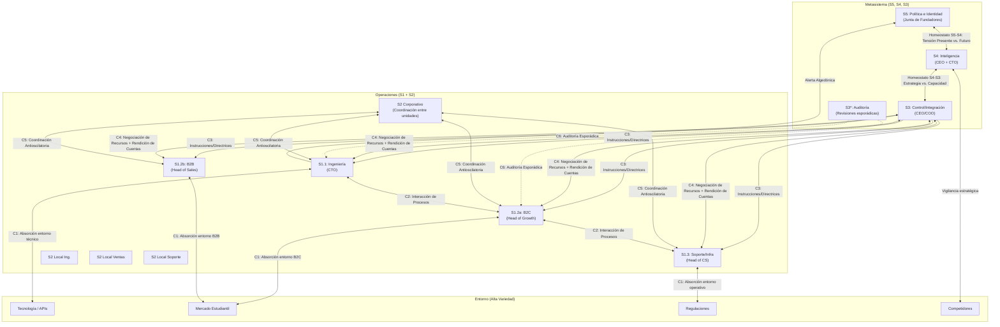
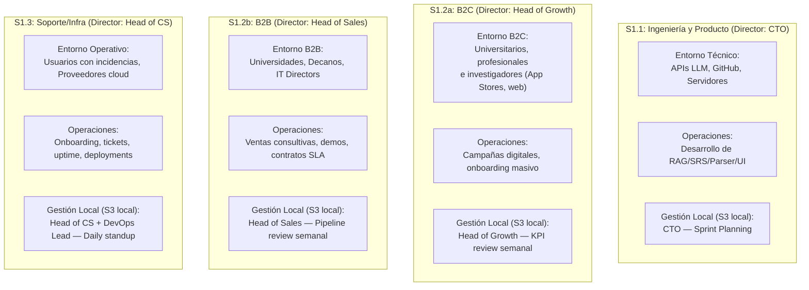

# 3_sistemas_vsm_synapta

> **Validación Cap. 2 (Pérez Ríos/Beer):** Esta fase corresponde a la *Dimensión Horizontal*. Se posiciona en el nivel de recursión elegido como *sistema en foco* (Synapta, Nivel 0) y analiza en detalle sus 5 subsistemas. Para cada uno se validan: **Existencia** (¿está formalmente representado?), **Calidad** (¿tiene los recursos y canales adecuados?) y **Desempeño** (¿opera de forma eficiente y eficaz?). La secuencia recomendada por el Cap. 2 es inversa a la operativa: primero S5, luego S4, S3, S3*, S2 y finalmente S1, para entender el propósito antes que los detalles.

---

## Vista General del MSV de Synapta

---

## 1. Sistema 5: Política e Identidad

> **Cap. 2:** S5 es la máxima autoridad. Cierra la organización fijando su identidad, misión, valores y *ethos*. Equilibra la tensión entre S3 (aquí y ahora) y S4 (futuro). Recibe el canal algedónico directo desde operaciones si la viabilidad está en riesgo.

**Existencia:** Representado por la **Junta de Fundadores / Consejo Directivo de Synapta**.

**Calidad:**
- Declara el principio de **"Markdown libre y propiedad del usuario"** (Single Source of Truth), la privacidad como valor no negociable y la transparencia algorítmica.
- Establece los límites éticos que S3 y S1 no pueden cruzar, incluso bajo presión de mercado (e.g., nunca vender metadatos de estudio aunque un inversor lo requiera).

**Desempeño:** Equilibra activamente la tensión entre la presión operativa del día a día (S3: *"necesitamos ingresos rápidos"*) y la visión adaptativa del futuro (S4: *"debemos migrar a local-first"*). S5 decide bajo qué valores éticos se resuelve esa tensión.

**Responsables:**

| Función | Responsable |
| :--- | :--- |
| Custodio de identidad y ética | Junta de Fundadores (CEO + Co-founders) |
| Validación legal de políticas | Asesor Legal externo |
| Comunicación de valores a toda la organización | CEO + Head of People (RRHH) |

**Relación con otros sistemas:**
- **↔ S4:** Homeostato permanente. S5 recibe del S4 las opciones estratégicas de adaptación y decide cuáles son compatibles con la identidad declarada.
- **↔ S3:** S5 fija las políticas y los límites. S3 opera dentro de esos límites.
- **← S1 (Algedónico):** Si alguna unidad operativa detecta una amenaza vital (e.g., brecha de datos masiva), la señal llega *directamente* a S5 sin pasar por S3, garantizando respuesta inmediata.

---

### Relación entre los Sistemas 5 de Diferentes Niveles de Recursión
El Cap. 2 establece que los S5 de distintos niveles forman una **cadena de transmisión y validación de identidad**:
- El S5 de Synapta (Nivel 0) fija la identidad global: *"privacidad del usuario, Markdown abierto, IA como amplificador"*.
- Los directores locales de Ingeniería, Ventas y Soporte (sus respectivos S5 a nivel de unidad) deben **asumir, comprender y traducir** esa identidad a sus contextos operativos.
- Por ejemplo: el S5 local de Ingeniería traduce *"privacidad del usuario"* en *"toda arquitectura de BD debe soportar modo on-premise sin dependencia cloud obligatoria"*.
- **Procedimiento de comunicación:** Sesiones bimestrales de alineación de valores dirigidas por el CEO, en las que cada director local verifica que sus decisiones operativas sean congruentes con la identidad corporativa. La patología que se previene es la *"representación inadecuada frente a niveles superiores"* (Cap. 2), que ocurre cuando los directores locales actúan sin consultar ni respetar la identidad del nivel superior.

---

## 2. Sistema 4: Inteligencia (El Exterior y el Futuro)

> **Cap. 2:** S4 monitorea el entorno exterior (mercados, tecnología, competidores) y planifica la adaptación futura. Su interacción más crítica internamente es con S3, formando el **Homeostato S4-S3**: S4 propone cambios para adaptarse y S3 responde con las capacidades reales disponibles.

**Existencia:** Representado por la **Dirección Estratégica (CEO + CTO)** con apoyo del equipo de I+D.

**Calidad:**
- Modelos de simulación de costos de API y volumen de tokens (¿qué pasa si la base de usuarios crece de 5,000 a 50,000 en 6 meses?).
- Monitoreo sistemático de papers en arXiv sobre optimización FSRS y evolución de RAG.
- Evaluación del impacto del algoritmo FSRS: benchmarks muestran **20%–30% menos reviews diarias** vs. SM-2 clásico manteniendo la misma retención *(FSRS Benchmark Study, 2024)* [1].

**Desempeño:** Genera roadmaps tecnológicos viables que anticipan la obsolescencia y mantienen a Synapta adaptable frente a cambios como la aparición de asistentes cognitivos nativos en sistemas operativos.

**Responsables:**

| Función | Responsable |
| :--- | :--- |
| Estrategia tecnológica y roadmap de IA | CTO |
| Investigación de mercado y benchmarking competitivo | Head of Growth + Head of Sales |
| Simulaciones financieras y escenarios de costos | CFO + CTO |
| Monitoreo de regulaciones futuras | Asesor Legal + CEO |

**Relación con otros sistemas:**
- **↔ S3 (Homeostato S4-S3):** S4 propone *"migrar el motor RAG a ejecución local"*. S3 responde: *"la capacidad actual de ingeniería puede absorber eso en Q3, no Q2"*. Esta negociación garantiza que las propuestas estratégicas sean factibles operativamente.
- **↔ S5:** S4 presenta a S5 las opciones de adaptación. S5 valida cuáles son compatibles con los valores éticos de Synapta.
- **← Entorno (S4 como sensor activo):** S4 no espera que los cambios lleguen — activamente los busca en eventos de la industria, foros técnicos, movimientos de competidores y cambios regulatorios.

---

### Relación entre los Sistemas 4 de Diferentes Niveles
El Cap. 2 establece que los S4 de distintos niveles deben estar **explícitamente conectados** para evitar estrategias contradictorias:
- El S4 de Ingeniería (Nivel 1.1) planifica adoptar modelos locales de lenguaje (SLMs). Ese plan afecta los costos de API y el presupuesto de Ventas (Nivel 1.2).
- El S4 de Ventas planifica ofrecer un tier de precio "on-premise" a universidades. Eso afecta la arquitectura que Ingeniería debe desarrollar.
- **Mecanismo de coherencia:** Reuniones mensuales del *comité tecnológico-comercial* (CTO + Head of Sales + CFO) donde los S4 de cada unidad presentan sus planes de adaptación y se verifica compatibilidad cruzada. Los outputs del modelo financiero de Ingeniería (costos de API por usuario) sirven como *inputs* del modelo de pricing de Ventas — implementando el principio de *modelos de Dinámica de Sistemas anidados* descrito en el Cap. 2.

---

## 3. Sistema 3: Control e Integración (El Aquí y Ahora)

> **Cap. 2:** S3 es responsable del presente. Optimiza el funcionamiento conjunto del Sistema 1 buscando sinergias. No interviene autoritariamente en las operaciones diarias — su estilo debe respetar la autonomía de las unidades, interviniendo solo en excepciones.

**Existencia:** Representado por el **CEO / COO** (Dirección de Operaciones).

**Calidad:** KPIs consolidados de las tres unidades, control presupuestal de APIs y pauta, asignación de headcount por unidad.

**Desempeño:** Interviene solo cuando un indicador algedónico se activa (uptime < 99.5%, costos de API superan el 25% del presupuesto, o ventas caen más del 20% en un mes). La intervención rutinaria en sprints de ingeniería o en campañas de marketing es una patología organizacional.

**Responsables:**

| Función | Responsable |
| :--- | :--- |
| Integración y coordinación de las tres unidades | CEO / COO |
| Control de presupuesto global | CFO |
| Asignación de recursos humanos | Head of People (RRHH) |
| Reporte a inversores | CEO + CFO |
| Resolución de conflictos inter-unidades | CEO/COO (mediador de último recurso) |

**Relación con otros sistemas:**
- **→ S1 (C3):** Envía instrucciones y directrices de alto nivel (no microgestión) a los directores locales de cada unidad.
- **↔ S1 (C4):** Negocia recursos (presupuesto, personas, licencias de API) y recibe la rendición de cuentas periódica.
- **← S3* (C6):** Recibe resultados de auditorías esporádicas para validar que los reportes del S1 sean verídicos.
- **↔ S4 (Homeostato):** Informa a S4 sobre qué cambios estratégicos son factibles dado el estado operativo actual.

---

## 4. Sistema 3*: Auditoría y Monitoreo

> **Cap. 2:** S3* provee información esporádica y directa desde las operaciones, evitando los filtros formales. No es rutinario ni autoritario — su uso excesivo destruiría la confianza y autonomía del S1.

**Existencia:** Representado por **auditorías de código cruzadas** (code reviews entre ingenieros de diferentes áreas), **NPS aleatorios** a usuarios finales y **revisiones financieras esporádicas** por el CFO.

**Calidad:** Ejecutado con herramientas de análisis estático (SonarQube), sesiones de *customer shadowing* (observar en vivo el onboarding de un estudiante) y revisiones de contratos B2B.

**Desempeño:** Activado de forma aleatoria (máximo una vez al mes por unidad) para garantizar que las métricas reportadas formalmente por S1 coincidan con la realidad.

**Responsables:**

| Función | Responsable |
| :--- | :--- |
| Auditorías técnicas de código | CTO (cruzado entre ingenieros) |
| Auditorías financieras | CFO + Auditor externo anual |
| Encuestas NPS / Customer shadowing | Head of Customer Success |
| Revisión de contratos B2B | Asesor Legal + Head of Sales |

---

## 5. Sistema 2: Coordinación (Local y Corporativo)

> **Cap. 2:** S2 amortigua las oscilaciones y evita conflictos entre las unidades del S1. **No emite órdenes** — provee servicios de coordinación. El Cap. 2 distingue un S2 corporativo (entre las grandes unidades del S1) y S2 locales (dentro de cada unidad para coordinar sus sub-equipos internos).

### 5.1 Sistema 2 Corporativo (entre Ingeniería, Ventas B2C, Ventas B2B, Soporte)
**Responsable:** CEO/COO como árbitro + procesos formales compartidos.

**Mecanismos:**
1. **Esquemas de datos estandarizados:** YAML frontmatter y estructura de directorios Markdown normalizados — el "idioma común" entre Producto, Ventas y Soporte que impide desajustes técnicos.
2. **Matriz de Sizing:** Limita el volumen de compromisos B2B que Ventas puede firmar mensualmente en función de la velocidad de entrega de Ingeniería (puntos de historia disponibles).
3. **Release Calendar:** Ventana mensual coordinada donde Ingeniería comunica qué funcionalidades son estables en producción antes de que Ventas las incluya en demos.
4. **SLA Internos:** Ingeniería se compromete a resolver bugs críticos reportados por Soporte en < 4 horas durante días hábiles.

**Previene:** Que Ventas B2B prometa integraciones que Ingeniería no puede entregar, o que Soporte escale tickets a Ingeniería sin priorización, saturando los sprints.

### 5.2 Sistema 2 Local — Ingeniería (S1.1)
**Responsable:** CTO + Scrum Master.

**Mecanismos:** Sprints semanales (Scrum), tablero Kanban compartido (GitHub Projects/Linear), estándares de branching en Git, revisiones de PR obligatorias antes de merge a producción.

### 5.3 Sistema 2 Local — Ventas (S1.2a y S1.2b)
**Responsable:** Head of Growth + Head of Sales.

**Mecanismos:** CRM compartido (HubSpot) entre B2C y B2B, reglas de calificación de leads, calendario compartido de campañas que evita que B2C y B2B compitan por el mismo presupuesto de pauta en el mismo mes.

### 5.4 Sistema 2 Local — Soporte e Infraestructura (S1.3)
**Responsable:** Head of Customer Success + DevOps Lead.

**Mecanismos:** Sistema de priorización de tickets (P0-P3), protocolos de escalamiento al DevOps, runbooks de respuesta a incidencias de servidor.

---

## 6. Sistema 1: Operaciones (Unidades Operativas Viables)

> **Cap. 2:** Cada unidad del S1 debe ser un **sistema viable en sí misma**, con su propia gestión (director local), operaciones y entorno específico. El grado de autonomía es esencial: cada unidad absorbe la variedad de su entorno sin necesitar permiso constante del metasistema.

**Responsables por unidad:**

| Unidad | Director Local | Legal | Contabilidad/Presupuesto | RRHH | Operaciones Core |
| :--- | :--- | :--- | :--- | :--- | :--- |
| **Ingeniería (1.1)** | CTO | Asesor Legal (contratos OSS) | CTO + CFO (presupuesto APIs) | Head of People | Ingenieros Full Stack, ML Engineers |
| **B2C (1.2a)** | Head of Growth | Asesor Legal (T&C, privacidad) | Head of Growth + CFO (presupuesto pauta) | Head of People | Growth Hackers, Content Creators |
| **B2B (1.2b)** | Head of Sales | Asesor Legal (contratos institucionales) | Head of Sales + CFO (precios, descuentos) | Head of People | Ejecutivos de Cuenta B2B |
| **Soporte/Infra (1.3)** | Head of CS | Asesor Legal (SLAs contractuales) | Head of CS + CFO (costos cloud) | Head of People | Support Engineers, DevOps |

---

## Fuentes Citadas

| # | Fuente | Dato utilizado |
| :--- | :--- | :--- |
| [1] | FSRS Benchmark Study (2024). *An Empirical Comparison of Spaced Repetition Schedulers* | FSRS reduce 20%–30% las reviews diarias vs. SM-2 con igual retención |
