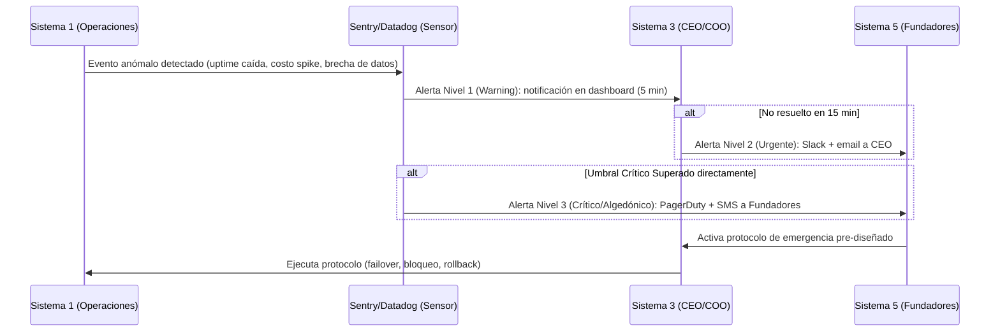

# 4_coherencia_y_control

> **Validación Cap. 2 (Pérez Ríos/Beer):** Esta es la fase de cierre del método. Su objetivo es asegurar que la **coherencia y la unidad estructural** existan a través de *todos* los niveles de recursión de Synapta: que la identidad definida en S5 llegue intacta hasta las operaciones del S1 más específico, y que los planes estratégicos del S4 de diferentes niveles no se contradigan entre sí. También se diseñan los canales de emergencia algedónicos y los 6 canales de control cibernético que sostienen el equilibrio dinámico.

---

## 1. Articulación Vertical–Horizontal en la Fase 4

El Cap. 2 explica que la coherencia opera en dos ejes:

- **Eje Vertical (entre niveles):** Synapta (Nivel 0) → Ingeniería, Ventas B2C, Ventas B2B, Soporte (Nivel 1). La coherencia vertical asegura que lo que se decide en el Nivel 0 (identidad, estrategia, presupuesto) se traduzca correctamente en el Nivel 1 sin distorsiones.
- **Eje Horizontal (dentro del sistema en foco):** La coherencia horizontal asegura que los S5, S4 y S3 dentro del mismo nivel operen de forma articulada (Homeostato S4-S3 y equilibrio S5-S4-S3).

La Fase 4 verifica que ambos ejes estén activos y sin bloqueos.

---

## 2. Coherencia de Políticas e Identidad (Sistema 5)

### 2.1 Cadena de Transmisión de Identidad (Vertical Descendente)

El Cap. 2 establece que los S5 de los distintos niveles forman una **cadena de transmisión y validación de la identidad corporativa**. Para Synapta:

| Nivel | S5 Responsable | Traducción de la Identidad Corporativa |
| :--- | :--- | :--- |
| **Nivel 0 (Corporativo)** | Junta de Fundadores / CEO | *"Markdown libre, privacidad del usuario, IA como amplificador — no como sustituto del pensamiento propio."* |
| **Nivel 1.1 (Ingeniería)** | CTO (S5 local) | *"Toda la arquitectura debe soportar modo on-premise sin dependencia cloud obligatoria. Las funcionalidades de IA no pueden enviar datos del usuario a terceros sin consentimiento explícito."* |
| **Nivel 1.2a (B2C)** | Head of Growth (S5 local) | *"Nunca vender como característica algo que no exista en producción. No usar dark patterns en el funnel de conversión."* |
| **Nivel 1.2b (B2B)** | Head of Sales (S5 local) | *"Los contratos institucionales no pueden incluir cláusulas de cesión de datos de estudiantes a la universidad sin consentimiento individual."* |
| **Nivel 1.3 (Soporte/Infra)** | Head of CS + DevOps Lead (S5 local) | *"En ninguna circunstancia se puede acceder al contenido privado de los mazos de un usuario para diagnosticar un bug sin su autorización explícita."* |

**Responsable de mantener la cadena activa:** CEO (como emisor principal) + Head of People (RRHH) para incorporar los valores en los procesos de onboarding de nuevos empleados.

**Procedimiento de verificación:** Cada director local completa un **checklist de coherencia de identidad** trimestral en el que documenta cómo una decisión operativa reciente reafirmó o tensionó los valores corporativos, con revisión por el CEO.

**Patología que se previene:** *"Representación inadecuada frente a niveles superiores"* (Cap. 2) — cuando los directores locales actúan ignorando la identidad corporativa, generando una organización con múltiples identidades contradictorias.

---

### 2.2 Alineación Ascendente (Vertical hacia arriba)

La coherencia no es solo top-down. El Cap. 2 señala que los S5 locales también deben poder influir en la identidad global a medida que sus experiencias operativas revelan tensiones o necesidades no anticipadas:

- **Mecanismo:** Los directores locales pueden elevar al Consejo Directivo (S5 global) propuestas de ajuste de política mediante el *Comité de Identidad y Ética Trimestral*. Por ejemplo: si el equipo de Ventas B2B detecta que varias universidades requieren funcionalidades que implican revisar el principio de privacidad, ese caso se eleva al S5 global para una decisión de política, no se resuelve unilateralmente.

---

## 3. Coherencia de Estrategias (Sistema 4)

### 3.1 Verificación de Compatibilidad entre S4 de Niveles

El Cap. 2 declara que es una *"necesidad absoluta"* verificar que los cambios estratégicos planificados en un nivel sean **totalmente compatibles** con los de los demás. Para Synapta:

| Pareja de S4 | Posible Contradicción | Mecanismo de Coherencia |
| :--- | :--- | :--- |
| **S4 Ingeniería ↔ S4 Ventas B2B** | Ingeniería planifica migrar a SLMs locales (reduciendo costos cloud), pero Ventas B2B tiene ya contratos firmados que prometen el 99.9% de uptime cloud. | Reunión mensual del *Comité Tecnológico-Comercial* (CTO + Head of Sales + CEO) donde los roadmaps se cruzan antes de comprometerse externamente. |
| **S4 Ventas B2C ↔ S4 Ventas B2B** | B2C planifica un modelo Freemium que ofrezca todo el poder RAG gratis, mientras B2B vende ese mismo poder como diferenciador de precio premium. | El CFO actúa como árbitro de pricing: los planes de adquisición B2C y la propuesta de valor B2B deben ser revisados juntos en el presupuesto trimestral. |
| **S4 Corporativo ↔ S4 Unidades** | La dirección estratégica decide internacionalizar a Colombia en Q2, pero Soporte/Infra no tiene capacidad para dar SLA a otro mercado hasta Q4. | El S4 corporativo *consulta* los modelos de capacidad del S4 de Infra antes de comprometer fechas de expansión. Los outputs del S4 de Infra son *inputs* del plan corporativo (principio de modelos anidados del Cap. 2). |

**Responsables de la verificación de coherencia estratégica:**

| Proceso | Responsable |
| :--- | :--- |
| Comité Tecnológico-Comercial mensual | CEO (moderador) + CTO + Head of Sales + CFO |
| Revisión de compatibilidad de roadmaps | CTO (tecnología) + Head of Growth (mercado) |
| Simulaciones financieras de escenarios | CFO |
| Revisión legal de compromisos estratégicos | Asesor Legal |

---

## 4. El Canal Algedónico (Algedonic Loop) — Sistema de Alarma de Viabilidad

El canal algedónico transmite señales de emergencia desde donde surge la crisis (normalmente S1 o el entorno captado por S4) **directamente hasta S5**, puenteando la jerarquía normal para garantizar una respuesta inmediata.



### 4.1 Variables Críticas, Sensores y Umbrales

El canal algedónico de Synapta se extiende a variables tanto cuantitativas (técnicas y de usuarios) como cualitativas (institucionales, regulatorias, de equipo y de identidad), asegurando que cualquier evento que amenace la viabilidad u honestidad de la organización sea transmitido de inmediato.

| Dimensión | Variable | Sensor | Umbral Warning (🟡) | Umbral Urgente (🟠) | Umbral Crítico (🔴 → S5 directo) | Justificación del Umbral y Calibración |
| :--- | :--- | :--- | :--- | :--- | :--- | :--- |
| **Técnica** | Caída del servicio | UptimeRobot free (ping cada 5 min) | > 30 minutos caído | > 2 horas caído | > 4 horas o pérdida de datos | **30 min:** Pérdida de progreso del usuario activo. **2h:** Sesión completa de estudio arruinada. **4h:** Jornada académica completa perdida, gatillando abandono masivo. Sensor configurado por Ingeniería. |
| **Técnica** | Costos de APIs | Consola de facturación de Google/OpenAI | 70% del presupuesto mensual con ≥ 15 días restantes | 90% del presupuesto mensual consumido | 100% consumido antes del día 20 del mes | **70% a mitad de mes:** Tiempo suficiente para optimizar prompts, caché o limitar uso. **Día 20:** Margen insostenible para operar los últimos 10 días de clase. Calibrado por Ingeniería. |
| **Técnica** | Errores en producción | Sentry free tier | 5+ errores 5xx en 1 hora | 20+ errores 5xx en 1 hora | Pérdida o corrupción de datos de usuarios | **5 err/h:** Ruido de red tolerable en beta. **20 err/h:** Problema sistémico en producción. Calibrado y configurado mediante alertas automáticas en Sentry por Ingeniería. |
| **Usuarios** | Abandono de usuarios activos | PostHog free / Google Analytics 4 | Pérdida de 5+ WAU en una semana | Pérdida de 15+ WAU o 0 sesiones SRS en 48h | Caída del 50% de la base de WAU en una semana | **5 WAU:** 3%-10% de la base (señal temprana de insatisfacción). **15 WAU:** Caída severa de retención. **50%:** Crisis sistémica de producto o marca. Monitoreado por el Head of Growth. |
| **Institucional** | Estado del piloto con docentes | Seguimiento manual en Notion | Docente sin responder por 2 semanas | Docente indica insatisfacción o duda | Pérdida del único piloto activo en el semestre | **2 semanas sin respuesta:** Riesgo de enfriamiento del piloto en semestres cortos. **Pérdida de piloto:** Pérdida absoluta de validación institucional. Medido por Relaciones Institucionales. |
| **Regulatoria** | Cambio en legislación de datos | Boletín El Peruano, alertas SUNEDU | Anuncio de proyecto de ley restrictivo | Ley aprobada que requiere adecuación | Resolución que prohíbe software no validado | Sigue la progresión legislativa peruana. El sensor es el CEO, quien configura alertas en Google Alerts ("datos personales educación Perú", "SUNEDU regulación"). |
| **Equipo** | Baja de un integrante | Declaración en reunión o WhatsApp | Integrante reduce disponibilidad > 30% | Integrante anuncia salida en ≤ 2 semanas | Baja inmediata de rol clave sin sucesor | **30% de reducción:** Equivale a perder 6-8h de trabajo semanal, afectando los sprints de Ingeniería o Growth. Representa la patología de "nivel intermedio huérfano". |
| **Identidad** | Violación de valores éticos | Canal humano (cualquier integrante) | Acción que roza los límites (ej. uso de dark patterns) | Queja formal de usuario por privacidad | Acción que contradice públicamente los principios de Synapta | La identidad es cualitativa y el escalamiento no es numérico. Alerta Crítica pasa directo a la Junta de Fundadores (S5) sin filtros jerárquicos de S3, según el Cap. 2. |

#### Canal de Notificación Humana (WhatsApp Alert Protocol)
Para aquellas variables que no pueden automatizarse mediante software (institucional, regulatoria, equipo e identidad), el sensor es humano. El integrante que detecta la anomalía debe comunicarlo al grupo de WhatsApp del equipo en un plazo máximo de **4 horas**:
- *Justificación del Plazo:* Asegura que el equipo reaccione el mismo día sin exigir una disponibilidad en tiempo real estricta para estudiantes universitarios, pero evitando que un problema crítico se postergue hasta el día siguiente.
- *Formato Obligatorio del Mensaje:*
```text
[ALERTA S5] Nivel: [Warning 🟡 / Urgente 🟠 / Crítico 🔴]
Dimensión: [Técnica / Usuarios / Institucional / Regulatoria / Equipo / Identidad]
Qué ocurrió: [Descripción breve de la situación en 1-2 líneas]
Detectado el: [dd/mm/aaaa a las hh:mm]
Propuesta de acción: [Propuesta inicial o "Requiero reunión urgente"]
```

> **Justificación del diseño de respuesta inmediata:** Según el *IBM Cost of a Data Breach Report 2025*, el promedio global para identificar y contener una brecha de datos es de **241 días** *(IBM Security, 2025)* [1]. Para Synapta, ese plazo representaría una destrucción irreversible de la confianza de sus usuarios. El canal algedónico reduce ese tiempo a **< 10 minutos** para variables técnicas automatizadas, y a **< 4 horas** para variables humanas, mediante protocolos pre-diseñados.

### 4.2 Protocolos de Emergencia Pre-diseñados

El Cap. 2 enfatiza que en una crisis vital no hay tiempo para deliberar — los protocolos deben estar listos antes:

| Crisis | Protocolo | Responsable de Ejecución |
| :--- | :--- | :--- |
| **Brecha de datos** | 1. Bloqueo automático de sesiones afectadas. 2. Revocación de tokens de API en producción. 3. Activación de BD de respaldo en modo lectura. 4. Notificación a usuarios afectados (Ley N° 29733). | DevOps Lead (ejecución) + CEO y Asesor Legal (notificación regulatoria) |
| **Caída de API cloud principal** | Transición automatizada del motor RAG a SLM local (offline-first). Los usuarios con conexión degradada ven modo reducido, no error fatal. | DevOps Lead + CTO (supervisión) |
| **Caída total de servidores** | Activación del proveedor de cloud de respaldo (multi-región). Notificación a usuarios B2B con SLA activos en < 15 minutos. | DevOps Lead + Head of CS (comunicación a cuentas B2B) |
| **Pérdida masiva de usuarios B2B** | Convocatoria inmediata de reunión ejecutiva (CEO + Head of Sales + CFO) para evaluar causa raíz y plan de retención. | CEO (convocante) + Head of Sales (diagnóstico) |

---

## 5. Los 6 Canales de Control Cibernético Vertical

El Cap. 2 define 6 canales verticales que articulan la relación entre el metasistema y las operaciones, garantizando el equilibrio homeostático de la organización:

| Canal | Nombre | Descripción en Synapta | Responsable Emisor | Responsable Receptor |
| :--- | :--- | :--- | :--- | :--- |
| **C1** | Absorción del entorno | Interacción de cada unidad con su entorno específico. Ingeniería absorbe la variedad técnica (APIs, bugs); Ventas B2C absorbe la variedad del mercado; B2B absorbe la variedad institucional universitaria; Soporte absorbe el entorno operativo. | Directores locales de cada unidad | S3 corporativo (recibe señales agregadas) |
| **C2** | Interacciones de procesos | Interacciones directas entre unidades: bugs de producción que Soporte escala a Ingeniería; requisitos de funcionalidad de B2B a Ingeniería; calendarización de pauta compartida. | Director local origen | Director local destino |
| **C3** | Intervención corporativa | Instrucciones, directrices y políticas que el S3 corporativo (CEO/COO) envía a los directores locales. No microgestión — solo lineamientos de alto nivel y metas. | CEO / COO | Directores locales de S1 |
| **C4** | Negociación de recursos | Canal de rendición de cuentas (basado en los Cuadros de Mando semanales) y asignación de recursos (presupuesto de APIs, pauta, tiempo de equipo). | Directores locales de S1 (reportan) ↔ CFO + CEO (asignan) | CFO + CEO |
| **C5** | Coordinación antioscilatoria | Gobernado por el S2 corporativo. Sincroniza entregas, calendarios de release, sizing entre B2C y B2B, y SLAs internos para evitar oscilaciones destructivas. | S2 Corporativo (CEO/COO como árbitro + procesos formales) | Todas las unidades del S1 |
| **C6** | Auditoría (S3*) | Canal de monitoreo esporádico y directo mediante la rotación de auditores cruzados. Valida la realidad operativa del S1 sin pasar por los filtros de sus directores. | Auditores rotativos cruzados | CEO / COO (reciben el informe directo) |

### 5.1 Análisis del Canal 4 (C4): Los 8 Componentes de Transducción

El Cap. 2 exige que cada canal sea estructurado con 8 componentes de comunicación para evitar distorsión del mensaje. Se detalla el Canal 4 (Negociación de Recursos) como ejemplo completo:

**Circuito de Ida — Reporte de Ingeniería a Dirección:**
1. **Emisor:** CTO (Líder de Ingeniería).
2. **Transductor de entrada:** GitHub Projects traduce entregables de software a indicadores cuantitativos (velocidad en puntos de historia, incidentes de API, deuda técnica en horas).
3. **Canal:** Reunión semanal de Sprint Review + cuadro de mando semanal de la unidad en Google Sheets.
4. **Transductor de salida:** Reporte ejecutivo resumido: *"Se completaron 48/50 puntos. 2 incidentes de API con costo adicional de S/. 45. Se necesita aumentar la cuota de API en S/. 150/mes para el próximo sprint."*
5. **Receptor:** CEO / COO (S3 corporativo).

**Circuito de Retorno — Respuesta de Dirección a Ingeniería:**
6. **Emisor:** CFO + CEO.
7. **Transductor:** Actualización del presupuesto mensual aprobado en el Google Sheet central de finanzas + priorización del backlog.
8. **Receptor:** CTO recibe el presupuesto ajustado y recalibra la planificación de sprints. El bucle homeostático se cierra.

> **Por qué los 8 componentes importan:** Si el transductor de entrada (paso 2) no existe (Ingeniería reporta en lenguaje técnico crudo), el CEO/CFO no puede decodificar la información y el canal de negociación se bloquea — una de las patologías de comunicación más frecuentes en startups tecnológicas.

---

## 6. Niveles de SLA (Service Level Agreements): Metodología y Estructura (C1 y C4)

El Cap. 2 define a los SLA como la formalización de las interacciones en el canal C1 (absorción del entorno externo) y el canal C4 (rendición de cuentas interna). En un proyecto de aprendizaje adaptativo, los SLAs diferencian los compromisos reales que se pueden sostener con recursos limitados.

### 6.1 SLA Externos: Metodología de Determinación en 5 Pasos
Para evitar compromisos ficticios que desmoronen la credibilidad de Synapta, se implementa una metodología estructurada:

1. **Paso 1 — Medición de Baseline Real:** Antes de comprometer niveles de servicio, el equipo opera YachaqAI en fase cerrada durante 2 semanas. El SLA nunca superará el percentil 80 (P80) observado.
   - *Justificación del P80:* Al ser estudiantes con dedicación parcial, un P90 o P95 sería inalcanzable durante semanas de exámenes. El P80 es el punto de equilibrio operativo.
2. **Paso 2 — Diferenciación de Compromisos:** Se segmentan los SLAs según el tipo de usuario (Beta, B2C, Piloto Docente).
3. **Paso 3 — Validación de Infraestructura:** Se verifica que los tiers gratuitos no limiten la disponibilidad (ej. Vercel Hobby y Supabase Free no tienen SLA formal, por lo que los SLAs externos deben expresarse cualitativamente).
4. **Paso 4 — Lenguaje Honesto y Transparente:** La comunicación pública declara explícitamente que se trata de un piloto académico en validación.
5. **Paso 5 — Revisión Mensual en la SAS:** Si un SLA se incumple sistemáticamente (más de 2 veces en el mes), se ajusta el compromiso o se reasignan recursos en la SAS.

#### Tabla de SLAs Externos
| Segmento de Relación | Compromiso Declarado | Método de Medición | Consecuencias de Incumplimiento | Justificación del Compromiso |
| :--- | :--- | :--- | :--- | :--- |
| **Usuario Beta** (Entorno inmediato, 10-30 alumnos) | Soporte directo por WhatsApp; respuesta en ≤ 12 horas en días hábiles. Acceso a nuevas funciones. | Log de tickets manual en Notion. | Disculpa directa y registro de la causa raíz en el cuadro de mando de Growth. Sin penalidades. | El círculo de confianza ofrece pruebas a cambio de soporte ágil y cercano. 12 horas es viable al compartir facultad y horarios. |
| **Usuario B2C** (Masivo digital, 50-150 usuarios) | Servicio disponible en horario académico habitual (lunes a sábado, 7am–10pm). Soporte por correo o formulario; respuesta en ≤ 48 horas. | Reportes automáticos de UptimeRobot y logs de tickets del formulario. | Comunicación pública en el canal de difusión con explicación y tiempo estimado de resolución. | **Horario académico:** Coincide con las horas de estudio del estudiante peruano promedio, evitando soporte nocturno insostenible. **48h:** Límite para evitar frustración de uso. |
| **Docente del Piloto** (Stakeholder institucional B2B) | Servicio disponible durante horas de clase (ej. L-M 10am–12pm). Soporte directo al WhatsApp del CEO; respuesta en ≤ 4 horas en días hábiles. Cambios en producción notificados con ≥ 48h. | Registro manual de incidencias durante horas de clase y timestamps de respuesta. | CEO contacta al docente en < 2h para explicar la causa y ofrece compensación (extensión del piloto, demostración adicional). | **4h:** Plazo crítico para evitar que el docente aborte el piloto si falla durante una clase. La compensación simbólica preserva el prestigio institucional de Synapta. |

### 6.2 SLAs Internos (Mecanismos S2 Corporativos)
Los SLAs internos regulan los compromisos recíprocos entre los integrantes del equipo para asegurar que el metasistema funcione coordinadamente:

| Comprometente | Beneficiario | Compromiso Interno | Consecuencia de Incumplimiento Reiterado | Justificación |
| :--- | :--- | :--- | :--- | :--- |
| **Ingeniería** | Todos | Avisar con ≥ 24 horas antes de realizar un deploy a producción. | Se discute en la SAS mensual y se agrega checklist de verificación obligatoria en el PR. | Permite a Soporte conocer los cambios y preparar respuestas para los usuarios. |
| **Ingeniería** | Relaciones Institucionales | Resolver bugs críticos reportados por el docente en ≤ 4 horas en días hábiles. | Se trata en la SAS; el CEO prioriza la resolución frente a nuevas características. | Evita que el docente experimente fallas recurrentes en sus siguientes clases. |
| **Relaciones Institucionales** | Ingeniería | No prometer características fuera de producción que no estén como "listas" en Notion/GitHub. | Se discute en la SAS; Ingeniería asume control directo del roadmap frente al cliente. | Evita la sobrecarga por "deuda de expectativas" comerciales. |
| **Crecimiento/B2C** | Relaciones Institucionales | Avisar con ≥ 48 horas sobre publicaciones de precios, ofertas o gratuidad. | Publicaciones futuras requieren firma y aprobación del Head of Sales. | Evita que una oferta B2C interfiera con la negociación B2B en curso. |
| **Soporte/CX** | Ingeniería | Entregar el reporte priorizado de "top-3 puntos de fricción" al inicio de cada sprint. | Se discute en la SAS; se automatiza mediante formulario directo a Linear/GitHub. | Ingeniería requiere los inputs antes de cerrar la planeación del sprint. |
| **Cualquier Integrante** | Todos | Responder a consultas directas en el canal de WhatsApp del equipo en ≤ 4 horas. | Se aborda en la SAS para evaluar sobrecarga académica y redistribuir tareas. | Tiempo máximo para no paralizar la toma de decisiones colectiva. |

*Protocolo ante Incumplimiento Reiterado:* Se define como incumplir el mismo SLA interno **2 o más veces en el mismo mes**. Gatilla revisión obligatoria en el Bloque 1 de la SAS mensual para diagnosticar si se debe a sobrecarga académica, falta de herramientas, o si se requiere redefinir el compromiso.

---

## Fuentes Citadas

| # | Fuente | Dato utilizado |
| :--- | :--- | :--- |
| [1] | IBM Security (2025). *Cost of a Data Breach Report 2025* | Promedio global de 241 días para identificar y contener una brecha de datos |
