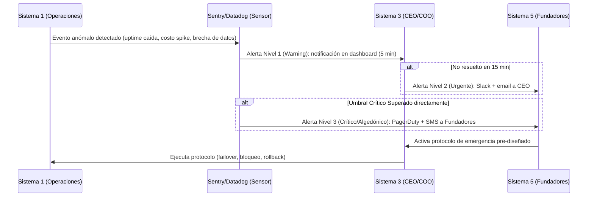

# 4_coherencia_y_control

> **Validación Cap. 2 (Pérez Ríos/Beer):** Esta es la fase de cierre del método. Su objetivo es asegurar que la **coherencia y la unidad estructural** existan a través de *todos* los niveles de recursión de Synapta: que la identidad definida en S5 llegue intacta hasta las operaciones del S1 más específico, y que los planes estratégicos del S4 de diferentes niveles no se contradigan entre sí. También se diseñan los canales de emergencia algedónicos y los 6 canales de control cibernético que sostienen el equilibrio dinámico.

---

## 1. Articulación Vertical–Horizontal en la Fase 4

El Cap. 2 explica que la coherencia opera en dos ejes:

- **Eje Vertical (entre niveles):** Synapta (Nivel 0) → Ingeniería, Ventas B2C, Ventas B2B, Soporte (Nivel 1). La coherencia vertical asegura que lo que se decide en el Nivel 0 (identidad, estrategia, presupuesto) se traduzca correctamente en el Nivel 1 sin distorsiones.
- **Eje Horizontal (dentro del sistema en foco):** La coherencia horizontal asegura que los S5, S4 y S3 dentro del mismo nivel operen de forma articulada (Homeostato S4-S3 y equilibrio S5-S4-S3).

La Fase 4 verifica que ambos ejes estén activos y sin bloqueos.

---

## 2. Coherencia de Políticas e Identidad (Sistema 5)

### 2.1 Cadena de Transmisión de Identidad (Vertical Descendente)

El Cap. 2 establece que los S5 de los distintos niveles forman una **cadena de transmisión y validación de la identidad corporativa**. Para Synapta:

| Nivel | S5 Responsable | Traducción de la Identidad Corporativa |
| :--- | :--- | :--- |
| **Nivel 0 (Corporativo)** | Junta de Fundadores / CEO | *"Markdown libre, privacidad del usuario, IA como amplificador — no como sustituto del pensamiento propio."* |
| **Nivel 1.1 (Ingeniería)** | CTO (S5 local) | *"Toda la arquitectura debe soportar modo on-premise sin dependencia cloud obligatoria. Las funcionalidades de IA no pueden enviar datos del usuario a terceros sin consentimiento explícito."* |
| **Nivel 1.2a (B2C)** | Head of Growth (S5 local) | *"Nunca vender como característica algo que no exista en producción. No usar dark patterns en el funnel de conversión."* |
| **Nivel 1.2b (B2B)** | Head of Sales (S5 local) | *"Los contratos institucionales no pueden incluir cláusulas de cesión de datos de estudiantes a la universidad sin consentimiento individual."* |
| **Nivel 1.3 (Soporte/Infra)** | Head of CS + DevOps Lead (S5 local) | *"En ninguna circunstancia se puede acceder al contenido privado de los mazos de un usuario para diagnosticar un bug sin su autorización explícita."* |

**Responsable de mantener la cadena activa:** CEO (como emisor principal) + Head of People (RRHH) para incorporar los valores en los procesos de onboarding de nuevos empleados.

**Procedimiento de verificación:** Cada director local completa un **checklist de coherencia de identidad** trimestral en el que documenta cómo una decisión operativa reciente reafirmó o tensionó los valores corporativos, con revisión por el CEO.

**Patología que se previene:** *"Representación inadecuada frente a niveles superiores"* (Cap. 2) — cuando los directores locales actúan ignorando la identidad corporativa, generando una organización con múltiples identidades contradictorias.

---

### 2.2 Alineación Ascendente (Vertical hacia arriba)

La coherencia no es solo top-down. El Cap. 2 señala que los S5 locales también deben poder influir en la identidad global a medida que sus experiencias operativas revelan tensiones o necesidades no anticipadas:

- **Mecanismo:** Los directores locales pueden elevar al Consejo Directivo (S5 global) propuestas de ajuste de política mediante el *Comité de Identidad y Ética Trimestral*. Por ejemplo: si el equipo de Ventas B2B detecta que varias universidades requieren funcionalidades que implican revisar el principio de privacidad, ese caso se eleva al S5 global para una decisión de política, no se resuelve unilateralmente.

---

## 3. Coherencia de Estrategias (Sistema 4)

### 3.1 Verificación de Compatibilidad entre S4 de Niveles

El Cap. 2 declara que es una *"necesidad absoluta"* verificar que los cambios estratégicos planificados en un nivel sean **totalmente compatibles** con los de los demás. Para Synapta:

| Pareja de S4 | Posible Contradicción | Mecanismo de Coherencia |
| :--- | :--- | :--- |
| **S4 Ingeniería ↔ S4 Ventas B2B** | Ingeniería planifica migrar a SLMs locales (reduciendo costos cloud), pero Ventas B2B tiene ya contratos firmados que prometen el 99.9% de uptime cloud. | Reunión mensual del *Comité Tecnológico-Comercial* (CTO + Head of Sales + CEO) donde los roadmaps se cruzan antes de comprometerse externamente. |
| **S4 Ventas B2C ↔ S4 Ventas B2B** | B2C planifica un modelo Freemium que ofrezca todo el poder RAG gratis, mientras B2B vende ese mismo poder como diferenciador de precio premium. | El CFO actúa como árbitro de pricing: los planes de adquisición B2C y la propuesta de valor B2B deben ser revisados juntos en el presupuesto trimestral. |
| **S4 Corporativo ↔ S4 Unidades** | La dirección estratégica decide internacionalizar a Colombia en Q2, pero Soporte/Infra no tiene capacidad para dar SLA a otro mercado hasta Q4. | El S4 corporativo *consulta* los modelos de capacidad del S4 de Infra antes de comprometer fechas de expansión. Los outputs del S4 de Infra son *inputs* del plan corporativo (principio de modelos anidados del Cap. 2). |

**Responsables de la verificación de coherencia estratégica:**

| Proceso | Responsable |
| :--- | :--- |
| Comité Tecnológico-Comercial mensual | CEO (moderador) + CTO + Head of Sales + CFO |
| Revisión de compatibilidad de roadmaps | CTO (tecnología) + Head of Growth (mercado) |
| Simulaciones financieras de escenarios | CFO |
| Revisión legal de compromisos estratégicos | Asesor Legal |

---

## 4. El Canal Algedónico (Algedonic Loop) — Sistema de Alarma de Viabilidad

El canal algedónico transmite señales de emergencia desde donde surge la crisis (normalmente S1 o el entorno captado por S4) **directamente hasta S5**, puenteando la jerarquía normal para garantizar una respuesta inmediata.

### 4.1 Variables Críticas, Sensores y Umbrales

| Variable | Sensor | Responsable del Sensor | Umbral Nivel 1 (Warning) | Umbral Nivel 2 (Urgente) | Umbral Nivel 3 (Crítico/Algedónico) |
| :--- | :--- | :--- | :--- | :--- | :--- |
| **Disponibilidad del servicio** | Datadog / UptimeRobot | DevOps Lead | < 99.8% por 5 min | < 99.5% por 15 min | < 99.0% por 30 min |
| **Costos de API cloud** | Consola GCP / OpenAI billing alerts | CTO | +15% del presupuesto diario | +25% del presupuesto diario | +35% del presupuesto diario |
| **Seguridad / brecha de datos** | Sentry + alertas de autenticación fallida | DevOps Lead + Asesor Legal | 3+ intentos de acceso fallidos en 1 min desde misma IP | Detección de patrón de exfiltración de datos | Cualquier acceso no autorizado a datos de usuarios confirmado |
| **Pérdida masiva de usuarios** | PostHog / GA4 | Head of Growth | Churn rate >5% en una semana | Churn rate >10% en una semana | Churn rate >20% en una semana o cancela una cuenta B2B grande |

> **Justificación del diseño de respuesta inmediata:** Según el *IBM Cost of a Data Breach Report 2025*, el promedio global para identificar y contener una brecha de datos es de **241 días** *(IBM Security, 2025)* [1]. Para Synapta, ese plazo representaría una destrucción irreversible de la confianza de sus usuarios. El canal algedónico reduce ese tiempo a **< 10 minutos**, mediante sensores automatizados y protocolos pre-diseñados que no requieren decisiones lentas en el momento de la crisis.

### 4.2 Protocolos de Emergencia Pre-diseñados

El Cap. 2 enfatiza que en una crisis vital no hay tiempo para deliberar — los protocolos deben estar listos antes:

| Crisis | Protocolo | Responsable de Ejecución |
| :--- | :--- | :--- |
| **Brecha de datos** | 1. Bloqueo automático de sesiones afectadas. 2. Revocación de tokens de API en producción. 3. Activación de BD de respaldo en modo lectura. 4. Notificación a usuarios afectados (Ley N° 29733). | DevOps Lead (ejecución) + CEO y Asesor Legal (notificación regulatoria) |
| **Caída de API cloud principal** | Transición automatizada del motor RAG a SLM local (offline-first). Los usuarios con conexión degradada ven modo reducido, no error fatal. | DevOps Lead + CTO (supervisión) |
| **Caída total de servidores** | Activación del proveedor de cloud de respaldo (multi-región). Notificación a usuarios B2B con SLA activos en < 15 minutos. | DevOps Lead + Head of CS (comunicación a cuentas B2B) |
| **Pérdida masiva de usuarios B2B** | Convocatoria inmediata de reunión ejecutiva (CEO + Head of Sales + CFO) para evaluar causa raíz y plan de retención. | CEO (convocante) + Head of Sales (diagnóstico) |

---

## 5. Los 6 Canales de Control Cibernético Vertical

El Cap. 2 define 6 canales verticales que articulan la relación entre el metasistema y las operaciones, garantizando el equilibrio homeostático de la organización:

| Canal | Nombre | Descripción en Synapta | Responsable Emisor | Responsable Receptor |
| :--- | :--- | :--- | :--- | :--- |
| **C1** | Absorción del entorno | Interacción de cada unidad con su entorno específico. Ingeniería absorbe la variedad técnica (APIs, bugs, cambios de librerías); Ventas B2C absorbe la variedad del mercado digital; B2B absorbe la variedad institucional. | Directores locales de cada unidad | S3 corporativo (recibe señales agregadas) |
| **C2** | Interacciones de procesos | Interacciones directas entre unidades: bugs de producción que Soporte escala a Ingeniería; requisitos técnicos que Ventas B2B pasa a Ingeniería para negociar. | Director local origen | Director local destino |
| **C3** | Intervención corporativa | Instrucciones, directrices y políticas que el S3 corporativo (CEO/COO) envía a los directores locales. No microgestión — solo lineamientos de alto nivel. | CEO / COO | Directores locales de S1 |
| **C4** | Negociación de recursos | Canal de rendición de cuentas y asignación de recursos entre el S3 corporativo y las unidades: presupuesto de APIs, headcount, pauta publicitaria. | Directores locales de S1 (reportan) ↔ CFO + CEO (asignan) | CFO + CEO |
| **C5** | Coordinación antioscilatoria | Gobernado por el S2 corporativo. Sincroniza entregas, calendarios de release y sizing entre unidades para evitar conflictos. | S2 Corporativo (CEO/COO como árbitro + procesos formales) | Todas las unidades del S1 |
| **C6** | Auditoría (S3*) | Canal de monitoreo esporádico y directo que el S3* usa para verificar la realidad operativa sin filtros jerárquicos. | CTO / CFO / Head of CS (auditores) | S3 corporativo (CEO/COO recibe resultados) |

### 5.1 Análisis del Canal 4 (C4): Los 8 Componentes de Transducción

El Cap. 2 exige que cada canal sea estructurado con 8 componentes de comunicación para evitar distorsión del mensaje. Se detalla el Canal 4 (Negociación de Recursos) como ejemplo completo:

**Circuito de Ida — Reporte de Ingeniería a Dirección:**
1. **Emisor:** CTO (Líder de Ingeniería).
2. **Transductor de entrada:** Jira / GitHub Projects traduce entregables de software a indicadores cuantitativos (velocidad en puntos de historia, incidentes de API, deuda técnica en horas).
3. **Canal:** Reunión semanal de Sprint Review + dashboard compartido en Notion.
4. **Transductor de salida:** Reporte ejecutivo en lenguaje no técnico: *"Se completaron 48/50 puntos. 2 incidentes de API con costo adicional de $120. Se necesita aumentar cuota de API en $500/mes para el próximo sprint."*
5. **Receptor:** CEO / COO (S3 corporativo).

**Circuito de Retorno — Respuesta de Dirección a Ingeniería:**
6. **Emisor:** CFO + CEO.
7. **Transductor:** Documento de Presupuesto Mensual actualizado con el ajuste de $500 aprobado + metas de velocidad para el siguiente sprint.
8. **Receptor:** CTO confirma la recepción del presupuesto ajustado y actualiza el backlog. El bucle homeostático se cierra.

> **Por qué los 8 componentes importan:** Si el transductor de entrada (paso 2) no existe (Ingeniería reporta en lenguaje técnico crudo), el CEO/CFO no puede decodificar la información y el canal de negociación se bloquea — una de las patologías de comunicación más frecuentes en startups tecnológicos.

---

## Fuentes Citadas

| # | Fuente | Dato utilizado |
| :--- | :--- | :--- |
| [1] | IBM Security (2025). *Cost of a Data Breach Report 2025* | Promedio global de 241 días para identificar y contener una brecha de datos |
