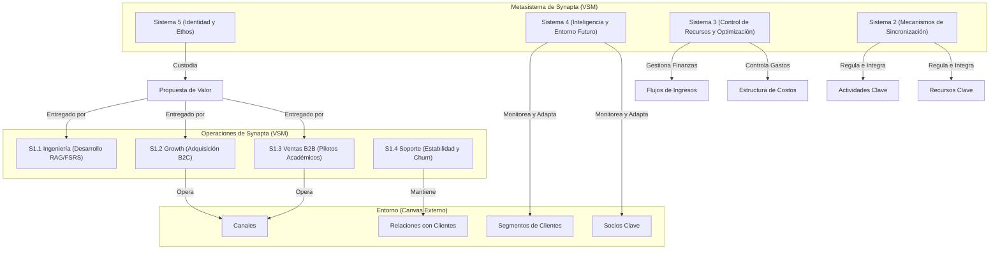

# 8_modelo_canvas_synapta

> **Validación Metodológica (Alexander Osterwalder / José Pérez Ríos):** El Modelo Canvas de Negocios (Business Model Canvas - BMC) describe la lógica de cómo Synapta crea, entrega y captura valor. Para mantener la coherencia cibernética con el Modelo del Sistema Viable (MSV), este lienzo no se trata como un documento estático, sino como la estructura de variedad externa que el metasistema (S4 y S5) debe monitorear y regular continuamente para asegurar la viabilidad de la organización.

## Tabla de Contenidos

- [1. El Lienzo del Modelo de Negocios (Visual Grid)](#1-el-lienzo-del-modelo-de-negocios-visual-grid)
- [2. Desglose Detallado de los 9 Bloques](#2-desglose-detallado-de-los-9-bloques)
  - [2.1 Segmentos de Clientes (Customer Segments)](#21-segmentos-de-clientes-customer-segments)
  - [2.2 Propuesta de Valor (Value Propositions)](#22-propuesta-de-valor-value-propositions)
  - [2.3 Canales (Channels)](#23-canales-channels)
  - [2.4 Relación con Clientes (Customer Relationships)](#24-relacion-con-clientes-customer-relationships)
  - [2.5 Flujos de Ingresos (Revenue Streams)](#25-flujos-de-ingresos-revenue-streams)
  - [2.6 Recursos Clave (Key Resources)](#26-recursos-clave-key-resources)
  - [2.7 Actividades Clave (Key Activities)](#27-actividades-clave-key-activities)
  - [2.8 Socios Clave (Key Partners)](#28-socios-clave-key-partners)
  - [2.9 Estructura de Costos (Cost Structure)](#29-estructura-de-costos-cost-structure)
- [3. Mapeo de Alineación Cibernética (Canvas ◄──► MSV)](#3-mapeo-de-alineacion-cibernetica-canvas-msv)
  - [3.1 Mapeo de Bloques al MSV](#31-mapeo-de-bloques-al-msv)
- [4. Buenas Prácticas Aplicadas en el Canvas de Synapta](#4-buenas-practicas-aplicadas-en-el-canvas-de-synapta)
- [Fuentes Citadas](#fuentes-citadas)

---

---

## 1. El Lienzo del Modelo de Negocios (Visual Grid)

El siguiente tablero resume los 9 bloques del modelo de negocio de Synapta y su producto principal, **YachaqAI**:

| **Socios Clave (Key Partners)** | **Actividades Clave (Key Activities)** | **Propuestas de Valor (Value Propositions)** | **Relación con Clientes (Customer Relationships)** | **Segmentos de Clientes (Customer Segments)** |
| :--- | :--- | :--- | :--- | :--- |
| • **Proveedores de IA y Nube:** Google Cloud Platform (Gemini 1.5/2.5 Flash), Supabase, y Vercel. • **Universidades SUNEDU:** Decanos e investigadores de universidades licenciadas en el Perú (socios de validación). • **Asesoría Legal Externa:** Diseño de cumplimiento normativo (Ley N° 29733 de Datos Personales). | • **Desarrollo de Software:** Optimización del motor RAG, parser estructurado y sincronización Markdown. • **Calibración FSRS:** Ajuste continuo del algoritmo de repetición espaciada en base a telemetría de estudio. • **Venta Consultiva B2B:** Demostración y personalización para decanos académicos. | **Para Estudiantes (B2C):** • Conversión automática de apuntes estáticos (PDFs) a grafos interactivos de estudio. • Mitigación sistemática de la curva de olvido (repetición espaciada FSRS). • Privacidad total y portabilidad (exportación Markdown limpia).  **Para Universidades (B2B):** • Dashboard de analítica predictiva de retención de alumnos. • Integración fluida con LMS (Moodle, Canvas). | **B2C (Bajo Contacto / Automatizado):** • Autoservicio (Self-Service) mediante onboarding digital interactivo. • Soporte de autoservicio guiado por IA. • Comunidad de aprendizaje y soporte en Discord.  **B2B (Alto Contacto / Consultivo):** • Relación comercial directa y consultiva de largo plazo. • Soporte dedicado (SLA interno). | **Estudiantes Universitarios (B2C):** • Estudiantes de carreras de alta densidad de información (Medicina, Derecho, Ingeniería, Posgrados) en Perú que requieren optimizar su retención de información.  **Docentes y Universidades (B2B):** • Instituciones de educación superior licenciadas por SUNEDU interesadas en reducir la tasa de deserción del primer año (27% promedio en LATAM). |
| | **Recursos Clave (Key Resources)** | | **Canales (Channels)** | |
| | • **Tecnológicos:** Algoritmo FSRS calibrado, motor propietario de estructuración de apuntes, bases de datos vectoriales. • **Humanos:** Equipo de fundadores y desarrolladores (dedicación mixta inicial). | | • **B2C (Orgánico y Viral):** Compartición de mazos de estudio entre estudiantes en aula (viralidad natural). • **B2B (Venta Directa):** Pipeline comercial estructurado en CRM HubSpot. • **Comunidad:** Canal Discord oficial. | |
| **Estructura de Costos (Cost Structure)** | | **Flujos de Ingresos (Revenue Streams)** | | |
| • **Costos de Cómputo e IA (Variables):** Consumo de APIs de Gemini y LlamaParse por prompt/documento. • **Infraestructura Cloud (Fijos/Semi-variables):** Hosting en Vercel y base de datos Supabase. • **Costo de Adquisición de Clientes (CAC):** Pauta digital B2C de bajo presupuesto y viáticos de demostración B2B. • **Cumplimiento y Legal Outsourcing:** Honorarios por auditoría y contratos. | | • **Suscripción Freemium B2C:** Acceso básico gratuito a YachaqAI (con límites mensuales de tokens de IA). Suscripción mensual premium para uso ilimitado de prompts RAG. • **Licenciamiento SaaS B2B:** Licencia de software institucional anual cobrada por volumen de estudiantes y profesores integrados en la facultad. | | |

---

## 2. Desglose Detallado de los 9 Bloques

### 2.1 Segmentos de Clientes (Customer Segments)
Synapta opera en un mercado híbrido (B2C y B2B) en el sector EdTech de Perú y Latinoamérica:
*   **Segmento B2C (Estudiantes Individuales):** Estudiantes universitarios de pregrado y posgrado matriculados en universidades licenciadas (mercado potencial de más de 1.2 millones de alumnos en Perú [4]). El foco inicial son carreras de alta densidad de memoria (Medicina, Derecho, Ingeniería de Sistemas, Ciencias de la Salud), donde la pérdida de información diaria por la curva de Ebbinghaus [6] genera un dolor crítico inmediato.
*   **Segmento B2B (Institucional):** Decanos de facultades, directores de carrera y oficinas de bienestar estudiantil en las 105 universidades licenciadas por SUNEDU [3]. Su dolor principal es la tasa de deserción de estudiantes de primer año (que ronda el 27% en LATAM [2]), el cual afecta directamente su licenciamiento y reputación institucional.

### 2.2 Propuesta de Valor (Value Propositions)
*   **Propuesta de Valor B2C (YachaqAI para Estudiantes):**
    *   *Estudio Automatizado:* Elimina el esfuerzo de crear tarjetas de repaso (flashcards) o resúmenes manuales; la IA procesa diapositivas y PDFs de clase para convertirlos en grafos interactivos de Markdown estructurado de manera instantánea.
    *   *Retención Óptima Sostenible:* Aplicación científica del algoritmo FSRS (Free Spaced Repetition Scheduler) para programar repasos personalizados en el momento exacto antes de olvidar, garantizando una retención a largo plazo.
    *   *Privacidad y Portabilidad:* Respeto absoluto a los datos del alumno. La información se puede exportar limpiamente a repositorios Markdown portables (compatibles con editores de texto plano locales), sin retención cautiva de información (Anti-Vendor Lock-in).
*   **Propuesta de Valor B2B (YachaqAI Institucional):**
    *   *Monitoreo de Retención Colectiva:* Provee a las autoridades académicas datos agregados (anonimizados) sobre los conceptos y temas que más dificultad causan a los estudiantes en las evaluaciones semanales.
    *   *Prevención Temprana de la Deserción:* Indicadores analíticos en tiempo real que permiten a los tutores intervenir antes de que el estudiante repruebe las asignaturas troncales.

### 2.3 Canales (Channels)
*   **B2C - Canal de Adquisición Viral:** Funciones de red nativas dentro del producto (como "Compartir Mazo con mi Compañero" y "Compartir Apunte del Curso"). Esto crea un bucle de recomendación pull en el aula universitaria sin requerir presupuestos de marketing masivos.
*   **B2B - Canal de Venta Directa:** Contacto directo y consultoría con autoridades académicas. Se gestiona y monitorea a través de HubSpot CRM, clasificando las etapas de los pilotos institucionales desde el primer contacto hasta el cierre de la licencia anual.
*   **Canal de Retención y Soporte:** Servidor de Discord de la comunidad para la recolección de feedback, bugs y propuestas de características por parte de los usuarios activos.

### 2.4 Relación con Clientes (Customer Relationships)
*   **Autoservicio Automatizado (B2C):** Diseñado para requerir la mínima intervención humana. El onboarding es 100% interactivo guiado por un bot de asistencia en la interfaz de YachaqAI.
*   **Comunidad de Co-creación (B2C):** Moderación activa en Discord donde los estudiantes comparten mazos públicos de asignaturas específicas, creando un ecosistema de soporte comunitario.
*   **Relación Consultiva Dedicada (B2B):** Contacto directo entre el Head of Sales y las autoridades universitarias. Se ofrece soporte a nivel de Acuerdo de Nivel de Servicio (SLA) para garantizar la disponibilidad técnica y capacitaciones periódicas a los docentes.

### 2.5 Flujos de Ingresos (Revenue Streams)
*   **Suscripción Mensual/Anual B2C (SaaS):**
    *   *Tier Gratuito:* Permite cargar hasta 3 documentos al mes y realizar 50 consultas de IA (RAG).
    *   *Tier Premium (S/. 15 - S/. 25 mensuales):* Consultas ilimitadas de IA, almacenamiento extendido de apuntes en la nube y sincronización avanzada en tiempo real con gestores de conocimiento locales.
*   **Licenciamiento SaaS B2B (Institucional):**
    *   Suscripción anual cobrada por volumen de estudiantes matriculados en la facultad. Incluye la integración con el LMS de la universidad (Canvas/Moodle) y acceso al panel analítico de retención para docentes.

### 2.6 Recursos Clave (Key Resources)
*   **Algoritmo FSRS de Repetición Espaciada:** Calibrado específicamente para la estructura de grafos de conocimiento de YachaqAI.
*   **Infraestructura de Datos y Conectores:** Pipelines de procesamiento RAG optimizados y conectores automáticos de base de datos PostgreSQL en Supabase.
*   **Recurso Humano y Know-How:** Dedicación y experiencia técnica del equipo fundador (CTO, CEO, CFO con dedicación a tiempo parcial inicial [9]).

### 2.7 Actividades Clave (Key Activities)
*   **Desarrollo Técnico y DevOps:** Mantenimiento de la estabilidad del sistema (Uptime ≥ 99% [13]), refinamiento del parser de PDFs y reducción de latencias del motor de IA.
*   **Operaciones y Gestión de Sprints (S2/S3):** Planificación semanal y asignación de recursos basada en el Release Calendar técnico.
*   **Venta Institucional y Demostración:** Ejecución de demos personalizadas para decanos de universidades y seguimiento de contratos de pilotos B2B.

### 2.8 Socios Clave (Key Partners)
*   **Proveedores Cloud y de Modelos Fundacionales:** Google Cloud Platform ( Vertex AI para acceso prioritario a Gemini [10]) como proveedor tecnológico neurálgico.
*   **Decanos y Docentes Pioneros (Early Adopters):** Autoridades de universidades peruanas licenciadas que actúan como patrocinadores del software en sus aulas y validan las hipótesis de valor académico.
*   **Asesoría Legal Externa (Outsourced):** Firma legal peruana encargada de estructurar el cumplimiento de la Ley N° 29733 de Datos Personales, permitiendo el despliegue legal en el ámbito educativo.

### 2.9 Estructura de Costos (Cost Structure)
*   **Costo de APIs de Procesamiento de IA (Variable):** Pagos por volumen de tokens procesados en Gemini 1.5/2.5 Flash y páginas analizadas en LlamaParse.
*   **Hosting e Infraestructura Cloud (Fijo/Semi-variable):** Base de datos PostgreSQL en Supabase y alojamiento web frontend en Vercel.
*   **Costos Comerciales (CAC):** Buffer mensual de pauta digital B2C (S/. 50/mes inicial) y viáticos de demostración comercial B2B (S/. 50/mes) [8].
*   **Costos Operativos Legales:** Honorarios del servicio outsourced de asesoría legal para auditorías de cumplimiento normativo.

---

## 3. Mapeo de Alineación Cibernética (Canvas ◄──► MSV)

Para garantizar la viabilidad organizacional de Synapta, los 9 bloques del Canvas de Negocios se conectan directamente con los 5 Sistemas de Control del **Modelo del Sistema Viable (MSV)** diseñados previamente:

### 3.1 Mapeo de Bloques al MSV
1.  **Propuesta de Valor ◄──► Sistema 5 (Políticas e Identidad):** La propuesta de valor (e.g., privacidad absoluta, no monetización de datos del estudiante, la IA como amplificador cognitivo y no como sustituto) es el reflejo del *ethos* y las políticas de identidad definidas por la Junta de Fundadores (Sistema 5) [7].
2.  **Segmentos de Clientes y Socios Clave ◄──► Sistema 4 (Inteligencia):** El Sistema 4 monitorea el entorno externo y el mercado educativo futuro (SUNEDU, CAGR de EdTech, competidores como NotebookLM) para detectar cuándo los Segmentos de Clientes o los Socios Clave requieren una adaptación estratégica. Utiliza para ello el **Modelo M5 (Penetración de Mercado y Regulaciones EdTech Perú)**.
3.  **Flujos de Ingresos y Costos ◄──► Sistema 3 (Control y Gestión Interna):** El Sistema 3 (CFO y CEO) gestiona la eficiencia del "aquí y ahora". Controla los costos variables de APIs de Gemini y LlamaParse apoyándose en el **Modelo M1 (Optimización de Presupuesto de APIs)** para asegurar que el tier gratuito B2C no agote los recursos de caja de la startup.
4.  **Actividades Clave y Recursos Clave ◄──► Sistema 2 (Coordinación y S2 Local):** El Sistema 2 (mecanismos de sincronización horizontal como GitHub workflows, CRM HubSpot y runbooks automáticos) coordina las Actividades Clave del desarrollo técnico y los Recursos Clave de infraestructura, evitando roces y oscilaciones entre el equipo de desarrollo (S1.1) y soporte (S1.4).
5.  **Canales y Relación con Clientes ◄──► Sistema 1 (Unidades Operativas):**
    *   **Canal 1 (C1):** Regula las interacciones directas de las unidades operativas con su entorno. El equipo de Growth (**S1.2**) opera los canales B2C y la comunidad Discord; el equipo de Ventas B2B (**S1.3**) gestiona las relaciones con decanos y docentes; el equipo de Soporte (**S1.4**) gestiona el Uptime y la tasa de cancelaciones (churn).

---

## 4. Buenas Prácticas Aplicadas en el Canvas de Synapta

1.  **Diferenciación Clara de Segmentos Híbridos:** En lugar de mezclar canales y propuestas de valor, el lienzo separa de forma explícita las metas de los estudiantes (B2C: velocidad, retención y portabilidad) frente a las metas institucionales (B2B: retención de alumnos y acreditación de calidad bajo estándares SUNEDU).
2.  **Enfoque Cuantitativo Realista (Fase 1):** Las asignaciones de costos y flujos financieros reflejan el presupuesto operativo del MVP real de YachaqAI (presupuesto inicial de S/. 150 - S/. 500/mes de caja, y costo de API Gemini estimado con fuentes vigentes de cobro por millón de tokens [10]).
3.  **Evitación de Conceptos Genéricos:** En vez de colocar "Marketing" o "Desarrollo", se especifican actividades y recursos concretos como "viralidad del aula al compartir apuntes", "calibración FSRS", e "integración RAG con base de datos Supabase".
4.  **Consistencia de Relaciones:** Se asegura que el segmento B2C (gran volumen, bajo ticket) sea gestionado con relaciones automatizadas de autoservicio (self-service) y soporte comunitario en Discord para evitar la hipertrofia de soporte. Por el contrario, el segmento B2B (bajo volumen, alto ticket) se vincula a relaciones consultivas de alta fidelización y SLAs de soporte formalizados.

---

## Fuentes Citadas

| # | Fuente | Detalle y Uso de Métrica / Justificación |
| :--- | :--- | :--- |
| [1] | IMARC Group (2025). *Latin America EdTech Market Size, Industry Growth & Forecast 2026–2034*. | Proyección de CAGR de 11.8%–12.5% y valoración del mercado EdTech de USD $11,400M–$18,300M. |
| [2] | Scielo / Revistas académicas (2023). *Deserción estudiantil en universidades latinoamericanas*. | Justificación de la tasa promedio del ~27% de abandono estudiantil en primer año de educación superior. |
| [3] | SUNEDU (2026). *Listado de universidades con licencia institucional vigente*. | Justificación de las 105 universidades licenciadas en el Perú como mercado meta institucional. |
| [4] | SUNEDU – Sistema de Información Universitaria (2023/2024). | Justificación del mercado objetivo inicial B2C (~1.2 millones de estudiantes matriculados en Perú). |
| [5] | Pérez Ríos, José (2008). *Diseño de organizaciones viables: Un enfoque sistémico*. | Principios metodológicos de acoplamiento de entorno, regulación y prevención de patologías organizativas. |
| [6] | Ebbinghaus, Hermann (1885). *Memory: A Contribution to Experimental Psychology*. | Curva del olvido (pérdida de ~70% de información nueva sin repaso activo en 24h) para justificar el dolor B2C. |
| [7] | Beer, Stafford (1985). *Diagnosing the System for Organizations*. John Wiley & Sons. | Fundamento de los Sistemas 1 a 5 y los bucles de transducción. |
| [8] | StartupPeru / PROINNOVATE (2023). *Guía de Presupuestos y Pilotos de Validación en Startups Pre-Seed*. | Justificación del presupuesto operativo inicial pre-seed de S/. 150 - S/. 500/mes de caja y viáticos. |
| [9] | NCIIA (2019). *Student Venture Team Size and Commitment Standards*. | Justificación de la distribución de roles a tiempo parcial/dedicación mixta en equipos de 2-5 personas. |
| [10] | Google Cloud (2026). *Vertex AI / Gemini API Pricing Page*. | Tarifas oficiales por volumen de tokens para costeo variable de prompts de Gemini 1.5/2.5 Flash. |
| [11] | Vercel (2026). *Pricing and Plan Limits*. | Justificación de hosting serverless para el frontend. |
| [12] | Supabase (2026). *Pricing Plans & Platform Limits*. | Justificación de hosting PostgreSQL de base de datos. |
| [13] | Beyer, B., Jones, C., Petoff, J., & Murphy, K. (2016). *Site Reliability Engineering: How Google Runs Production Systems*. | Calibración de metas de Uptime de servicio (SLO ≥ 99.0%). |
| [14] | Zendesk (2024). *Customer Experience Trends Report*. | Benchmark de soporte para tiempos de resolución de incidencias en SaaS (≤ 24h). |