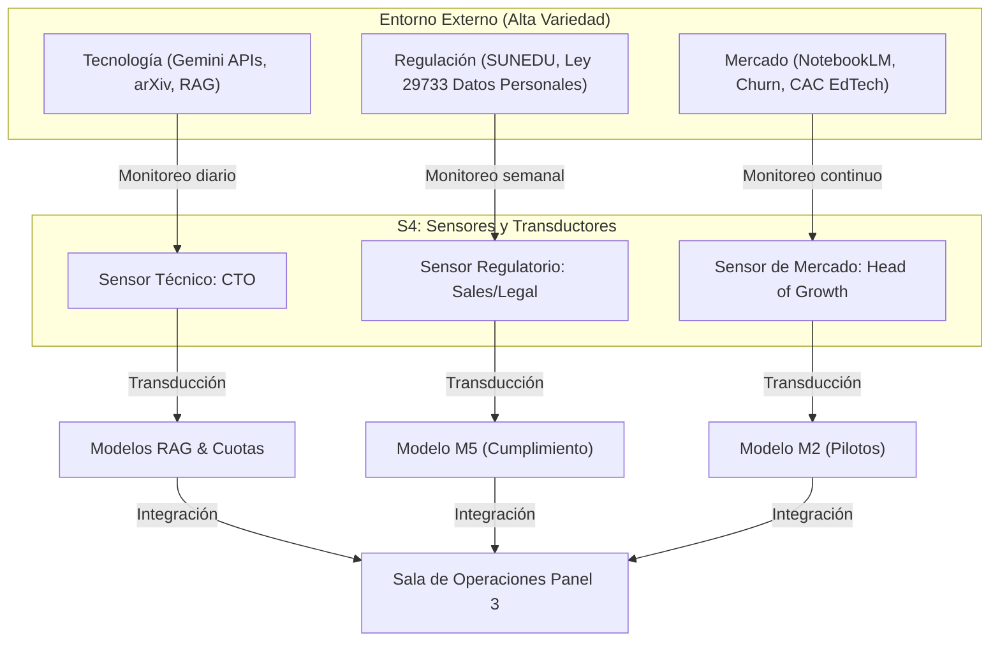

> **Validación Cap. 2 (Pérez Ríos/Beer):** Esta fase corresponde al diseño del **Sistema 4 (Inteligencia)**. Su propósito es estructurar la capacidad adaptativa de Synapta enfocándose en el **"afuera y el mañana"** [1], [2]. El S4 actúa como el sensor de variedad externa y modelador prospectivo de la organización, asegurando que la startup se anticipe a disrupciones tecnológicas, regulatorias y de mercado antes de que afecten la viabilidad del presente (gobernado por el S3) [2], [5].

---

## Tabla de Contenidos

- [Parte 1: Fundamentación y Captura de Variedad Externa](#parte-1-fundamentacion-y-captura-de-variedad-externa)
  - [1. Introducción al diseño del Sistema 4](#1-introduccion-al-diseno-del-sistema-4)
  - [2. Fundamentación de la necesidad del Sistema 4 (justificación basada en los límites de S3)](#2-fundamentacion-de-la-necesidad-del-sistema-4-justificacion-basada-en-los-limites-de-s3)
  - [3. Diseño del sistema de vigilancia del entorno](#3-diseno-del-sistema-de-vigilancia-del-entorno)
- [Parte 2: Modelado y Proyección Sistemática](#parte-2-modelado-y-proyeccion-sistematica)
  - [4. Diseño del sistema de inteligencia estratégica](#4-diseno-del-sistema-de-inteligencia-estrategica)
  - [5. Diseño del sistema de prospectiva y escenarios](#5-diseno-del-sistema-de-prospectiva-y-escenarios)
- [Fuentes Citadas](#fuentes-citadas)

---

## Parte 1: Fundamentación y Captura de Variedad Externa

### 1. Introducción al diseño del Sistema 4
El **Sistema 4 (Inteligencia)** de Synapta es el órgano responsable de la **adaptación continua** [1]. Su foco de atención no es el funcionamiento cotidiano del "aquí y ahora", sino la exploración del "allá y entonces" (los cambios tecnológicos en Inteligencia Artificial, las regulaciones del sistema educativo peruano y la evolución del mercado de EdTech en Latinoamérica) [3], [5]. 

En Synapta, el S4 tiene como misión capturar la complejidad y variedad del entorno futuro, procesarla y traducirla en alternativas estratégicas para que la Junta de Fundadores (S5) y la Dirección Operativa (S3) puedan tomar decisiones informadas [2], [5]. Físicamente, en las fases iniciales de la startup (Fase 1: MVP de 2-5 personas [9]), el S4 se implementa de manera **multiactiva** (donde los fundadores asumen temporalmente roles de Inteligencia al monitorear sus respectivas áreas) y se apoya en una **Sala de Operaciones Virtual** y en **Modelos de Simulación (M2 y M5)** para proyectar escenarios de viabilidad [2], [8].

---

### 2. Fundamentación de la necesidad del Sistema 4 (justificación basada en los límites de S3)
El **Sistema 3 (Gestión Operativa)** está diseñado para optimizar y dar cohesión a las operaciones actuales del Sistema 1 (Ingeniería, Growth, Ventas y Soporte) [1]. Sin embargo, el S3 tiene límites estructurales y de capacidad cognitiva que hacen indispensable la existencia de un Sistema 4 independiente:

1.  **Sobrecarga Cognitiva (Ley de Miller):** El S3 (liderado por el CEO/CFO) monitorea indicadores de desempeño semanales, cuotas de gasto de APIs en tiempo real y la resolución de incidentes de soporte [8], [17]. Según la Ley de Miller, la capacidad de procesamiento de un tomador de decisiones está limitada a $7 \pm 2$ fragmentos de información concurrentes [10]. Si el S3 también asumiera la vigilancia diaria de papers de investigación en IA, variaciones de precios de proveedores, competidores y cambios regulatorios de SUNEDU, colapsaría bajo la variedad del entorno, cayendo en la patología de la **Hipertrofia del S3** (microgestión desestructurada) [5].
2.  **Esquizofrenia de la Gestión (Conflicto Presente-Futuro):** Existe una tensión natural entre la estabilidad operativa (minimizar costos, estabilizar el código del sprint en S3) y la adaptación al cambio (migrar de infraestructura, adoptar nuevos LLMs en S4) [21]. Si el mismo sistema que controla el presupuesto diario (S3) decide sobre la adaptación futura (S4) sin un canal formal de debate, la urgencia de los problemas cotidianos siempre ahogará la planificación del mañana.
3.  **Atenuación de Variedad Externa:** El S4 funciona como un filtro estratégico. Absorbe y modela la complejidad del mercado y la tecnología *antes* de que golpee al S3. Sin este filtro, el metasistema operaría de forma puramente reactiva ante crisis, en lugar de actuar proactivamente mediante planes previamente diseñados [4], [7].

---

### 3. Diseño del sistema de vigilancia del entorno
Para vigilar el entorno EdTech en el Perú y LATAM, el S4 de Synapta implementa **radares estratégicos** compuestos por sensores y transductores específicos en tres áreas críticas:

#### 3.1 Radares Estratégicos de Vigilancia
1.  **Radar Tecnológico (IA y Arquitectura de Software):** Monitorea la relación costo/rendimiento de modelos fundacionales, APIs de parsers estructurados y algoritmos de repetición espaciada (SRS).
2.  **Radar Regulatorio e Institucional (SUNEDU y Privacidad):** Vigila las normativas sobre acreditación de programas híbridos/virtuales en Perú y las directivas de la Autoridad Nacional de Protección de Datos Personales (APDP).
3.  **Radar de Mercado y Competidores (EdTech):** Monitorea las estrategias de monetización y características de competidores directos/indirectos (NotebookLM, Anki, RemNote y otros gestores de notas locales).

#### 3.2 Matriz de Sensores y Transductores del S4

| Dimensión | Sensor (Responsable VSM) | Fuentes de Datos Primarias | Frecuencia | Transductor (Traducción de Variedad a Idioma Interno) |
| :--- | :--- | :--- | :--- | :--- |
| **Tecnológica** | CTO (Sensor S4 Técnico) | • Feeds de arXiv (sección cs.CL). • Vertex AI Pricing Console. • Logs de latencia y tokens en Supabase. | Diaria | Traduce métricas técnicas de contexto y tokens a costo financiero por usuario activo y velocidad de respuesta (ej. *"Gemini 2.5 Flash Lite reduce el costo variable en 30%"* [13]). |
| **Regulatoria** | Head of Sales + Asesor Legal Externo (Sensor S4 Regulatorio) | • Diario Oficial El Peruano. • Resoluciones del Consejo Directivo de SUNEDU. • Directivas de la APDP (Ley 29733). | Semanal | Traduce leyes y circulares administrativas a requisitos técnicos en el backlog de Ingeniería (ej. *"SUNEDU exige un portafolio de evidencias de estudio; se requiere exportar logs de repaso en PDF"* [3]). |
| **Mercado y Competencia** | Head of Growth (Sensor S4 de Mercado) | • Foros de EdTech Latam. • Google Alerts ("NotebookLM", "Anki"). • Onboarding feedback de YachaqAI. | Semanal | Traduce movimientos de competidores en hipótesis de producto y variaciones del CAC/LTV (ej. *"NotebookLM lanza versión escolar; debemos acelerar la exportación abierta Markdown para diferenciarnos"* [11]). |

---

## Parte 2: Modelado y Proyección Sistemática

### 4. Diseño del sistema de inteligencia estratégica
El sistema de inteligencia estratégica es el encargado de consolidar la información de los radares y procesarla dentro de un entorno de decisión interactivo: la **Sala de Operaciones Virtual** [17].

#### 4.1 La Sala de Operaciones - Panel 3 (Entorno Futuro)
El Panel 3 reside en Notion y Google Sheets, y sirve de interfaz directa para las sesiones de planificación estratégica del metasistema (S3, S4 y S5) [2], [5]. A diferencia de los Paneles 1 y 2 (enfocados en el control del presente), el Panel 3 visualiza y cruza tres tipos de información:
1.  **Tendencias Tecnológicas:** Costo proyectado de APIs de Gemini e infraestructura cloud frente al volumen estimado de usuarios para los próximos 12 meses [13], [14], [15].
2.  **Alertas Tempranas Regulatorias:** Semáforos de riesgo de cumplimiento normativo (ej. Verde = Todo en orden; Amarillo = SUNEDU evalúa cambios en acreditación virtual [3]; Rojo = APDP inicia inspección sectorial de EdTechs [22]).
3.  **Simulador de Escenarios Dinámicos:** Acceso directo a las interfaces de simulación de los modelos M2 y M5.

#### 4.2 El Bucle de Escalamiento Algedónico del S4
Si un sensor de S4 detecta una disrupción crítica en el entorno que amenaza la viabilidad general de la empresa (ej. una filtración del competidor que invalida nuestra ventaja técnica o un cambio de ley retroactivo), el S4 **puentea al S3** y gatilla una **Alerta Algedónica Estratégica** directa a la Junta de Fundadores (S5) utilizando el canal algedónico de comunicación de emergencia, convocando a una sesión de rediseño de identidad organizacional de manera inmediata [1], [18].

---

### 5. Diseño del sistema de prospectiva y escenarios
Para tomar decisiones basadas en datos y no en intuiciones subjetivas, el S4 de Synapta utiliza **Modelos de Simulación Dinámica** recomendados por José Pérez Ríos [2], [5]. Estos modelos permiten evaluar el impacto de variables externas a través de escenarios "qué pasaría si" (What-if) [2], [5].

#### 5.1 Modelo M2 (Impacto de Pérdida del Piloto B2B)
*   **Lógica del Modelo:** Evalúa la vulnerabilidad de la tracción inicial de YachaqAI frente al abandono o cancelación por parte de docentes clave en universidades peruanas [3].
*   **Variables de Entrada:**
    *   Tasa de recomendación docente en aula: `30%` (porcentaje de alumnos que usan la app por indicación de su profesor).
    *   Tasa de retención de esos estudiantes tras la salida del docente: `50%`.
    *   Semanas de retraso para captar un docente de reemplazo: `8 semanas` [11].
*   **Variables de Salida:**
    *   Caída proyectada de Usuarios Activos Semanales (WAU) el mes siguiente a la cancelación.
    *   Costo de Adquisición de Clientes (CAC) adicional necesario para compensar la caída con pauta B2C [8].
*   **Decisiones Pre-diseñadas (Acciones Correctivas):**
    *   *Si la proyección muestra caída de WAU > 20%:* Activar inmediatamente el **Protocolo C (Cancelación de Piloto)** en S1.3, disparando la plantilla de rescate y asumiendo manualmente la digitalización de sílabos para reducir el esfuerzo del docente [11].

#### 5.2 Modelo M5 (Penetración de Mercado y Regulaciones SUNEDU)
*   **Lógica del Modelo:** Simula a 5 años la sostenibilidad financiera de Synapta ante variaciones en el mercado de educación virtual en el Perú y restricciones del ente regulador [3].
*   **Variables de Entrada:**
    *   Matrícula total universitaria nacional: `1.2M` de estudiantes [4].
    *   Tasa anual de crecimiento de educación virtual: `8.5%` anual.
    *   Tasa anual de penetración proyectada de competidores EdTech: `5.0%`.
    *   Probabilidad de endurecimiento regulatorio de SUNEDU (ej. prohibir exámenes virtuales sin supervisión biométrica): `40%`.
*   **Variables de Salida:**
    *   Mercado Direccionable Útil (SOM) proyectado a 5 años.
    *   Volumen de licencias institucionales anuales requeridas para sostener el punto de equilibrio financiero.
*   **Decisiones Pre-diseñadas (Acciones Correctivas):**
    *   *Si la probabilidad de cambio regulatorio de SUNEDU supera el 60%:* S4 instruye al backlog de Ingeniería (S1.1) iniciar el desarrollo de un módulo de compatibilidad fuera de línea y exportador de evidencias de estudio en PDF para asegurar el cumplimiento normativo preventivo [3], [23].

---

### 5.3 Preparación ante Disrupciones Tecnológicas y de Mercado

Para asegurar la adaptabilidad, se pre-diseñan dos planes estratégicos ante disrupciones simuladas en el S4:

#### Disrupción A: Google NotebookLM lanza una versión corporativa gratuita para universidades SUNEDU
*   **Análisis del Entorno (S4):** Google cuenta con ventajas de capital y modelos de gran escala. Sin embargo, NotebookLM es un sistema cerrado ("Vendor Lock-in") que no permite exportar notas en formato abierto y restringe la privacidad de datos.
*   **Plan de Adaptación:**
    1.  **Diferenciación del Ethos (S5):** Reforzar en la marca el valor de la **portabilidad absoluta (Markdown libre y exportable para su uso personal)** y la privacidad de datos personales bajo la Ley N° 29733 [22] (Google entrena modelos con datos escolares en sus versiones estándar, lo cual genera recelo en universidades peruanas).
    2.  **Calibración Técnica (S1.1):** Integrar de forma prioritaria el algoritmo **FSRS local (offline)** [12]. NotebookLM no cuenta con motores de repetición espaciada científica ni planificación personalizada del tiempo de estudio; YachaqAI se posiciona como el motor dinámico de *retención*, no solo de consulta pasiva.

#### Disrupción B: SUNEDU prohíbe el uso de IAs generativas en tareas académicas en el Perú
*   **Análisis del Entorno (S4):** Un cambio regulatorio de esta escala desataría el pánico en las universidades aliadas (B2B), que cancelarían contratos de software para evitar sanciones.
*   **Plan de Adaptación:**
    1.  **Pivote de Producto (S1.1/S1.3):** Desactivar de forma inmediata las funciones de generación de resúmenes por IA (RAG de escritura) en las licencias institucionales B2B.
    2.  **Rediseño de Propuesta de Valor (S5):** Re-enfocar a YachaqAI exclusivamente como una **plataforma de repaso activo y evaluación adaptativa** (Active Recall & Spaced Repetition). La IA no escribe los trabajos del estudiante; en su lugar, *interroga* y *evalúa* la retención del alumno sobre los materiales de clase. Se presenta ante SUNEDU como una herramienta de combate contra el plagio por IA, ya que garantiza que el alumno retenga en su cerebro los conceptos clave antes de las evaluaciones presenciales.

---

## Fuentes Citadas

| # | Fuente | Detalle y Uso de Métrica / Justificación |
| :--- | :--- | :--- |
| [1] | Beer, Stafford (1985). *Diagnosing the System for Organizations*. John Wiley & Sons. | Definición teórica del Sistema 4 como el órgano de adaptación encargado del "exterior y el futuro". |
| [2] | Pérez Ríos, José (2012). *Diseño y Diagnóstico para Organizaciones Sostenibles*. Editorial Ibergarceta. | Teoría del metasistema del VSM, modelado del entorno y principios de viabilidad. |
| [3] | SUNEDU (2026). *Listado de universidades con licencia institucional vigente*. | Justificación de las 105 universidades peruanas licenciadas y sus marcos normativos de calidad. |
| [4] | Ashby, W. Ross (1956). *An Introduction to Cybernetics*. Chapman & Hall. | Ley de la variedad requerida para regular los disturbios y fluctuaciones del mercado. |
| [5] | Pérez Ríos, José (2008). *Diseño de organizaciones viables: Un enfoque sistémico*. | Patologías de falta de Sistema 4, esquizofrenia de gestión e hipertrofia del S3. |
| [6] | IMARC Group (2025). *Latin America EdTech Market Size, Industry Growth & Forecast 2026–2034*. | Datos macroeconómicos del CAGR 11.8%–12.5% para proyecciones del modelo M5. |
| [7] | Beer, Stafford (1979). *The Heart of Enterprise*. John Wiley & Sons. | Diseño y balance de los homeostatos organizacionales. |
| [8] | StartupPeru / PROINNOVATE (2023). *Guía de Presupuestos y Pilotos de Validación en Startups Pre-Seed*. | Calibración de CAC, viáticos y presupuestos para las simulaciones de costos. |
| [9] | NCIIA (2019). *Student Venture Team Size and Commitment Standards*. | Distribución multiactiva en equipos pequeños (2-5 personas, dedicación parcial). |
| [10] | Miller, George A. (1956). *The Magical Number Seven, Plus or Minus Two: Some Limits on Our Capacity for Processing Information*. | Capacidad cognitiva de atención del S3. |
| [11] | Y Combinator (2020). *Startup Playbook & MVP Validation Cycles*. | Ciclos de tracción, horizontes de pilotos y métricas de retención D7. |
| [12] | FSRS Benchmark Study (2024). *An Empirical Comparison of Spaced Repetition Schedulers*. | Mapeo técnico del algoritmo FSRS frente a competidores. |
| [13] | Google Cloud (2026). *Vertex AI / Gemini API Pricing Page*. | Costos de Gemini 2.5 Flash para simulaciones variables del modelo M1/M5. |
| [14] | Supabase (2026). *Pricing Plans & Platform Limits*. | Límites de PostgreSQL para escalamiento técnico del S4. |
| [15] | Vercel (2026). *Pricing and Plan Limits*. | Hosting Next.js en entornos de simulación de carga. |
| [16] | Juran, J. M. (1989). *Juran on Leadership for Quality*. Free Press. | Estructuras de calidad y mejora continua. |
| [17] | Beyer, B., Jones, C., Petoff, J., & Murphy, K. (2016). *Site Reliability Engineering: How Google Runs Production Systems*. | Modelos de dashboards e incidencias para la Sala de Operaciones. |
| [18] | GitLab (2022). *Remote Team Communication Playbook & Response SLAs*. | Estándares de respuesta asíncrona para notificaciones críticas. |
| [19] | Zendesk (2024). *Customer Experience Trends Report*. | Tiempos de soporte para la calibración del modelo de Churn. |
| [20] | Scielo / Revistas académicas (2023). *Deserción estudiantil en universidades latinoamericanas*. | Meta de retención institucional del ~27% de deserción universitaria en primer año en LATAM. |
| [21] | Ebbinghaus, Hermann (1885). *Memory: A Contribution to Experimental Psychology*. | Curva de olvido (~70% de pérdida en 24h) para el modelo de utilidad pedagógica. |
| [22] | Congreso de la República (2011). *Ley N° 29733 de Protección de Datos Personales de la República del Perú*. Diario Oficial El Peruano. | Marco regulatorio de la protección y privacidad de datos personales en el Perú. |
| [23] | SUNEDU (2015). *Ley Universitaria N° 30220*. Diario Oficial El Peruano. | Marco legal regulatorio de las universidades del Perú y sus condiciones básicas de calidad. |
