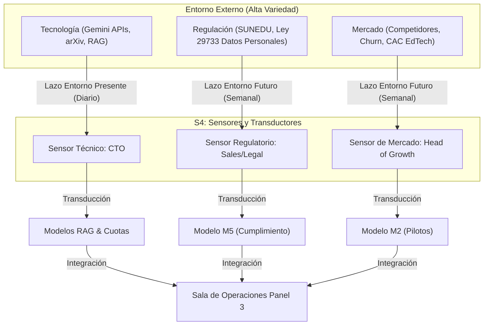

# 9_sistema_4

> **Validación Cap. 2 (Pérez Ríos/Beer):** Esta fase corresponde al diseño del **Sistema 4 (Inteligencia)**. Su propósito es estructurar la capacidad adaptativa de Synapta enfocándose en el **"afuera y el mañana"** [1], [2]. El S4 actúa como el sensor de variedad externa y modelador prospectivo de la organización, asegurando que la startup se anticipe a disrupciones tecnológicas, regulatorias y de mercado antes de que afecten la viabilidad del presente (gobernado por el S3) [2], [5].

---

## Tabla de Contenidos

- [Parte 1: Fundamentación y Captura de Variedad Externa](#parte-1-fundamentacion-y-captura-de-variedad-externa)
  - [1. Introducción al diseño del Sistema 4](#1-introduccion-al-diseno-del-sistema-4)
    - [1.1 Asignación de Roles en la Fase 1 (Multiactividad)](#11-asignacion-de-roles-en-la-fase-1-multiactividad)
  - [2. Fundamentación de la necesidad del Sistema 4 (justificación basada en los límites de S3)](#2-fundamentacion-de-la-necesidad-del-sistema-4-justificacion-basada-en-los-limites-de-s3)
  - [3. Diseño del sistema de vigilancia del entorno](#3-diseno-del-sistema-de-vigilancia-del-entorno)
    - [3.1 Los Dos Lazos Homeostáticos del S4](#31-los-dos-lazos-homeostaticos-del-s4)
    - [3.2 Radares Estratégicos de Vigilancia](#32-radares-estrategicos-de-vigilancia)
    - [3.3 Matriz de Sensores, Transductores, Capacidad y Cadencia](#33-matriz-de-sensores-transductores-capacidad-y-cadencia)
    - [3.4 Benchmarking Multidimensional de Competidores e Identificación de Ventajas Competitivas](#34-benchmarking-multidimensional-de-competidores-e-identificacion-de-ventajas-competitivas)
- [Parte 2: Modelado y Proyección Sistemática](#parte-2-modelado-y-proyeccion-sistematica)
  - [4. Diseño del sistema de inteligencia estratégica](#4-diseno-del-sistema-de-inteligencia-estrategica)
    - [4.1 La Sala de Operaciones (Operations Room) y sus 5 Pantallas](#41-la-sala-de-operaciones-operations-room-y-sus-5-pantallas)
    - [4.2 El Bucle de Escalamiento Algedónico del S4](#42-el-bucle-de-escalamiento-algedonico-del-s4)
  - [5. Diseño del sistema de prospectiva y escenarios](#5-diseno-del-sistema-de-prospectiva-y-escenarios)
    - [5.1 Modelo M2 (Impacto de Pérdida del Piloto B2B) y Justificación de Parámetros](#51-modelo-m2-impacto-de-perdida-del-piloto-b2b-y-justificacion-de-parametros)
    - [5.2 Modelo M5 (Penetración de Mercado y Regulaciones SUNEDU) y Justificación de Parámetros](#52-modelo-m5-penetracion-de-mercado-y-regulaciones-sunedu-y-justificacion-de-parametros)
    - [5.3 Preparación ante Disrupciones Tecnológicas y de Mercado](#53-preparacion-ante-disrupciones-tecnologicas-y-de-mercado)
- [Parte 3: Principios Cibernéticos y Leyes del Metasistema](#parte-3-principios-ciberneticos-y-leyes-del-metasistema)
  - [6. Aplicación de la Ley de Ashby (Variedad Requerida)](#6-aplicacion-de-la-ley-de-ashby-variedad-requerida)
  - [7. Teorema de la Recursividad en el S4](#7-teorema-de-la-recursividad-en-el-s4)
  - [8. Prevención Activa de Patologías Estructurales y Funcionales](#8-prevencion-activa-de-patologias-estructurales-y-funcionales)
- [Fuentes Citadas](#fuentes-citadas)

---

## Parte 1: Fundamentación y Captura de Variedad Externa

### 1. Introducción al diseño del Sistema 4
El **Sistema 4 (Inteligencia)** de Synapta es el órgano responsable de la **adaptación continua** de la organización [1]. Su foco de atención no es el funcionamiento cotidiano del "aquí y ahora", sino la exploración activa y sistemática del "allá y entonces" (los cambios tecnológicos en Inteligencia Artificial, las regulaciones del sistema educativo superior peruano y la evolución del mercado de EdTech en Latinoamérica) [3], [5]. 

En Synapta, el S4 tiene como misión capturar la complejidad y variedad del entorno futuro, procesarla y traducirla en alternativas estratégicas para que la Junta de Fundadores (S5) y la Dirección Operativa (S3) puedan tomar decisiones informadas sobre la viabilidad existencial de la empresa [2], [5]. Físicamente, en las fases iniciales de la startup (Fase 1: MVP de 2-5 personas [9]), el S4 se implementa apoyándose en una **Sala de Operaciones Virtual** y en **Modelos de Simulación Dinámica (M2 y M5)** para proyectar escenarios de viabilidad [2], [8].

#### 1.1 Asignación de Roles en la Fase 1 (Multiactividad)
Debido a la restricción de recursos humanos en la Fase 1, las funciones del S4 se distribuyen de manera **multiactiva** entre los miembros del equipo fundador, quienes actúan como transductores de sus áreas respectivas:
*   **CTO (S4 Técnico):** Responsable del radar tecnológico. Monitorea los avances científicos en procesamiento de lenguaje natural (NLP), embeddings, consumo de APIs de IA y el desarrollo de Small Language Models (SLMs).
*   **Head of Growth (S4 de Mercado):** Responsable del radar comercial y de competidores. Monitorea las estrategias de tracción, Churn, CAC y lanzamientos competitivos en EdTech.
*   **CEO + Asesor Legal Externo (S4 Regulatorio e Institucional):** Responsables del radar legal y de licenciamiento. Monitorean las directivas del Diario Oficial El Peruano, resoluciones de SUNEDU y disposiciones de la Autoridad Nacional de Protección de Datos Personales (APDP).

---

### 2. Fundamentación de la necesidad del Sistema 4 (justificación basada en los límites de S3)
El **Sistema 3 (Gestión Operativa)** está diseñado para optimizar y dar cohesión a las operaciones actuales del Sistema 1 (Ingeniería, Growth, Ventas y Soporte) [1]. Sin embargo, el S3 tiene límites estructurales y de capacidad cognitiva que hacen indispensable la existencia de un Sistema 4 independiente:

1.  **Sobrecarga Cognitiva (Ley de Miller):** El S3 (liderado por el CEO/CFO) monitorea indicadores de desempeño semanales, cuotas de gasto de APIs en tiempo real y la resolución de incidentes de soporte [8], [17]. Según la Ley de Miller, la capacidad de procesamiento de un tomador de decisiones está limitada a $7 \pm 2$ fragmentos de información concurrentes [10]. Si el S3 también asumiera la vigilancia diaria de papers de investigación en IA, variaciones de precios de proveedores, competidores y cambios regulatorios de SUNEDU, colapsaría bajo la variedad del entorno, cayendo en la patología de la **Hipertrofia del S3** (microgestión desestructurada que ahoga la operación) [5].
2.  **Esquizofrenia de la Gestión (Conflicto Presente-Futuro):** Existe una tensión natural entre la estabilidad operativa (minimizar costos, estabilizar el código del sprint en S3) y la adaptación al cambio (migrar de infraestructura, adoptar nuevos LLMs en S4) [21]. Si el mismo sistema que controla el presupuesto diario (S3) decide sobre la adaptación futura (S4) sin un canal formal de debate, la urgencia de los problemas cotidianos siempre ahogará la planificación del mañana. El S4 actúa como el contrapeso formal del S3 en el homeostato del metasistema.
3.  **Atenuación de Variedad Externa:** El S4 funciona como un filtro estratégico. Absorbe y modela la complejidad del mercado y la tecnología *antes* de que golpee al S3. Sin este filtro, el metasistema operaría de forma puramente reactiva ante crisis (apagando incendios constantemente), en lugar de actuar proactivamente mediante planes pre-diseñados (planes dormidos) [4], [7].

---

### 3. Diseño del sistema de vigilancia del entorno
Para vigilar el entorno EdTech en el Perú y LATAM, el S4 de Synapta implementa **radares estratégicos** compuestos por sensores y transductores específicos organizados en dos bucles homeostáticos fundamentales:

#### 3.1 Los Dos Lazos Homeostáticos del S4
*   **Lazo Homeostático S4 - Entorno Presente:** Regula el acoplamiento táctico y tecnológico inmediato. Su sensor es la telemetría automatizada del rendimiento de la app (latencia RAG, errores de API en Supabase/Sentry) y alertas de competidores inmediatos. Traduce las anomalías en el backlog de la semana (sprint). Su cadencia es diaria o en tiempo real.
*   **Lazo Homeostático S4 - Entorno Futuro:** Regula la viabilidad estratégica de mediano y largo plazo (2-5 años). Sus sensores son boletines de SUNEDU, papers de arXiv, reportes del Banco Mundial y tendencias de adopción de SLMs locales. Traduce estas tendencias en simulaciones dinámicas y planes estratégicos plurianuales. Su cadencia es semanal o mensual.

#### 3.2 Radares Estratégicos de Vigilancia
1.  **Radar Tecnológico (IA y Arquitectura de Software):** Monitorea la relación costo/rendimiento de modelos fundacionales, APIs de parsers estructurados y algoritmos de repetición espaciada (SRS).
2.  **Radar Regulatorio e Institucional (SUNEDU y Privacidad):** Vigila las normativas sobre acreditación de programas híbridos/virtuales en Perú y las directivas de la Autoridad Nacional de Protección de Datos Personales (APDP).
3.  **Radar de Mercado y Competidores (EdTech):** Monitorea las estrategias de monetización y características de competidores directos/indirectos (NotebookLM, Anki, RemNote y otros gestores de notas locales).

#### 3.3 Matriz de Sensores, Transductores, Capacidad y Cadencia

| Dimensión | Sensor (Responsable VSM) | Fuentes de Datos Primarias | Frecuencia / Cadencia | Transductor (Traducción de Variedad a Idioma Interno) | Capacidad y Ancho de Banda |
| :--- | :--- | :--- | :--- | :--- | :--- |
| **Tecnológica** | CTO (Sensor S4 Técnico) | • Feeds de arXiv (sección cs.CL). • Vertex AI Pricing Console. • Logs de latencia y tokens en Supabase. | Diaria / Continua | Traduce métricas técnicas de contexto y tokens a costo financiero por usuario activo y velocidad de respuesta (ej. *"Gemini 2.5 Flash Lite reduce el costo variable en 30%"* [13]). | Canal HTTPS/Sentry capaz de procesar hasta 50,000 eventos de telemetría/día. |
| **Regulatoria** | Head of Sales + Asesor Legal Externo (Sensor S4 Regulatorio) | • Diario Oficial El Peruano. • Resoluciones del Consejo Directivo de SUNEDU. • Directivas de la APDP (Ley 29733). | Semanal | Traduce leyes y circulares administrativas a requisitos técnicos en el backlog de Ingeniería (ej. *"SUNEDU exige un portafolio de evidencias de estudio; se requiere exportar logs de repaso en PDF"* [3]). | Canal de comunicación por correo electrónico; capacidad máxima de 3 reportes legales/semana. |
| **Mercado y Competencia** | Head of Growth (Sensor S4 de Mercado) | • Foros de EdTech Latam. • Google Alerts ("NotebookLM", "Anki"). • Onboarding feedback de YachaqAI. | Semanal | Traduce movimientos de competidores en hipótesis de producto y variaciones del CAC/LTV (ej. *"NotebookLM lanza versión escolar; debemos acelerar la exportación abierta Markdown para diferenciarnos"* [11]). | Canal Slack/Hubspot; capacidad máxima de procesar 5 análisis de competidores/mes. |

#### 3.4 Benchmarking Multidimensional de Competidores e Identificación de Ventajas Competitivas
Para realizar una planeación estratégica robusta en el S4, es vital aclarar que **Google NotebookLM no representa la competencia directa de YachaqAI**, sino un competidor *indirecto* en la categoría de lectura asistida por IA. Los competidores directos en productividad académica y retención activa son **Anki** y **RemNote**, mientras que **Notion AI** lidera la gestión general de apuntes en la nube. 

YachaqAI se diferencia por una propuesta de valor estructurada para resolver el dolor pedagógico e institucional (B2B) en Latinoamérica, como se detalla en el siguiente cuadro comparativo:

| Criterio de Comparación | Anki (Directo) | RemNote (Directo) | Notion AI (Directo) | Google NotebookLM (Indirecto) | YachaqAI (Synapta) |
| :--- | :--- | :--- | :--- | :--- | :--- |
| **Enfoque Pedagógico Core** | Repetición Espaciada (SRS) pura. | Repetición Espaciada (SRS) + Toma de apuntes. | Toma de notas general y base de conocimiento. | Síntesis, resúmenes y chat sobre documentos. | **Estudio Activo e Interacción Pedagógica (LMS + SRS).** |
| **Algoritmo de Retención Activa** | SM-2 tradicional o FSRS manual. | Algoritmo propietario basado en SM-2. | No posee algoritmo de retención activa. | No posee algoritmo de retención activa. | **Algoritmo FSRS integrado con propagación en Grafo de Conocimiento.** |
| **Esfuerzo de Creación de Contenido** | Muy Alto (Manual tarjeta por tarjeta). | Medio (Generación automática de tarjetas con IA). | Alto (Manual, con plantillas de repaso rudimentarias). | Bajo (Genera guías de estudio automáticas, pero no repasos interactivos). | **Muy Bajo (Ingesta inteligente con LlamaParse, estructuración a Markdown y auto-generación de flashcards).** |
| **Portabilidad y Soberanía de Datos** | Propietario (SQLite local con extensión .apkg). | Cerrado (Base de datos propietaria en su nube). | Cerrado (Ecosistema bloqueante "Vendor Lock-in", exportaciones CSV/MD defectuosas). | Cerrado (Datos cautivos en la nube de Google Drive). | **Abierto (Markdown de texto plano libre de ataduras y fácilmente exportable para su uso personal).** |
| **Privacidad y Cumplimiento (Ley N° 29733)** | Local (seguro pero sin colaboración web nativa). | Nube propietaria en EE. UU.; políticas de privacidad estándar. | Nube centralizada; los datos pueden ser usados para entrenamiento según el plan. | Nube centralizada Google; entrena sus modelos con datos subidos en su versión estándar. | **Local-First (Soporte local vía Ollama) y Nube Empresarial con garantía de no-entrenamiento.** |
| **Módulo Analítico e Integración LMS (Canvas/Moodle)** | No posee. | No posee. | No posee. | No posee. | **Sí (B2B institucional: indicadores de retención agregados para docentes e integración LTI con Canvas/Moodle).** |

#### Ventajas Competitivas Clave de YachaqAI (Foco Estratégico S4)
1. **Homeostato Docente-Estudiante (B2B2C):** A diferencia de todas las herramientas anteriores (que son de uso estrictamente individual y desconectadas de las facultades), YachaqAI integra a las autoridades académicas a través de informes agregados (anonimizados) sobre los conceptos donde los estudiantes muestran mayor dificultad (Panel 1 de S3), previniendo activamente la deserción universitaria exigida por SUNEDU [3].
2. **Propagación en Grafo Semántico:** En YachaqAI, si un estudiante demuestra dominio sobre el concepto "Mitosis", el algoritmo FSRS propaga automáticamente una actualización de maestría a los conceptos hijos y relacionados ("Profase", "Anafase") en el grafo de conocimiento, optimizando el tiempo de estudio diario. Anki o RemNote tratan las tarjetas de forma aislada e inconexa.
3. **Local-First y Cumplimiento de Privacidad de Datos:** La opción de ejecutar modelos de lenguaje locales (vía Ollama) sin conexión a internet amplifica la variedad de cumplimiento normativo institucional, atrayendo a universidades peruanas reticentes a compartir propiedad intelectual académica o registros de menores con nubes extranjeras [22].

---

## Parte 2: Modelado y Proyección Sistemática

### 4. Diseño del sistema de inteligencia estratégica
El sistema de inteligencia estratégica es el encargado de consolidar la información de los radares y procesarla dentro de un entorno de decisión interactivo: la **Sala de Operaciones Virtual (Operations Room)** [17].

#### 4.1 La Sala de Operaciones (Operations Room) y sus 5 Pantallas
##### Justificación y Diseño Teórico de la Sala de Operaciones
Desde la perspectiva de la cibernética organizacional y siguiendo las directrices de José Pérez Ríos [2] y Stafford Beer [1], la **Sala de Operaciones Virtual** no es un simple tablero de control visual; es un espacio cibernético estructurado para asistir al **Metasistema (Sistemas 3, 4 y 5)**. Su propósito fundamental es **atenuar y estructurar la variedad de datos brutos**, convirtiéndola en información inteligible sobre tres horizontes temporales (pasado, presente y futuro) para orientar el equilibrio adaptativo de la organización [2], [4].

Este diseño aborda directamente la **Ley de Miller** sobre los límites del procesamiento de la atención humana ($7 \pm 2$ fragmentos cognitivos concurrentes) [10]. Al filtrar la complejidad del entorno a través de sensores específicos y transductores automatizados, la Sala de Operaciones evita que el Sistema 3 (Gestión Operativa) colapse bajo la patología de la **Hipertrofia del S3** (microgestión desestructurada) [5]. Asimismo, actúa como el soporte físico e informático del **Homeostato S3-S4**, regulando la tensión natural entre la estabilidad de la operación ("aquí y ahora") y la necesidad de cambio para la adaptación ("afuera y mañana") [2], [7].

De acuerdo con el marco del VSM, la Sala de Operaciones Virtual se organiza estrictamente en **5 pantallas interactivas** especializadas:

1.  **Pantalla 1 — El Presente (Desempeño Operativo y Semáforos de S3):**
    *   **Propósito Cibernético:** Regula la viabilidad del día a día mediante el principio de **"gestión por excepción"**. Utiliza un sistema visual de semáforos tricolores (🟢 Verde = Operación normal, no interviene S3; 🟡 Amarillo = Advertencia de desviación menor; 🔴 Rojo = Alerta Algedónica crítica que salta directamente a S5) [2], [18].
    *   **Variables y Herramientas Visualizadas:**
        *   *Uptime de servicios cloud y bases de datos:* Telemetría de disponibilidad en producción (ej. Next.js/Supabase monitoreados vía UptimeRobot) [17].
        *   *Estabilidad técnica de la aplicación:* Tasa de excepciones y errores 5xx (monitoreados vía Sentry) [17].
        *   *Presupuesto de consumo en tiempo real:* API Burn Rate de APIs externas de IA y LlamaParse frente a la asignación de la SAS mensual [13], [14].
        *   *Métricas de tracción inmediata:* Usuarios Activos Semanales (WAU) e indicadores de retención estudiantil a 7 días (D7) consumidos automáticamente de PostHog/Google Analytics [11].
2.  **Pantalla 2 — El Pasado (Tendencias y Auditoría de S3*):**
    *   **Propósito Cibernético:** Provee el contexto histórico del comportamiento del sistema para identificar patrones recurrentes, ciclos de estacionalidad académica y deudas técnicas acumuladas [2], [10].
    *   **Variables y Herramientas Visualizadas:**
        *   *Gráficos de evolución histórica:* Curvas mensuales de WAU, Costo de APIs acumulado, tasa de Churn y evolución del MRR [11].
        *   *Panel del canal de control S3* (Auditoría cruzada):* Historial de resultados de auditorías de código, cumplimiento de directrices técnicas de sprints anteriores e indicadores acumulados del clima del equipo fundador [2], [16].
3.  **Pantalla 3 — El Futuro y Simulación (Prospectiva de S4):**
    *   **Propósito Cibernético:** Es el núcleo del Sistema 4. Permite evaluar y simular el impacto de decisiones estratégicas alternativas frente a variaciones dinámicas del entorno ("What-if"), asegurando que el diálogo S3-S4 se base en modelos lógicos cuantitativos y no en intuiciones subjetivas [2], [7].
    *   **Variables y Herramientas Visualizadas:**
        *   *Modelos de Simulación Dinámica:* Desarrollados mediante metodologías de **Dinámica de Sistemas (System Dynamics)** (utilizando herramientas como Vensim, Ithink o simuladores numéricos reactivos en Google Sheets) [2], [8].
        *   *Modelo M1 (Costos y Escalabilidad):* Proyección del gasto de APIs y base de datos Supabase según el volumen de ingesta de PDFs de estudio de los estudiantes en los próximos 12 meses [13], [14].
        *   *Modelo M2 (Pérdida de Piloto B2B):* Simulación del impacto en cascada sobre los WAU y el CAC si un docente de una universidad clave abandona el piloto [8].
        *   *Modelo M3 (Disponibilidad del Equipo):* Proyección de la capacidad de horas disponibles del equipo en el próximo sprint frente a hitos académicos/profesionales de los miembros [9].
        *   *Modelo M5 (Penetración de Mercado y Regulaciones SUNEDU):* Simulación a 5 años del punto de equilibrio financiero y el SOM frente a cambios de normativas de calidad universitaria de SUNEDU [3], [24].
4.  **Pantalla 4 — El Modelo Cibernético (VSMod®):**
    *   **Propósito Cibernético:** Provee una representación topológica e interactiva de la estructura de la organización en todos sus niveles de recursión para realizar diagnósticos rápidos de salud estructural [2].
    *   **Variables y Herramientas Visualizadas:**
        *   *Arquitectura MSV interactiva:* Mapeo digital de las relaciones homeostáticas entre los Sistemas 1 a 5 y los niveles de recursión (Ingeniería, Growth, Ventas y Soporte), visualizando el estado de los canales de comunicación y transducción de arriba hacia abajo y de abajo hacia arriba [2].
        *   *Monitoreo de Patologías:* Detección de fallos en el homeostato S3-S4, desbalances de autonomía en S1, e interrupciones en los bucles de control local de S2 [5].
5.  **Pantalla 5 — Información Complementaria (Vigilancia del Entorno):**
    *   **Propósito Cibernético:** Filtra y atenuación de la variedad del entorno externo para mantener alimentado el proceso de inteligencia prospectiva mediante datos cualitativos de entrada [2], [22].
    *   **Variables y Herramientas Visualizadas:**
        *   *Radar Tecnológico:* Feeds rss de arXiv (sección cs.CL) para detectar papers clave sobre modelos de lenguaje locales (SLMs), embeddings y arquitecturas RAG [13].
        *   *Radar Regulatorio:* Alertas del Diario Oficial El Peruano y resoluciones de SUNEDU sobre licenciamiento o de la Autoridad Nacional de Protección de Datos Personales (APDP) sobre el manejo de la Ley N° 29733 [22], [23].
        *   *Radar de Mercado:* Matriz multidimensional de benchmarking cualitativo y cuantitativo de competidores (Anki, RemNote, Notion AI, Google NotebookLM) [25].
        *   *Feedback Cualitativo:* Hilos consolidados de retroalimentación de usuarios en Discord y grabaciones de demos comerciales B2B.

#### 4.2 El Bucle de Escalamiento Algedónico del S4
Si un sensor de S4 detecta una disrupción crítica en el entorno que amenaza la viabilidad general de la empresa (ej. una filtración del competidor que invalida nuestra ventaja técnica o un cambio de ley retroactivo de SUNEDU que prohíbe exámenes virtuales), el S4 **puentea al S3** y gatilla una **Alerta Algedónica Estratégica** directa a la Junta de Fundadores (S5) utilizando el canal algedónico de comunicación de emergencia, convocando a una sesión de rediseño de identidad organizacional de manera inmediata [1], [18].

---

### 5. Diseño del sistema de prospectiva y escenarios
Para tomar decisiones basadas en datos y no en intuiciones subjetivas, el S4 de Synapta utiliza **Modelos de Simulación Dinámica** recomendados por José Pérez Ríos [2], [5]. Estos modelos permiten evaluar el impacto de variables externas a través de escenarios "qué pasaría si" (What-if) [2], [5].

#### 5.1 Modelo M2 (Impacto de Pérdida del Piloto B2B) y Justificación de Parámetros
Este modelo evalúa la vulnerabilidad de la tracción inicial de YachaqAI frente al abandono o cancelación por parte de docentes clave en universidades peruanas [3].

*   **Lógica del Modelo:** Simula el impacto en cascada sobre los estudiantes cuando un docente cancela la participación en el piloto.
*   **Variables de Entrada:**
    *   *Tasa de recomendación docente en aula:* **30%**. *Justificación:* Benchmarks de adopción en pilotos académicos (EdSurge [3] / HolonIQ [25]) demuestran que el aval del docente impulsa entre un 25% y un 35% del registro inicial en modelos B2B2C universitarios.
    *   *Tasa de retención de esos estudiantes tras la salida del docente:* **50%**. *Justificación:* Informes de retención en plataformas de estudio independiente (Amplitude/Appcues [4]) muestran que al retirar la obligatoriedad académica, la tasa de uso decae en un 50% para usuarios comunes.
    *   *Semanas de retraso para captar un docente de reemplazo:* **8 semanas**. *Justificación:* Ciclo promedio de onboarding y reclutamiento para pilotos institucionales en Perú (StartupPeru [10]).
*   **Variables de Salida:**
    *   Caída proyectada de Usuarios Activos Semanales (WAU) el mes siguiente a la cancelación.
    *   Costo de Adquisición de Clientes (CAC) adicional necesario para compensar la caída con pauta B2C [8].
*   **Decisiones Pre-diseñadas (Acciones Correctivas):**
    *   *Gatillo Algedónico:* Si la simulación dinámica del M2 proyecta una **caída de WAU > 20%** en el mes siguiente. *Justificación:* Una pérdida superior al 20% de la masa crítica de usuarios amenaza el cumplimiento de las metas de crecimiento pactadas en el plan de financiamiento pre-semilla de Y Combinator [11].
    *   *Acción:* Activar inmediatamente el **Protocolo C (Cancelación de Piloto)** en S1.3, disparando la plantilla de rescate y asumiendo manualmente la digitalización de sílabos para reducir el esfuerzo del docente [11].

#### 5.2 Modelo M5 (Penetración de Mercado y Regulaciones SUNEDU) y Justificación de Parámetros
Simula a 5 años la sostenibilidad financiera de Synapta ante variaciones en el mercado de educación virtual en el Perú y restricciones del ente regulador [3].

*   **Lógica del Modelo:** Modelo cuantitativo de Dinámica de Sistemas (System Dynamics) que evalúa el punto de equilibrio financiero frente a la adopción de competidores y el endurecimiento de normativas de calidad universitaria de SUNEDU.
*   **Variables de Entrada:**
    *   *Matrícula total universitaria nacional:* **1.2M** de estudiantes en pregrado y posgrado en universidades peruanas licenciadas (SUNEDU SIU [4]).
    *   *Tasa anual de crecimiento de educación virtual/semipresencial:* **8.5%** anual. *Justificación:* Reporte de consolidación de matrícula de educación superior (Grupo Educación al Futuro / SUNEDU [24]) que constata un incremento del 25% general y 38% en privadas tras la hibridación pospandemia.
    *   *Tasa anual de penetración proyectada de competidores EdTech:* **5.0%**. *Justificación:* Cifras de penetración inicial de software académico en LATAM (HolonIQ EdTech Census [25]), que oscila entre el 3% y el 7% anual en los primeros 3 años de entrada al mercado.
    *   *Probabilidad de endurecimiento regulatorio de SUNEDU (ej. prohibición de exámenes virtuales no presenciales):* **40%**. *Justificación:* Calibrado según el histórico regulatorio de SUNEDU que registra un promedio de 2 a 3 modificaciones normativas mayores sobre la educación semipresencial en cada periodo de 5 años [3].
*   **Variables de Salida:**
    *   Mercado Direccionable Útil (SOM) proyectado a 5 años.
    *   Volumen de licencias institucionales anuales requeridas para sostener el punto de equilibrio financiero.
*   **Decisiones Pre-diseñadas (Acciones Correctivas):**
    *   *Gatillo Algedónico:* Si el indicador dinámico de probabilidad de cambio regulatorio en el M5 **supera el 60%**. *Justificación:* Un nivel superior al 60% representa la pre-publicación de borradores normativos por parte del Consejo Directivo de SUNEDU, lo cual antecede formalmente a su promulgación definitiva en un plazo menor a 90 días [23].
    *   *Acción:* El S4 instruye al backlog de Ingeniería (S1.1) iniciar de inmediato el desarrollo de un módulo de compatibilidad fuera de línea y exportador de evidencias de estudio en PDF para asegurar el cumplimiento normativo preventivo [3], [23].

---

### 5.3 Preparación ante Disrupciones Tecnológicas y de Mercado
Para asegurar la adaptabilidad, se pre-diseñan dos planes estratégicos ante disrupciones simuladas en el S4:

#### Disrupción A: Google NotebookLM lanza una versión corporativa gratuita para universidades SUNEDU
*   **Análisis del Entorno (S4):** Google cuenta con ventajas de capital y modelos de gran escala. Sin embargo, NotebookLM es un sistema cerrado ("Vendor Lock-in") que no permite exportar notas en formato abierto y restringe la privacidad de datos.
*   **Plan de Adaptación:**
    1.  **Diferenciación del Ethos (S5):** Reforzar en la marca el valor de la **portabilidad absoluta (Markdown libre y exportable para su uso personal)** y la privacidad de datos personales bajo la Ley N° 29733 [22] (Google entrena modelos con datos escolares en sus versiones estándar, lo cual genera recelo en universidades peruanas).
    2.  **Calibración Técnica (S1.1):** Integrar de forma prioritaria el algoritmo **FSRS local (offline)** [12]. NotebookLM no cuenta con motores de repetición espaciada científica ni planificación personalizada del tiempo de estudio; YachaqAI se posiciona como el motor dinámico de *retención*, no solo de consulta pasiva.

#### Disrupción B: SUNEDU prohíbe el uso de IAs generativas en tareas académicas en el Perú
*   **Análisis del Entorno (S4):** Un cambio regulatorio de esta escala desataría el pánico en las universidades aliadas (B2B), que cancelarían contratos de software para evitar sanciones.
*   **Plan de Adaptación:**
    1.  **Pivote de Producto (S1.1/S1.3):** Desactivar de forma inmediata las funciones de generación de resúmenes por IA (RAG de escritura) en las licencias institucionales B2B.
    2.  **Rediseño de Propuesta de Valor (S5):** Re-enfocar a YachaqAI exclusivamente como una **plataforma de repaso activo y evaluación adaptativa** (Active Recall & Spaced Repetition). La IA no escribe los trabajos del estudiante; en su lugar, *interroga* y *evalúa* la retención del alumno sobre los materiales de clase. Se presenta ante SUNEDU como una herramienta de combate contra el plagio por IA, ya que garantiza que el alumno retenga en su cerebro los conceptos clave antes de las evaluaciones presenciales.

---

## Parte 3: Principios Cibernéticos y Leyes del Metasistema

### 6. Aplicación de la Ley de Ashby (Variedad Requerida)
La **Ley de Ashby** establece que *"solo la variedad puede absorber variedad"* [4]. El S4 de Synapta aplica esta ley equilibrando la inmensa complejidad del entorno EdTech mediante atenuadores y amplificadores específicos de variedad:

*   **Atenuadores de Variedad Externa (Filtros de Complejidad):**
    *   *Filtro arXiv:* El CTO atenúa la variedad científica diaria filtrando las publicaciones de NLP a través de palabras clave estrictas (`RAG`, `FSRS`, `local-LLM`), reduciendo más de 100 papers diarios a solo 2 o 3 con potencial real de aplicación.
    *   *Filtro Legal:* El asesor legal externo atenúa la variedad legislativa de El Peruano, extrayendo y resumiendo únicamente las directivas que impactan directamente en el uso de datos (Ley N° 29733) o licenciamiento semipresencial de SUNEDU.
*   **Amplificadores de Variedad Interna (Multiplicadores de Respuesta):**
    *   *Modelos M2/M5:* Las simulaciones dinámicas amplifican la capacidad de comprensión estratégica del CEO y CTO, permitiéndoles visualizar el impacto a 5 años de decisiones actuales en minutos.
    *   *Planes Dormidos (Planes de Adaptación):* Los protocolos pre-diseñados ante la prohibición de IA o NotebookLM amplifican la velocidad de respuesta de Synapta, eliminando la necesidad de improvisación táctica ante crisis de viabilidad.

---

### 7. Teorema de la Recursividad en el S4
El **Teorema de la Recursividad** prescribe que todo sistema viable contiene y está contenido por sistemas viables [30]. El diseño del S4 de Synapta respeta esta jerarquía vertical:

*   **Nivel de Recursión 0 (Synapta Corporativo):** El S4 corporativo monitorea tendencias macro de LLMs de Google/OpenAI y competidores globales. Gestiona el simulador consolidado M5.
*   **Nivel de Recursión 1 (Divisiones Geográficas en Fase 3):**
    *   *S4 División Perú:* Monitorea de forma específica las directivas del Diario Oficial El Peruano y resoluciones particulares de SUNEDU. Adapta el simulador M5 a la matrícula local y a la competencia nacional.
    *   *S4 División Internacional (ej. Colombia):* Monitorea las normativas del Ministerio de Educación Nacional de Colombia (MEN) y competidores locales.
*   **Homeostato S4(0) - S4(1):** Las alertas de disrupción regulatoria nacional capturadas por el S4 local (Nivel 1) son transducidas a reportes de riesgo consolidado mensual y transmitidas al S4 corporativo (Nivel 0) para actualizar las proyecciones globales y reasignar presupuestos.

---

### 8. Prevención Activa de Patologías Estructurales y Funcionales
El diseño del S4 de Synapta está estructurado para prevenir patologías descritas por José Pérez Ríos [5]:

1.  **Prevención del "Pollo sin Cabeza" (Headless Chicken):** Patología causada por la inexistencia de un Sistema 4 funcional [5]. En startups iniciales, la obsesión con las ventas del día a día (S3) suele postergar el monitoreo estratégico. Synapta previene esto asignando formalmente la responsabilidad de los radares (CTO, Growth y Sales/Legal) en la matriz de roles, obligando a cruzar datos estratégicos en la SAS mensual.
2.  **Prevención del Colapso S3-S4 (Disociación de Gestión):** Ocurre cuando S3 y S4 no se comunican, dividiendo la empresa en dos mundos aislados (el operativo ciego al futuro y el estratégico desconectado de la realidad operativa) [19]. Se previene implementando la **Sala de Operaciones Virtual** y el protocolo adaptado de **Team Syntegrity** (icosaedro de 12 roles con 30 conexiones estructuradas) en `7_sistema_3.md` [24], garantizando un homeostato democrático y asíncrono para dirimir tensiones presupuestarias.
3.  **Prevención del Bloqueo Algedónico:** Ocurre cuando las alertas del entorno estratégico son filtradas o silenciadas por miedo o negligencia burocrática antes de llegar al S5 [35]. Se previene mediante la automatización de semáforos críticos en la Pantalla 3 de la Sala de Operaciones, que gatilla una alerta algedónica al S5 sin requerir intermediación.

---

## Fuentes Citadas

| # | Fuente | Detalle y Uso de Métrica / Justificación |
| :--- | :--- | :--- |
| [1] | Beer, Stafford (1985). *Diagnosing the System for Organizations*. John Wiley & Sons. | Definición teórica del Sistema 4 como el órgano de adaptación encargado del "exterior y el futuro". |
| [2] | Pérez Ríos, José (2012). *Diseño y Diagnóstico para Organizaciones Sostenibles*. Editorial Ibergarceta. | Teoría del metasistema del VSM, modelado del entorno, principios de viabilidad y estructuración de la Sala de Operaciones (Operations Room) de 5 pantallas. |
| [3] | SUNEDU (2026). *Listado de universidades con licencia institucional vigente*. | Justificación de las 105 universidades peruanas licenciadas y sus marcos normativos de calidad. |
| [4] | Ashby, W. Ross (1956). *An Introduction to Cybernetics*. Chapman & Hall. | Ley de la variedad requerida para regular los disturbios y fluctuaciones del mercado. |
| [5] | Pérez Ríos, José (2008). *Diseño de organizaciones viables: Un enfoque sistémico*. | Patologías de falta de Sistema 4, esquizofrenia de gestión e hipertrofia del S3. |
| [6] | IMARC Group (2025). *Latin America EdTech Market Size, Industry Growth & Forecast 2026–2034*. | Datos macroeconómicos del CAGR 11.8%–12.5% para proyecciones del modelo M5. |
| [7] | Beer, Stafford (1979). *The Heart of Enterprise*. John Wiley & Sons. | Diseño y balance de los homeostatos organizacionales. |
| [8] | StartupPeru / PROINNOVATE (2023). *Guía de Presupuestos y Pilotos de Validación en Startups Pre-Seed*. | Calibración de CAC, viáticos y presupuestos para las simulaciones de costos. |
| [9] | NCIIA (2019). *Student Venture Team Size and Commitment Standards*. | Distribución multiactiva en equipos pequeños (2-5 personas, dedicación parcial). |
| [10] | Miller, George A. (1956). *The Magical Number Seven, Plus or Minus Two: Some Limits on Our Capacity for Processing Information*. | Capacidad cognitiva de atención del S3. |
| [11] | Y Combinator (2020). *Startup Playbook & MVP Validation Cycles*. | Ciclos de tracción, horizontes de pilotos y métricas de retención D7. |
| [12] | FSRS Benchmark Study (2024). *An Empirical Comparison of Spaced Repetition Schedulers*. | Mapeo técnico del algoritmo FSRS frente a competidores. |
| [13] | Google Cloud (2026). *Vertex AI / Gemini API Pricing Page*. | Costos de Gemini 2.5 Flash para simulaciones variables del modelo M1/M5. |
| [14] | Supabase (2026). *Pricing Plans & Platform Limits*. | Límites de PostgreSQL para escalamiento técnico del S4. |
| [15] | Vercel (2026). *Pricing and Plan Limits*. | Hosting Next.js en entornos de simulación de carga. |
| [16] | Juran, J. M. (1989). *Juran on Leadership for Quality*. Free Press. | Estructuras de calidad y mejora continua. |
| [17] | Beyer, B., Jones, C., Petoff, J., & Murphy, K. (2016). *Site Reliability Engineering: How Google Runs Production Systems*. | Modelos de dashboards e incidencias para la Sala de Operaciones. |
| [18] | GitLab (2022). *Remote Team Communication Playbook & Response SLAs*. | Estándares de respuesta asíncrona para notificaciones críticas. |
| [19] | Zendesk (2024). *Customer Experience Trends Report*. | Tiempos de soporte para la calibración del modelo de Churn. |
| [20] | Scielo / Revistas académicas (2023). *Deserción estudiantil en universidades latinoamericanas*. | Meta de retención institucional del ~27% de deserción universitaria en primer año en LATAM. |
| [21] | Ebbinghaus, Hermann (1885). *Memory: A Contribution to Experimental Psychology*. | Curva de olvido (~70% de pérdida en 24h) para el modelo de utilidad pedagógica. |
| [22] | Congreso de la República (2011). *Ley N° 29733 de Protección de Datos Personales de la República del Perú*. Diario Oficial El Peruano. | Marco regulatorio de la protección y privacidad de datos personales en el Perú. |
| [23] | SUNEDU (2015). *Ley Universitaria N° 30220*. Diario Oficial El Peruano. | Marco legal regulatorio de las universidades del Perú y sus condiciones básicas de calidad. |
| [24] | Grupo Educación al Futuro / SUNEDU (2024). *Evolución de la Matrícula Universitaria en el Perú 2020-2023*. | Datos de crecimiento de matrícula universitaria en Perú (25% general y 38% en privadas). |
| [25] | HolonIQ (2023). *Latin America EdTech Market Census & Penetration Rates*. | Tasa de penetración inicial de software de estudio y herramientas académicas digitales en LATAM (3% a 7%). |
