# propuesta_plataforma_pdf_markdown

> **Versión del Documento:** 2.2 — Sistema de Evaluación Híbrida  
> **Fecha:** Junio 2026  
> **Estado:** Propuesta Técnica para Equipo de Ingeniería e Inversores  
> **Nombre:** YachaqAI — del quechua *Yachaq*, "el que sabe" o "el sabio"

---

## Tabla de Contenidos

1. [Visión del Producto](#1-visión-del-producto)
2. [Arquitectura General del Sistema](#2-arquitectura-general-del-sistema)
3. [Modelo de Datos](#3-modelo-de-datos)
4. [Estructura de Almacenamiento Markdown Híbrido](#4-estructura-de-almacenamiento-markdown-híbrido)
5. [Motor de Consulta LLM Wiki — Agentic RAG](#5-motor-de-consulta-llm-wiki--agentic-rag)
6. [Arquitectura del Índice de Conocimiento](#6-arquitectura-del-índice-de-conocimiento)
7. [Plan de Estudio y Scheduler Agent](#7-plan-de-estudio-y-scheduler-agent)
8. [Modelo de Onboarding Conversacional](#8-modelo-de-onboarding-conversacional)
9. [Motor de Repetición Espaciada Graph-SRS](#9-motor-de-repetición-espaciada-graph-srs)
10. [Sistema Visual del Grafo Dinámico](#10-sistema-visual-del-grafo-dinámico)
11. [Editor Markdown Modo Dual](#11-editor-markdown-modo-dual)
12. [Flujos de Usuario Críticos](#12-flujos-de-usuario-críticos)
13. [Sistema de Notificaciones](#13-sistema-de-notificaciones)
14. [Gestión de Errores y Edge Cases](#14-gestión-de-errores-y-edge-cases)
15. [Seguridad y Privacidad](#15-seguridad-y-privacidad)
16. [Métricas y Analytics](#16-métricas-y-analytics)
17. [Pila Tecnológica](#17-pila-tecnológica)
18. [Roadmap de Desarrollo](#18-roadmap-de-desarrollo)

---

## 1. Visión del Producto

**YachaqAI** es una plataforma inteligente de gestión del aprendizaje (LMS) y base de conocimiento interconectada. Transforma documentos estáticos (PDFs, libros, apuntes) en un grafo dinámico de conocimiento estructurado en Markdown, genera planes de estudio personalizados mediante lenguaje natural, y optimiza la retención a largo plazo usando repetición espaciada con propagación en el grafo de conocimiento.

### 1.1 Propuesta de Valor

| Dimensión | Problema Actual | Solución YachaqAI |
|:---|:---|:---|
| **Ingesta de Conocimiento** | PDFs son documentos pasivos, difíciles de conectar entre sí | Conversión automática a grafos de conceptos interconectados |
| **Planificación** | El estudiante no sabe qué estudiar ni en qué orden | Cronograma generado desde disponibilidad en lenguaje natural |
| **Retención** | El olvido exponencial destruye lo aprendido (curva de Ebbinghaus) | FSRS con propagación en el grafo — revisiones en el momento exacto |
| **Consulta** | Buscar en apuntes es lento e impreciso | LLM Wiki con Graph-Traversal RAG sobre los propios archivos del usuario |
| **Progreso** | No hay visibilidad real del dominio del conocimiento | Grafo semáforo que refleja maestría en tiempo real |

### 1.2 Principios de Diseño

1. **Markdown como fuente de verdad (Single Source of Truth):** Todos los datos de conocimiento viven en archivos `.md` portables, fácilmente exportables para su uso personal en Notion o cualquier editor de Markdown.
2. **IA como amplificador, no como reemplazante:** El usuario mantiene control editorial completo sobre su base de conocimiento.
3. **Privacidad por diseño:** Los documentos del usuario pueden procesarse completamente en local (modo offline) o mediante proveedores cloud con encriptación de tránsito.
4. **Progresión verificable:** El sistema prohíbe avanzar sin evidencia de comprensión (cuestionarios obligatorios por módulo).

### 1.3 Benchmarking y Ventajas Competitivas de YachaqAI

Para comprender la diferenciación de YachaqAI en el ecosistema actual, es necesario realizar un benchmarking frente a las herramientas populares del mercado EdTech y PKM. Aunque herramientas como Google NotebookLM son excelentes para la lectura asistida y síntesis por IA, operan como sistemas indirectos y cerrados. YachaqAI se posiciona en la intersección de un gestor de conocimiento local (PKM) y un sistema estructurado de aprendizaje activo (LMS) con repetición espaciada científica.

| Criterio de Comparación | Anki (Directo) | RemNote (Directo) | Notion AI (Directo) | Google NotebookLM (Indirecto) | YachaqAI |
| :--- | :--- | :--- | :--- | :--- | :--- |
| **Enfoque Core** | Repetición Espaciada (SRS) pura. | Repetición Espaciada (SRS) + Toma de apuntes. | Toma de notas general y base de conocimiento. | Síntesis, resúmenes y chat sobre documentos. | **Estudio Activo e Interacción Pedagógica (LMS + SRS).** |
| **Algoritmo de Retención Activa** | SM-2 tradicional o FSRS manual. | Algoritmo propietario basado en SM-2. | No posee algoritmo de retención. | No posee algoritmo de retención. | **Algoritmo FSRS integrado con propagación en Grafo de Conocimiento.** |
| **Creación de Fichas de Repaso** | Muy Alto (Manual tarjeta por tarjeta). | Medio (Generación automática de tarjetas con IA). | Alto (Manual, con plantillas de repaso rudimentarias). | Bajo (Genera guías de estudio, pero no repasos interactivos). | **Muy Bajo (Ingesta inteligente con LlamaParse, estructuración a Markdown y auto-generación de flashcards).** |
| **Portabilidad y Soberanía** | Propietario (SQLite local con extensión .apkg). | Cerrado (Base de datos propietaria en su nube). | Cerrado (Ecosistema bloqueante "Vendor Lock-in", exportaciones MD defectuosas). | Cerrado (Datos cautivos en la nube de Google Drive). | **Abierto (Markdown de texto plano libre de ataduras y fácilmente exportable para su uso personal).** |
| **Privacidad de Datos** | Local (seguro pero sin colaboración web nativa). | Nube propietaria en EE. UU.; políticas de privacidad estándar. | Nube centralizada; los datos pueden ser usados para entrenamiento. | Nube centralizada Google; entrena sus modelos con datos en versión estándar. | **Local-First (Soporte local vía Ollama) y Nube Empresarial con garantía de no-entrenamiento.** |
| **Módulo B2B / Integración LMS** | No posee. | No posee. | No posee. | No posee. | **Sí (B2B institucional: indicadores de retención para docentes e integración LTI con Canvas/Moodle).** |

#### Ventajas Competitivas de YachaqAI:
1. **El Bucle Docente-Estudiante (Integración LMS):** YachaqAI no es una herramienta aislada. Se integra mediante el protocolo LTI a los LMS institucionales (Canvas y Moodle) de las universidades. Permite a los docentes visualizar mapas agregados y anonimizados de los conceptos que más dificultad causan a los alumnos (e.g. mayor porcentaje de errores en flashcards del tema X), permitiendo intervenciones pedagógicas oportunas y previniendo la deserción escolar.
2. **Propagación Semántica de Maestría:** A diferencia de Anki o RemNote, que tratan cada tarjeta de repaso como una entidad atómica inconexa, YachaqAI vincula el motor FSRS al grafo de conceptos. Si el alumno demuestra comprender un concepto primario, la maestría se propaga inteligentemente a los nodos hijos relacionados, reduciendo el volumen de repasos diarios innecesarios y optimizando el tiempo de estudio.
3. **Privacidad Local-First y Cumplimiento Regulatorio (Ley N° 29733):** Ofrece un motor ejecutable 100% local (Local-First vía Ollama) para que los documentos y las notas académicas no salgan del computador del usuario o de los servidores de la universidad, superando las restricciones legales y el recelo de propiedad intelectual que generan los sistemas en la nube cautivos de corporaciones multinacionales.

---

## 2. Arquitectura General del Sistema

### 2.1 Diagrama de Arquitectura Completa

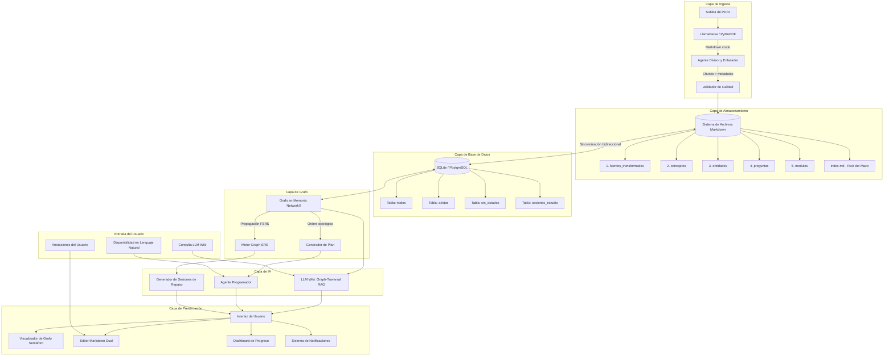

### 2.2 Flujo de Datos de Alto Nivel

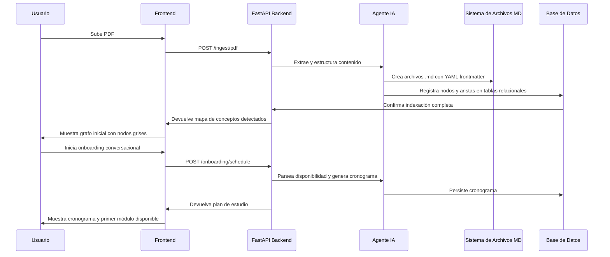

---

## 3. Modelo de Datos

El sistema de archivos Markdown es la fuente de verdad para el **contenido**, pero la base de datos relacional es la fuente de verdad para el **estado** del sistema (SRS, progreso, cronograma). Esta separación es fundamental: nunca se modifica la BD sin sincronizarla con el archivo `.md` correspondiente.

### 3.1 Diagrama Entidad-Relación

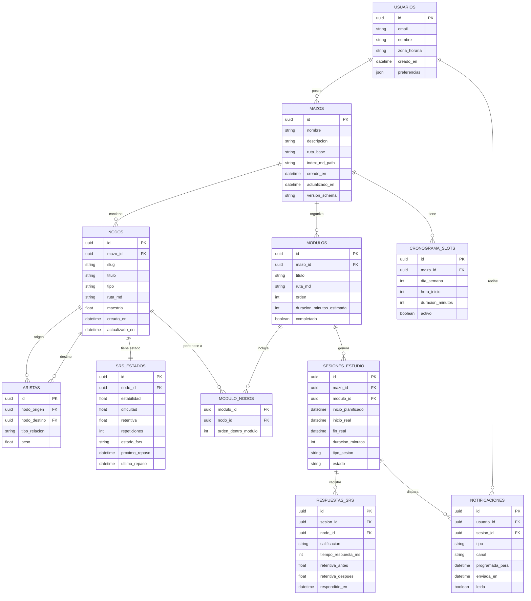

### 3.2 Descripción de Tablas Clave

| Tabla | Rol | Notas de Diseño |
|:---|:---|:---|
| `mazos` | Agrupa un conjunto de conocimiento de un PDF/curso | El campo `ruta_base` apunta a la carpeta raíz del sistema de archivos MD |
| `nodos` | Un concepto, entidad, fuente o pregunta individual | El campo `tipo` puede ser: `concepto`, `entidad`, `fuente`, `pregunta` |
| `aristas` | Relación dirigida entre dos nodos | Tipos: `prerrequisito`, `relacionado`, `referencia`, `genera_pregunta` |
| `srs_estados` | Estado FSRS actual de un nodo | Sincronizado con el YAML frontmatter del archivo `.md` |
| `respuestas_srs` | Historial completo de calificaciones por nodo | Usado para analytics y ajuste de dificultad |
| `cronograma_slots` | Disponibilidad semanal del usuario | Generado desde lenguaje natural, editable manualmente |
| `sesiones_estudio` | Sesión planificada vs. real | El campo `tipo_sesion` puede ser: `nuevo_contenido`, `repaso_srs`, `mixto` |

### 3.3 Sincronización BD ↔ Sistema de Archivos

> [!IMPORTANT]
> La sincronización es **bidireccional pero jerárquica**: el archivo `.md` tiene prioridad para el contenido de texto, y la BD tiene prioridad para el estado SRS. Un proceso de sincronización corre cada vez que:
> 1. El usuario guarda ediciones en el editor (MD → BD)
> 2. El motor SRS actualiza la retentiva tras una respuesta (BD → MD frontmatter)
> 3. Se detecta una modificación externa al archivo (watcher de sistema de archivos → BD)

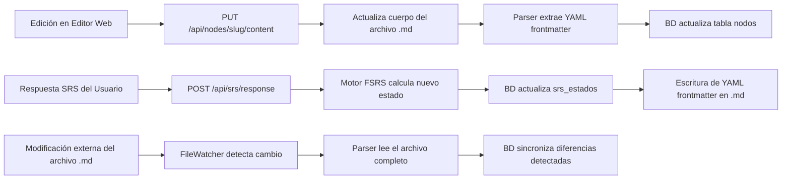

---

## 4. Estructura de Almacenamiento Markdown Híbrido

El sistema utiliza el sistema de archivos local basado en Markdown como la **fuente de verdad del contenido**. Esto permite que sea fácilmente exportable para su uso personal en Notion u otras herramientas de PKM (Personal Knowledge Management) sin ninguna dependencia propietaria.

### 4.1 Estructura de Directorios

```text
yachaq_knowledge_base/
├── YACHAQ.md                         # Schema del agente: cómo se comporta el LLM en este mazo
├── index.md                          # Índice raíz: catálogo de todo el contenido del mazo
├── log.md                            # Registro cronológico de actividad del usuario y del agente
├── 1. fuentes_transformadas/
│   ├── introduccion_redes.md         # PDF original transformado
│   └── cisco_ccna_vol1.md
├── 2. conceptos/
│   ├── modelo_osi.md
│   ├── protocolo_tcp.md
│   └── protocolo_udp.md
├── 3. entidades/
│   ├── cisco_systems.md
│   └── vint_cerf.md
├── 4. preguntas/
│   ├── q_modelo_osi.md
│   └── q_protocolo_tcp.md
├── 5. modulos/
│   ├── modulo_01_fundamentos_redes.md
│   └── modulo_02_capa_transporte.md
└── .yachaq/
    ├── config.json                   # Configuración técnica del mazo (no editar manualmente)
    ├── index_vectorial.pkl           # Embeddings en caché (NO sincronizar a Git)
    └── sync_log.jsonl                # Log técnico de sincronizaciones BD ↔ FS
```

> [!IMPORTANT]
> Los tres archivos raíz cumplen roles distintos e irremplazables — un patrón inspirado en el **LLM Wiki de Andrej Karpathy**:
> - **`YACHAQ.md`** — Le dice al agente *cómo* comportarse: convenciones del dominio, qué hacer al ingresar nuevo material, cómo hacer lint.
> - **`index.md`** — Le dice al agente *qué hay* en el mazo: catálogo navegable con links a todo el contenido.
> - **`log.md`** — Le dice al agente *qué pasó*: historial cronológico de ingesta, consultas y lint, legible por humanos y parseable por máquinas.

> [!NOTE]
> La carpeta `.yachaq/` contiene archivos de estado interno que **no deben** ser editados manualmente ni incluidos en sistemas de control de versiones compartidos. El `index_vectorial.pkl` se regenera automáticamente si se elimina.


### 4.2 El Archivo `YACHAQ.md` — Schema del Agente

Inspirado en el concepto de `CLAUDE.md` del patrón LLM Wiki de Andrej Karpathy, `YACHAQ.md` es el **archivo de configuración de comportamiento** del agente de IA. Su rol es hacer que el agente sea un mantenedor disciplinado y consistente de la base de conocimiento entre sesiones.

El agente lee este archivo al inicio de **cada operación** (ingesta, consulta, lint) para recordar las convenciones del mazo específico.

```markdown
---
yachaq_schema_version: "2.0"
mazo_id: "a1b2c3d4-e5f6-7890-abcd-ef1234567890"
---

# YACHAQ.md — Schema del Agente: Introducción a Redes de Computadores

## Convenciones de Este Mazo

- Dominio: **Redes de Computadores (CCNA Routing & Switching v7)**
- Idioma: **Español**. Términos técnicos en inglés se mantienen si son el estándar de la industria.
- Nivel objetivo: **Universitario — primer año de Ingeniería de Sistemas**
- Granularidad: Un concepto = una idea explicable en 200-400 palabras.

## Instrucciones para INGEST (nueva fuente)

1. Lee el documento completo antes de crear ningún archivo.
2. Compara contra `index.md` para identificar conceptos ya existentes.
3. **Conceptos existentes:** actualiza el archivo en lugar de crear duplicado.
   - Si la nueva fuente complementa: añade bajo nueva sección `## Desde [Fuente]`.
   - Si contradice: inserta `> ⚠️ CONTRADICCIÓN: [fuente nueva] dice X; [fuente anterior] decía Y.`
4. **Conceptos nuevos:** crea archivo `.md` siguiendo la plantilla estándar (§4.4).
5. Actualiza `index.md` con el nuevo contenido.
6. Añade entrada a `log.md`: `## [YYYY-MM-DD] ingest | Nombre del Documento`

## Instrucciones para QUERY (LLM Wiki)

1. Lee `index.md` para identificar las 3-5 páginas más relevantes.
2. Navega los enlaces internos si necesitas más contexto (profundidad máx: 3 saltos).
3. Cita los archivos fuente de cada afirmación con enlaces relativos.
4. Si la respuesta sintetiza 3+ fuentes o supera 300 palabras, propone archivarla como nuevo nodo.
5. Registra en `log.md`: `## [YYYY-MM-DD] query | Resumen de la pregunta`

## Instrucciones para LINT (revisión de salud)

1. Identifica nodos huérfanos (ninguna página los enlaza).
2. Busca afirmaciones contradictorias entre páginas.
3. Detecta conceptos mencionados 5+ veces sin página propia.
4. Sugiere fuentes externas para llenar gaps identificados.
5. Documenta en `log.md`: `## [YYYY-MM-DD] lint | N problemas encontrados`
```

### 4.3 El Archivo `log.md` — Registro Cronológico de Actividad

A diferencia del `sync_log.jsonl` (técnico, para el sistema), el `log.md` es una narrativa **legible por humanos y parseable por máquinas** de toda la actividad del mazo.

```markdown
# Log del Mazo: Introducción a Redes de Computadores

## [2026-06-05] lint | 3 problemas encontrados
- Nodo huérfano: `protocolo_udp.md` no tiene ningún enlace entrante.
- Contradicción: `modelo_osi.md` cita 7 capas; `cisco_ccna_vol1.md` usa modelo TCP/IP de 4 capas sin aclarar la diferencia.
- Concepto sin página: "Máscara de Subred" mencionada 8 veces pero sin archivo en `conceptos/`.

## [2026-06-03] query | Diferencia entre TCP y UDP para aplicaciones en tiempo real
- Respuesta archivada en `conceptos/comparacion_tcp_udp.md` (nodo tipo: síntesis).

## [2026-06-01] ingest | Cisco CCNA Vol.1 (450 páginas)
- Conceptos creados: 42 | Entidades: 8 | Módulos generados: 6
- Actualizaciones a páginas existentes: 0 (primer ingreso del mazo)
- Tiempo de procesamiento: 4 min 32 seg
```

El formato `## [YYYY-MM-DD] operación | descripción` permite búsquedas simples:

```bash
# Ver las últimas 5 entradas del log
grep "^## \[" log.md | tail -5

# Ver solo ingestas de documentos
grep "^## \[.*\] ingest" log.md
```

### 4.4 Plantillas de Archivos con YAML Frontmatter


#### A. Archivo `index.md` — Raíz del Mazo

```markdown
---
yachaq_version: "2.0"
mazo_id: "a1b2c3d4-e5f6-7890-abcd-ef1234567890"
nombre: "Introducción a Redes de Computadores"
descripcion: "Basado en CCNA Routing & Switching v7"
fuentes_originales:
  - nombre: "Cisco CCNA Vol.1"
    ruta: "1. fuentes_transformadas/cisco_ccna_vol1.md"
    paginas_procesadas: 450
    hash_pdf_sha256: "e3b0c44298fc1c149afb..."
total_conceptos: 42
total_entidades: 8
total_modulos: 6
creado_en: "2026-06-01T10:00:00Z"
actualizado_en: "2026-06-05T08:30:00Z"
---

# Mazo: Introducción a Redes de Computadores

## Módulos de Estudio

| Módulo | Conceptos | Estado | Progreso |
|:---|:---|:---|:---|
| [Módulo 1: Fundamentos](./5. modulos/modulo_01_fundamentos_redes.md) | 8 | En Progreso | 62% |
| [Módulo 2: Capa de Transporte](./5. modulos/modulo_02_capa_transporte.md) | 6 | Bloqueado | 0% |

## Todos los Conceptos

- [Modelo OSI](./2. conceptos/modelo_osi.md) — Maestría: 🟡 74%
- [Protocolo TCP](./2. conceptos/protocolo_tcp.md) — Maestría: 🔴 45%
```

#### B. Archivo de Concepto: `2. conceptos/protocolo_tcp.md`

```markdown
---
id: "protocolo_tcp"
mazo_id: "a1b2c3d4-e5f6-7890-abcd-ef1234567890"
tipo: "concepto"
titulo: "Protocolo TCP"
modulo: "modulo_02_capa_transporte"
dificultad_srs: 4.2
estabilidad_srs: 8.5
retentiva_srs: 0.71
proximo_repaso: "2026-06-08T08:00:00Z"
ultimo_repaso: "2026-06-01T09:15:00Z"
maestria: 0.45
estado_srs: "revision"
repeticiones: 3
prerrequisitos:
  - "modelo_osi"
relacionados:
  - "protocolo_udp"
entidades:
  - "cisco_systems"
  - "vint_cerf"
fuente_primaria: "cisco_ccna_vol1"
pagina_fuente: 87
---

# Protocolo TCP — Transmission Control Protocol

El **Protocolo TCP** es un protocolo fundamental de la capa de transporte del [Modelo OSI](../conceptos/modelo_osi.md). Diseñado para proporcionar entrega de datos confiable y orientada a la conexión sobre redes no confiables.

## Características Clave

- **Control de Flujo:** Garantiza que un emisor rápido no sature a un receptor lento mediante ventanas deslizantes.
- **Establecimiento de Conexión:** Utiliza el saludo de tres vías (Three-Way Handshake).
- **Entrega Confiable:** Números de secuencia y acuses de recibo (ACK) garantizan el orden.
- **Control de Congestión:** Algoritmos CUBIC/BBR ajustan la tasa de envío a la capacidad de la red.

## Entidades Asociadas

- Especificado originalmente en [RFC 793](../entidades/vint_cerf.md) por [Vint Cerf](../entidades/vint_cerf.md) y Bob Kahn.
- [Cisco Systems](../entidades/cisco_systems.md) implementa TCP en todos sus dispositivos de red.

## Notas del Usuario

> 📝 *Espacio reservado para anotaciones personales del estudiante.*
```

#### C. Archivo de Preguntas SRS: `4. preguntas/q_protocolo_tcp.md`

```markdown
---
id: "q_protocolo_tcp"
mazo_id: "a1b2c3d4-e5f6-7890-abcd-ef1234567890"
concepto_asociado: "protocolo_tcp"
tipo: "pregunta"
subtipo_cuestionario: "mixto"
tiempo_estimado_minutos: 5
---

# Cuestionario: Protocolo TCP

## Pregunta 1 — Completar la Oración
El establecimiento de conexión en TCP se denomina `[___]` y requiere `[___]` pasos.

> **Respuesta:** Three-Way Handshake / 3 pasos (SYN → SYN-ACK → ACK)

## Pregunta 2 — Relacionar Términos

| Término | Definición |
|:---|:---|
| A. Control de Flujo | \_\_ Evita saturar al receptor |
| B. Control de Congestión | \_\_ Ajusta la tasa según capacidad de red |
| C. Three-Way Handshake | \_\_ Establece sesión antes de transmitir |

## Pregunta 3 — Desarrollo Conceptual
¿Por qué TCP se considera "orientado a la conexión" y qué implica eso para la latencia en comparación con UDP?

> **Respuesta Esperada:** TCP requiere establecer una sesión lógica antes de transmitir datos, usando el Three-Way Handshake. Esto introduce latencia adicional (ida y vuelta × 1.5 RTT antes del primer byte de datos) en comparación con UDP, que es sin conexión y envía datos directamente.
```

---

## 5. Motor de Consulta LLM Wiki — Agentic RAG

En lugar de depender exclusivamente de bases de datos vectoriales estándar (que pierden el contexto estructural y jerárquico del conocimiento), YachaqAI implementa un motor de búsqueda **Graph-Traversal Agentic RAG** que combina búsqueda vectorial con navegación explícita del grafo de conocimiento.

### 5.1 Algoritmo de Búsqueda con Navegación de Grafo

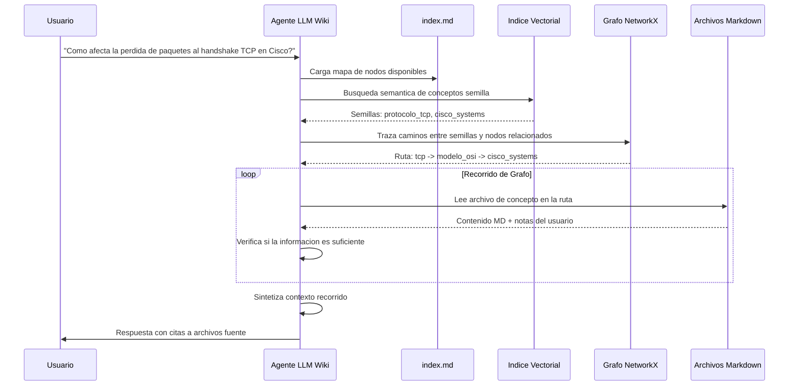

### 5.2 Proceso Detallado de Respuesta

1. **Identificación de Semillas (Paso 0):** El agente analiza la pregunta del usuario con el LLM para extraer 2-5 conceptos clave. Hace una búsqueda vectorial rápida (`top-k=5`) en el índice del `index.md` para encontrar los nodos más relevantes como puntos de partida.

2. **Expansión del Grafo (Paso 1):** Usando NetworkX, el agente calcula los nodos alcanzables en `profundidad ≤ 3` desde los nodos semilla. Prioriza nodos con mayor maestría (más estudiados) como contexto confiable.

3. **Lectura Selectiva de Archivos (Paso 2):** El agente lee los archivos `.md` de los nodos en la ruta. Si la ruta tiene más de 8 nodos, aplica un segundo filtrado vectorial para seleccionar los 8 más relevantes a la pregunta original.

4. **Incorporación de Notas del Usuario (Paso 3):** Las secciones marcadas con `## Notas del Usuario` en cada archivo `.md` tienen un peso adicional del 20% en la síntesis final, dado que representan el entendimiento personalizado del estudiante.

5. **Síntesis y Citación (Paso 4):** El LLM genera la respuesta final con citas explícitas en formato `[Concepto](ruta/al/archivo.md)`, permitiendo al usuario navegar directamente a las fuentes.

### 5.3 Archivado de Respuestas Valiosas

Las respuestas del LLM Wiki no desaparecen en el historial del chat. Siguiendo el patrón Karpathy, si la respuesta es analítica o sintetiza múltiples fuentes, el sistema la propone como nueva página en el mazo — haciendo que las exploraciones del usuario **compuesten conocimiento** en lugar de perderse.

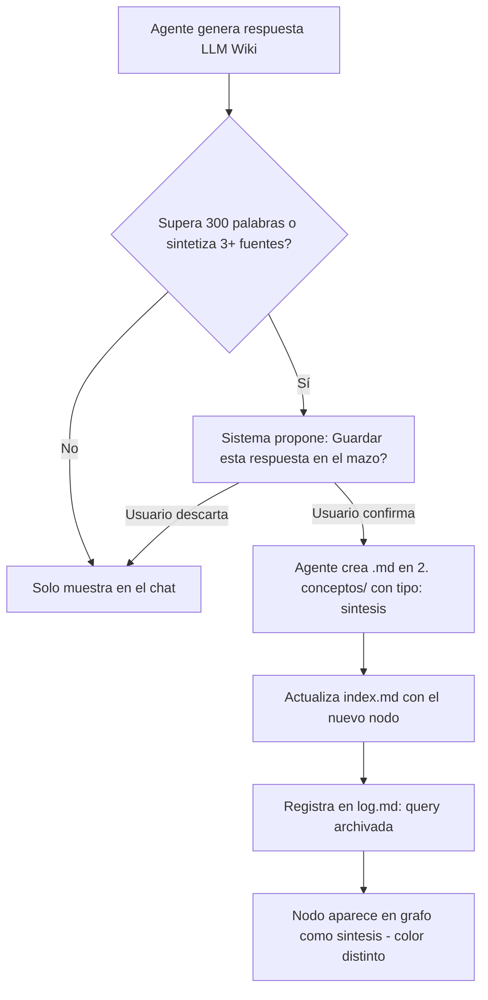

### 5.4 Operación LINT — Salud Periódica del Mazo

El agente ejecuta un proceso de salud **semanal automático** (también ejecutable manualmente desde el dashboard). Lee el `YACHAQ.md` para instrucciones específicas del dominio y luego:

| Problema Detectado | Criterio | Acción del Agente |
|:---|:---|:---|
| **Nodo huérfano** | Ningún otro `.md` enlaza a este nodo | Sugiere qué páginas deberían enlazarlo |
| **Contradicción entre fuentes** | Misma afirmación con valores distintos en dos archivos | Marca con `> ⚠️ CONTRADICCIÓN` y propone resolución |
| **Concepto sin página** | Término mencionado 5+ veces pero sin archivo en `conceptos/` | Propone crear la página con borrador generado |
| **Referencia rota** | Enlace apunta a un archivo que no existe | Corrige o elimina la referencia |
| **Módulo sin cuestionario** | Módulo con conceptos pero sin archivos en `4. preguntas/` | Genera automáticamente preguntas para ese módulo |

El resultado completo del Lint se documenta en `log.md` y se muestra en el dashboard como un **panel de salud del mazo**.

### 5.5 Ingesta Incremental — Comportamiento al Agregar Nuevas Fuentes

Uno de los gaps más críticos del diseño original: ¿qué pasa cuando el usuario sube un segundo PDF sobre el mismo tema? YachaqAI **no crea duplicados** — integra el nuevo conocimiento siguiendo el protocolo del `YACHAQ.md`:

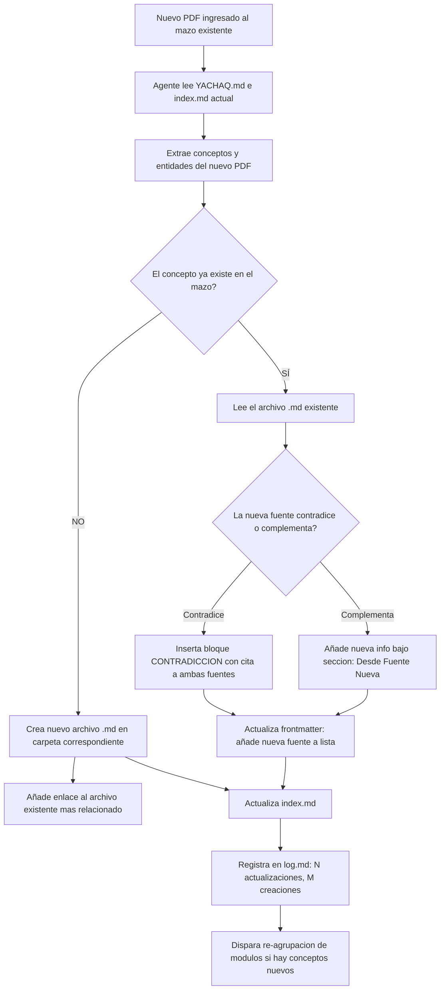

### 5.6 Límites y Resguardos del RAG

| Condición | Comportamiento del Sistema |
|:---|:---|
| Pregunta fuera del dominio del mazo | El agente responde honestamente: *"Esta pregunta está fuera del contenido de tu mazo. ¿Deseas buscar en internet?"* |
| Nodo sin archivo `.md` (inconsistencia de BD) | El agente omite ese nodo y registra la inconsistencia en `sync_log.jsonl` |
| Grafo con más de 500 nodos | Se activa búsqueda vectorial previa al recorrido para limitar el subgrafo a 50 nodos candidatos |
| Respuesta superior a 4000 tokens | El agente genera un resumen ejecutivo y ofrece expansión por sección |

---

## 6. Arquitectura del Índice de Conocimiento

El índice es el componente que hace eficiente la búsqueda semántica sin recorrer todos los archivos. Se construye en dos fases y se mantiene de forma incremental.

### 6.1 Construcción del Índice

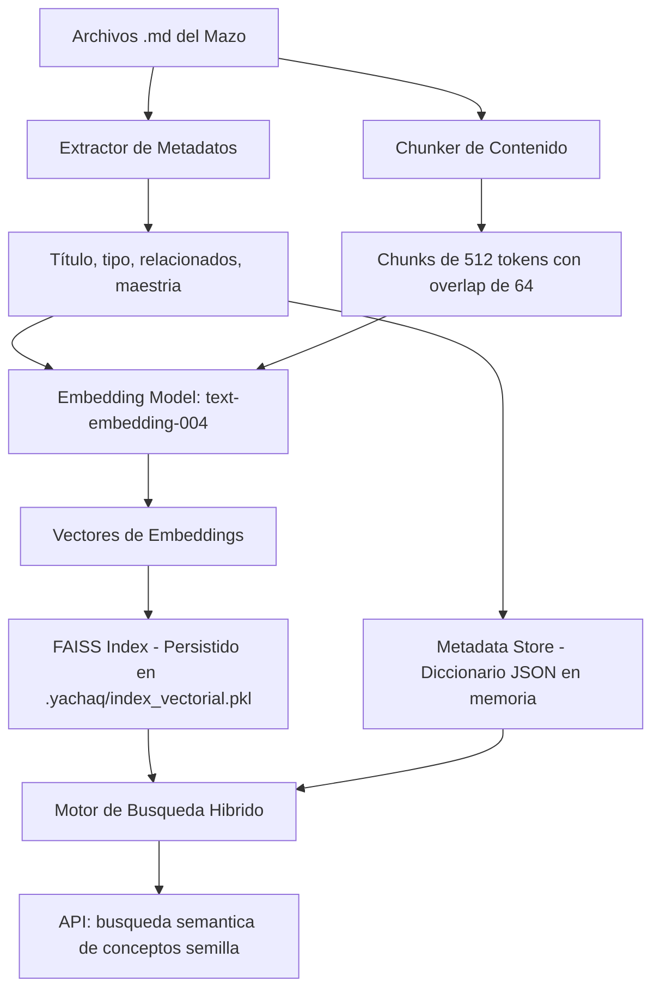

### 6.2 Mantenimiento Incremental del Índice

El índice se actualiza de forma incremental para evitar re-indexar todo el mazo en cada cambio:

- **Adición de nodo:** Se calcula el embedding del nuevo archivo y se inserta en el índice FAISS sin reconstruirlo completamente.
- **Edición de nodo:** Se elimina el vector del ID afectado y se inserta el nuevo embedding.
- **Eliminación de nodo:** Se marca como eliminado en el metadata store; el índice FAISS se compacta en el próximo ciclo nocturno (background job).
- **Re-indexación total:** Se dispara manualmente desde la interfaz o automáticamente cuando el `sync_log.jsonl` registra más de 50 operaciones pendientes.

### 6.3 Modelo de Embeddings

| Modelo | Uso | Latencia Estimada |
|:---|:---|:---|
| `text-embedding-004` (Google) | Embeddings de conceptos y chunks de texto | ~50ms por chunk |
| `all-MiniLM-L6-v2` (local, Sentence-Transformers) | Fallback offline sin internet | ~20ms local |

> [!TIP]
> Para usuarios con colecciones grandes (>200 documentos), se recomienda usar `pgvector` con PostgreSQL en lugar de FAISS para persistencia nativa y escalabilidad sin necesidad de serializar el índice a disco.

---

## 7. Plan de Estudio y Scheduler Agent

### 7.1 Generación del Plan de Módulos

Una vez que el agente de ingesta construye el grafo de conceptos, el **Scheduler Agent** calcula el orden óptimo de aprendizaje:

1. **Ordenamiento Topológico:** Usando el algoritmo de Kahn sobre el grafo de prerrequisitos, se garantiza que los conceptos base siempre precedan a los avanzados (ej: "Modelo OSI" antes que "Protocolo TCP").

2. **Agrupación en Módulos:** Los conceptos se agrupan en módulos de tamaño similar (configurable, por defecto 6-10 conceptos por módulo) usando un algoritmo de partición de grafos que respeta la cohesión temática.

3. **Estimación de Duración:** Cada módulo recibe una estimación de tiempo basada en:
   - Longitud promedio de los archivos `.md` de sus conceptos (palabras ÷ 200 palabras/min de lectura)
   - Tiempo estimado para completar los cuestionarios (promedio: 3 min por pregunta)
   - Buffer de anotaciones del 20%

### 7.2 Conversión de Disponibilidad en Lenguaje Natural

El usuario expresa su disponibilidad en texto libre:

> *"Quiero estudiar los lunes y miércoles por la noche (1 hora cada día) y los sábados por la mañana (3 horas). No tengo tiempo los domingos."*

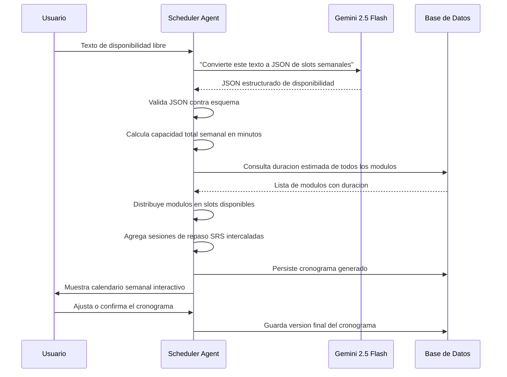

#### Esquema JSON de Disponibilidad Generado

```json
{
  "zona_horaria": "America/Lima",
  "slots_semanales": [
    { "dia": 1, "hora_inicio": "20:00", "duracion_minutos": 60, "etiqueta": "Lunes noche" },
    { "dia": 3, "hora_inicio": "20:00", "duracion_minutos": 60, "etiqueta": "Miércoles noche" },
    { "dia": 6, "hora_inicio": "09:00", "duracion_minutos": 180, "etiqueta": "Sábado mañana" }
  ],
  "dias_excluidos": [0],
  "capacidad_semanal_minutos": 300,
  "preferencia_sesion": "nuevo_contenido_primero"
}
```

### 7.3 Reglas de Distribución de Carga

- **Sesiones cortas (<45 min):** Solo se asigna contenido de repaso SRS.
- **Sesiones medias (45-90 min):** Se asigna un submódulo de contenido nuevo + repaso SRS de conceptos vencidos.
- **Sesiones largas (>90 min):** Se asigna un módulo completo + repaso SRS + tiempo buffer para notas.
- **Bloqueo de avance:** Un módulo bloqueado (por prerrequisitos incompletos) nunca se asigna a una sesión aunque haya tiempo disponible.

---

## 8. Modelo de Onboarding Conversacional

El onboarding es la primera experiencia del usuario con YachaqAI. Es crítico que sea fluido, no técnico y que recoja toda la información necesaria para configurar el sistema correctamente desde el inicio.

### 8.1 Flujo del Agente de Onboarding

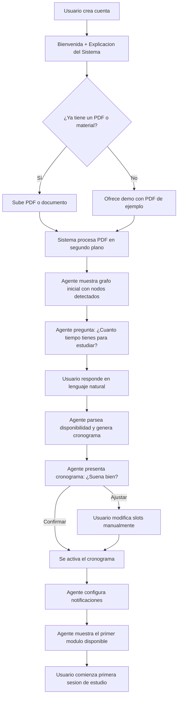

### 8.2 Script del Agente Conversacional

El agente de onboarding sigue un script estructurado con lógica de ramificación:

| Paso | Mensaje del Agente | Respuesta Esperada | Acción del Sistema |
|:---|:---|:---|:---|
| **Bienvenida** | *"¡Hola! Soy tu asistente de YachaqAI. Voy a ayudarte a convertir tus documentos en un plan de estudio personalizado. ¿Tienes un PDF o material de estudio para comenzar?"* | PDF / No tengo aún | Renderiza dropzone o carga PDF de demo |
| **Procesamiento** | *"Perfecto, estoy analizando tu documento... He detectado [N] conceptos clave organizados en [M] temas principales. Aquí está tu mapa inicial de conocimiento."* | (muestra grafo) | Renderiza grafo con nodos grises |
| **Disponibilidad** | *"Para crear tu plan de estudio, cuéntame: ¿qué días y cuánto tiempo tienes disponible para estudiar? No te preocupes por el formato, escríbelo como quieras."* | Texto libre | Llama al parser de disponibilidad |
| **Validación** | *"Basándome en lo que me contaste, he creado este cronograma: [tabla]. ¿Quieres ajustar algo o lo confirmamos?"* | Confirmar / Ajustar | Persiste o abre editor de slots |
| **Notificaciones** | *"¿Te gustaría recibir recordatorios antes de cada sesión de estudio? Puedo enviarte notificaciones push o por email."* | Push / Email / No gracias | Configura el sistema de notificaciones |
| **Primer módulo** | *"¡Todo listo! Tu primera sesión es [fecha/hora]. Mientras tanto, ¿quieres explorar tu grafo de conocimiento o ver el primer módulo?"* | Explorar / Ver módulo | Redirige a interfaz principal |

### 8.3 Edge Cases del Onboarding

| Situación | Comportamiento del Sistema |
|:---|:---|
| PDF procesado con menos de 5 conceptos detectados | El agente advierte: *"Este documento parece muy corto. ¿Deseas agregar más materiales antes de generar el plan?"* |
| Usuario no especifica disponibilidad válida | El agente repregunta: *"No pude entender bien tu horario. ¿Puedes decirme, por ejemplo, cuántas horas a la semana en total tienes disponibles?"* |
| El usuario quiere estudiar todos los días | El sistema crea slots diarios pero advierte sobre la importancia del descanso y los días de repaso |
| Usuario abandona el onboarding a mitad | El estado se persiste en BD; al volver, el agente retoma desde donde se quedó |

---

## 9. Motor de Repetición Espaciada Graph-SRS

### 9.1 Fundamentos del Algoritmo FSRS

YachaqAI usa **FSRS v5** (Free Spaced Repetition Scheduler), el algoritmo de repetición espaciada más preciso disponible en código abierto. A diferencia del SM-2 de Anki, FSRS modela la memoria con parámetros continuos en lugar de intervalos discretos.

Los parámetros fundamentales por cada concepto:

| Parámetro | Símbolo | Descripción | Rango |
|:---|:---|:---|:---|
| **Retentiva** | R(t) | Probabilidad de recordar el concepto en el tiempo t | 0.0 — 1.0 |
| **Estabilidad** | S | Días hasta que R cae al 90% | 1 — ∞ |
| **Dificultad** | D | Dificultad intrínseca del concepto | 1 — 10 |

### 9.2 Propagación de Maestría en el Grafo

YachaqAI va más allá del FSRS estándar: cuando un concepto es calificado, el impacto se **propaga a través del grafo** de conocimiento.

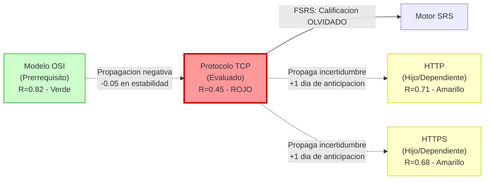

#### Reglas de Propagación

| Evento | Efecto en Prerrequisitos | Efecto en Dependientes |
|:---|:---|:---|
| Calificación **EXCELENTE** | Confirma solidez; sin cambio | Reduce intervalo de repaso en 10% (están más estables) |
| Calificación **BIEN** | Sin efecto | Sin efecto en dependientes |
| Calificación **DIFÍCIL** | Agenda revisión suave en 48h | Añade +2 días de anticipación al próximo repaso |
| Calificación **OLVIDADO** | Reduce estabilidad en 0.1; agenda revisión urgente | Reduce intervalo en 30%; prioriza en próxima sesión |

### 9.3 Flujo de la Sesión de Repaso

El flujo de repaso aplica un **modelo de evaluación híbrida**: las preguntas objetivas son calificadas automáticamente por el sistema, mientras que las preguntas de desarrollo son analizadas por un Agente Evaluador de IA que proporciona retroalimentación detallada antes de que el usuario confirme su calificación final.

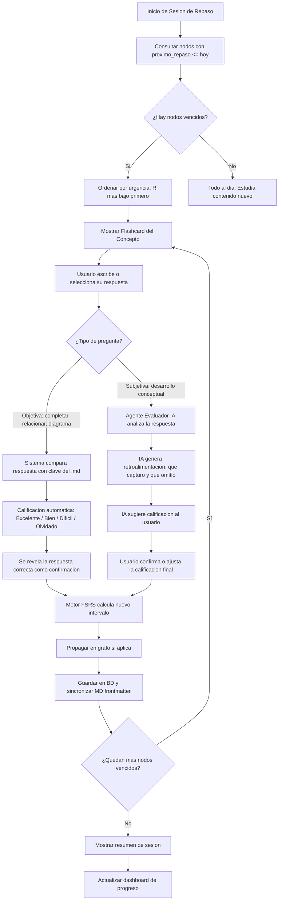

### 9.4 Tipos de Tarjetas SRS y Método de Evaluación

| Tipo | Formato | Ejemplo | Método de Evaluación | Quién Califica |
|:---|:---|:---|:---|:---|
| **Completar oración** | Texto con `[___]` a rellenar | "El TCP usa `[___]` pasos para establecer conexión" | Comparación exacta o fuzzy contra la clave en el `.md` | 🤖 Sistema automático |
| **Relacionar términos** | Tabla de matching | Definición ↔ Concepto | Comparación de pares seleccionados vs. pares correctos | 🤖 Sistema automático |
| **Diagrama incompleto** | Etiquetas faltantes en un diagrama | Capas del modelo OSI en blanco | Comparación de etiquetas ingresadas vs. etiquetas correctas | 🤖 Sistema automático |
| **Desarrollo conceptual** | Pregunta abierta | "¿Por qué TCP es orientado a la conexión?" | Agente IA analiza cobertura de conceptos clave y coherencia | 👤 Usuario (con guía de IA) |

> [!NOTE]
> **Regla de conversión para preguntas objetivas:** el sistema traduce el puntaje de aciertos al vocabulario FSRS: 100% correcto → *Excelente*; 70–99% → *Bien*; 1–69% → *Difícil*; 0% → *Olvidado*. Este umbral es configurable por el usuario en las preferencias del mazo.

### 9.5 Agente Evaluador de IA — Preguntas de Desarrollo

Para las preguntas de tipo *Desarrollo Conceptual*, el sistema delega la evaluación a un agente especializado que actúa como tutor, no como juez.

#### Flujo del Agente Evaluador

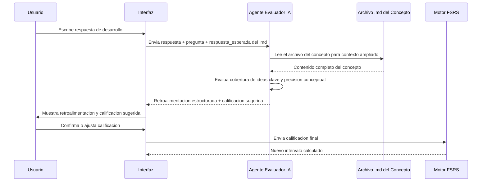

#### Estructura de la Retroalimentación del Agente

El Agente Evaluador genera una respuesta estructurada que la interfaz presenta visualmente al usuario:

```json
{
  "ideas_cubiertas": [
    "Correcto: mencionó el Three-Way Handshake",
    "Correcto: explicó el impacto en la latencia"
  ],
  "ideas_omitidas": [
    "No mencionó la diferencia cuantitativa de RTT respecto a UDP"
  ],
  "errores_conceptuales": [],
  "calificacion_sugerida": "Bien",
  "justificacion": "Capturó los conceptos fundamentales pero omitió el detalle cuantitativo del RTT. Recomendamos repasar en 3 días.",
  "tip_de_estudio": "Revisa la sección 'Latencia' en protocolo_tcp.md para el detalle del cálculo RTT × 1.5."
}
```

#### Principios del Agente Evaluador

1. **Tutor, no juez:** El agente siempre explica *por qué* la respuesta fue calificada de cierta manera, no solo emite una nota.
2. **Soberanía del usuario:** La calificación del agente es una *sugerencia*. El usuario tiene siempre la última palabra, especialmente si el agente no entendió el matiz de su respuesta.
3. **Transparencia de criterios:** Cada pregunta de desarrollo tiene una lista de *ideas clave* en su archivo `.md` que el agente usa explícitamente como rúbrica. El usuario puede ver y editar esta lista.
4. **Sin falsos positivos:** Si el agente no tiene confianza suficiente (respuesta muy ambigua), devuelve `calificacion_sugerida: null` y le pide al usuario que se autocalifique.


## 10. Sistema Visual del Grafo Dinámico

El grafo de conocimiento es el panel central de YachaqAI. Visualiza en tiempo real el estado de dominio del usuario sobre todo su contenido.

### 10.1 Estados de los Nodos (Semáforo de Maestría)

| Estado | Color | Criterio de Retentiva | Criterio de Activación |
|:---|:---|:---|:---|
| **Bloqueado** | Gris (`#9E9E9E`) | No aplica — no iniciado | Estado inicial; prerrequisitos no completados |
| **En Estudio** | Blanco con borde azul | No aplica — en progreso | Módulo activado; cuestionario no rendido aún |
| **Crítico** | Rojo (`#F44336`) | R < 70% | Calificación "Olvidado" o repaso vencido > 48h |
| **En Práctica** | Amarillo (`#FFC107`) | 70% ≤ R < 90% | Aprobado con dificultad; en consolidación |
| **Dominado** | Verde (`#4CAF50`) | R ≥ 90% | Respuestas consecutivas correctas y estables |

### 10.2 Reglas de Transición de Estado

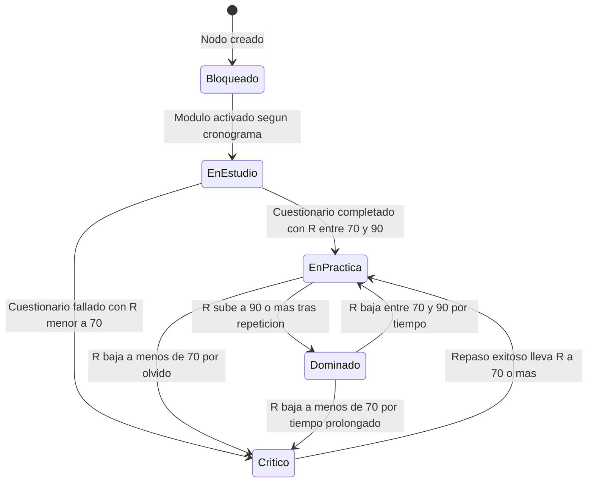

### 10.3 Funciones Interactivas del Grafo

- **Hover sobre nodo:** Muestra tooltip con título, maestría %, próximo repaso y número de preguntas asociadas.
- **Click en nodo:** Abre el archivo `.md` del concepto en el editor de modo dual.
- **Filtros de vista:** El usuario puede filtrar para ver solo nodos rojos (urgentes), o solo un módulo específico.
- **Zoom y física:** El grafo usa simulación de física 2D. Los nodos con más conexiones se ubican en el centro naturalmente.
- **Líneas de aristas:** Aristas sólidas = prerrequisito, aristas punteadas = relacionado, aristas rojas = dependencia en riesgo.

---

## 11. Editor Markdown Modo Dual

Cada concepto del grafo tiene un archivo `.md` asociado que el usuario puede leer y editar directamente en la interfaz web.

### 11.1 Modo Lectura (Renderizado)

- Muestra el contenido formateado con tipografía de alta calidad.
- Renderiza automáticamente: diagramas Mermaid, tablas, código con sintaxis resaltada.
- Los enlaces internos `[Concepto](../conceptos/concepto.md)` son clickeables y navegan al nodo del grafo.
- Muestra la barra de maestría del concepto en la cabecera.
- Señala visualmente las secciones `## Notas del Usuario` con un fondo diferenciado.

### 11.2 Modo Edición

- Editor CodeMirror con soporte de sintaxis Markdown.
- Autocompletado de enlaces `[[concepto]]` que busca en el índice del mazo.
- El YAML frontmatter se muestra en un panel separado de solo lectura (para evitar edición accidental de metadatos SRS).
- Al guardar: el backend actualiza únicamente el cuerpo del archivo, preservando el frontmatter intacto.
- Las ediciones desencadenan re-indexación incremental del chunk modificado.

### 11.3 Protecciones del Editor

> [!CAUTION]
> El sistema **nunca permite** que una edición manual del usuario modifique los campos `dificultad_srs`, `estabilidad_srs`, `retentiva_srs`, `proximo_repaso` o `ultimo_repaso` directamente desde el editor. Estos campos son administrados exclusivamente por el motor SRS. Si el archivo `.md` es editado externamente y estos campos cambian, el sistema alerta al usuario en el próximo sync y restaura los valores de la BD.

---

## 12. Flujos de Usuario Críticos

### 12.1 Flujo de Primera Sesión de Estudio (Post-Onboarding)

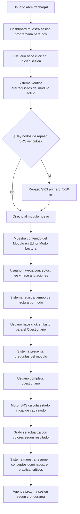

### 12.2 Flujo de Sesión de Repaso Diaria

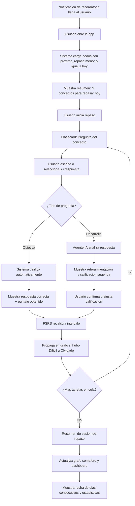

### 12.3 Flujo de Consulta LLM Wiki

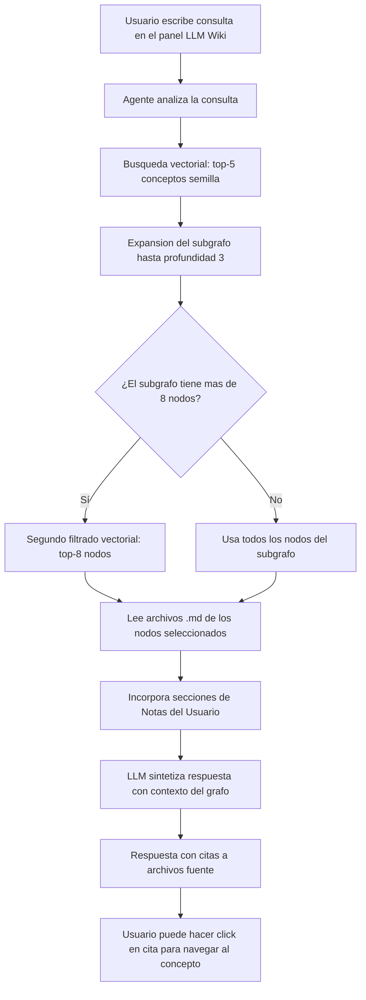

---

## 13. Sistema de Notificaciones

### 13.1 Tipos de Notificaciones

| Tipo | Trigger | Canal | Tiempo de Anticipación |
|:---|:---|:---|:---|
| **Recordatorio de Sesión** | Sesión programada en cronograma | Push / Email | 30 min antes |
| **Repaso Urgente** | N nodos con R < 70% y repaso vencido > 24h | Push | Inmediato |
| **Módulo Desbloqueado** | Prerrequisitos completados | Push / In-app | Inmediato |
| **Racha en Peligro** | No ha habido actividad en 24h y hay sesión pendiente | Push / Email | A las 8pm hora local |
| **Resumen Semanal** | Cada domingo | Email | Programado |
| **Logro Desbloqueado** | Hito de maestría alcanzado (ej: primer concepto verde) | In-app | Inmediato |

### 13.2 Flujo de Generación y Envío de Notificaciones

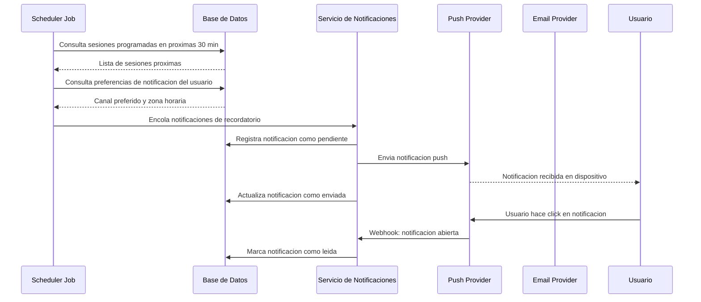

### 13.3 Preferencias de Notificaciones

El usuario puede configurar desde la interfaz:
- **Canal preferido:** Push, Email, ambos o ninguno por tipo de notificación.
- **Horario de silencio:** Rango de horas en que no recibir notificaciones (ej: 22:00 — 08:00).
- **Frecuencia de resumen:** Diario, semanal o nunca.

---

## 14. Gestión de Errores y Edge Cases

### 14.1 Errores en el Proceso de Ingesta de PDFs

| Caso | Detección | Comportamiento del Sistema | Acción del Usuario |
|:---|:---|:---|:---|
| **PDF corrupto o ilegible** | LlamaParse retorna error 4xx | Notificación: *"No pudimos leer este PDF. ¿Está protegido con contraseña?"* | Puede reintentar con PDF correcto |
| **PDF protegido con contraseña** | LlamaParse retorna error de encriptación | Solicita contraseña al usuario | Ingresa contraseña; se reintenta extracción |
| **PDF sin texto (solo imágenes escaneadas)** | Parser devuelve < 100 caracteres de texto | Activa pipeline OCR (tesseract + LLM post-processing) | Se notifica que el proceso tardará más |
| **PDF muy largo (>500 páginas)** | Detección por conteo de páginas | Muestra advertencia: *"Este PDF tomará 3-5 minutos para procesar. Te notificaremos cuando esté listo."* Procesa en background | Puede cerrar la app y volver después |
| **PDF con tablas complejas o fórmulas** | Validación de calidad del Markdown generado | Marca las secciones dudosas con `<!-- REVISAR: calidad baja -->` | El usuario puede editar en el editor MD |
| **Fallo de red durante la subida** | Timeout HTTP o error 5xx | Upload con reintento automático (3 intentos, backoff exponencial) | Si persiste, muestra botón de "Reintentar" |
| **Fallo del LLM durante la estructuración** | Exception en la API del LLM | Persiste el Markdown crudo sin estructurar; agenda re-procesamiento | Puede forzar re-procesamiento manual |

### 14.2 Inconsistencias en el Modelo de Datos

| Caso | Detección | Comportamiento |
|:---|:---|:---|
| **Nodo en BD sin archivo `.md`** | Sync check al inicio de sesión | Marca nodo como `estado: huerfano`; ofrece regenerar el archivo |
| **Archivo `.md` sin registro en BD** | FileWatcher detecta archivo nuevo | Importa automáticamente; crea nodo en BD y calcula embedding |
| **Frontmatter YAML inválido** | Parser falla al leer el archivo | Usa los datos de BD como fuente de verdad; genera nuevo frontmatter |
| **Referencia rota entre archivos MD** | Validación periódica de links | Registra en `sync_log.jsonl`; muestra en panel de salud del mazo |
| **Ciclos en el grafo de prerrequisitos** | Detección al ejecutar orden topológico | Alerta al usuario con el ciclo detectado; sugiere qué arista romper |

### 14.3 Edge Cases de Conectividad

| Escenario | Comportamiento |
|:---|:---|
| **Sin internet durante una sesión de estudio** | El contenido Markdown ya está en el sistema de archivos local; la sesión continúa normalmente. Las respuestas SRS se encolan localmente y se sincronizan al recuperar la conexión |
| **Sin internet durante el procesamiento de un PDF** | El proceso se pausa con un mensaje claro; se reanuda automáticamente al recuperar conectividad |
| **Sin internet para el LLM Wiki** | Muestra: *"La consulta requiere conexión a internet. En modo offline puedes buscar en tus archivos localmente."*; activa búsqueda por keywords en los MD locales |
| **Conexión lenta durante la carga del grafo** | El grafo se carga en modo simplificado (lista de nodos) mientras se descarga la vista completa en background |

### 14.4 Edge Cases de la Lógica SRS

| Caso | Comportamiento |
|:---|:---|
| **Usuario no estudia por 30+ días** | El sistema no sobrecarga con todos los repasos vencidos. Aplica una *"sesión de rehabilitación"*: presenta máximo 20 conceptos por sesión, priorizando los más críticos |
| **Concepto marcado como OLVIDADO 5+ veces consecutivas** | El sistema sugiere revisar el material fuente y añadir anotaciones. Puede proponer dividir el concepto en sub-conceptos más pequeños |
| **Módulo completado con 100% de notas EXCELENTE en primera intención** | El sistema alerta sobre posible efecto de *ilusión de competencia*; sugiere revisar en 7 días con preguntas de variación antes de marcar como dominado |
| **El usuario edita el contenido de un concepto** | Las puntuaciones SRS existentes se preservan pero el próximo repaso se adelanta 1 día para validar que el usuario recuerda la versión actualizada del contenido |

---

## 15. Seguridad y Privacidad

> [!CAUTION]
> YachaqAI procesa documentos que pueden ser privados, confidenciales o protegidos por derechos de autor (apuntes personales, libros, documentos internos de empresas). El sistema debe ser diseñado con **privacidad por defecto**.

### 15.1 Modelo de Amenazas

| Amenaza | Severidad | Mitigación |
|:---|:---|:---|
| Acceso no autorizado a documentos del usuario | Alta | Autenticación JWT con refresh tokens; aislamiento de datos por `user_id` en todas las queries |
| Intercepción de PDFs en tránsito | Alta | TLS 1.3 obligatorio en todas las comunicaciones; sin fallback a HTTP |
| Fuga de contenido al enviar a APIs de LLM externas | Media | Opción de modo completamente local (LLM local vía Ollama); política de datos con el proveedor de LLM (OpenAI, Google) |
| Inyección de prompts en el LLM Wiki | Media | Sanitización del input del usuario; prompt con instrucciones de scope fijas |
| Acceso físico a los archivos MD del usuario | Baja | Los archivos MD son legibles por diseño (portabilidad); el usuario puede elegir cifrado de disco a nivel de OS |
| Pérdida o corrupción de datos | Alta | Backups automáticos de la BD y del directorio MD antes de cada operación de escritura masiva |

### 15.2 Políticas de Datos

1. **Segregación de datos:** Cada usuario tiene un namespace aislado. Ninguna query a la BD incluye datos de otro usuario.
2. **Datos enviados a LLMs externos:** Solo se envían chunks de texto del contenido del usuario necesarios para la tarea actual. Nunca se envían PDFs completos en un solo request.
3. **Modo Privado (Local-First):** El usuario puede optar por usar un LLM local (Ollama + Gemma/Mistral) para que ningún dato salga de su máquina. En este modo, la velocidad de procesamiento es menor pero la privacidad es total.
4. **Eliminación de cuenta:** Al eliminar la cuenta, el usuario tiene 30 días para descargar sus archivos MD. Después de esa fecha, todos los datos de la BD se eliminan de forma irreversible.
5. **Exportación de datos:** El usuario puede exportar su mazo completo en cualquier momento como un ZIP con todos los archivos MD, fácilmente exportable para su uso personal en otros editores.

### 15.3 Autenticación y Autorización

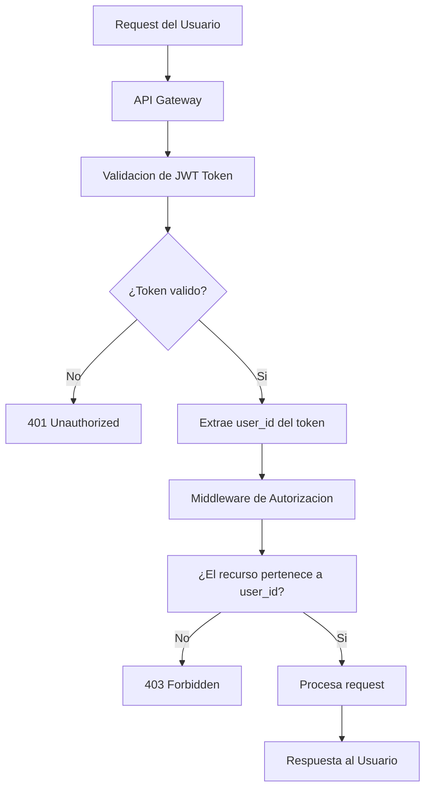

---

## 16. Métricas y Analytics

### 16.1 Dashboard de Progreso del Estudiante

El dashboard muestra al usuario una vista 360° de su progreso académico:

#### Panel de Métricas Principales

| Métrica | Descripción | Visualización |
|:---|:---|:---|
| **Racha Activa** | Días consecutivos con al menos 1 sesión de estudio | Número + ícono de fuego |
| **Maestría General del Mazo** | Promedio ponderado de R de todos los nodos dominados | Porcentaje + barra de progreso |
| **Nodos por Estado** | Conteo de grises, rojos, amarillos y verdes | Gráfico de torta con colores semáforo |
| **Tiempo Estudiado** | Total de minutos de sesiones reales esta semana | Gráfico de barras (últimos 7 días) |
| **Retención Promedio** | R promedio de todos los nodos evaluados | Línea temporal (últimos 30 días) |
| **Carga de Repaso** | Número de nodos vencidos para hoy y los próximos 7 días | Gráfico de barras (heatmap calendar) |

#### Curva de Olvido Personalizada

El sistema genera una curva de retención personalizada para cada usuario basada en el historial de respuestas SRS, comparándola con la curva de Ebbinghaus teórica para mostrar cuánto mejor está reteniendo el usuario gracias al sistema.

### 16.2 Métricas de Sistema (Para el Equipo de Ingeniería)

| Métrica | Herramienta | Alerta |
|:---|:---|:---|
| Tiempo de procesamiento de PDF | Prometheus + Grafana | > 5 min por 100 páginas |
| Latencia del LLM Wiki | Prometheus | > 10 segundos por consulta |
| Errores de sincronización BD-FS | Log aggregation (Loki) | > 5 errores por hora |
| Uso de tokens de LLM por usuario | Custom dashboard | > 100K tokens/día por usuario |
| Tasa de éxito de conversión de PDF | Custom dashboard | < 90% de éxito |

### 16.3 Analytics de Comportamiento de Aprendizaje

- **Tasa de completación de módulos:** % de módulos iniciados vs. completados con cuestionario.
- **Tiempo por concepto:** Tiempo promedio de lectura por nodo (detectado via scroll events en el editor).
- **Patrones de olvido:** Qué tipos de conceptos (por dificultad D o por área temática) tienen mayor tasa de olvido.
- **Eficacia del cronograma:** % de sesiones planificadas vs. sesiones realmente completadas.

---

## 17. Pila Tecnológica

### 17.1 Frontend

| Componente | Tecnología | Justificación |
|:---|:---|:---|
| Framework | React 19 + Next.js 15 (TypeScript) | SSR optimizado para módulos de contenido; App Router para navegación fluida |
| Visualización de Grafos | React Flow v12 | Soporte nativo de físicas 2D, handles customizables, rendimiento con +500 nodos |
| Editor Markdown | CodeMirror 6 + remark/rehype | Extensible para sintaxis `[[wiki-links]]`; renderizado MDX con Mermaid |
| Estado Global | Zustand | Ligero y sin boilerplate; suficiente para el estado de la sesión activa |
| Componentes UI | shadcn/ui + Tailwind CSS v4 | Componentes accesibles; personalización total via CSS variables |
| Gráficos del Dashboard | Recharts | Nativo React; suficiente para los gráficos de progreso requeridos |

### 17.2 Backend

| Componente | Tecnología | Justificación |
|:---|:---|:---|
| Framework API | FastAPI (Python 3.12) | Alto rendimiento async; tipado con Pydantic v2; auto-documentación OpenAPI |
| Base de Datos (Desarrollo) | SQLite + SQLAlchemy 2.0 | Sin dependencias de servidor; suficiente para MVP y desarrollo local |
| Base de Datos (Producción) | PostgreSQL 16 + pgvector | Escalable; `pgvector` reemplaza FAISS en producción |
| Migraciones de BD | Alembic | Integración nativa con SQLAlchemy |
| Motor de Grafos | NetworkX 3.x | Librería Python madura para grafos; suficiente para colecciones < 10K nodos |
| Motor SRS | py-fsrs (FSRS v5) | Implementación oficial del algoritmo FSRS en Python |
| Ingesta de PDFs | LlamaParse (LlamaIndex) | Mejor calidad de extracción para PDFs complejos con tablas y diagramas |
| OCR Fallback | Tesseract 5 + pytesseract | Para PDFs escaneados sin capa de texto |
| Índice Vectorial | FAISS (desarrollo), pgvector (producción) | FAISS es más rápido en memoria; pgvector persiste nativamente en PostgreSQL |
| Background Jobs | Celery + Redis | Para procesamiento asíncrono de PDFs y envío de notificaciones |
| File Watcher | watchdog (Python) | Para detectar ediciones externas de los archivos MD |

### 17.3 Agentes de IA

| Componente | Tecnología | Justificación |
|:---|:---|:---|
| Orquestación de Agentes | LangGraph 0.2+ | Grafos de agentes con estados; permite ciclos y lógica de retry controlada |
| Agente de Ingesta | LangGraph + Gemini 2.5 Flash | Velocidad de procesamiento masivo de texto; costo eficiente |
| Agente LLM Wiki | LangGraph + Gemini 2.5 Pro | Mayor capacidad de razonamiento para síntesis de múltiples fuentes |
| Agente de Scheduler | LangGraph + Gemini 2.5 Flash | Tarea de parsing y cálculo; no requiere razonamiento profundo |
| **Agente Evaluador de IA** | **LangGraph + Gemini 2.5 Flash** | **Evalúa respuestas de desarrollo conceptual: detecta ideas clave cubiertas, omisiones y errores; devuelve retroalimentación estructurada y calificación sugerida. Opera en el flujo SRS para preguntas subjetivas.** |
| Embeddings | `text-embedding-004` (Google) | Alta calidad en español; integrado con el stack de Google AI |
| LLM Local (opcional) | Ollama + Gemma 3 9B | Para modo privado sin internet; calidad suficiente para tareas de parsing |

### 17.4 Infraestructura y DevOps

| Componente | Tecnología |
|:---|:---|
| Containerización | Docker + Docker Compose |
| Orquestación (Producción) | Kubernetes (GKE / EKS) |
| CI/CD | GitHub Actions |
| Monitoreo | Prometheus + Grafana |
| Logs | Loki + Grafana |
| CDN y Storage | Cloudflare R2 (para almacenamiento de PDFs originales) |
| Email | Resend API |
| Push Notifications | Firebase Cloud Messaging (FCM) |

---

## 18. Roadmap de Desarrollo

### 18.1 Visión por Fases

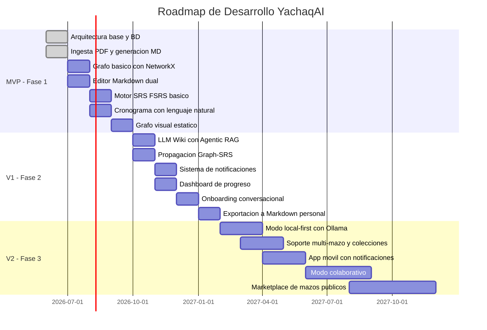

### 18.2 Tabla Detallada de Roadmap

| Fase | Feature | Descripción | Complejidad | Dependencias |
|:---|:---|:---|:---|:---|
| **MVP** | Ingesta de PDF | Subida, extracción con LlamaParse, generación de archivos MD | Alta | LlamaParse API |
| **MVP** | Estructura de archivos MD | Generación del árbol de carpetas con frontmatter YAML | Media | — |
| **MVP** | Modelo de datos relacional | Tablas base: nodos, aristas, srs_estados, sesiones | Alta | PostgreSQL / SQLite |
| **MVP** | Grafo visual básico | Visualización con React Flow; colores estáticos | Media | React Flow |
| **MVP** | Editor Markdown dual | Modo lectura/edición con CodeMirror | Media | CodeMirror |
| **MVP** | Motor SRS básico | Implementación de FSRS sin propagación en grafo | Alta | py-fsrs |
| **MVP** | Cronograma con NL | Parser de disponibilidad con LLM y generación de slots | Media | Gemini API |
| **MVP** | Onboarding básico | Flujo conversacional de 6 pasos | Media | — |
| **V1** | LLM Wiki Agentic RAG | Motor de consulta con traversal del grafo de conocimiento | Muy Alta | LangGraph, FAISS |
| **V1** | Propagación Graph-SRS | FSRS con propagación de maestría a nodos vecinos | Alta | NetworkX + FSRS |
| **V1** | Grafo dinámico semáforo | Colores en tiempo real según estado SRS | Media | React Flow + WebSocket |
| **V1** | Sistema de notificaciones | Push y email con Celery + Redis | Media | FCM, Resend |
| **V1** | Dashboard de progreso | Métricas de retención y racha de estudio | Media | Recharts |
| **V1** | Onboarding conversacional completo | Agente con manejo de edge cases y repregunta | Alta | LangGraph |
| **V1** | Exportación Markdown personal | ZIP con todos los MD, compatible con cualquier lector local | Baja | — |
| **V2** | Modo local-first | LLM local con Ollama; embeddings locales sin internet | Muy Alta | Ollama, all-MiniLM |
| **V2** | Multi-mazo | Soporte de múltiples colecciones de conocimiento por usuario | Alta | Refactorización de BD |
| **V2** | App móvil | PWA o React Native con notificaciones push nativas | Muy Alta | FCM |
| **V2** | Modo colaborativo | Mazos compartidos entre usuarios; anotaciones colaborativas | Muy Alta | WebSockets, CRDT |
| **V2** | Marketplace de mazos | Publicar y suscribirse a mazos de otros usuarios | Alta | Sistema de permisos |

### 18.3 Criterios de Éxito por Fase

| Fase | Métrica de Éxito |
|:---|:---|
| **MVP** | Un usuario puede subir un PDF, obtener un grafo de conceptos, un cronograma, y completar su primera sesión de estudio con cuestionario en menos de 15 minutos desde el registro |
| **V1** | El usuario puede consultar su LLM Wiki con preguntas en lenguaje natural y obtener respuestas con citas correctas. La tasa de retención medida por el SRS mejora en > 30% respecto a una semana sin el sistema |
| **V2** | El sistema funciona completamente sin internet en modo Ollama. Un usuario puede usar YachaqAI en su celular con la misma funcionalidad del MVP |

---

## Apéndice A: Glosario Técnico

| Término | Definición |
|:---|:---|
| **FSRS** | Free Spaced Repetition Scheduler — algoritmo de repetición espaciada de código abierto basado en el modelo de memoria de Ebbinghaus con parámetros continuos |
| **Graph-SRS** | Extensión de FSRS propietaria de YachaqAI que propaga el impacto de las calificaciones a través del grafo de conocimiento |
| **Agentic RAG** | Retrieval Augmented Generation con un agente autónomo que decide qué documentos recuperar y en qué orden, a diferencia del RAG estático |
| **Graph-Traversal RAG** | Variante de Agentic RAG donde la recuperación sigue explícitamente los enlaces del grafo de conocimiento en lugar de solo buscar por similitud vectorial |
| **Mazo** | Colección de conocimiento derivada de uno o más documentos fuente, organizada como un grafo de conceptos con su cronograma de estudio asociado |
| **Frontmatter YAML** | Bloque de metadatos al inicio de un archivo Markdown delimitado por `---`, utilizado por YachaqAI para almacenar el estado SRS y las relaciones del grafo |
| **Retentiva (R)** | Probabilidad de que el usuario recuerde un concepto en el momento presente, calculada por FSRS. Valor entre 0.0 y 1.0 |
| **Estabilidad (S)** | Número de días que tarda la retentiva en caer al 90% tras un repaso exitoso. Mayor S = concepto más firmemente aprendido |
| **Ordenamiento Topológico** | Algoritmo de teoría de grafos que ordena los nodos de un grafo dirigido acíclico (DAG) de tal forma que todo prerrequisito aparece antes que sus dependientes |
| **Single Source of Truth** | Principio de diseño por el que existe una única fuente autoritativa de un dato. En YachaqAI, los archivos MD son la fuente de verdad del contenido, y la BD es la fuente de verdad del estado |

---

## Apéndice B: Preguntas Frecuentes del Equipo de Ingeniería

**P: ¿Por qué usar SQLite en desarrollo si el sistema de archivos MD ya existe?**  
R: Los archivos MD son óptimos para el contenido de texto y la portabilidad, pero son ineficientes para consultas relacionales como "dame todos los nodos con R < 0.7 cuyo próximo repaso sea hoy". La BD relacional responde estas consultas en microsegundos; escanear cientos de archivos MD llevaría segundos.

**P: ¿Qué pasa si el usuario edita los archivos MD directamente con otros editores de Markdown locales mientras YachaqAI está abierto?**  
R: El FileWatcher de `watchdog` detecta el cambio, parsea el archivo modificado, y actualiza la BD. Si el YAML frontmatter fue modificado externamente (lo que no está soportado), el sistema lo restaura desde la BD y advierte al usuario.

**P: ¿Por qué LangGraph en lugar de AutoGen o CrewAI para los agentes?**  
R: LangGraph permite definir grafos de estados con lógica de control precisa (ciclos, condicionales, retry). Para el Graph-Traversal RAG necesitamos un ciclo de "leer nodo → evaluar si es suficiente → leer siguiente nodo o terminar" que LangGraph maneja nativamente. AutoGen y CrewAI son más apropiados para sistemas multi-agente conversacionales.

**P: ¿Cómo se maneja la concurrencia cuando el motor SRS actualiza un archivo MD mientras el usuario lo está editando?**  
R: El sistema implementa un lock optimista por archivo: antes de escribir, verifica el `updated_at` del archivo en BD. Si difiere del valor en memoria, aborta la escritura del SRS, notifica al usuario del conflicto y le pide que resuelva manualmente (similar a un merge conflict de Git).

---

## Apéndice C: Comparativa con el Patrón LLM Wiki de Karpathy

Este apéndice documenta cómo YachaqAI adopta, adapta y extiende el patrón LLM Wiki publicado por Andrej Karpathy, clarificando las decisiones de diseño divergentes.

| Concepto del Patrón Karpathy | Implementación en YachaqAI | Tipo |
|:---|:---|:---|
| Wiki persistente compilada en ingesta | El agente crea archivos `.md` por concepto, entidad y módulo en ingesta, no en tiempo de consulta | ✅ Adoptado |
| Tres capas: Fuentes / Wiki / Schema | `1. fuentes_transformadas/` / `conceptos/` + `entidades/` / `YACHAQ.md` | ✅ Adoptado con nombres propios |
| `index.md` como catálogo navegable | `index.md` como raíz del mazo con tabla de módulos, conceptos y estado de maestría | ✅ Adoptado y enriquecido con datos SRS |
| `log.md` cronológico y parseable | `log.md` con formato `## [YYYY-MM-DD] operación \| descripción` y soporte `grep` | ✅ Adoptado directamente |
| Schema del agente (`CLAUDE.md`) | `YACHAQ.md` con instrucciones para INGEST, QUERY y LINT específicas del dominio | ✅ Adoptado con nombre propio |
| Operación LINT periódica | Proceso semanal automatizado con panel de salud en el dashboard | ✅ Adoptado y automatizado |
| Ingesta incremental que actualiza páginas existentes | Protocolo en §5.5: compara contra `index.md`, actualiza si existe, crea si no existe, señala contradicciones | ✅ Adoptado y formalizado |
| Archivar respuestas valiosas de vuelta al wiki | Si la respuesta supera 300 palabras o sintetiza 3+ fuentes, se propone crear un nodo tipo `sintesis` | ✅ Adoptado con criterio automático |
| El LLM escribe la wiki; el humano solo lee | Extendido: el LLM escribe y el usuario puede editar con el modo editor dual (YachaqAI es LMS, no solo PKM) | 🔵 Extendido intencionalmente |
| Grafo visual de relación | Reemplazado por grafo semáforo dinámico con estados de maestría — la dimensión pedagógica supera la puramente estructural | 🔵 Reemplazado con propósito pedagógico |
| Compatibilidad con editores locales | El vault exportado es compatible nativamente con la especificación estándar de Markdown (Wikilinks, YAML Frontmatter, Dataview plugin) | ✅ Mantenida como exportación |
| Herramientas CLI opcionales (`qmd`) | El backend FastAPI expone endpoints de búsqueda consumidos por la interfaz; el usuario no necesita CLI | 🔵 Internalizado en la plataforma |

> [!NOTE]
> La diferencia filosófica fundamental: el patrón Karpathy es una **herramienta PKM** donde el LLM mantiene el conocimiento para que el humano lo explore. YachaqAI es un **sistema LMS activo** donde además se mide y optimiza la retención mediante SRS, se genera un plan de estudio estructurado, y el progreso es verificable mediante cuestionarios. El patrón Karpathy es el motor de conocimiento; YachaqAI añade el motor de aprendizaje encima.

---

*Documento preparado para el equipo de ingeniería e inversores de YachaqAI.*
*Versión 2.2 — Junio 2026. Incorpora sistema de evaluación híbrida (auto-calificación objetiva + Agente Evaluador de IA para preguntas de desarrollo).*

